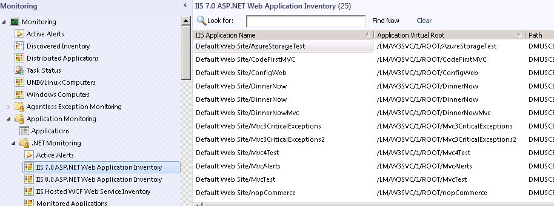

# Before You Begin Monitoring .NET Applications
In [!INCLUDE[om12long](Token/om12long_md.md)], you can monitor web applications and web services from server\- and client\-side perspectives to get details about application availability and performance that can help you pinpoint problems. \([!INCLUDE[sc2012sp1note](Token/sc2012sp1note_md.md)] You can also monitor Windows Services.\) When you specify settings, the types of events to collect, the performance goals to measure, and which servers to monitor, [!INCLUDE[om12short](Token/om12short_md.md)] .NET Application Monitoring provides insights into how web\-based applications are running. You can see how frequently a problem is occurring, how a server was performing when a problem occurred, and the chain of events related to the slow request or a method that is unreliable. You have to have this information to partner with software developers and database administrators to help ensure that applications are available and perform at optimal levels.

**Current [!INCLUDE[avicode57](Token/avicode57_md.md)] customers**: [!INCLUDE[om12short](Token/om12short_md.md)] has .NET application monitoring capabilities that can replace [!INCLUDE[avicode57](Token/avicode57_md.md)] for applications hosted in Internet Information Services \(IIS\) 7.0. \([!INCLUDE[sc2012sp1note](Token/sc2012sp1note_md.md)] Also for applications hosted in Internet Information Services \(IIS\) 8.0.\) If you are using [!INCLUDE[avicode57](Token/avicode57_md.md)] to monitor applications and want to upgrade to [!INCLUDE[om12short](Token/om12short_md.md)], you must be running [!INCLUDE[avicode57](Token/avicode57_md.md)] with [!INCLUDE[om2007r2long](Token/om2007r2long_md.md)] with the latest cumulative updates. During the upgrade, the [!INCLUDE[avicode57](Token/avicode57_md.md)] configuration is not converted to the .NET Application Performance Monitoring configuration, and the AVIcode agent is not replaced with the .NET Application Performance Monitoring agent. AVIcode agents continue to work as they did before the upgrade because the .NET Application Performance Monitoring configuration does not affect them. However, to continue to monitor applications by using [!INCLUDE[avicode57](Token/avicode57_md.md)] after the upgrade, you must manually install these management packs: AVIcode.DotNet.SystemCenter.Enterprise.Monitoring.mpb and AVIcode.DotNet.SystemCenter.Client.Monitoring.mp. For more information, see [Steps to import AVIcode 5.7 templates after upgrading](http://go.microsoft.com/fwlink/?LinkId=230859) and [Notes for AVIcode 5.7 Customers](http://go.microsoft.com/fwlink/?LinkId=231263)

After the upgrade, we recommend that you configure all new application monitoring by using the .NET Application Performance Monitoring wizard and gradually replace the [!INCLUDE[avicode57](Token/avicode57_md.md)] agents with the new .NET Application Performance Monitoring agents.

## Before You Begin
To view Application Performance Monitoring event details, you must install the [!INCLUDE[om12short](Token/om12short_md.md)] Web Console. For more information, see [How to Install the Operations Manager Web Console](http://go.microsoft.com/fwlink/?LinkId=236163)

Import the IIS 7.0 management pack \(Microsoft.Windows.InternetInformationServices.2008.mp\) and the [!INCLUDE[om12short](Token/om12short_md.md)] APM Web IIS 7 management pack \(Microsoft.SystemCenter.Apm.Web.IIS7.mp\). The Microsoft.SystemCenter.Apm.Web.IIS7.mp management pack is included in the download package in the Management Packs folder—it is not available on the management pack catalog.

For [!INCLUDE[sc2012sp1_short](Token/sc2012sp1_short_md.md)], to monitor Windows Server 2012, you also need to import the Microsoft.InternetInformationServices.2012.mp management pack \(in the management pack catalog\) and the Microsoft.SystemCenter.Apm.Web.IIS8.mp management pack. The Microsoft.SystemCenter.Apm.Web.IIS8 mp management pack is included in the download package in the Management Packs folder—it is not available on the management pack catalog.

For information about importing management packs, see [How to Import an Operations Manager Management Pack](How-to-Import-an-Operations-Manager-Management-Pack.md). Additionally, ensure that websites, applications, and services have been discovered.

> [!IMPORTANT]
> When you try to import the .NET Monitoring management pack \(Microsoft.SystemCenter.Apm.Web.IIS7.mp\) from disc and resolve the references it has to Microsoft.Windows.InternetInformationServices.2008.mp, this IIS management pack in turn references the Windows Server 2008 Operating System \(Discovery\) management pack. If any of these management packs fail to import manually, update Microsoft.Windows.Server.Library.mp and import Microsoft.SystemCenter.Apm.Web.IIS7.mp again.
> 
> If you are running Windows Server 2008 R2, import the IIS 7.0 management packs.
> 
> [!INCLUDE[sc2012sp1note](Token/sc2012sp1note_md.md)] If you are running Windows Server 2012, import the IIS 8.0 management pack. If you are running both Windows Server 2008 R2 and Windows Server 2012, import IIS 7.0 and IIS 8.0 management packs.

> [!NOTE]
> After you import the management packs, wait until the IIS Application Pools have been discovered and ASP.NET Web Applications start to appear in the ASP.NET Web Application Inventory view before you begin monitoring. For more information, see [Configuring the Management Pack for Operations Manager APM Web IIS 7](http://go.microsoft.com/fwlink/?LinkId=251495)

Before you begin monitoring Windows Services, you need to configure Windows Services using the Windows Service template. Once you do this, the.NET Application Performance Monitoring template can discover the Windows Services that are running. For more information, see [Authoring the Windows Service Template](http://go.microsoft.com/fwlink/?LinkId=252385)

**ASP.NET Web Application Inventory view**

Here are some questions to answer before you begin:

-   What are the names of the applications that you want to monitor?

-   Which servers host the applications that you want to monitor?

-   Do you want to monitor performance events?

-   Do you want to monitor exception events?

-   What threshold signifies a performance issue with a request?

-   Do you want to monitor both server and browser performance?

If you plan to monitor browser performance, check application compatibility before you begin to configure client\-side monitoring of the ASP.NET application. To check compatibility, use the Check Client\-Side Compatibility task. The information collected by this task tells you what pages should be excluded from monitoring. The list of excluded pages is entered during the configuration of client\-side application monitoring in the wizard.

#### To check applications for compatibility with client\-side monitoring

1.  To see a view of all the ASP.NET web applications that [!INCLUDE[om12short](Token/om12short_md.md)] finds, in the Operations console, in the navigation pane, click the **Monitoring** button, expand **Application Monitoring**, expand **.NET Monitoring**, and then click **ASP.NET Web Application Inventory**.

2.  To check applications for compatibility with client\-side monitoring, click an application name, and in the tasks pane, in the **IIS 7 ASP.NET Application Endpoint Tasks** section, click **Check Client Side Monitoring Compatibility**, and then click **Run**. This task does an analysis and lets you know if the application has compatibility issues with client\-side monitoring.

3.  The results page displays whether incompatibilities are found. If an application has incompatibilities, you should exclude the incompatible pages from client\-side monitoring later when you are configuring client\-side monitoring.

    You can change an application so that it becomes compatible with client\-side monitoring by following the instructions in the output of the compatibility tool.

> [!NOTE]
> For [!INCLUDE[sc2012sp1_short](Token/sc2012sp1_short_md.md)], you can only check applications for compatibility with client\-side monitoring in the IIS 7.0 ASP.NET Web Applications and IIS 8.0 ASP.NET Web Applications views. You cannot check applications for compatibility with client\-side monitoring in the IIS Hosted WCF Web Services view because client\-side monitoring does not apply to this type of endpoint.

## See Also
[How to Configure Monitoring for .NET Applications](How-to-Configure-Monitoring-for-.NET-Applications.md)
[How to Start Monitoring a New Application](How-to-Start-Monitoring-a-New-Application.md)

