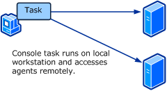

# Console Tasks
*Console tasks* in [!INCLUDE[om12long](Token/om12long_md.md)] run on the workstation where the Operations Console is running and uses the same credentials as the logged on user. The application that is run by the task must be installed on the workstation.

**Console task**

Console tasks are useful for running administration consoles or other tools that remotely access application components. These will usually be executable programs that run outside the Operations console. You can also run a command line utility and have the output displayed in a **Console Task Output** window.

For example, an administration console might require the name of the server that is running the application. The target for the task could be a class based on **Windows Computer Role** representing the application installation on the server. The task would only be available when an instance of the target class is selected. Because the class is hosted by **Windows Computer**, the PrincipalName property could be provided on the command line.

## Create Console Task Wizard Options
When you run the **Create Console Task** wizard, you have to provide values for the options in the following tables. Each table represents a single page in the wizard.

### General Properties
The following options are available on the **General Options** page of the wizard.

|Option|Description|
|----------|---------------|
|Task Name|The name used for the task. This name is displayed in the **Actions** pane in the Operations console.|
|Description|Optional description of the task.|
|Task target|Target class of the task. The task will be displayed in the **Actions** pane when an instance of the target class is selected. Properties from the target object are available to use in the parameter of the task  You do not specify a target for Alert and Event command line tasks. They are available to all alerts and events regardless of the class that created them.|

### Command Line
The following options are available on the **Command Line** page of the wizard.

|Option|Description|
|----------|---------------|
|Application|Path and name of the application to run.|
|Parameters|Parameters to add to the command line. This can be a combination of static text and variables for the properties of the target class or one of its parent classes.  If a variable used for a parameter could resolve to text containing a space, you should enclose the variable in quotations \(""\). If there are no quotations and the text includes a space, then it will be seen as multiple parameters.|
|Working directory|The default directory to use when the application is run.|
|Display output when this task is run|If selected, a **Console Task Output** window is opened when the task is run to display command line output. Make sure this option is selected if the application for the task is a utility that you would normally run from a command prompt.|

## Command Line Tasks
*Command line tasks* run a command line application or batch file using a target class. They are listed in the **Actions** pane of the Operations console when an instance of the target class is selected. You can specify the path to the application and the working directory. You can also use $Target variables from the target class or one of its parents to be included on the command line.

The following procedure creates a console task to run the **nslookup** utility to resolve the name of a computer to an IP address on the local computer. In this example, you will pass the principle name of the target computer to the command line.

#### To create a command line task

1.  Select the **Authoring** workspace.

2.  In the Authoring pane, expand **Management Pack Objects**.

3.  Right click **Tasks** and select **Create a New Task** to open the **Create Task Wizard**.

4.  On the **Task Type** page, do the following:

    1.  Under **Console Tasks**, select **Command line**.

    2.  In the **Select destination management pack** dropdown, select the management pack file to store the task. For more information about management packs, see [Selecting a Management Pack File](Selecting-a-Management-Pack-File.md).

    3.  Click **Next**.

5.  On the **General Properties** page, do the following:

    1.  Under **Task Name**, type **NSLookup**. This is the text that will be displayed in the **Actions** pane.

    2.  Click the Select button to open the **Select Items to Target** dialog box.

    3.  Select **Windows Computer** and click **OK**.

    4.  Click **Next**.

6.  On the **Command Line** page, do the following:

    1.  In the **Application** box, type **%windir%\\system32\\nslookup.exe**.

    2.  Click the button to the right of the  **Parameters** box and select **Principal Name**.

    3.  Ensure that the **Display output when this task is run** checkbox is selected. This option causes the **Console Task Output** window to be opened when the task is run.

    4.  Click **Create**.

#### To test the command line task

1.  Select the **Monitoring** workspace.

2.  Select the **Windows Computers** view.

3.  Select a computer listed in the **Windows Computers** pane.

4.  In the **Windows Computer Tasks** section of the **Tasks** pane, click **NSLookup**.

5.  When you have inspected the results of the lookup, click **Close**.

## Alert Command Line Tasks
*Alert command line tasks* run a command line application or batch file based on an alert. They are listed in the **Actions** pane of the Operations console when an alert is selected. You can specify the path to the application and the working directory. You can also use properties from the selected alert on the command line.

The following procedure creates a command line task to run a custom application forwarding an alert to an external ticketing system. It runs a custom program that accepts the Ticket ID, Managed Object Name, and Owner as command line parameters. In this example, it is expected that the managed object name and owner would possibly include spaces, so they are enclosed in quotations.

#### To create an alert command line task

1.  Select the **Authoring** workspace.

2.  In the Authoring pane, expand **Management Pack Objects**.

3.  Right click **Tasks** and select **Create a New Task** to open the **Create Task Wizard**.

4.  On the **Task Type** page, do the following:

    1.  Under **Console Tasks**, select **Alert command line**.

    2.  In the **Select destination management pack** dropdown, select the management pack file to store the task. For more information about management packs, see [Selecting a Management Pack File](Selecting-a-Management-Pack-File.md).

    3.  Click **Next**.

5.  On the **General Properties** page, do the following:

    1.  Under **Task Name**, type **Forward Alert**. This is the text that will be displayed in the **Actions** pane.

    2.  Click **Next**.

6.  On the **Command Line** page, do the following:

    1.  In the **Application** box, type **c:\\ticketing\\CreateTicket.exe**.

    2.  Click the button to the right of the  **Parameters** box and select **Ticket ID**.

    3.  Type a space after **$Ticket ID$**.

    4.  Click the button to the right of the **Parameters** box and select **Managed Object Name**.

    5.  Type quotations \(""\) around **$Managed Object Name$** and a space after the second quotation.

    6.  Click the button to the right of the **Parameters** box and select **Owner**.

    7.  Type quotations \(""\) around **$Owner$**.

    8.  Verify that the final **Parameters** box looks like the following:

        **$Ticket ID$ "$Managed Object Name$" "$Owner$"**

    9. Ensure that the **Display output when this task is run** checkbox is not selected.

    10. Click **Create**.

## Event Command Line Tasks
*Event command line tasks* run a command line application or batch file based on an event. They are listed in the **Actions** pane of the Operations console when an event is selected. You can specify the path to the application and the working directory. You can also use properties from the selected event on the command line.

The following procedure creates a command line task to run a custom application creating a ticket in an external ticketing system based on the selected event. It runs a custom program that accepts the Event Number, Managed Object Name, and Description as command line parameters. In this example, it is expected that the managed object name and description would possibly include spaces, so they are enclosed in quotations.

#### To create an event command line task

1.  Select the **Authoring** workspace.

2.  In the Authoring pane, expand **Management Pack Objects**.

3.  Right click **Tasks** and select **Create a New Task** to open the **Create Task Wizard**.

4.  On the **Task Type** page, do the following:

    1.  Under **Console Tasks**, select **Event command line**.

    2.  In the **Select destination management pack** dropdown, select the management pack file to store the task. For more information about management packs, see [Selecting a Management Pack File](Selecting-a-Management-Pack-File.md).

    3.  Click **Next**.

5.  On the **General Properties** page, do the following:

    1.  Under **Task Name**, type **Create Ticket**. This is the text that will be displayed in the **Actions** pane.

    2.  Click **Next**.

6.  On the **Command Line** page, do the following:

    1.  In the **Application** box, type **c:\\ticketing\\CreateTicket.exe**.

    2.  Click the button to the right of the  **Parameters** box and select **Number**.

    3.  Type a space after **$Number$**.

    4.  Click the button to the right of the **Parameters** box and select **Managed Object Name**.

    5.  Type quotations \(""\) around **$Managed Object Name$** and a space after the second quotation.

    6.  Click the button to the right of the **Parameters** box and select **Description**.

    7.  Type quotations \(""\) around **$Description$**.

    8.  Verify that the final **Parameters** box looks like the following:

        **$Ticket ID$ "$Managed Object Name$" "$Description$"**

    9. Ensure that the **Display output when this task is run** checkbox is not selected.

    10. Click **Create**.

## See Also
[Tasks](Tasks.md)
[Agent Tasks](assetId:///f6269883-c45e-4102-a2ba-fa19739e06c7)

