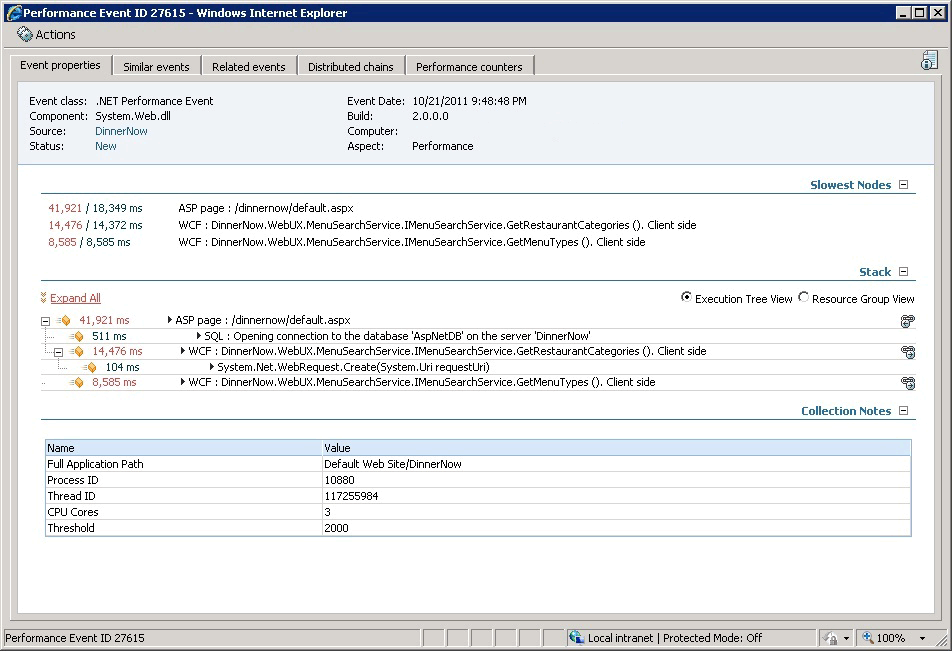
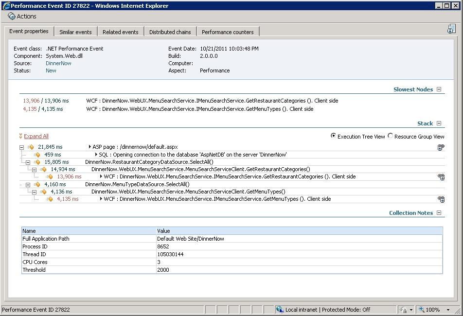

# How to Add, Enable, and Disable Namespaces
Namespaces define where application performance monitoring should go to collect more detailed information, such as parameters and variables for functions in the specified namespaces or classes. They can be added to the default list and be treated as either entry points or as methods. The default monitoring list can be changed by adding, editing, or removing namespaces and classes.

> [!NOTE]
> Many large .NET Framework namespaces \(such as System.\* and Microsoft.\*\) are disabled by default. To enable them, you need to explicitly add them to the namespaces list as enabled namespaces. Additionally, adding namespaces can affect performance and you should add them only after careful testing.

> [!NOTE]
> [!INCLUDE[sc2012sp1note](Token/sc2012sp1note_md.md)]**All namespaces** is present in the list and enabled for monitoring by default. However, **All namespaces**, does not include namespaces that have been explicitly disabled by the user or by the default configuration files.

If a namespace is generating too many events, collection for that namespace is turned off by the agent automatically to prevent overloading the agend and an event is written on the agent in the [!INCLUDE[om12short](Token/om12short_md.md)] event log. However, everything else will continue to run as expected.

## Add a Namespace

#### To add a namespace

1.  To open the .NET Application Performance Monitoring template, in the [!INCLUDE[om12short](Token/om12short_md.md)] console, in the navigation pane, click the **Authoring** button, click **Management Pack Templates**, and then click **.NET Application Performance Monitoring**.

2.  Right\-click the application group whose settings you want to modify, and then select **Properties**.

3.  On the **Server\-Side Defaults** tab, click **Advanced Settings**.

4.  On the **Advanced settings** page, click **Set Namespaces** to open the **Namespace list** page. This is where you can add namespaces.

5.  To add a namespace, on the **Namespace list** page, select **Namespace or class**, click **Add**, and then type the namespace you want to add.

    > [!NOTE]
    > The namespace and class names are case\-sensitive. The class name should be specified in the following format: Namespace.ClassName

    The **Enable monitoring** checkbox specifies whether or not you want to collect information from functions contained in the namespace or class. If you want to disable monitoring, perhaps because the functions in the namespace are called very frequently and could be creating performance overhead, clear the **Enable monitoring** checkbox, and the functions will not be monitored. If you want to make this namespace an entry point, select the **Enable as entrypoint** checkbox. Performance event timing begins when the monitor encounters a known entry point and completes when the processing of the entry point finishes. If that time exceeds the alerting threshold, then a performance event is reported. For most ASP.NET, ASP.NET MVC, and WCF applications and services, it is typically not necessary to mark specific namespaces or classes as entry points because the default configuration files already contain the entry points that are used by those technologies. Click **OK**.

    > [!WARNING]
    > Namespaces are set on the process level. If you enable a namespaces for an application that is running in the process and then disable it for a different application running in that process, there will be a namespace conflict and application monitoring will be disabled. To resolve this, you must make the namespace handling the same for all applications in the same process.

    > [!NOTE]
    > In contrast to namespaces, methods allow you to enable and disable data collection at the specific function level and let you monitor both time measurements as well as collecting deep information, such as variables and parameters used by the methods.

## Edit a Namespace

#### To edit a namespace

1.  To open the .NET Application Performance Monitoring template, in the [!INCLUDE[om12short](Token/om12short_md.md)] console, in the navigation pane, click the **Authoring** button, click **Management Pack Templates**, and then click **.NET Application Performance Monitoring**.

2.  Right click the application group whose settings you want to modify, and then select **Properties**.

3.  On the **Server\-Side Defaults** tab, click **Advanced Settings**.

4.  On the **Advanced settings** page, click **Set Namespaces** to open the **Namespace list** page. This is where you can edit namespaces.

5.  To edit a namespace, on the **Namespace list** page, click **Edit**, make your changes, and then click **OK**.

    > [!NOTE]
    > The namespace and class names are case\-sensitive. The class name should be specified in the following format: Namespace.ClassName

## Remove a Namespace

#### To remove a namespace

1.  To open the .NET Application Performance Monitoring template, in the [!INCLUDE[om12short](Token/om12short_md.md)] console, in the navigation pane, click the **Authoring** button, click **Management Pack Templates**, and then click **.NET Application Performance Monitoring**.

2.  Right click the application group whose settings you want to modify, and then select **Properties**.

3.  On the **Server\-Side Defaults** tab, click **Advanced Settings**.

4.  On the **Advanced settings** page, click **Set Namespaces** to open the **Namespace list** page. This is where you can remove namespaces.

5.  To remove a namespace, on the **Namespace list** page, select the namespace or class you want to remove, click **Remove**, and then click **OK**.

## When to Enable or Disable Monitoring of All Namespaces and Classes
This setting is used to figure out what you do not know when you are troubleshooting. When you are working with an application, you might not know what you need to enable to get the data you want. This is when you should enable all namespaces. Monitoring all namespaces gives you a view into all the methods that make up the request and ensures that all paths through the application are measured. If, for instance, you only select specific namespaces that you know exist, you might not collect all the information you need to troubleshoot performance problems. You would miss collecting performance information from unlisted namespaces. In this case, the timing in the known functions would include the amount of time spent in the unlisted namespace, giving the false impression that the known functions are slow when they are not.

**When to use:** Use this when you are trying to troubleshoot a problem and need to isolate the slow function.

**Strategy:** Before setting specific namespaces, it is good to first set all namespaces to know what’s being hit, and then reduce the number of namespaces to those that are relevant. This reduces amount of data collected and reduces impact on monitored application.

> [!TIP]
> It is best to enable all namespaces in a test environment before implementing it in a production environment as there is a performance penalty to monitoring all namespaces. When a test environment is not available, begin by measuring a single server’s baseline performance, and then enabling all namespaces on that single server. When you can determine that performance is not impacted, then roll out the setting to more servers.
> 
> [!INCLUDE[sc2012sp1note](Token/sc2012sp1note_md.md)]**All namespaces** is in the list and enabled for monitoring by default. However, **All namespaces**, does not include namespaces that have been explicitly disabled.

This example shows the difference in monitoring data when you change which namespaces are enabled.

**Monitoring with no namespaces**

Monitoring with no additional namespaces enabled, the execution tree shows that calls are going to WCF services, but has no details about the actual flow or where those calls are coming from. If a developer tries to investigate this issue and sees that the web service is called from multiple places, the information is incomplete and less useful in helping them find the true root cause.

**Monitoring with specific namespaces**

By adding the appropriate application specific namespaces, the execution tree shows more details about what is happening in the slow webpage.

#### To enable or disable monitoring of all namespaces and classes

1.  To open the .NET Application Performance Monitoring template, in the [!INCLUDE[om12short](Token/om12short_md.md)] console, in the navigation pane, click the **Authoring** button, click **Management Pack Templates**, and then click **.NET Application Performance Monitoring**.

2.  Right click the application group whose settings you want to modify, and then select **Properties**.

3.  On the **Server\-Side Defaults** tab, click **Advanced Settings**.

4.  On the **Advanced settings** page, click **Set Namespaces** to open the **Namespace list** page. This is where you can add namespaces.

5.  To add a namespace, on the **Namespace list** page, select **All namespaces**, click **Add**.

6.  To enable monitoring for all namespaces, select **Enable monitoring**. If you want to make all namespaces an entry point, select **Enable as entrypoint**. Click **OK**.

    > [!TIP]
    > With web applications you typically do not need to enable a namespace or class as an entry point. Entry points are used as the trigger to start measuring performance. .NET provides well\-known entry points that should cover the majority of web applications. You need to set the entry point flag only if the monitored application is called through a custom interface.

## See Also
[Understanding and Using Assemblies and Namespaces in .NET](http://go.microsoft.com/fwlink/?LinkId=230965)

