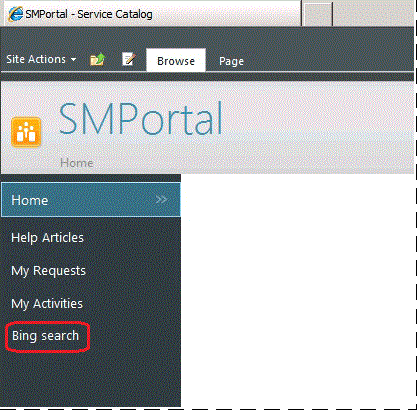

# How to Add Navigation Links
You can add additional navigation links to the [!INCLUDE[smssp](Token/smssp_md.md)] home page in [!INCLUDE[smlong12](Token/smlong12_md.md)]. As an example, the following procedure adds a link titled "Bing search" to an external website \(http:\/\/www.bing.com\), as shown in the following illustration.

### To add navigation links

1.  Start a browser, and connect to the [!INCLUDE[smssp](Token/smssp_md.md)] home page, for example, http:\/\/<WebServerName>:82\/SMPortal.

2.  In the upper left corner, click **Site Actions**, and then click **Site Settings**.

3.  On the **Site Settings** page, in the **Look and Feel** area, click **Quick launch**.

4.  On the **Quick Launch** page, click **New Navigation Link**.

5.  In the **Type the Web address** field, type **http:\/\/www.bing.com**.

6.  In the **Type the description** field, type **Bing search**, and then click **OK**.

## See Also
[Managing the System Center 2012 - Service Manager Self-Service Portal](Managing-the-System-Center-2012---Service-Manager-Self-Service-Portal.md)

