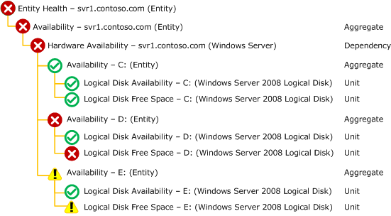

# Monitors and Rules
Monitors and rules are the primary elements for measuring health and detecting errors in [!INCLUDE[om12short](Token/om12short_md.md)] and provide similar yet distinct functionality. Monitors set the state of an object while rules create alerts and collect data for analysis and reporting. Each monitor and rule is primarily defined by the source of the data that is used to perform its required functionality and the logic used to evaluate this data.

Although they provide different functionality, monitors and rules both use a common set of sources that provide the data to evaluate. For example, a monitor may use a performance counter to set the state of a particular object. A rule may access the same performance counter in order to store its value for analysis and reporting.

## Monitors
A monitor measures the health of some aspect of a managed object. There are three kinds of monitors as shown in the following table:

### Health State
Monitors each have either two or three health states. A monitor will be in one and only one of its potential states at any given time. When a monitor loaded by the agent, it is initialized to a healthy state. The state will change only if the specified conditions for another state are detected.

The overall health of a particular object is determined from the health of each of its monitors. This will be a combination of monitors targeted directly at the object, monitors target at objects rolling up to the object through a dependency monitor, dependency monitors targeted at those objects, and so on. This hierarchy is illustrated in the Health Explorer of the Operations console. The policy for how health is rolled up is part of the configuration of the aggregate and dependency monitors.

When you create a monitor, you must specify a condition for each of its health states. When one of those conditions is met, the monitor changes to that state. Each of the conditions must be unique such that only one can be true at a particular time. When a monitor changes to a Warning or Critical state, then it can optionally generate an alert. When it changes to a Healthy state, then any previously generated alert can optionally be automatically resolved.

### Types of Monitors

|Monitor|Description|
|-----------|---------------|
|Unit Monitors|Measures some aspect of the application. This might be checking a performance counter to determine the performance of the application, running a script to perform a synthetic transaction, or watch for an event that indicates an error. Classes will typically have multiple unit monitors targeted at them to test different features of the application and to monitor for different problems.|
|Dependency Monitors|Provides health rollup between different classes. This allows the health of an object to depend on the health of another kind of object that it relies on for successful operation.|
|Aggregate Monitors|Provides a combined health state for similar monitors. Unit and dependency monitors will typically be configured under a particular aggregate monitor. In addition to providing better general organization of the many different monitors targeted at a particular class, aggregate monitors provide a unique health state for different categories of the class.|

> [!NOTE]
> When the term *monitor* is alone, it typically refers to a unit monitor. Aggregate and dependency monitors will typically be referred to with their full name.

The following diagram shows an example of the Health Explorer for the **Windows Server** class. This shows the use of the different kinds of monitors contributing to an overall health state.

**Sample Health Explorer**

## Rules
Rules do not affect the health state of the target object. They are used for one of three functions as described in the following table:

|Monitor|Description|
|-----------|---------------|
|Alerting Rules|Alerting rules create an alert when a particular event is detected. This can be any of the different kinds of events shown in [Data Sources](Data-Sources.md). Alerting rules do not affect health state.|
|Collection Rules|Collection rules collect events or performance data to the Operations Manager database and data warehouse. They do not create alerts or set health state.  Collection rules can use each of the data sources shown in [Data Sources](Data-Sources.md). The data will be converted to either an event or to performance data depending on the particular kind of collection rule you are creating. For some wizards, you will need to provide the specific information from the data source that will be used for different properties of the data being collected.|
|Command Rules|Command rules will run a script or command on a schedule. They do not create alerts or collect any data.|

## Should you create a monitor or a rule?
Unit monitors and rules in [!INCLUDE[om12short](Token/om12short_md.md)] are similar. They are both workflows that run on an agent, they both can generate an alert when a particular condition is met, and they both use a similar set of data sources to detect these conditions. As a result, it can be difficult to determine if you want to create a monitor or rule for a particular scenario.

Use the following criteria to determine which one to create for different conditions.

### Create a monitor if…

-   You want to affect the health of an object. In addition to generating an alert, a monitor will affect the health state of its target object. This is displayed in state views and availability reports.

-   You want to automatically resolve an alert when the error condition has been cleared. An alert from a rule cannot be automatically cleared since a rule has no way of detecting that the problem has been resolved. A monitor can detect that the problem has been resolved when the condition for its healthy state is met, and the alert can automatically be resolved.

-   You are creating an alert based on a performance threshold. There are no rules available to generate an alert from a performance threshold. A monitor should be used for this scenario anyway since you can use the condition where the performance counter is under the defined threshold.

-   You have a condition that requires more complex logic than is possible with rules. The Operations console provides a variety of options for setting the health state of a monitor but only simple detection for a rule. If you need more complex logic for a rule but don’t have a method to detect the monitor’s healthy state, then you can create a monitor using Manual or Timer reset. See [Event Monitor Reset](Event-Monitor-Reset.md) for more information.

    > [!NOTE]
    > Using the [Viso Management Pack Designer](Authoring-Tools.md#VMPD) you can create custom rules using the same logic available in the Operations console for monitors.

### Create a Rule if…

-   You want to collect performance counters or events for analysis and reporting. Monitors only collect this information when it initiates a change in health state. If you want to collect the information you need to create a collection rule.

    If you want to both collect a performance counter and set a threshold for it to set a health state, then create both a rule and a monitor using the same performance counter.

-   You want to generate an alert that is not related to health state of an object.

## Monitors and Rules Topics
Monitors and rules are described in the following topics.

-   [Data Sources](Data-Sources.md)

    Describes the concept of a data source and lists the different kinds of data sources available for monitors and rules.

-   [Expressions](Expressions.md)

    Describes how to create an expression for different kinds of monitors and rules.

-   [Alerts](Alerts.md)

    Describes how to configure alerts created by monitors and rules.

-   [Event Monitors and Rules](Event-Monitors-and-Rules.md)

    Describes monitors and rules that use different kinds of events and provides details and procedures for creating them using wizards in the Operations console.

-   [Performance Monitors and Rules](Performance-Monitors-and-Rules.md)

    Describes monitors and rules that collect and monitor performance and provides details and procedures for creating them using wizards in the Operations console.

-   [Script Monitors and Rules](Script-Monitors-and-Rules.md)

    Provides the details of how to write a monitoring script and how to create monitors and rules using scripts.

-   [Dependency Monitors](Dependency-Monitors.md)

    Describes monitors that allow the health of one kind of object to be dependent on the health of another object.

-   [Aggregate Monitors](Aggregate-Monitors.md)

    Describes monitors that consolidate  the health of other monitors for a particular kind of object.

