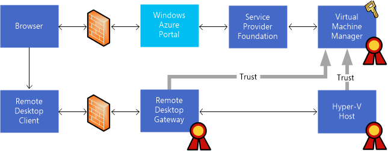

# Remote Console for VMM
Remote Console provides tenants with the ability to access the console of their virtual machines in scenarios when other remote tools \(or Remote Desktop\) are unavailable. Tenants can use Remote Console to access virtual machines when the virtual machine is on an isolated network, an untrusted network, or across the Internet.

Remote Console needs the following to run:

-   [!INCLUDE[winthreshold_server_2](Token/winthreshold_server_2_md.md)] with the Hyper\-V role

-   [!INCLUDE[vmm12sp1_long](Token/vmm12sp1_long_md.md)] in [!INCLUDE[sc_threshold_1](Token/sc_threshold_1_md.md)]

-   Service Provider Foundation in [!INCLUDE[sc_threshold_1](Token/sc_threshold_1_md.md)]

-   [!INCLUDE[katal_1](Token/katal_1_md.md)]

> [!NOTE]
> Tenants need a client computer that supports Remote Desktop Protocol 8.1. For example, users who are running [!INCLUDE[win8_client_2](Token/win8_client_2_md.md)] must upgrade to [!INCLUDE[winblue_client_2](Token/winblue_client_2_md.md)]. In addition, clients using Windows 7 SP1 must install [KB2830477](http://support.microsoft.com/kb/2830477).

In this release, Remote Console supports limited functionality. Features such as the clipboard, sound, printer redirection, and drive mapping are not supported. Remote Console functions in a manner that is similar to the keyboard, video, and mouse \(KVM\) connection that is used by physical computers.

## User authentication
In Hyper\-V, certificate\-based authentication can be used to help ensure that tenants only access virtual machines that are assigned to them. The [!INCLUDE[katal_1](Token/katal_1_md.md)] web portal, Service Provider Foundation, and [!INCLUDE[vmm12short](Token/vmm12short_md.md)] authenticate and authorize access to virtual machines and provide a token that the Hyper\-V host uses to grant access to a single virtual machine.

The following diagram illustrates the components that are needed for Remote Console access when tenants are accessing a virtual machine across an untrusted network such as the Internet. Remote Desktop Gateway \(RD Gateway\) is omitted if this environment is deployed in a corporate network.



The private and public keys for a certificate are used to establish a trust relationship. The following sections describe how to create the required certificates.

### Creating a certificate for remote access
A certificate is used to create a trust relationship between RD Gateway server, the Hyper\-V hosts, and [!INCLUDE[vmm12short](Token/vmm12short_md.md)]. The certificate allows RD Gateway and the Hyper\-V hosts to accept claims tokens that are issued by [!INCLUDE[vmm12short](Token/vmm12short_md.md)] RD Gateway. It is possible to use the same or different certificates for validation on RD Gateway and the Hyper\-V hosts. Valid certificates must meet the following requirements:

1.  The certificate must not be expired.

2.  The Key Usage field must contain a digital signature.

3.  The Enhanced Key Usage field must contain the following Client Authentication object identifier: \(1.3.6.1.5.5.7.3.2\)

4.  The root certificates for the certification authority \(CA\) that issued the certificate must be installed in the Trusted Root Certification Authorities certificate store.

5.  The cryptographic service provider for the certificate must support SHA256.

> [!NOTE]
> You can obtain a valid certificate from a commercial certification authority, an enterprise certification authority, or by using a self\-signed certificate. When you use a self\-signed certificate, you must place the public key of the certificate in the Trusted Root Certification Authorities certificate store in RD Gateway and the Hyper\-V hosts.

#### Using the MakeCert tool to create a test certificate
For testing purposes, you can use the MakeCert tool to create a self\-signed certificate. MakeCert is part of the Windows SDK.

-   To download the SDK, see[Windows SDK for Windows 8.1](http://msdn.microsoft.com/windows/bg162891.aspx).

-   For more information, see [MakeCert](http://msdn.microsoft.com/library/windows/desktop/aa386968.aspx) on the Windows Dev Center.

The following code provides an example for how to create a self\-signed certificate:

```
makecert -n "CN=Remote Console Connect" -r -pe -a sha256 -e <mm/dd/yyyy> -len 2048 -sky signature -eku 1.3.6.1.5.5.7.3.2 -ss My -sy 24 "<CertificateName>.cer"
```

where:

|||
|-|-|
|\-sky signature|Use for signing|
|\-r|Create self\-signed certificate|
|\-n “CN\=Remote Console Connect”|Subject name \(Remote Console Connect\)|
|\-pe|Private key is exportable|
|\-a sha256|algorithm|
|\-len 2048|Key length|
|\-e <mm\/dd\/yyyy>|Expiry date|
|\-eku 1.3.6.1.5.5.7.3.2|Enhanced Key Usage \(Client Authentication object identifier\)|
|\-ss My|Store private key in certificate store My|
|\-sy 24|Cryptographic provider type \(supports SHA256\)|
|“<CertificateName>.cer”|Name for the public key|

#### Using a certification authority
When you request a certificate from a certification authority, a certificate template .inf file similar to the following can be used with the Certreq tool. For more information, see [Certreq](http://technet.microsoft.com/library/dn296456.aspx).

```
[Version]
Signature="$Windows NT$"
[NewRequest]
; Change to your,country code, company name and common name
Subject = "C=US, O=Contoso, CN=wap-rdg.contoso.com"
; Indicates both encryption and signing
KeySpec = 1 
; Length of the public and private key, use 2048 or higher
KeyLength = 2048
; Certificate will be put into the local computer store
MachineKeySet = TRUE 
PrivateKeyArchive = FALSE
RequestType = PKCS10
UserProtected = FALSE
; Allow the key to be shared between multiple computers
Exportable = TRUE
SMIME = False
UseExistingKeySet = FALSE 
; ProviderName and ProviderType must be for a CSP that supports SHA256
ProviderName = "Microsoft Enhanced RSA and AES Cryptographic Provider"
ProviderType = 24
; KeyUsage must include DigitalSignature. 0xA0 also includes Key Encipherment
KeyUsage = 0xa0
[EnhancedKeyUsageExtension]
OID=1.3.6.1.5.5.7.3.2
```

You can validate that a certificate in a .pfx file meets algorithm and Enhanced Key Usage requirements by running the following Windows PowerShell script:

```
$cert = Get-PfxCertificate <cert.pfx>
if ($cert.PrivateKey.CspKeyContainerInfo.ProviderName -ne "Microsoft Enhanced RSA and AES Cryptographic Provider")
{
       Write-Warning "CSP may not support SHA256"
}
if (! (Test-Certificate $cert -EKU "1.3.6.1.5.5.7.3.2") )
{
       Write-Warning "Certificate is not valid"
}
```

### Installing the certificate
Once the certificate has been created, you must then install it and configure [!INCLUDE[vmm12short](Token/vmm12short_md.md)] to use the certificate to issue claims tokens. The private key for the certificate is then imported into the [!INCLUDE[vmm12short](Token/vmm12short_md.md)] database. To do this, use the **Set\-SCVMMServer** Windows PowerShell cmdlet, for example:

```
PS C:\> $mypwd = ConvertTo-SecureString "password" -AsPlainText -Force
PS C:\> $cert = Get-ChildItem .\RemoteConsoleConnect.pfx 
PS C:\> $VMMServer = VMMServer01.Contoso.com
PS C:\> Set-SCVMMServer -VMConnectGatewayCertificatePassword $mypwd -VMConnectGatewayCertificatePath $cert -VMConnectHostIdentificationMode FQDN -VMConnectHyperVCertificatePassword $mypwd -VMConnectHyperVCertificatePath $cert -VMConnectTimeToLiveInMinutes 2 -VMMServer $VMMServer
```

In this example, the same certificate is used for RD Gateway and for the [!INCLUDE[nextref_virtualname](Token/nextref_virtualname_md.md)] hosts, and tokens have a lifetime of two minutes. You can select a lifetime for tokens of 1 to 60 minutes.

You identify the host server by its Fully Qualified Domain Name \(FQDN\). Alternatively, hosts can be identified by IPv4 address, IPv6 address, and host name. The host identity is included in the Remote Desktop Protocol \(RDP\) file that is sent to tenants.

> [!NOTE]
> `VMMServer01.Contoso.com` is used as the example host server name. Change this to your actual server name.

`RemoteConsoleConnect.pfx` is used to import the PFX file where the certificate keys are stored to the VMM database. ‎

When each host is refreshed in [!INCLUDE[vmm12short](Token/vmm12short_md.md)], it installs the certificate in the Personal certificate store of the [!INCLUDE[nextref_virtualname](Token/nextref_virtualname_md.md)] host and configures the [!INCLUDE[nextref_virtualname](Token/nextref_virtualname_md.md)] host to validate tokens by using the certificate. You can use the following Windows PowerShell command to force a refresh of all [!INCLUDE[nextref_virtualname](Token/nextref_virtualname_md.md)] hosts:

```
PS C:\> Get-SCVMHost -VMMServer "VMMServer01.Contoso.com" | Read-SCVMHost
```

### Hyper\-V hosts
Hyper\-V supports Remote Console functionality as of [!INCLUDE[winblue_server_2](Token/winblue_server_2_md.md)].

When authenticating tokens, Hyper\-V only accepts tokens that are signed by using specific certificates and hash algorithms. [!INCLUDE[vmm12short](Token/vmm12short_md.md)] performs the required configuration for the Hyper\-V hosts.

When you use a self\-signed certificate, you must import the public key of the certificate to the Trusted Root Certification Authorities certificate store for the [!INCLUDE[nextref_virtualname](Token/nextref_virtualname_md.md)] host. The following script provides an example of how to use Windows PowerShell to import the public key:

```
PS C:\> Import-Certificate -CertStoreLocation cert:\LocalMachine\Root -Filepath "<certificate path>.cer"
```

You must restart the Hyper\-V Virtual Machine Management service if you install a certificate after you configure [!INCLUDE[vmm12short](Token/vmm12short_md.md)].

You can verify that the Hyper\-V host is correctly configured for Remote Console as follows:

1.  Check that the certificate is in the Personal certificate store of the [!INCLUDE[nextref_virtualname](Token/nextref_virtualname_md.md)] host and that it is trusted.

2.  Check the hash configuration for the trusted issuer certificate.

The following script provides an example of how to use Windows PowerShell to check that the certificate is installed in the Personal certificate store of the [!INCLUDE[nextref_virtualname](Token/nextref_virtualname_md.md)] host:

```
PS C:\> dir cert:\localmachine\My\ | Where-Object { $_.subject -eq "CN=Remote Console Connect" }
```

The following script provides an example of how to use Windows PowerShell to check the hash configuration for the trusted issuer certificate:

```
PS C:\> $TSData = Get-WmiObject -computername $Server -NameSpace "root\virtualization\v2" -Class "Msvm_TerminalServiceSettingData"
```

The **TrustedIssuerCertificateHashes** array must contain the certificate thumbprint that is used to connect Remote Console. The **AllowedHashAlgorithms** array must be empty or contain the SHA256 algorithm. When the array is empty, it defaults to SHA256 or SHA512.

> [!NOTE]
> [!INCLUDE[vmm12short](Token/vmm12short_md.md)] generates SHA256 tokens.

### Remote Desktop Gateway
Remote Desktop Gateway \(RD Gateway\) can only be used for console access to virtual machines. When you configure RD Gateway, a configuration change occurs, which makes the gateway unusable for other purposes. The following tasks are completed when you configure RD Gateway:

1.  Deploy RD Gateway and install the authentication plug\-in.

2.  Install the certificate.

3.  Configure trusted issuer certificates \(by using WMI\).

4.  Create a certificate for RD Gateway.

To support federated authentication, it is necessary to install the Microsoft System Center Virtual Machine Manager Console Connect Gateway onto RD Gateway server. Start by creating a virtual machine, then enable Remote Desktop Services.

Then install the System Center Virtual Machine Manager Console Connect Gateway component. You will find the installation binaries for this component in the following Virtual Machine Manager installation media folder: **CDLayout.EVAL\\amd64\\Setup\\msi\\RDGatewayFedAuth**. For a high availability configuration, install multiple quantities of RD Gatewaywith the Console Connect Gateway component behind a load balancer.

Next, import the public key of the certificate into the Personal certificate store on each RD Gateway server. You can accomplish this by using Windows PowerShell as shown in the following example:

```
PS C:\> Import-Certificate -CertStoreLocation cert:\LocalMachine\My -Filepath "<certificate path>.cer"
```

If you are using a self\-signed certificate, you must import the public key of the certificate into the Trusted Root Certification Authorities certificate store for the machine account. You can accomplish this by using Windows PowerShell as shown in the following example:

```
PS C:\> Import-Certificate -CertStoreLocation cert:\LocalMachine\Root -Filepath "<certificate path>.cer"
```

When authenticating tokens, RD Gateway accepts only tokens that are signed by using specific certificates and hash algorithms. This configuration is performed by setting the **TrustedIssuerCertificateHashes** and **AllowedHashAlgorithms** properties in the WMI **FedAuthSettings** class. You must have administrative credentials to set these properties.

The **TrustedIssuerCertificateHashes** property is an array of certificate thumbprints that are stored in the RD Gateway server. You can use the following Windows PowerShell command to set the **TrustedIssuerCertificateHashes** property:

```
$Server = "rdgw.contoso.com"
$Thumbprint = "95442A6B58EB5E443313C1B4AFD2665991D354CA"
$TSData = Get-WmiObject -computername $Server -NameSpace "root\TSGatewayFedAuth2" -Class "FedAuthSettings"
$TSData.TrustedIssuerCertificates = $Thumbprint
$TSData.Put()
```

The last step is to select or create a self\-signed certificate for RD Gateway. To accomplish this, open RD Gateway Manager, right\-click **Remote Desktop Gateway**, and click **Properties**. In the **Properties** dialog box, click the **SSL Certificate** tab.

This certificate is used by tenant client computers to verify the identity of the RD Gateway server. The CN name for the certificate must match the FQDN of the RD Gateway server. Open RD Gateway Manager and assign or create a self\-signed certificate.

> [!NOTE]
> Use a self\-signed certificate only for testing. A self\-signed certificate should never be used in a production deployment. Using a self\-signed certificate also requires that the certificate is installed on every tenant computer that is connecting through the RD Gateway.

You can verify the configuration of RD Gateway by performing the following steps:

1.  Make sure that RD Gateway is configured to use the Console Connect Gateway for authentication and authorization. You can accomplish this by using Windows PowerShell as shown in the following example:

    ```
    PS C:\> Get-WmiObject -Namespace root\CIMV2\TerminalServices -Class Win32_TSGatewayServerSettings
    ```

    Verify that the **AuthenticationPlugin** and **AuthorizationPlugin** properties are set to **FedAuthorizationPlugin**.

2.  Make sure that a certificate has been installed in the Personal certificate store for the machine account. You can accomplish this by using Windows PowerShell as shown in the following example:

    ```
    PS C:\> dir cert:\localmachine\My\ | Where-Object { $_.subject -eq "CN=Remote Console Connect" }
    ```

3.  Check the configuration of the Console Connect Gateway. You can accomplish this by using Windows PowerShell as shown in the following example:

    ```
    PS C:\> Get-WmiObject -computername $Server -NameSpace "root\TSGatewayFedAuth2" -Class "FedAuthSettings"
    ```

    The **TrustedIssuerCertificates** array must contain the certificate thumbprint for Console Connect Gateway.

### Windows Azure Pack for Windows Server for Remote Console
You can enable access to Remote Console on a per plan basis through the Virtual Machine Clouds service in Windows Azure Pack for Windows Server. In the dashboard of the plan, select the **Virtual Machine Clouds** under plan services, and select **Connect to the console of virtual machines** under additional settings.

If you have installed a Remote Desktop Gateway, read the procedure [How to configure Windows Azure Pack to use the Remote Desktop Gateway](How-to-configure-Windows-Azure-Pack-to-use-the-Remote-Desktop-Gateway.md).

## Security recommendations
We recommend that you perform the following tasks to improve security:

|Name|Threat|Recommendation|
|--------|----------|------------------|
|Token Access|Access to My certificate store can be used to generate access tokens for any virtual machine.|Use Active Directory security groups to restrict access to the Virtual Machine Manager server generating tokens.|
|Token lifetime|The Remote Desktop Protocol \(RDP\) file contains the **EndpointFedAuth** token and possession of the RDP file allows access to the console of a specific virtual machine.|Configure a short expiration time for the token. One minute is the recommended expiration time. Use the **SetSCVMMServer** Windows PowerShell cmdlet to set the token lifetime.|
|Shared access|Another user requests and accesses the console session, which ends the existing session. This includes a host that accesses the console of a user who is signed in, and then gains access to tenant resources.<br /><br />Console sessions are similar to KVM sessions for physical hosts. A virtual machine session is available to all users who have been granted the Console Read or Console Read\/Write operations privilege in the authorization policy. By default, this is granted to any Administrator.|Tennant Users:<br /><br />Do not remain signed in to a console session when not actively working.<br /><br />Ensure that the operating system locks after a short period of inactivity.<br /><br />Hosting service providers:<br /><br />Use authorization policies to restrict read and write access.|
|Malicious users|Malicious users can attempt to connect to ports through the RD Gateway when they are not authorized. For example, a malicious user might attempt to connect to the RDP port on a Hyper\-V host to try user name and password combinations.|Configure Remote Desktop resource authorization policies in the RD Gateway server to block users from connecting directly to port 3389 on the Hyper\-V server. Connections are needed only to port 2179. For more information, see[Manage Remote Desktop Resource Allocation Policies (RD RAPs)](http://technet.microsoft.com/library/cc730630.aspx).|
|Man\-in–the\-middle attack|One security issue that Hyper\-V was designed to address is better protection against “man\-in\-the\-middle” attacks \(also referred to as MITM\). Use of trusted certificates to identify the Hyper\-V host can help protect against MITM attacks. Hyper\-V uses a single\-port listener that utilizes trusted certificates for server authentication. Under certain circumstances, Hyper\-V issues a self\-signed certificate that is then used for server authentication. As an alternative to this approach, you can configure Hyper\-V to use a different certificate, such as one issued by a certification authority \(CA\).|Use a Hyper\-V host certificate with a valid certificate chain that is connected to a trusted root certificate. This prevents an error message that says the identity of the remote computer cannot be verified. For more information, see[Configuring Certificates for Virtual Machine Connection](http://technet.microsoft.com/library/ff935311.aspx).|
|Session snooping|When a console connection is active, it is possible for host staff to take a snapshot of the virtual machine and export the virtual machine to another server, or to collect thumbnail images of the console.|Use authorization policies to restrict read and write access. Disclose to tenants the situations in which your staff could access console sessions.|
|Network configuration|A malicious user can use properties in the RDP file to gain insight about a network configuration.|Determine if the host name or IP address should be used to connect to a server running Hyper\-V. This information is included in the RDP file that is sent to the service consumer. It is also in the certificate that is presented by the server running Hyper\-V when the console connection is initiated.<br /><br />Set the network configuration to ensure that servers running Hyper\-V are not directly accessible from the Internet or from a user’s virtual machine. An IP address \(in particular, an IPv6 address\) reduces the amount of information that is disclosed.|

## See Also
[How to configure Windows Azure Pack to use the Remote Desktop Gateway](How-to-configure-Windows-Azure-Pack-to-use-the-Remote-Desktop-Gateway.md)
[Managing a self-service environment for tenants](Managing-a-self-service-environment-for-tenants.md)
[Managing tenant resources with VMM](Managing-tenant-resources-with-VMM.md)


