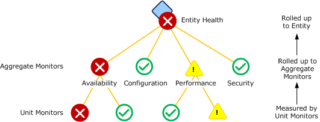
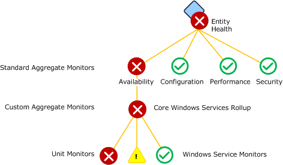
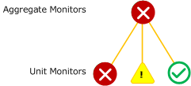
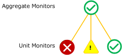

# Aggregate Monitors
*Aggregate monitors* group multiple monitors to provide a single health aggregated health state. This provides an organization to all of the monitors targeted at a particular class and provides a consolidated health state for specific categories of operation.

## Standard Aggregate Monitors
Every class has four standard aggregate monitors: Availability, Configuration, Performance, and Security. These are in the System.Health.Library management pack and targeted at the **Entity** class. Because all classes inherit from the **Entity** class, all classes inherit these standard monitors. The standard set of aggregate monitors will be sufficient for most classes.

Most monitors will fall into one of the four categories represented by the standard aggregate monitors. Because of this, custom aggregate monitors will typically use one of the standard aggregate monitors as their parent instead of being positioned alongside them directly under the entity health.  Unit monitors and dependency monitors will similarly use either a custom aggregate monitor or one of the standard aggregate monitors as their parent.

**Standard aggregate monitors**

## Custom Aggregate Monitors
Management packs can include custom aggregate monitors specific to the requirements of classes in a particular application. These monitors may use another aggregate monitor for their parent or the top level Entity State similar to the standard aggregate monitors use. Custom aggregate monitors can be configured underneath another aggregate monitor or attached directly to the entity state.

For example, the Windows Server 2008 Operating System \(Monitoring\) management pack includes an aggregate monitor called Microsoft.Windows.Server.2008.OperatingSystem.CoreServicesRollup that is used to combine the health of the different services that are monitored by this management pack. There are nine services that the management pack considers critical to the operation of a computer running [!INCLUDE[longhornshort](../Token/longhornshort_md.md)]. Instead of positioning these directly under the Availability aggregate monitor alongside other unit monitors, the aggregate monitor provides a combined health measurement for all the related services.

This aggregate monitor is illustrated in the following diagram.

**Core Windows Services Rollup aggregate monitor**

## Health Rollup Policy
Each aggregate monitor must define a health rollup policy which is the logic that is used to determine the health of the aggregate monitor based on the health of the monitors under it. The possible health rollup policies for an aggregate monitor are as follows:

### Worst state
The state of the aggregate monitor matches the state of the child monitor with the worst health state. This is the most common policy used by aggregate monitors.

**Worst state health policy**

### Best state
The state of the aggregate monitor matches the state of the child monitor with the best health state.

**Best state health policy**

## Alerting on Aggregate Monitors
You can configure alerts on aggregate monitors just like with unit monitors, and you can leverage this feature to reduce noise by limiting the number of redundant alerts you receive. To implement this strategy, group together a common set of unit monitors underneath an aggregate monitor. Configure the aggregate monitor to send an alert, but configure unit monitors to not send an alert. When one of the unit monitors goes to a critical or warning state \(depending on the configuration of your aggregate monitor\), it will cause the aggregate monitor to change to the same state and cause an alert to be sent. If another unit monitor under the same aggregate goes to a warning or critical state, another alert won’t be sent since the aggregate monitor will already be in the negative state.

This strategy should only be used if the unit monitors measure a particular feature of the application. The assumption it relies on is that a problem with one of the monitors will alert support staff to a problem in the application. They can inspect the Health Explorer for further information including the other monitors that may be unhealthy. Additional alerts for a similar problem would not be of value but only create excess noise.

If the unit monitors measure different features of the application such that alerts should be received separately from each, then either multiple aggregate monitors should be created or this strategy should not be used.

