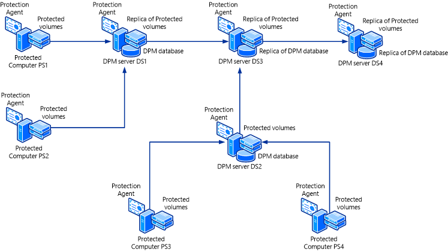
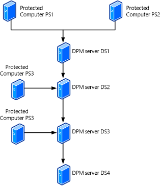
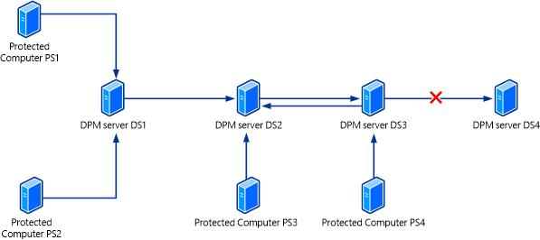

# Back up DPM using a secondary server
Data and replicas on a DPM server can be backed up and protected by another DPM server in any of the following configurations:

-   **Primary to secondary protection**—The database and replicas stored on a primary DPM server can be backed up to a secondary DPM server. If the primary server fails the secondary server continues to back up protected workloads. If the primary server fails you can do either of the following:

    -   Rebuild the primary server and restore its database and replicas from the secondary server. Then move the protected workloads back to the primary server after the rebuild.

    -   Select to switch protection to the secondary DPM server. With this setting you then restore to the protected computer directly from the secondary server when the need arises.

        For instructions, see [Set up secondary servers](../Topic/Set-up-secondary-servers.md).

-   [DPM chaining](#BKMK_Chain)—A chain of DPM servers provide protection, and each server protects the next one in in the chain. For example:

    -   DPM1 is protected by DPM2 \(DPM1 is the primary and DPM2 is the secondary\).

    -   DPM2 is protected by DPM3 \(DPM2 is the primary and DPM3 is the secondary\)

    For instructions, see [Set up chaining](../Topic/Set-up-chaining.md).

-   [Cyclic protection](#BKMK_Cyclic)—One DPM server is backed up by another DPM server, and vice versa. So that DPM1 protects DPM2, and likewise DPM2 protects DPM1. This is useful for small environments.

## DPM chaining
**Before you begin:**

-   Each DPM server can only be protected once in the chain so verify they’re not protected by more than one server.

-   Primary and secondary servers are established by the chain, so in our example above, although DPM3 is actually protecting DPM1 because it’s acting as the secondary server for DPM2, it can’t act directly as a secondary server for DPM1.

-   If a DPM server is configured to protect its own data source the chain will be broken. For example if DPM1 protects its own database or system state, DPM2 can’t protect DPM1.

-   Before you can protect the database of a primary DPM server you need to start the SQL Server VSS Writer service on the primary server.

**Scenario 1: Chained protection**

Scenario 1 shows a scenario in which four DPM servers are chained:

|Server|Protecting|Protected by|
|----------|--------------|----------------|
|DS1 \(primary\)|PS1, PS2|DS3|
|DS2 \(primary\)|PS3, PS4|DS3|
|DS3 \(secondary\)|DS1, DS2|DS4|
|DS4 \(secondary\)|DS3|\-|

**Scenario 2: Chained protection**

Scenario 2 shows a scenario in which four DPM servers are chained:

|Server|Protecting|Protected by|
|----------|--------------|----------------|
|DS1 \(primary\)|PS1, PS2|DS2|
|DS2 \(primary\)|PS3|DS3|
|DS2 \(secondary\)|DS1|DS3|
|DS3 \(primary\)|PS4|DS4|
|DS3 \(secondary\)|DS2|DS4|
|DS4|DS3|\-|

## Cyclic protection
If you don’t want to use a secondary server then two [!INCLUDE[dpm2012short](../Token/dpm2012short_md.md)] servers can protect each other.

**Scenario 3: Cyclic protection**

Scenario 3 shows a scenario using cyclic protection

|Server|Protecting|Protected by|
|----------|--------------|----------------|
|DS1 \(primary\)|PS1, PS2|DS2|
|DS2 \(primary\)|PS3|DS3|
|DS2 \(secondary\)|DS1, DS3|DS3|
|DS3 \(primary\)|PS4|DS2|
|DS3 \(secondary\)|DS2|DS2|

