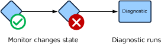
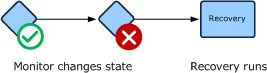

# Diagnostics and Recoveries
*Diagnostics* and *recoveries* run when a monitor changes state. Diagnostics collect additional information about the detected problem. Recoveries try to resolve the problem. Each will typically run a command or script that outputs information displayed in the Health Explorer in the Operations Console.

## Diagnostics
Diagnostics run after a monitor changes state and try to collect additional information about the issue. This information is provided to the user with the state change history in the properties of the monitor. If the **Run diagnostic automatically** property of the diagnostic is set to true, then it is run automatically when the monitor changes state. If the **Run diagnostic automatically** property of the diagnostic is set to false, then a link is provided to the user in the Operations console that they can click to run the diagnostic.

Diagnostics are not intended to make any changes to the application or system that they are running on. Because they are running a script or command, however, there is no way for [!INCLUDE[om12short](../Token/om12short_md.md)] to make sure that these changes are not being made. It is the responsibility of the management pack author to make sure that no such changes are being made. If changes to the application or system are required, then a recovery should be used.

**Diagnostic**

## Recoveries
Recoveries are workflows that run after a monitor changes state. Recoveries try to correct the issue, and return the monitor to a healthy state. Any output from the recovery is provided to the user with the state change history in the properties of the monitor that the diagnostic is associated with. If the **Run diagnostic automatically** property of the recovery is set to true, then the recovery is run automatically when the monitor changes state. If the **Run diagnostic automatically** property of the recovery is set to false, then a link is provided to the user in the Operations console that they can click to run the recovery.

**Recovery**

### Recalculating State
If a recovery is successful, then the monitor should return to a healthy state the next time that the monitor detects the required information. If the monitor runs a scheduled script for example, then the monitor will return to healthy the next time that the script runs and the monitors detects the criteria for a healthy state. If the monitor relies on an event for its healthy state, the application is expected to create the required event in response to the recovery successfully correcting the problem. If a monitor is configured to use a manual reset though, then the user will still be required to manually set it to a healthy state.

A recovery can be configured to recalculate the state of the monitor immediately after it runs. This option has the same effect as the user selecting **Recalculate Health** for the monitor in the Operations console. Recalculating state only has an effect on monitors that run on a schedule such as a script and that have on demand detection defined. If the monitor does not have on demand detection defined, then the option has no effect. The advantage of configuring a monitor to recalculate state is that it can return the monitor to a healthy state immediately instead of waiting for the schedule.

## Diagnostic and Recovery Wizard Options
When you run the Diagnostic or Recovery wizard, you will need to provide values for options in the following tables. Each table represents a single page in the wizard.

### Diagnostic or Recovery Task Type
The **Diagnostic Task Type** or **Recovery Task Type** page allows you to specify the type of diagnostic or recovery to create and the management pack file to store it in.

|Option|Description|
|----------|---------------|
|Select the type of diagnostic task to create  Select the type of recovery task to create|Specifies if the diagnostic or recovery will run a command or a script.|
|Management Pack|Management pack file to store the diagnostic or recovery. If the monitor is in an unsealed management pack file, then the diagnostic or recovery must be stored in the same one.  For more information on management packs, see [Selecting a Management Pack File](../Topic/Selecting-a-Management-Pack-File.md).|

### General
The **General** page includes general settings for the diagnostic or wizard including its name, category, target, and the management pack file to store it in.

|Option|Description|
|----------|---------------|
|Diagnostic Name  Recovery Name|The name used for the diagnostic or recovery. For a rule, the name appears in the **Rules** view in the **Authoring** pane. When you create a view or report, you can select this name to use the data collected by it. For a monitor, the name appears in the Health Explorer of any target objects.|
|Description|Optional description of the diagnostic or recovery.|
|Management Pack|Management pack to store the rule.  For more information on management packs, see [Selecting a Management Pack File](../Topic/Selecting-a-Management-Pack-File.md).|
|Select the health state for which this diagnostic will run  Select the health state for which this recovery will run|Specifies the health state that the diagnostic or recovery will run in response to. When the monitor changes to the specified state from another state, the diagnostic or recovery will run.|
|Run diagnostic automatically  Run recovery automatically|If selected, the diagnostic or recovery will automatically run when the monitor changes to the specified state. If not selected, the diagnostic or recovery will be displayed as a link in the Health Explorer that the user can click to run.|
|Recalculate monitor state after recovery finishes  \(Recoveries only\)|Specifies whether the recovery should initiate a recalculation of the monitor health state after completing. This is described in [Recalculating State](../Topic/Diagnostics-and-Recoveries.md#Recalculating).|

### Command Line
The **Command Line** page is only available for **Run Command** diagnostics and recoveries. It includes details about the command to run.

|Option|Description|
|----------|---------------|
|Full path to file|The path and name of the executable to run.|
|Parameters|Any command line parameters that you would include after the executable if you were running it from a command line. You can include variables that refer to values from properties of the target object of the monitor.|
|Working directory|The default directory to set while the command runs if the executable requires one.|
|Timeout \(in seconds\)|The number of seconds that the command can run before the agent stops it. This prevents problem scripts from running continuously and putting excess overhead on the agent computer.  The timeout value assigned to a script should allow enough time for the script to run under ordinary conditions, but should be less than the interval that the script is scheduled to run. If a script is configured to have a timeout value greater than its duration, then possibly multiple copies of the script could be running concurrently.|

### Script
The **Script** page is only available for **Run Script** diagnostics and recoveries. It contains the body of the script itself and its parameters. You can type the script directly into the dialog box, but you will usually write it using another text editor and then copy the text of the script and paste it. This allows you to use a more functional editing tool and test the script on a command line before including it in the management pack.

|Option|Description|
|----------|---------------|
|File Name|Name of the script. Must have either a .vbs or .js extension depending on its language. There is no requirement to make this name unique because each script is provided its own temporary directory on the agent.|
|Timeout|The number of seconds that the script can run before the agent stops it. This prevents problem scripts from running continuously and putting excess overhead on the agent computer.  The timeout value assigned to a script should allow enough time for the script to run under ordinary conditions, but should be less than the interval that the script is scheduled to run. If a script is configured to have a timeout value greater than its duration, then possibly multiple copies of the script could be running concurrently.|
|Script|The body of the script.|
|Parameters|Click to provide values for any arguments in the script. For more information, see [Script Arguments](../Topic/Script-Monitors-and-Rules.md#ScriptArguments).|

## Creating Diagnostics and Recoveries
Use the following procedure to create a diagnostic in [!INCLUDE[om12short](../Token/om12short_md.md)] with the following details:

-   Collects a list of the processes running on the agent computer.

#### To create a diagnostic that runs a command

1.  Create a monitor using a procedure from one of the topics in [Monitors and Rules](../Topic/Monitors-and-Rules.md).

    In the Operations console, select the **Authoring** workspace, and then select **Monitors**.

2.  In the **Monitors** pane, expand the monitor you created in the first step.

3.  Right\-click the monitor and select **Properties**.

4.  Select the **Diagnostic and Recovery** tab.

5.  Click **Add** and then **Diagnostic for a warning health state** or **Diagnostic for a critical health state**. The options available in this step will depend on the health states of the monitor.

6.  On the **Diagnostic Task** Type page, do the following:

    1.  In the **Select the type of diagnostic task to create** box, select **Run Command**.

    2.  Click **Next**.

7.  On the **General** tab, do the following:

    1.  In the **Diagnostic Name** box, type **Check Running Processes**.

    2.  In the **Select the health state for which this diagnostic will run** dropdown, select either **Warning** or **Critical**. The diagnostic will run when the monitor changes from a healthy state to the specified state.

    3.  Ensure that **Run diagnostic automatically** is selected.

    4.  Click **Next**.

8.  On the **Command Line** tab, do the following:

    1.  In the **Full path to file** box, type **%windir%\\system32\\tasklist.exe**.

    2.  Click **Create**.

    3.  Click **OK**.

