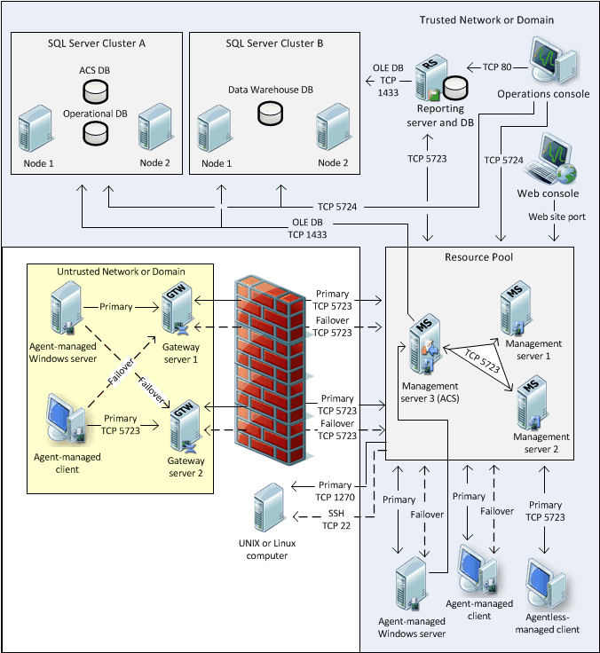

# Distributed Deployment of Operations Manager
The distributed management group installation will form the foundation of 99 percent of [!INCLUDE[om12short](../Token/om12short_md.md)] deployments. It allows for the distribution of features and services across multiple servers to allow for scalability. It can include all [!INCLUDE[om12short](../Token/om12short_md.md)] server roles and supports the monitoring of devices across trust boundaries through the use of the gateway server.

The following diagram presents one possible option for the distributed management group topology.

> [!NOTE]
> There is no direct communication between an operations console and the databases. All communication goes to the resource pool through TCP 5724, and then to the database servers using OLE DB on TCP 1433 or another customized port a customer establishes. However, there is direct communication between an Application Diagnostics console \(residing with a web console\) and databases.

## System Center 2016 \- Operations Manager Features
This configuration supports all [!INCLUDE[scom_threshold_1](../Token/scom_threshold_1_md.md)] features:

-   Monitoring and alerting, targeted for up to 15,000 agents

-   Monitoring across trust boundaries

-   Reporting

-   Audit collection

-   Agentless exception management

-   Agent failover between management servers

-   Gateway failover between management servers

-   Clustering high availability for database roles

## Operations Manager Servers
This configuration supports all [!INCLUDE[om12short](../Token/om12short_md.md)] server roles:

-   Audit Collection Services \(ACS\) collector

-   ACS database

-   ACS forwarder \(on agent\-managed devices\)

-   Gateway server

-   Management server

-   Operational database

-   Operations console

-   SQL Server  Reporting database

-   Reporting data warehouse database

-   Web console server

## Restrictions
Single management group configurations do not support partitioning. Partitioning is the separation of management group services across multiple management groups. In [!INCLUDE[om12short](../Token/om12short_md.md)], you may want to create multiple management groups for the following reasons.

### Installed Languages
[!INCLUDE[om12short](../Token/om12short_md.md)] management groups support only one installed language. If the overall IT environment that you need to monitor has more than one installed language, a separate management group will be needed per language.

### Consolidated Views
Even the largest distributed management group implementation will not be appropriate in every instance. This will lead you to implement multiple management groups, which will split your monitoring and alerting data between management groups. To provide a single, consolidated view of your environment, data from multiple management groups can be consolidated and viewed in another management group. For more information, see [Connecting Management Groups in Operations Manager](http://go.microsoft.com/fwlink/p/?LinkID=207755).

### Function
You may need to have separate groups as needed according to function, such as preproduction for testing management packs and new servers, and production for monitoring daily business processes.

### Administrative or Other Business Needs
Your company may have other administrative, security, or business needs that require complete separation of monitoring data and administrative teams, which will mandate additional management groups.

## Common Uses
Distributed management groups are most commonly used to monitor very large preproduction environments and large production environments that

-   Span trust boundaries between domains and workgroups.

-   Have multiple network environments segmented by firewalls.

-   Have a need for high availability.

-   Must have a scalable monitoring solution.

## Ports Used
This configuration supports full distribution of features among servers in the management group as well as monitoring of devices across network boundaries, resulting in a longer list of ports that need to be available for communications. For more information, see [Connecting Management Groups in Operations Manager](http://go.microsoft.com/fwlink/p/?LinkID=207755).

## Distributed Deployment
You deploy  [!INCLUDE[om12short](../Token/om12short_md.md)] in a distributed management group when you want to allow for scalability and high availability of your management servers and gateway servers. By default, all management servers are members of the All Management Servers Resource Pool, which balances the monitoring load of your management group as new management servers are added, and provides automatic failover for monitoring.

A distributed management group distributes the various features of [!INCLUDE[om12short](../Token/om12short_md.md)] across several servers. For example, you can install the operational database on one server, the web console on a second server, and the Reporting server on a separate server. This differs from the single\-server management group installation, where all features are installed on one server. For more information, see [Single-Server Deployment of Operations Manager](../Topic/Single-Server-Deployment-of-Operations-Manager.md)

You can install a web console on a stand\-alone server or on an existing management server, but you cannot install the management server feature on a server that has an existing web console. If you want to install the management server and web console on the same server, you must either install both features simultaneously, or install the management server before you install the web console.

This section of the Deployment Guide contains the following topics:

-   [How to Install an Operations Manager Management Server](../Topic/How-to-Install-an-Operations-Manager-Management-Server.md)

-   [How to Install the Operations Console](../Topic/How-to-Install-the-Operations-Console.md)

-   [Install the Operations Manager Web Console](../Topic/Install-the-Operations-Manager-Web-Console.md)

-   [How  to Install an Audit Collection Services &#40;ACS&#41; Collector and Database](../Topic/How--to-Install-an-Audit-Collection-Services--ACS--Collector-and-Database.md)

-   [How to Install the Operations Manager Reporting Server](../Topic/How-to-Install-the-Operations-Manager-Reporting-Server.md)

-   [How to Deploy a Gateway Server](assetId:///cc38412e-d5c6-429a-ac70-b01b7651e4d5)

## See Also
[Deploying System Center 2016 - Operations Manager](../Topic/Deploying-System-Center-2016---Operations-Manager.md)

