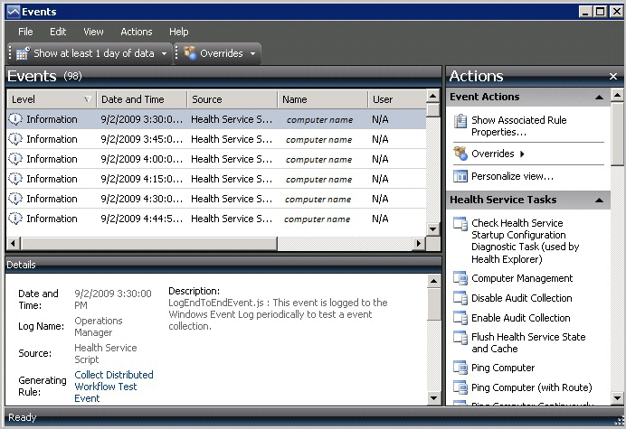
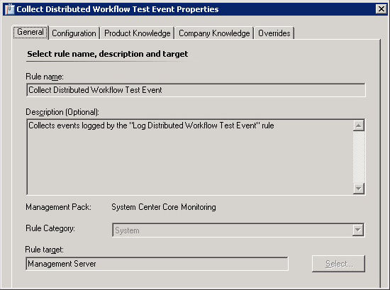

# Using Event View to Investigate Problems
In [!INCLUDE[om12long](../Token/om12long_md.md)], you can use an event view for an alert to help you investigate the problem that caused the alert.

Right\-click an alert, point to **Open**, and click **Event View**. In the **Event View** window, you see information about the events associated with the alert.

In the **Details** pane, click **Generating Rule** to view information about the rule that generated the alert. The **General** tab shows you the name, description, and the source management pack of the rule.

## See Also
[How Heartbeats Work in Operations Manager](../Topic/How-Heartbeats-Work-in-Operations-Manager.md)
[Resolving Heartbeat Alerts](../Topic/Resolving-Heartbeat-Alerts.md)
[Viewing Active Alerts](../Topic/Viewing-Active-Alerts.md)
[Viewing Alert Details](../Topic/Viewing-Alert-Details.md)
[Examining Properties of Alerts, Rules, and Monitors](../Topic/Examining-Properties-of-Alerts,-Rules,-and-Monitors.md)
[Impact of Closing an Alert](../Topic/Impact-of-Closing-an-Alert.md)
[How to Close an Alert Generated by a Monitor](../Topic/How-to-Close-an-Alert-Generated-by-a-Monitor.md)
[How to Reset Health](../Topic/How-to-Reset-Health.md)
[Identifying the Computer Experiencing a Problem](../Topic/Identifying-the-Computer-Experiencing-a-Problem.md)
[Using Health Explorer to Investigate Problems](../Topic/Using-Health-Explorer-to-Investigate-Problems.md)
[How an Alert is Produced](../Topic/How-an-Alert-is-Produced.md)
[Investigating Alert Storms](../Topic/Investigating-Alert-Storms.md)
[How to View All Rules and Monitors Running on an Agent-Managed Computer](../Topic/How-to-View-All-Rules-and-Monitors-Running-on-an-Agent-Managed-Computer.md)
[How to Set Alert Resolution States](../Topic/How-to-Set-Alert-Resolution-States.md)
[How to Configure Automatic Alert Resolution](../Topic/How-to-Configure-Automatic-Alert-Resolution.md)
[Diagnostic and Recovery Tasks](../Topic/Diagnostic-and-Recovery-Tasks.md)
[Viewing and Investigating Alerts for .NET Applications &#40;Server-side Perspective&#41;](../Topic/Viewing-and-Investigating-Alerts-for-.NET-Applications--Server-side-Perspective-.md)

