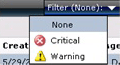

# Viewing Active Alerts
To view active alerts, open the Operations console and click **Monitoring**. The Monitoring Overview displays a summary of health states and alerts:

To view the actual alerts, click **Active Alerts** in the navigation pane.

**Tip**: If you are using the web console, you can filter the view of alerts by severity:

The list of alerts in the Results pane includes the severity, source, maintenance mode status, name, resolution state, and when the alert was created:

The following folders in the Monitoring workspace include a standard Active Alerts view scoped to the objects for that folder.

-   Data Warehouse

-   Network Monitoring

-   Operations Manager

-   Operations Manager\\Agent Details

-   Operations Manager\\APM Agent Details

-   Management Server

-   Notification

-   UNIX\/Linux Servers

-   Web Application Availability Monitoring

## See Also
[How Heartbeats Work in Operations Manager](../Topic/How-Heartbeats-Work-in-Operations-Manager.md)
[Resolving Heartbeat Alerts](../Topic/Resolving-Heartbeat-Alerts.md)
[How an Alert is Produced](../Topic/How-an-Alert-is-Produced.md)
[Viewing Alert Details](../Topic/Viewing-Alert-Details.md)
[Examining Properties of Alerts, Rules, and Monitors](../Topic/Examining-Properties-of-Alerts,-Rules,-and-Monitors.md)
[Impact of Closing an Alert](../Topic/Impact-of-Closing-an-Alert.md)
[How to Close an Alert Generated by a Monitor](../Topic/How-to-Close-an-Alert-Generated-by-a-Monitor.md)
[How to Reset Health](../Topic/How-to-Reset-Health.md)
[Identifying the Computer Experiencing a Problem](../Topic/Identifying-the-Computer-Experiencing-a-Problem.md)
[Using Health Explorer to Investigate Problems](../Topic/Using-Health-Explorer-to-Investigate-Problems.md)
[Using Event View to Investigate Problems](../Topic/Using-Event-View-to-Investigate-Problems.md)
[Investigating Alert Storms](../Topic/Investigating-Alert-Storms.md)
[How to View All Rules and Monitors Running on an Agent-Managed Computer](../Topic/How-to-View-All-Rules-and-Monitors-Running-on-an-Agent-Managed-Computer.md)
[How to Set Alert Resolution States](../Topic/How-to-Set-Alert-Resolution-States.md)
[How to Configure Automatic Alert Resolution](../Topic/How-to-Configure-Automatic-Alert-Resolution.md)
[Diagnostic and Recovery Tasks](../Topic/Diagnostic-and-Recovery-Tasks.md)
[Viewing and Investigating Alerts for .NET Applications &#40;Server-side Perspective&#41;](../Topic/Viewing-and-Investigating-Alerts-for-.NET-Applications--Server-side-Perspective-.md)
[Standard Views in Operations Manager](../Topic/Standard-Views-in-Operations-Manager.md)

