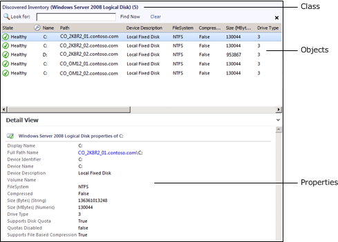
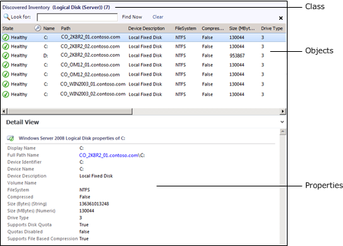

# Understanding Classes and Objects_1
To start authoring in [!INCLUDE[om12short](Token/om12short_md.md)], you should understand some basic concepts and terminology about how monitored objects are implemented. If you have used the [!INCLUDE[om12short](Token/om12short_md.md)] for monitoring, you are already familiar with using these objects, but for authoring, you should understand them at a deeper level.

## Object
An *object* is the basic unit of management in [!INCLUDE[om12short](Token/om12short_md.md)]. An object typically represents something in your computing environment, such as a computer, a logical disk, or a database. It could also represent something more abstract, such as an application, an Active Directory domain, or a DNS zone. An object can also be referred to as an *instance* of a particular [Class](Understanding-Classes-and-Objects.md#Class).

Objects must be discovered before they appear in the Operations console. Management packs include *discoveries* that inspect information about the agent computer to determine whether an object should be created and what the values for its properties should be. These discoveries are typically run on a schedule, and different management packs define different schedules for different objects. One discovery might run one time per day whereas another might run every few hours.

For more information about discoveries for advanced authors, see [Discovery](http://go.microsoft.com/fwlink/?LinkID=232861) in the [System Center Operations Manager 2007 R2 Authoring Guide](http://go.microsoft.com/fwlink/?LinkID=188119).

## Class
A *class* represents a kind of object, and every object in [!INCLUDE[om12short](Token/om12short_md.md)] is considered an *instance* of a particular class. All instances of a class share a common set of properties. Each object has its own values for these properties which are determined when the object is discovered. Most management packs define a set of classes that describe the different components that make up the application that is being monitored and the relationships between those classes.

A *target* in the Operations console represents all instances of a particular class. For example, a view lists all of the objects that are instances of the class that is used as the target class for the view, and a monitor is applied to all objects that are instances of the monitor’s target class.

The following screenshot shows an example of **Windows Server 2008 Logical Disk** class and objects in the **Discovered Inventory** view in the Operations console.

**Sample Class and Objects**

## Base Classes
You only have to understand the concept of base classes if you are performing advanced authoring. For more information, see [Classes and Relationships &#91;OM2012\_Authoring&#93;](assetId:///0a4ce326-8def-4eeb-8161-c7576ffd8429). For basic authoring, you only have to understand how base classes affect targeting.

Every class in Operations Manager has a *base class*. A class has all the properties of its base class and potentially adds more. All of the classes from the different management packs installed in your management group can be arranged in a tree with each class positioned under its base class. If you start at any class, and then walk up the tree following its base class, and then the base class of that class, and so on, you eventually reach the [Object](assetId:///Object) class which is the *root* of the System Center class library.

> [!NOTE]
> The *Entity* class is the root of the class library in Operations Manager 2007. The [Entity](assetId:///Entity) class is the same class as [Object](assetId:///Object). It has been renamed in Operations Manager 2012.

When you select a class as a target that is a base class for other classes, the monitor or rule applies to all instances of each of those classes. For example, if you use **Windows Operating System** as the target for a monitor, then the monitor applies to all instances of **Windows Client Operating System** and **Windows Server Operating System**. This is because those two classes use **Windows Operating System** as their base class. If you use Operating System as the target, the monitor applies to all those classes and also to any instance of **Unix Operating System**.

For information about how to view the complete class library in your management group from the **Distributed Application Designer**, see [Distributed Applications](Distributed-Applications.md).

The following screenshot shows an example of **Logical Disk \(Server\)** class and objects in the **Discovered Inventory** view in the Operations console. This is the base class for **Windows Server 2008 Logical Disk** which is shown earlier in this section. Note that this includes the same set of objects, but adds instances of **Windows Server 2003 Logical Disk** which also uses **Logical Disk \(Server\)** as its base class.

**Sample Base Class and Objects**

## Hosting Classes
Most classes are *hosted* by another class. When one class hosts another, the hosting class is called the *parent*, and the class being hosted is called the *child*. Instances of the child class cannot exist without a parent. For example, several classes are hosted by **Windows Computer** because they are components on a computer. It would not make sense to have a logical disk if there was no computer for the disk to be installed on. Therefore, **Logical Disk** is hosted by **Windows Computer**. This means that every instance of **Logical Disk** must have one instance of **Windows Computer** as its parent.

Hosting classes can be important because the properties of the host of a target class are available in rules and monitors. An object might also have the health of its child objects available in its Health Explorer.

You can typically determine the hosting parent of an object by viewing its **Path Name** property. This includes the name of the object’s parent. In the Operations console, you can click this name to open a state view for the parent object. In the previous screenshots, the name of the computer hosting the selected logical disk is included in the selected object’s path name.

## Group
A *group* is a collection of objects. They can be instances of the same class or of different classes. Groups have population criteria that define what objects are added to them. This can be dynamic criteria that adds objects as they are discovered or explicit criteria where you manually add specific objects to the group.

Groups are used to scope overrides, views, and user roles and to set the scope of monitoring for certain templates. They are not used to target monitors and rules. For more information, see [Targeting a group](Selecting-a-target.md#Groups),

## Viewing Classes and Objects
Use the following procedure to walk through the examples illustrated earlier in this section in your own [!INCLUDE[om12short](Token/om12short_md.md)] environment. This shows the concepts of objects, classes, and base classes by using the [Logical Disk](assetId:///Logical Disk) classes in the **Windows Server Operating System Management Pack**. You must have this management pack installed in your management group to complete this procedure.

#### To view a class in the Operations console

1.  Start the Operations console.

2.  In the navigation pane, click **Monitoring**, and then select **Discovered Inventory**.

3.  In the **Actions** pane, click **Change Target Type**. In the **Select Items to Target** dialog box, select **View all targets**.

    This list consists of all the classes included in all the management packs that are currently installed in the management group. Any of these classes can be selected to view a list of all its discovered instances and their properties. Any new classes included in a management pack that is installed later in the management group will be included in this list.

4.  Select **Windows Server 2008 Logical Disk**, and then click **OK**.

    This view shows a listing of logical disks on Windows Server 2008 computers that were discovered in the current environment.

5.  Select one of the instances.

    Take note of the properties in the **Detail View** pane. This shows the values for each property that were collected by the discovery process. Notice also the **Path name** property that is built from the key property of the current class and its parents. In this case, the key properties include the computer name and the device name.

6.  In the **Actions** pane, again select **Change Target Type**.

7.  In the **Select Items to Target** dialog box, select **View all targets**.

8.  Select **Logical Disk \(Server\)**, and then click **OK**.

    This is the class that is the base class for **Windows Server 2008 Logical Disk**. The view resembles the previous one, but includes objects from both Windows Server 2003 and Windows Server 2008, assuming both are installed in your environment. The properties are identical to the previous view, because the [Windows Server Logical Disk](assetId:///Windows Server Logical Disk) class has the same properties that are inherited by **Windows Server 2008 Logical Disk**.

9. In the **Actions** pane, again select **Change Target Type**. In the **Select Items to Target** dialog box, select **View all targets**.

10. Select **Logical Disk**, and then click **OK**.

    This is the class that is the base class for **Logical Disk \(Server\)**. The instances are identical to the previous view, but fewer properties are shown. This is because the **Logical Disk** class has only the properties directly assigned to it, and inherits only its single property from **Object**. The other properties are not visible because they are associated with a class further down the tree.

11. Select one of the disks and then click the link on the computer name part of the **Path Name** property shown in the **Detail View**.

    This opens a state view for the hosting object of the disk object that you selected. You can see in the **Detail View** that this is an instance of **Windows Computer**.

## See Also
[Selecting a target](Selecting-a-target.md)
[Creating a new target](Creating-a-new-target.md)

