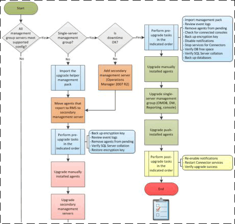

# Upgrade Process Flow Diagrams
Before you upgrade to [!INCLUDE[om12long](Token/om12long_md.md)], you must first determine whether all servers in your [!INCLUDE[om2007r2long](Token/om2007r2long_md.md)] management group meet the minimum supported configurations for [!INCLUDE[om12long](Token/om12long_md.md)]. For more information, see [Supported Configurations for System Center 2012 – Operations Manager](http://go.microsoft.com/fwlink/p/?LinkID=219650). You can use a set of process flow diagrams to determine your upgrade path and visualize the process.

> [!NOTE]
> You can click the appropriate process box to open and review the content for any step in the process.

The following table lists the process flow diagrams available, along with a description of when each upgrade path should be used.

|Condition|Process flow diagram|
|-------------|------------------------|
|When you have a single\-server or distributed management group that already meets the minimum supported configuration requirements for [!INCLUDE[om12long](Token/om12long_md.md)].|[Single\-Server and Distributed Upgrade \(Simple\) Process Flow Diagram](http://go.microsoft.com/fwlink/p/?LinkID=219647)|
|When your single\-server management group does not yet meet the minimum supported configuration requirements for [!INCLUDE[om12long](Token/om12long_md.md)], and requires new hardware.|[Single\-Server Upgrade \(Complex\) Process Flow Diagram](http://go.microsoft.com/fwlink/p/?LinkID=219648)|
|When your distributed management group has one or more servers that do not meet the minimum supported configuration requirements for [!INCLUDE[om12long](Token/om12long_md.md)], and might require new hardware.|[Distributed Upgrade \(Complex\) Process Flow Diagram](http://go.microsoft.com/fwlink/p/?LinkID=219649)|

## See Also
[Checklist: Single\-Server Upgrade \(Simple\)](assetId:///587ac7d6-c333-4ed4-a1fa-628dce82cf46)
[Checklist: Single\-Server Upgrade \(Complex\)](assetId:///6473b9f7-7062-4ae6-963a-4d28bc0264db)
[Checklist: Distributed Upgrade \(Simple\)](assetId:///938870a3-3636-4cb6-8e07-823d1374c525)
[Checklist: Distributed Upgrade \(Complex\)](assetId:///baa3a75e-5268-4c4d-833b-9c809160bfb1)

