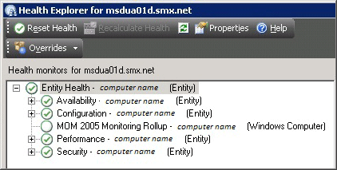
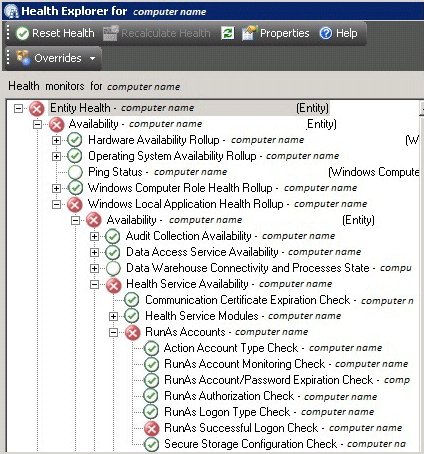
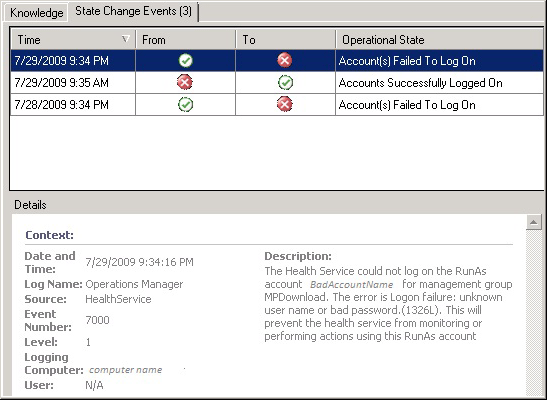

# Using Health Explorer to Investigate Problems
Use Health Explorer to find out which monitor is reacting and to review knowledge about the monitor and possible causes for actions related to it. In the **Active Alerts** view, click the alert to highlight it. The Health Explorer link under **Alert Actions** in the **Tasks** pane becomes active.

By default, when the Health Explorer window opens, all monitors in a failed state are expanded. If a monitor contains other monitors, as in the case of a roll\-up monitor, Health Explorer shows all monitors in a hierarchical layout, displaying monitoring data for all dependent services and applications. To view more information about any dependent monitor, you can right\-click that monitor, and then click **Monitor Properties** to open another Health Explorer window.

The following illustration shows monitors in a healthy state:

The following illustration shows some monitors in a critical state:

Click a monitor to view more information about the monitor in the **Details** pane. The **State Change Events** tab in the **Details** pane shows you when the state for the monitor changed, and the details give you information for the context of the state change:

## See Also
[How Heartbeats Work in Operations Manager](How-Heartbeats-Work-in-Operations-Manager.md)
[Resolving Heartbeat Alerts](Resolving-Heartbeat-Alerts.md)
[Viewing Active Alerts](Viewing-Active-Alerts.md)
[Viewing Alert Details](Viewing-Alert-Details.md)
[Examining Properties of Alerts, Rules, and Monitors](Examining-Properties-of-Alerts,-Rules,-and-Monitors.md)
[Impact of Closing an Alert](Impact-of-Closing-an-Alert.md)
[How to Close an Alert Generated by a Monitor](How-to-Close-an-Alert-Generated-by-a-Monitor.md)
[How to Reset Health](How-to-Reset-Health.md)
[Identifying the Computer Experiencing a Problem](Identifying-the-Computer-Experiencing-a-Problem.md)
[How an Alert is Produced](How-an-Alert-is-Produced.md)
[Using Event View to Investigate Problems](Using-Event-View-to-Investigate-Problems.md)
[Investigating Alert Storms](Investigating-Alert-Storms.md)
[How to View All Rules and Monitors Running on an Agent-Managed Computer](How-to-View-All-Rules-and-Monitors-Running-on-an-Agent-Managed-Computer.md)
[How to Set Alert Resolution States](How-to-Set-Alert-Resolution-States.md)
[How to Configure Automatic Alert Resolution](How-to-Configure-Automatic-Alert-Resolution.md)
[Diagnostic and Recovery Tasks](Diagnostic-and-Recovery-Tasks.md)
[Viewing and Investigating Alerts for .NET Applications &#40;Server-side Perspective&#41;](Viewing-and-Investigating-Alerts-for-.NET-Applications--Server-side-Perspective-.md)
[Using Health Explorer in Operations Manager](Using-Health-Explorer-in-Operations-Manager.md)

