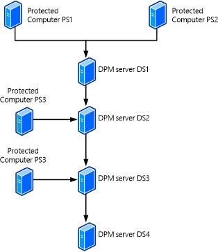

# Back up the DPM server

>Applies To: System Center 2016 Technical Preview - Data Protection Manager

To ensure that data can be recovered if DPM fails you'll need a strategy for backing up the DPM server. If it  isn’t backed up you’ll need to rebuild it manually after a failure, and disk-based recovery points won’t be recoverable. You can back up DPM servers using a couple of methods:

-   **Back up the DPM server**—You can back up a primary DPM server with a secondary DPM server. The secondary server will protect the primary server database and the data source replicas stored on the primary server. If the primary server fails, the secondary server can continue to protect workloads that are protected by the primary server, until the primary server is available again. If you need to rebuild the primary server you can restore the databases and replicas to it from the secondary server. You can also restore data to protected computers directly from the secondary server when the primary server isn’t available. You can set up two servers, one as primary and the another as secondary, or configure each server to act as the primary for the other. You can also configure a chain of DPM servers that protect each other according to the chain order.

-   **Back up the  DPM database**—You can configure a DPM server to back up its own databases to its tape library, or you can use non-Microsoft software to back up the databases to tape or removable media.

-   **Back up DPM using third-party software**—You can back up DPM servers using third-party software that supports DPM and VSS.

## Back up with a secondary DPM server
Information on a  DPM server can be backed up and protected by another DPM server in any of the following configurations:

-   **Primary to secondary protection**—The database and replicas stored on a primary DPM server can be backed up to a secondary DPM server. If the primary server fails the secondary server continues to back up protected workloads. If the primary server fails you can do either of the following:
    Rebuild the primary server and restore its database and replicas from the secondary server. Then move the protected workloads back to the primary server after the rebuild.
    Select to switch protection to the secondary DPM server. With this setting you then restore to the protected computer directly from the secondary server when the need arises.
    For instructions, see Set up secondary servers.

-   **DPM chaining**—A chain of DPM servers provide protection, and each server protects the next one in in the chain. For example:
    DPM1 is protected by DPM2 (DPM1 is the primary and DPM2 is the secondary).
    DPM2 is protected by DPM3 (DPM2 is the primary and DPM3 is the secondary)
    For instructions, see Set up chaining.

-   **Cyclic protection**—One DPM server is backed up by another DPM server, and vice versa. So that DPM1 protects DPM2, and likewise DPM2 protects DPM1. This is useful for small environments.

### Set up primary and secondary protection
Back up a primary DPM server using a secondary DPM server:

1.  Install the DPM protection agent on each primary DPM server that you want to protect. No restart is required.

2.  Add the primary DPM server to an existing protection group, or create a new one. Select to protect the following data sources:

    -   The SQL Server databases configured for the primary server.

    -   All volumes on the primary DPM server (Shares will not be visible separately)
        A

    -   All replicas on the primary DPM server.

    -   At a minimum, you should select the databases, the \Program Files\Microsoft System Center 2012\DPM\DPM\Config folder, and the \Program Files\Microsoft System Center 2012\DPM\Scripting folder.

Note that you can't exclude file names from protection for a replica. In addition all DPM servers must be running the same version, updates etc. When setting up synchronization we recommend you synchronize every 24 hours.

### Set up DPM chaining
Before you consider chaining note these limitations:

-   Each DPM server can only be protected once in the chain so verify they’re not protected by more than one server.

-   Primary and secondary servers are established by the chain. So for example if server DPM3 is actually protecting server DPM1 because it’s acting as the secondary server for DPM2, it can’t act directly as a secondary server for DPM1.

-   If a DPM server is configured to protect its own data source the chain will be broken. For example if DPM1 protects its own database or system state, DPM2 can’t protect DPM1.

-   Before you can protect the database of a primary DPM server you need to start the SQL Server VSS Writer service on the primary server.

#### Chaining example 1
**Scenario 1: Chained protection**

Scenario 1 shows a scenario in which four DPM servers are chained:

|Server|Protecting|Protected by|
|----------|--------------|----------------|
|DS1 (primary)|PS1, PS2|DS3|
|DS2 (primary)|PS3, PS4|DS3|
|DS3 (secondary)|DS1, DS2|DS4|
|DS4 (secondary)|DS3|-|


#### Chaining example 2
**Scenario 2: Chained protection**

Scenario 2 shows a scenario in which four DPM servers are chained:

|Server|Protecting|Protected by|
|----------|--------------|----------------|
|DS1 (primary)|PS1, PS2|DS2|
|DS2 (primary)|PS3|DS3|
|DS2 (secondary)|DS1|DS3|
|DS3 (primary)|PS4|DS4|
|DS3 (secondary)|DS2|DS4|
|DS4|DS3|-|



### Cyclic protection
If you don’t want to use a secondary server then two DPM servers can protect each other.

**Scenario 3: Cyclic protection**

Scenario 3 shows a scenario using cyclic protection

|Server|Protecting|Protected by|
|----------|--------------|----------------|
|DS1 (primary)|PS1, PS2|DS2|
|DS2 (primary)|PS3|DS3|
|DS2 (secondary)|DS1, DS3|DS3|
|DS3 (primary)|PS4|DS2|
|DS3 (secondary)|DS2|DS2|


### Configure chaining
Set up chaining as follows:

1.  Install the DPM protection agent on the DPM server that you want to protect from the DPM server you want to protect it from.

2.  Configure secondary protection for the data sources protected by the DPM server you are protecting. Note in the DPM console you won’t be able to configure protection for data sources that are already protected by the agent. This prevents you from repeatedly protecting data.
    .

3.  As an example, if you have  DPM1 and DPM2 you'd install the DPM protection agent from DPM1 to DPM2 and vice versa.
     Then configure secondary protection on DPM2 for servers that DPM1 protects., and configure secondary protection on DPM1 for servers that DPM2 protects.

### Recover the server
If a primary server fails you can switch protection to the secondary server. After you’ve switched protection, you can perform recovery functions from the secondary server.

-   To switch protection to the secondary server in the DPM console right-click the protection group for which you want to switch protection, and select **Switch Disaster Protection**. The replica will appear as inconsistent until you run a consistency check.

-   To recover a primary DPM server  you'll need to reestablish protection for all data sources previously protected by it. Note that you can't restore recovery points, and when you recover database files you should make sure the restore location on the DPM server is secure.

    You should recover the DPM database and then recovery any replicas.

-   Then reestablish protection by running Setdpmserver.exe.

## Back up the DPM database
As part of your DPM backup strategy, you’ll have to back up the DPNdatabase. The DPM database is named DPMDB. This database contains the DPM configuration together with data about DPM’s backups. In case of disaster, you can rebuild most of the functionality of a DPM server by using a recent backup of the database. Assuming you can restore the database, tape- based backups are accessible, and they maintain all protection group settings and backup schedules. If the DPM storage pool disks were not affected by the outage, disk-based backups are also usable after a rebuild. You can back up the database by using several different methods.

|Database backup method|Advantages|Disadvantages|
|--------------------------|--------------|-----------------|
|[Back up to Azure](#back-up-to-azure)|Easily configured and monitored in DPM.<br /><br />Multiple locations of the backup database files.<br /><br />Cloud storage provides a robust solution for disaster recovery.<br /><br />Very secure storage for the database.<br /><br />Supports 120 online recovery points.|Only available on DPM 2012 SP1 or later.<br /><br />Requires Azure account and additional DPM configuration. Incurs some cost for Azure storage.<br /><br />- Requires an alternate Windows Server 2012 based system with the Azure agent to gain access to DPM backups stored in the Azure backup vault. This can’t be another DPM server.<br /><br />Not an option if the database is hosted locally and you want to enable secondary protection. A workaround would be to use a remote SQL Server to host the database.<br /><br />Some extra preparation and recovery time is incurred.|
|[Back up the database by backing up the DPM storage pool](#Back-up-the-database-by-backing-up-the-DPM-storage-pool)|Simple to configure and monitor.<br /><br />The backup is kept on the DPM storage pool disks and is easy to access locally.<br /><br />DPM scheduled backups support 512 express full backups. If you back up hourly you’ll have 21 days of full protection.|Not a good option for disaster recovery. It’s online and recovery might not work as expected if the DPM server or storage pool disk fails.<br /><br />Not an option if the database is hosted locally and you want to enable secondary protection. A workaround would be to use a remote SQL Server to host the database.<br /><br />Some preparation and special steps are required to gain access to the recovery points if the DPM service or console isn’t running or working.|
|[Back up to a secondary DPM server](#back-up-the-database-to-a-secondary-server)|Easily configured and monitored in DPM.<br /><br />DPM scheduled backups support 512 express full backups. If done hourly, this provides 21 days of short term protection. If done every 30 minutes, it provides 10 days of protection.<br /><br />The backup is kept on the secondary DPM server storage pool disks which are locally accessible.<br /><br />Provides a good disaster recovery solution if secondary DPM server is offsite.|Additional DPM server and storage are required. Both DPM servers must to be running the same DPM version and update rollups.|
|[Back up to tape](#back-up-the-database-to-tape)|Easily configured and monitored in DPM.<br /><br />DPM scheduled tape backups support retention up to 99 years.<br /><br />Tape backup can be taken offsite for disaster recovery.<br /><br />Tape backup can be restored from any other DPM server that has a tape drive/library attached that uses the same tape media type.<br /><br />Tape can be encrypted for secure storage.|Not an option if the database is hosted locally and you want to enable secondary protection. A workaround would be to use a remote SQL Server to host the database.<br /><br />Only one tape backup per day can be scheduled.<br /><br />You need a working DPM server with a tape library to be able to read a DPM backup tape that contains the copy of the database you want to restore.<br /><br />Some preparation and special steps are required to gain access to the tape based recovery points.|
|[Back up with native SQL Server backup to a local disk](#back-up-with-native-sql-server-backup-to-a-local-disk)|Built-in to SQL Server.<br /><br />The backup is kept on a local disk which is easily accessible.<br /><br />It can be scheduled to run as often as you like.<br /><br />Totally independent of DPM.<br /><br />You can schedule a backup file cleanup.|Not a good option for disaster recovery unless the backups are copied to a remote location.<br /><br />Requires local storage for backups which may limit retention and frequency.|
|[Back up with native SQL backup and DPM protection to a share protected by DPM](#back-up-with-native-sql-server-backup-to-a-share-protected-by-dpm)|Easily monitored in DPM.<br /><br />Multiple locations of the backup database files.<br /><br />Easily accessible from any Windows machine on the network.<br /><br />Potentially the fastest recovery method.|Only supports 64 recovery points.<br /><br />Not a good option for site disaster recovery. DPM server or DPM storage pool disk failure may hinder recovery efforts.<br /><br />Not an option if the DPM DB is hosted locally and you want to enable secondary protection. A workaround would be to use a remote SQL Server to host the DPMDB.<br /><br />Some extra preparation is needed to get it configured and tested.<br /><br />Some extra preparation and recovery time is needed should the DPM server itself be down but DPM storage pool disks are fine.|

-   If you back up by using a DPM protection group, we recommend that you use a unique protection group for the database.

-   As a best practice, if you’re backing up to tape, make at least two copies of the backup tapes, and store each of the backup tapes in a different remote location. This added protection guards against physical damage or loss of the backup tape.

-   If the DPM SQL Server instance isn’t running on the DPM server, install the DPM protection agent on the SQL Server computer before you can protect the DPM databases on that server.

-   NOTE: For restore purposes, the DPM installation you want to restore with the DPM database must match the version of the DPM database itself.  For example, if the database you want to recover is from a DPM 2012 R2 with Update Rollup 4 installation, the DPM server must be running the same version with Update Rollup 4. This means that you might have to uninstall and reinstall DPM with a compatible version before you restore the database.  To check the database version you might have to mount it manually to a temporary database name and then run a SQL query against the database to check the last installed rollup, based on the major and minor versions. To check the DPM database version, follow these steps:

    1.  To run the query, open SQL Management Studio, and then connect to the SQL instance that’s running the DPM database.

    2.  Select the DPM database, and then start a new query.

    3.  Paste the following SQL query into the query pane and run it:

        **Select distinct MajorVersionNumber,MinorVersionNumber ,BuildNumber, FileName FROM dbo.tbl_AM_AgentPatch order byMajorVersionNumber,MinorVersionNumber,BuildNumber**

    If nothing is returned in the query results, or if the DPM server was upgraded from previous versions but no new update rollup was installed since then, there won’t be an entry for the major, minor for a base installation of DPM. To check the DPM versions associated with update rollups see [List of Build Numbers for System Center Data Protection Manager (DPM)](http://social.technet.microsoft.com/wiki/contents/articles/4058.list-of-build-numbers-for-system-center-data-protection-manager-dpm.aspx).

### Back up to Azure

1.  Before you start you'll need to run a script to retrieve the DPM replica volume mount point path so that you know which recovery point contains the DPM backup. Do this after initial replication with Azure Backup. In the script replace dplsqlservername% with the name of the SQL Server instance hosting the DPM database.

    ```
    Select ag.NetbiosName as ServerName,ds.DataSourceName,vol.MountPointPath
    from tbl_IM_DataSource as ds
    join tbl_PRM_LogicalReplica as lr on ds.DataSourceId=lr.DataSourceId
    join tbl_AM_Server as ag on ds.ServerId=ag.ServerId
    join tbl_SPM_Volume as vol on lr.PhysicalReplicaId=vol.VolumeSetID
    and vol.Usage =1
    and lr.Validity in (1,2)
    where ds.datasourcename like '%dpmdb%'
    and servername like '%dpmsqlservername%' --netbios name of server hosting DPMDB
    ```

    Make sure you have the passcode that was specified when the Azure Recovery Services Agent was installed and the DPM server was registered in the Azure Backup vault. You’ll need this passcode to restore the backup.

2.  Create an Azure Backup vault, download the Azure Backup Agent installation file and vault credentials. Run the installation file to install the agent on the DPM server and use the vault credentials to register the DPM server in the vault. [Learn more](https://azure.microsoft.com/en-us/documentation/articles/backup-azure-dpm-introduction/).

3.  After the vault is configured set up a DPM protection group that contains the DPM database, and select to back it up to disk and to Azure.

#### Recover the DPM database from Azure
You can recover the database from Azure using any DPM server (must be running at least DPM 2012 R2 with update rollup 7) that's registered in the Azure Backup vault, as follows:

1.  in the DPM console click **Recovery** > **Add External DPM**.

2.  Provide the vault credentials (download from the Azure Backup vault). Note that the credentials are only valid for two days.

3.  In **Select External DPM for Recovery** select the DPM server for which you want to recover the database, type in the encryption passphrase, and click **OK.**

4.  Select the recovery point you want to use from the list of available points. Click **Clear External DPM** to return to the local DPM view.

### Back up the database by backing up the DPM storage pool
Before you start you'll need to run a script to retrieve the DPM replica volume mount point path so that you know which recovery point contains the DPM backup. Do this after initial replication with Azure Backup. In the script replace dplsqlservername% with the name of the SQL Server instance hosting the DPM database.

```
Select ag.NetbiosName as ServerName,ds.DataSourceName,vol.MountPointPath
from tbl_IM_DataSource as ds
join tbl_PRM_LogicalReplica as lr on ds.DataSourceId=lr.DataSourceId
join tbl_AM_Server as ag on ds.ServerId=ag.ServerId
join tbl_SPM_Volume as vol on lr.PhysicalReplicaId=vol.VolumeSetID
and vol.Usage =1
and lr.Validity in (1,2)
where ds.datasourcename like '%dpmdb%'
and servername like '%dpmsqlservername%' --netbios name of server hosting DPMDB
```

1.  In DPM console, click **Protection** > **Create protection group** i

2.  On the **Select Protection Group Type** page, select  **Servers**.

3.  On the **Select group members** page, select the DPM database. If you’re running SQL Server remotely select the remote SQL Server installed and select DPM database. If SQL Server is running on the DPM server expand the DPM server item and select **DPMDB**.

4.  On the  **Select Data Protection Method** page, select **I want short-term protection using disk**. Specify the short-term protection policy options. We recommend a retention range of two weeks for DPM databases.

#### Recover the database
If the DPM server is still operational and the storage pool is intact (problems with the DPM service or console) then  copy the database from the replica volume or a shadow copy as follows:

1.  Decide from when you want to recover the database.

    -   If you want to copy the database from the last backup taken directly from the DPM replica volume, use **mountvol.exe** to assign a drive letter to the replica volume using the GUID from the SQL script output. For example: C:\Mountvol X: \\\\?\Volume{d7a4fd76-a0a8-11e2-8fd3-001c23cb7375}\

    -   If you want to copy the database from a previous recovery point (shadow copy) then you need to list all the shadow copies for the replica using the volume GUID from the SQL script output. This command lists shadow copies for that volume: C:\\>Vssadmin list shadows /for=\\\\?\Volume{d7a4fd76-a0a8-11e2-8fd3-001c23cb7375}\\. Note the creation time and the shadow copy ID  you want to recover from.

2.  Then use diskshadow.exe to mount the shadow copy to an unused drive letter X: using the shadow copy ID so that you can copy the database files.

3.  Open an administrative command prompt and run **psexec.exe -s cmd.exe** to start a command prompt in system context so that you have permission to navigate to the replica volume (X:) and copy the files.

4.  CD to the X: drive and navigate to the location of the DPM database files. Copy them to a location that's easy to restore from. After the copy is complete exist the psexec cmd window, and run diskshadow.exe and unexpose the X: volume.

5.  Now you can restore the database files by using SQL Management Studio or by running DPMSYNC-RESTOREDB.

### Back up the database to a secondary server

1.  On the secondary DPM server push the protection agent to the server on which the DPM database is installed – either on the primary DPM server or on a remote SQL Server. After installation the server will appear in **Unprotected server with protection agents** and should show status OK when refreshed.

2.  Create a new protection group. In **Select group member** choose the server hosting the DPM database. In **All SQL Servers** select the database you want to protect.
    In the **Select Data Protection Method** page select to use short-term protection to disk and online if required. On the **Specify Short-Term Goals** page select how to you want configure backups to short-term storage. For disk storage you can have 512 express full backups as often as every 30 minutes.
    Finish the wizard. Protection will start after the initial recovery point is created

#### Recover the database

1.  Rebuild the primary server as a DPM server if required.

2.  To restore the database, in the DPM console on the secondary server, click **Recovery** and locate the protected database.

3.  Select the date for the recovery point you want to recover. Recover the database to the original location.
    After recovering the database run the DPMSync tool.

## Back up the database to tape
You’ll need to know the barcode or tape labels of the tapes that contain a copy of the DPM database. The best way to do this is to schedule a Status Report to be mailed on the same day that the DPM database is backed up. The report will include the last backup date/time, the tape label and the barcode so that you can locate it for recovery. Alternatively you can use this SQL script to extract the information from the current database so you can to store it separately in case of disaster.

```
Select Path,ro.FileSpec,media.Label,media.BarcodeValue,pd.CreationDate,
pd.ExpiryDate,pd.LifeStatus as "1=valid, 2=expired"
from dbo.tbl_MM_MediaMap mm
join dbo.tbl_MM_PhysicalDataset pd on pd.datasetid = mm.datasetid
join dbo.tbl_MM_Media media on media.MediaId = mm.MediaId
join dbo.tbl_RM_RecoverableObjectFileSpec ro on ro.DatasetId = mm.DatasetId
where ro.filespec like '%DPMDB%'
order by CreationDate desc
```

1.  Create a protection group and on the **Select Group Members** page select the SQL Server (if it's running locally select DPMDB under the DPM server).

2.  Select to do long-term protection with tape and specify the tape details on the **Select Library and Tape Details**.

### Recover the database

-   The restore process will depend on the tape hardware available and the current state of the DPM server that took the tape-based backup. If you can’t restore the tape from the DPM server that did the backup, you’ll need to restore it from another DPM server that has the same type of tape drive so that the tape can be read. You might need to rebuild the DPM server if the only tape hardware available was the one attached to the failed DPM server.

-   If you’re using DPM tape encryption, you’ll need the same certificate used to encrypt the tape installed on the alternate DPM server.

To recover:

1.  Locate the physical tape that contains the version/date/time of the DPM database you want to restore.

2.  Insert the backup tape into the tape drive or library and perform a detailed inventory in the DPM console -> Management –>Libraries. Note that If the DPM server you are restoring from is a different DPM server, or it’s a new installation of DPM on the original server, the tape will be shown as imported (not created by this DPM server).

3.  If necessary, recatalog the imported tape.

4.  On the **Recovery** tab, locate the database data source. If it was from an imported tape, the recovery point will be under **External DPM tapes**.

5.  Recover the database (DPMDB) files. You can select to Recover to any instance of SQL Server or to Copy to a network folder.
    After the files are restored from tape, continue with recovery steps using SQL Management Studio or DPMSYNC –RESTOREDB.

## Back up with native SQL Server backup to a local disk
You can simply back up the DPM database to a local disk with native SQL Server backup, independent of DPM.

1.  Get an [overview](http://technet.microsoft.com/library/ms187048(v=sql.110).aspx) of SQL Server backup.

2.  [Learn more](http://technet.microsoft.com/library/jj919148(v=sql.110).aspx) about backing up SQL Server to the cloud.

## Back up with native SQL Server backup to a share protected by DPM
This backup option leverages native SQL to back up the DPM database to a share, protects the share with DPM, and uses Windows VSS previous versions to facilitate the restore.

**Before you start**

1.  If the DPM database is located on a remote SQL Server, install the DPM agent on that server.

2.  On the SQL Server make a folder on a drive with enough free space to hold a single copy of a backup. For example: C:\DPMBACKUP.

3.  Share the folder. For example share C:\DPMBACKUP folder as DPMBACKUP.

4.  Copy and paste the OSQL command below into Notepad and save it to a file named C:\DPMBACKUP\bkupdb.cmd. Make sure there is no .txt extension. Modify the SQL_Instance_name andDPMDB_NAME to match the instance and DPMDB name used by your DPM server.

    ```
    OSQL -E -S localhost\SQL_INSTANCE_NAME -Q "BACKUP DATABASE DPMDB_NAME TO DISK='C:\DPMBACKUP\dpmdb.bak' WITH FORMAT"

    ```

5.  Using Notepad, open the ScriptingConfig.xml file located under the ...\DPM\Scripting folder.

    -   On a remote SQL Server: **C:\Program Files\Microsoft Data Protection Manager\DPM\Scripting**

    -   On a DPM 2012 R2 server: **C:\Program Files\Microsoft System Center 2012 R2\DPM\DPM\Scripting**

    -   On a DPM 2012 or 2012 with SP1 server: **C:\Program Files\Microsoft System Center 2012\DPM\DPM\Scripting**

    -   On a DPM 2010 server, or on a DPM 2012 server upgraded from DPM 2010: **C:\Program Files\Microsoft DPM\DPM\Scripting**

6.  Modify ScriptingConfig.xml and change DataSourceName= to be the drive letter that contains the DPMDBBACKUP folder/share. Change the PreBackupScript entry to the full path and name of thebkupdb.cmd saved in step 5.

    ```
    <?xml version="1.0" encoding="utf-8"?>
    <ScriptConfiguration xmlns:xsi="http://www.w3.org/2001/XMLSchema-instance" 
    xmlns:xsd="http://www.w3.org/2001/XMLSchema" 
    xmlns="http://schemas.microsoft.com/2003/dls/ScriptingConfig.xsd">
    <DatasourceScriptConfig DataSourceName="C:">
    <PreBackupScript>C:\DPMDBBACKUP\bkupdb.cmd</PreBackupScript>
    <TimeOut>120</TimeOut>
    </DatasourceScriptConfig>
    </ScriptConfiguration>
    ```

7.  Save the changes to ScriptingConfig.xml.

8.  Protect the C:\DPMBACKUP folder or the \\\sqlservername\DPMBACKUP share using DPM and wait for the initial replica to be created. There should be a dpmdb.bak in the C:\DPMBACKUPfolder as a result of the pre-backup script running which was in turn copied to the DPM replica.

9. If you don’t enable self-service recovery, you’ll need some additional steps to share out the DPMBACKUP folder on the replica:

    1.  ) In the DPM console > **Protection**, locate the DPMBACKUP data source and select it. In the details section, click **Click to view details** on the link to the replica path and copy the path into Notepad. Remove the source path and retain the destination path. The path should look similar to the following: **C:\Program Files\Microsoft System Center 2012 R2\DPM\DPM\Volumes\Replica\File System\vol_c9aea05f-31e6-45e5-880c-92ce5fba0a58\454d81a0-0d9d-4e07-9617-d49e3f2aa5de\Full\DPMBACKUP**.

    2.  Make a share to that path using the share name **DPMSERVERNAME-DPMDB**. You can use the Net Share command below from an administrative command prompt.

        ```
        Net Share DPMSERVERNAME-dpmdb="C:\Program Files\Microsoft System Center 2012 R2\DPM\DPM\Volumes\Replica\File System\vol_c9aea05f-31e6-45e5-880c-92ce5fba0a58\454d81a0-0d9d-4e07-9617-d49e3f2aa5de\Full\DPMBACKUP"
        ```

**Configure the backup**

You can back up the DPM database as you would any other SQL Server database using SQL Server native backup.

-   Get an [overview](http://technet.microsoft.com/library/ms187048(v=sql.110).aspx) of SQL Server backup.

-   [Learn more](http://technet.microsoft.com/library/jj919148(v=sql.110).aspx) about backing up SQL Server to the cloud.

**Recover the database**

1.  Connect to the **\\\DPMServer\DPMSERVERNAME-dpmdb** share using Explorer from any Windows computer.

2.  Right-click the dpmdb.bak file to view properties. On the **Previous Versions** tab are all the backups that you can select and copy. There is also the very last backup still located in the C:\DPMBACKUP folder which is also easily accessible.

3.  If you need to move a SAN attached DPM storage pool disk to another server to be able to read from the replica volume, or to reinstall Windows to read locally attached disks, you’ll need to know the DPM Replica volume Mount point path or Volume GUID beforehand so you know what volume holds the database backup. You can use the SQL script below to extract that information any time after initial protection but before the need to restore. Replace the %dpmsqlservername% with the name of the SQL Server hosting the database.

    ```
    Select ag.NetbiosName as 
    ServerName,ds.DataSourceName,vol.MountPointPath,vol.GuidName 
    from tbl_IM_DataSource as ds
    join tbl_PRM_LogicalReplica as lr on ds.DataSourceId=lr.DataSourceId
    join tbl_AM_Server as ag on ds.ServerId=ag.ServerId
    join tbl_SPM_Volume as vol on lr.PhysicalReplicaId=vol.VolumeSetID
    and vol.Usage =1 
    and lr.Validity in (1,2) 
    where ds.datasourcename like '%C:\%' -- volume drive letter for DPMBACKUP
    and servername like '%dpmsqlservername%' --netbios name of server hosting DPMDB

    ```

4.  If you need to recover after moving DPM storage pool disks or a DPM server rebuild:

    1.  You have the volume GUID, so should that volume need to be mounted on another Windows server or after a DPM server rebuild, use mountvol.exe to assign it a drive letter using the volume GUID from the SQL script output: **C:\Mountvol X: \\\\?\Volume{d7a4fd76-a0a8-11e2-8fd3-001c23cb7375}\\**.

    2.  Reshare the DPMBACKUP folder on the replica volume using the drive letter and portion of the replica path representing the folder structure.

        ```
        net share SERVERNAME-DPMDB="X:\454d81a0-0d9d-4e07-9617-d49e3f2aa5de\Full\DPMBACKUP"

        ```

    3.  Connect to the \\\SERVERNAME\DPMSERVERNAME-dpmdb share using Explorer from any Windows computer

    4.  Right-click the dpmdb.bak file to view the Properties. On the **Previous Versions** tab are all the backups that you can select and copy.

