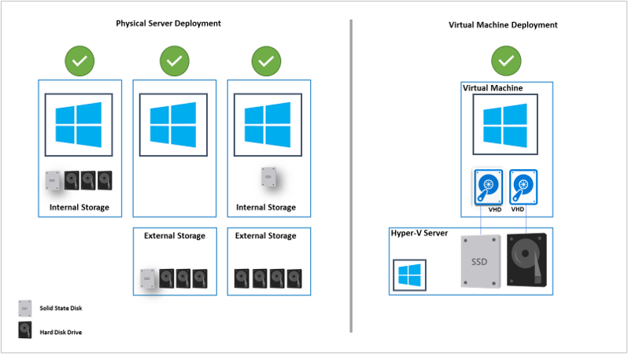
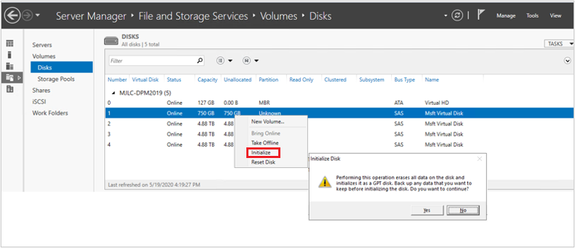
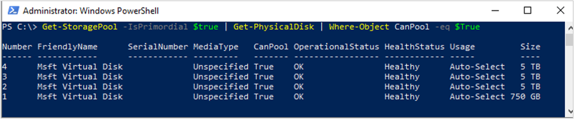

# Add Modern Backup Storage to DPM

::: moniker range=">= sc-dpm-1801 <= sc-dpm-1807"

[!INCLUDE [eos-notes-data-protection-manager.md](../includes/eos-notes-data-protection-manager.md)]

::: moniker-end

::: moniker range="<=sc-dpm-1807"

Modern Backup Storage (MBS) was introduced in System Center Data Protection Manager (DPM) 2016 to deliver 50% storage savings, 3X faster backups, and more efficient, workload-aware storage.

- MBS is enabled automatically when you're running at least DPM 2016 on Windows Server 2016. If DPM is running on a version of Windows Server older than Windows Server 2016, it doesn't use MBS.
- MBS provides intelligent storage for short-term backup to disk.  MBS provides faster disk backup, consuming less disk space. Without MBS, each data source needs two volumes, one for the initial backup and the other for delta changes.
- MBS backups are stored on an ReFS disk. It uses ReFS block cloning, and VHDX technology, [Learn more](https://techcommunity.microsoft.com/t5/system-center-blog/introducing-dpm-2016-modern-backup-storage/ba-p/351650).

> [!NOTE]
> DPM does not support deduplication on ReFS disk used for MBS backups.

DPM 2016 accepts volumes for storage. Once you add a volume, DPM formats the volume to ReFS to use the new features of Modern Backup Storage. Volumes cannot reside on a dynamic disk. Use only a basic disk.

While you can directly give a volume to DPM, you may face issues in extending the volume if a need arises later.
To prepare DPM for future expansion, use the available disks to create a storage pool, then create volumes on the storage pool, and expose the volumes to DPM. These virtual volumes can then be extended when needed.

The remainder of this article provides the detail on how to add a volume and to expand it later.

## Setting up MBS

Setting up MBS consists of the following procedures. Note that  you cannot attach locally created VHD (VHDX) files, and use them as storage on a physical DPM server.

1. Make sure you're running DPM 2016 or later on a VM running Windows Server 2016 or later.
2. Create a volume. To create a volume on a virtual disk in a storage pool:
    - Add a disk to the storage pool
    - Create a virtual disk from the storage pool, with layout set to Simple. You can then add additional disks, or extend the virtual disk.
    - Create volumes on the virtual disk.
3. Add the volumes to DPM.
4. Configure workload-aware storage.


## Create a volume

1. Create a storage pool in the File and Storage Services of Server Manager.
2. Add the available physical disks to the storage pool.
   - Adding only one disk to the pool keeps the column count to 1. You can then add disks as needed afterwards.
   - If multiple disks are added to the storage pool, the number of disks is stored as the number of columns. When more disks are added, they can only be a multiple of the number of columns.

     

3. Create a virtual disk from the storage pool, with the layout set to Simple.

    

4. Now add as many physical disks as needed.

    

5. Extend the virtual disk with the Simple layout, to reflect any physical disks you added.

    

6. Now, create volumes on the virtual disk.

    

    


## Add volumes to DPM storage


1. In the DPM Management console > **Disk Storage**, click **Rescan**.
2. In **Add Disk Storage**, click **Add**.
3. After the volumes are added, you can give them a friendly name.
4. Click **OK** to format the volumes to ReFS, so that DPM can use them as MBS.

    

## Configure workload-aware storage

Using workload-aware storage, the volumes can be selected to preferentially store specific workloads. For example, expensive volumes that support high IOPS can be configured to store workloads that need frequent, high-volume backups such as SQL Server with transaction logs. Workloads that are backed up less frequently, such as VMs, can be backed up to low-cost volumes.

You configure workload-aware storage using Windows PowerShell cmdlets.

### Update the volume properties

1. Run the **Update-DPMDiskStorage** to update the properties of a volume in the storage pool on a DPM server. The syntax is **Parameter Set: Volume**.
2. Run the cmdlet with these parameters.

    ```PowerShell
    Update-DPMDiskStorage [-Volume] <Volume> [[-FriendlyName] <String> ] [[-DatasourceType] <VolumeTag[]> ] [-Confirm] [-WhatIf] [ <CommonParameters>]
    ```

    

3. The changes made using the PowerShell cmdlet are reflected in the DPM Management console.

    

## Volume exclusion

DPM servers may be managed by a team of Administrators. While there are guidelines on storage that should be used for backups, a wrong volume given to DPM as backup storage may lead to loss of critical data. Hence, with DPM 2016 UR4 and later, you can prevent such scenarios by configuring those volumes to not be shown as available for storage using PowerShell.

For Example, to exclude F:\ and C:\MountPoint1, here are the steps:

1. Run the Set0DPMGlobalPropery cmdlet:

    ```PowerShell
    Set-DPMGlobalProperty -DPMStorageVolumeExclusion "F:,C:\MountPoint1"   
    ```
2. Rescan the storage through UI, or use Start-DPMDiskRescan cmdlet.

    The configured volumes and mountpoints are excluded.
3. To remove volume exclusion, run the following cmdlet:
    ```PowerShell
    Set-DPMGlobalProperty -DPMStorageVolumeExclusion ""   
    ```
After removing volume exclusion, rescan the storage. All volumes and mount points, except System Volumes, are available for DPM storage.

## Backup storage migration

Once all your backups are on MBS, there may be a need to migrate certain datasources from one volume to another. For example, scenarios where you need to upgrade storage, or when a volume is getting full. You can use PowerShell or the user interface to migrate datasources. The details can be found [in this blog entry](https://go.microsoft.com/fwlink/?linkid=861519).

The migrating datasource should have all recovery points on Modern Storage. Migrating datasources with backups on disks and volumes (for example, DPM server upgrades when the disk backups haven't expired) is not supported.
Migration is similar to modification of a protection group. While migration is in progress, you cannot trigger an ad hoc job. The scheduled jobs continue as configured. When the migration completes, any running jobs in the protection group are preempted.

## Custom size allocation

DPM 2016 consumes storage thinly, as needed. Once DPM is configured for protection, it calculates the size of the data being backed up. If many files and folders are being backed up together, as in the case of a file server, size calculation can take long time. With DPM, you can configure DPM to accept the volume size as default instead of calculating the size of each file. The corresponding registry key is "HKEY_LOCAL_MACHINE\SOFTWARE\Microsoft\Microsoft Data Protection Manager\Configuration\DiskStorage" with the Key, "EnableCustomAllocationOnReFSStorage" as a String set to 1 to enable custom size allocation, set to 0 for default size allocation with DPM.


::: moniker-end

::: moniker range="sc-dpm-2019"

Modern Backup Storage (MBS) was introduced in System Center Data Protection Manager (DPM) 2016 to deliver 50% storage savings, 3X faster backups, and more efficient, workload-aware storage. DPM 2019 introduces further performance improvements with MBS resulting in 50-70% faster backup with Windows Server 2019.

> [!NOTE]
> We recommend you to deploy DPM 2019 (using tiered volumes) on Windows Server 2019 to achieve enhanced backup performances.

- MBS is enabled automatically when you're running at least DPM 2016 on Windows Server 2016. If DPM is running on a version of Windows Server earlier than Windows Server 2016, it doesn't use MBS.
-   MBS provides intelligent storage for short-term backup to disk. MBS provides faster disk backup, consuming less disk space. Without MBS, each data source needs two volumes, one for the initial backup and the other for delta changes.
- MBS backups are stored on an ReFS disk. It uses ReFS block cloning, and VHDX technology. [Learn more](https://techcommunity.microsoft.com/t5/system-center-blog/introducing-dpm-2016-modern-backup-storage/ba-p/351650).
- With DPM 2019 and later, you can use tiered volumes for DPM native storage which delivers 50-70% faster backups

> [!NOTE]
> DPM does not support deduplication on ReFS disk used for MBS backups.

DPM 2019 accepts volumes/disks for storage. Once you add a volume, DPM formats the volume to ReFS to use the new features of Modern Backup Storage. Volumes cannot reside on a dynamic disk, use only a basic disk.

> [!NOTE]
> If the physical disk is or will be larger than 2TB, the disk must be converted to GPT before creating the volume(s) for DPM.

You can directly give a volume to DPM, however, you may have issues in extending the volume if a need arises later. You can create additional volumes using storage pools, which could be exposed to DPM and extended as needed. The following sections provide the details on how to create a tiered volume, add a volume to DPM, and expand it later


## Set up MBS with Tiered Storage

DPM 2016 introduced Modern Backup Storage (MBS), improving storage utilization and performance. MBS uses ReFS as underlying filesystem. MBS is designed to make use of hybrid storage such as tiered storage. To achieve the scale and performance claimed by MBS, we recommend using a small percentage (4% of overall storage) of flash storage (SSD) with DPM 2019 as a tiered volume in combination with HDD for DPM native storage.

Once you configure tiered storage, the ReFs file system has the intelligence to store File System Metadata on the SSD tier. This improves the overall backup job time significantly. There is no further configuration required while configuring the protection groups, etc.

> [!NOTE]
> - Tiering is recommended for faster backups. However, this is not a mandatory requirement to configure DPM storage.
>- You cannot attach locally created VHD (VHDX) files, and use them as storage on a physical DPM server. Make sure you are running DPM 2019 or later deployed on a VM running on Windows Server 2016 or later.  
> - When deploying DPM in a virtual machine, DPM 2019 can be deployed in a VM running on Windows Server 2016 or Windows Server 2019. For best performance we strongly recommend DPM 2019 installed on Windows 2019 with the latest Windows update installed.  


## Prerequisites

The tiered storage is configured using [Windows Storage Spaces](https://docs.microsoft.com/windows-server/storage/storage-spaces/overview). Following are the prerequisites for Windows Storage Spaces.

|Area | Requirement | Notes |
|---- |--------------|----|
|Disk bus types|- Serial Attached SCSI (SAS)<br><br> - Serial Advanced Technology Attachment (SATA) <br><br> - iSCSI and Fibre Channel Controllers.| When you configure Storage Spaces utilizing iSCSI and Fibre Channel (FC) disk controllers,  only non-resilient virtual disks (simple with any number of columns) are supported.|
|HBA considerations|- Simple host bus adapters (HBAs) that do not support RAID functionality are recommended <br><br> - If RAID-capable, HBAs must be in non-RAID mode with all RAID functionality disabled <br><br> - Adapters must not abstract the physical disks, cache data, or obscure any attached devices. This includes enclosure services that are provided by attached just-a-bunch-of-disks (JBOD) devices.|Storage Spaces is compatible only with HBAs where you can completely disable all RAID functionality.|

> [!NOTE]
> To configure tiered storage, Windows Storage Spaces requires minimum SSD size of 32 GB.

For more information on prerequisites for using Storage Spaces on a stand-alone server, see [Prerequisites to use Storage Spaces on a stand-alone server](https://docs.microsoft.com/windows-server/storage/storage-spaces/deploy-standalone-storage-spaces#prerequisites).

## Supported topology

To configure tiered storage, the storage can be directly attached to the DPM server or it can be from the external storage like SAN. The combination of directly attached storage and external storage can also be used.

Here are the possible storage combinations that are supported in both physical DPM server or virtual DPM Server scenario.

- SSD and HDD directly attached to DPM Server
- SSD and HDD from external storage
- SSD directly attached to DPM Server and HDD from external storage


> [!NOTE]
> - For DPM running on virtual machines, configuring tiered storage using Windows Storage Spaces is supported.
> - Hyper-V host presents both, the virtual SSD and HHD to the Virtual machine.
> - Virtual SSD should be carved out of physical SSD which could be directly attached to the Hyper-V host or from connected external storage.  



## Resiliency

DPM supports all of the three resiliency types, supported by Windows Storage spaces. To configure Mirror or Parity mode resiliency for tiered volume, multiple SSDs are required along with HDDs. When you configure simple resiliency type using a single SSD option, there might be data loss if the SSD becomes unavailable.

The below chart highlights some pros and cons of the three types of resiliency, supported by Windows Storage Spaces.

| TYPE | PRO | CON | Min Disks |
| --- | --- | --- | --- |
| Simple | - Max disk capacity (100%). <br><br> - Increased throughput. <br><br> - Stripes data across physical disks if applicable. | - No resiliency. <br><br> - Data loss guaranteed in case of physical disk failure.| 1 |
| Mirror | - Increased reliability.<br><br> - Greater data throughput and lower access latency than parity. <br><br> - Stripes the data across multiple physical drives. Can be configured for 2 or 3 copies of data. | - Reduced capacity (50%). <br><br> - Not supported on Iscsi or FC connected SAN. | 2 or 5 |
| Parity | - Stripes data and parity information across physical disks. <br><br> - Increased reliability. <br><br> - Increases resiliency through journaling. | - Reduced capacity, but not as much as mirroring. <br><br> - Not supported on Iscsi or FC connected SAN.<br><br> -  Slightly reduced performance. | 3 |

For more information to help plan for the number of physical disks and the desired resiliency type for a stand-alone server deployment, use the guidelines documented [here](https://docs.microsoft.com/windows-server/storage/storage-spaces/deploy-standalone-storage-spaces#prerequisites).

## Configure DPM storage

Windows Storage Spaces allows you to pool multiple physical disks into one logical drive. It provides an easy way to create software-defined storage using a server's local storage resources.

Follow the steps in the procedures below to set up MBS with tiered storage. Follow the procedures in the sequence, as listed below:

>[!NOTE]
>  In case you wish to modify your existing storage to tiered storage, migrate your current backups to a temporary volume using [volume migration](volume-to-volume-migration.md).

1. [Prepare physical disks and create Windows Storage Pool](#prepare-physical-disks-and-create-windows-storage-pool)
2. [Create tiered storage with required resiliency](#create-tiered-storage-volume).
3. [Add volume to DPM storage](#add-volumes-to-dpm-storage-1)
4. [Migrate your data back to the newly created volumes using Volume Migration](volume-to-volume-migration.md)
    >[!NOTE]
    > Applicable only if you have migrated your backups to a temporary volume, prior to performing step 1.

5. [Disable Write Auto Tiering at file system level](#disable-write-auto-tiering-at-file-system-level)
6. [Configure workload-aware storage](#configure-workload-aware-storage-1)


### Prepare physical disks and create Windows storage pool

Use the following procedures to prepare physical disks and create Windows storage pool.

#### Initialize disks

Based on the resiliency option that you have selected, calculate the number of HDDs and SSDs required. Initialize the new disks that are attached to the server first, prior to adding the disks to the storage pool.

>[!NOTE]
>]If the disks that you are using are more than 2TB in size, then the disks will be converted to GPT disks.

To Initialize the disks, follow these steps:

1. Open  **Server Manager**.
2. Click  **File and Storage Services**.
3. Click  **Volumes** and then click **Disks Pools**.
4. Right-click the disks and select **Initialize**.
5. Select **Yes** to initialize the disk.
The disk gets converted to GPT disk in case the size is more than 2 TB.
6. Repeat the steps for the remaining disks to initialize.

    

#### Check Primordial pool

By default, available disks are included in a pool that is named as **Primordial** pool. If no Primordial pool is listed under the *Storage Pools*, this indicates that the storage does not meet the requirements for storage spaces. Make sure that the disks meet the requirements that are outlined in the [prerequisites](#prerequisites) section.

Run the following cmdlet to view the physical disks available in the Primordial pool:

```PowerShell
Get-StoragePool -IsPrimordial $true | Get-PhysicalDisk | Where-Object CanPool -eq $True
```

**Example:**



#### Create a storage pool

Create a new storage pool with logical sector size of 4K. Create the storage volume with single disk initially.

Run the following cmdlet to create the storage pool:

```PowerShell
New-StoragePool –FriendlyName DPMPool –StorageSubsystemFriendlyName (Get-StorageSubSystem).FriendlyName –PhysicalDisks (Get-PhysicalDisk –CanPool $True) -LogicalSectorSizeDefault 4096 -FaultDomainAwarenessDefault PhysicalDisk
```

**Example:**


#### Set MediaType to SSD or HDD

By default, Windows automatically detects the type of disk that is attached, and lists it as either an SSD or HDD. In case the *MediaType* is set as *Unspecified*, use the following cmdlet to set the appropriate *MediaType* manually.

> [!NOTE]
> It is important that you identify the disk correctly (SSD/HDD) and set the *MediaType* accordingly. You can use the size of the disk as one of the identifiers.

1. Run the following cmdlet to check the MediaType:

   ```PowerShell
   Get-PhysicalDisk|FTDeviceID,BusType,MediaType,Size,UniqueId
   ```

   **Example:**

   

2. In the above example, assign the MediaType as SSD to the disk with DeviceID as 1 and assign HDD to the disks with DeviceID as 2,3 and 4.

    To set the **MediaType**, run the following cmdlets:

    ```PowerShell
    Set-PhysicalDisk -UniqueId "600224802D66666E313C92E116E2ADA1" -MediaType SSD
    Set-PhysicalDisk -UniqueId "60022480965A3579C3EB929E0BA39776" -MediaType HDD
    Set-PhysicalDisk -UniqueId "60022480183A590476AA8940A84C8E9D" -MediaType HDD
    Set-PhysicalDisk -UniqueId "60022480DB4A64573FEC4C9C82BB48EB" -MediaType HDD
    ```

    **Example:**

    

3. Run the following cmdlet to ensure that the MediaType has been set correctly:

     ```PowerShell
     Get-PhysicalDisk | FT DeviceID, BusType, MediaType, Size, UniqueId
     ```

     **Example**:

     

#### Disable Write-back cache

Disable Write-back cache to disable auto-caching at storage pool level. (applicable for tiered storage)
To disable write-back cache, run the following PowerShell cmdlet:

```PowerShell
Set-StoragePool -FriendlyName DPMPool -WriteCacheSizeDefault 0
```

**Example:**


## Create tiered storage volume

Before creating the tiered storage, you need to plan the column size.

- The column size determines how the data is written across the physical disks in the storage pool, and also decides the number of physical disks that need to be added to the storage pool before a virtual disk can be expanded, later.
- The more the number of columns (up to 8), the better the overall performance. If you need to add physical disks later, it needs to be in multiples of the column size.
- By default, when you create the virtual disk or volume, the column size is automatically determined based on the number of disks available in the storage pool.
- The default setting is used while creating new virtual disk or volume using Server Manager or when you don't specify the column size while using _New-StorageTier_ cmdlet.
- To change the default setting, run the following cmdlets.

    - Run the following cmdlet to find the current column size settings.

     ```PowerShell
     Get-ResiliencySetting
     ```

     **Example**:

     

    - To change the column size setting, run the following cmdlet.

        **For Mirror**:

        ```PowerShell
        Get-StoragePool DPMPool | Set-ResiliencySetting -Name Mirror -NumberOfColumnsDefault 1
        ```

        **For Parity**:

        ```PowerShell
        Get-StoragePool DPMPool | Set-ResiliencySetting -Name Parity -NumberOfColumnsDefault 3
        ```

### Create Simple tiered volume (No Resiliency)

To create the simple tiered volume (no resiliency), follow the steps below.

1. Create an SSD tier by running the following cmdlet:

    ```PowerShell
    New-StorageTier -StoragePoolFriendlyName DPMPool -FriendlyName SSDTier -MediaType SSD -ResiliencySettingName Simple -NumberOfColumns 1 -PhysicalDiskRedundancy 0 -FaultDomainAwareness PhysicalDisk
    ```

    **Example**

    

2. Create an HDD tier by running the following cmdlet:

    ```PowerShell
    New-StorageTier -StoragePoolFriendlyName DPMPool -FriendlyName HDDTier -MediaType HDD -ResiliencySettingName Simple -NumberOfColumns 1 -PhysicalDiskRedundancy 0 -FaultDomainAwareness PhysicalDisk
    ```
    **Example**

    

    

3. Create new volume using the SSD tier and HDD tier

    > [!NOTE]
    > Use the storage tier size slightly lower than the actual size as it may exceed the physical capacity of the pool. You can resize (extend) the tier later, by reviewing the details in [extend tiered volume](extend-tiered-volume.md).

    Run the following cmdlet to create new volume using SSD tier and HDD tier:

    ```PowerShell
    New-Volume -StoragePoolFriendlyName DPMPool -FriendlyName DPMVol -FileSystem ReFS -StorageTierFriendlyNames SSDTier,HDDTier -StorageTierSizes 745GB,14TB
    ```

    **Example:**

    

4.  Run the following cmdlet to  verify the performance tier and capacity tier used for the newly created volume:

    ```PowerShell
    Get-StorageTier
    ```

    **Example**
    

    Following image displays the end result as seen in Server Manager. You can view the volume in Windows disk management; this is ready to get added to the DPM storage pool.

    

## Add volumes to DPM storage

Follow these steps:

1. In the DPM Management console \> **Disk Storage** , click **Rescan**.
2. In **Add Disk Storage** , click **Add**.
   After the volumes are added, you can give them a friendly name.
3. Click **OK** to format the volumes to ReFS, so DPM can use them as MBS.

    

## Disable Write Auto Tiering at file system level

We recommend you to disable Write Auto Tiering file system level so that the entire performance tier is available for DPM to store ReFS metadata.

> [!NOTE]
> You can skip this step if more than 10% of SSD is used in the performance tier. This can be disabled later if there is a performance degradation in terms of backup speeds.

Follow the steps below to disable write auto-caching:

1. Open PowerShell.
2. Run the following cmdlet to view current setting:
   ```PowerShell
   fsutil behavior query disableWriteAutoTiering <driveLetter:>

   0 - Enable write auto tiering on the given volume (default)
   1 - Disable write auto tiering on the given volume
   ```
3. Run the following cmdlet to disable write-caching:

    ```PowerShell
    fsutil behavior set disableWriteAutoTiering <driveLetter:> 1
    ```

    **Example**:

    

## Migrate data to newly created volumes

In case you had upgraded your existing storage to a tiered storage, you can migrate your data by using Volume Migration. You can use PowerShell or the user interface to migrate data sources. [Learn more](volume-to-volume-migration.md).


Migration of data source should have all recovery points on Modern Storage.

> [!NOTE]
> - Migration of  data sources with backups on disks and volumes (for example, DPM server upgrades when the disk backups haven't expired) is not supported.
>- Migration is similar to modification of a protection group. While migration is in progress, you cannot trigger an ad hoc job. Scheduled jobs continue as configured. When the migration completes, current jobs in the protection group are preempted.


## Configure workload-aware storage

Using workload-aware storage, the volumes can be selected to preferentially store specific workloads. For example, expensive volumes that support high IOPS can be configured to store workloads that need frequent, high-volume backups such as SQL Server with transaction logs. Workloads that are backed up less frequently, such as VMs, can be backed up to low-cost volumes.

You can configure workload-aware storage using Windows PowerShell cmdlets.


### Update the volume properties

1. Run the **Update-DPMDiskStorage** to update the properties of a volume in the storage pool on a DPM server. The syntax is **Parameter Set: Volume**.
2. Run the cmdlet with these parameters.

    ```PowerShell
    Update-DPMDiskStorage [-Volume] <Volume> [[-FriendlyName] <String> ] [[-DatasourceType] <VolumeTag[]> ] [-Confirm] [-WhatIf] [ <CommonParameters>]
    ```

    

    Changes made using the PowerShell cmdlet are reflected in the DPM Management console.

    

## Volume Exclusion

DPM servers may be managed by a team of Administrators. While there are guidelines on storage that should be used for backups, a wrong volume given to DPM as backup storage may lead to loss of critical data. Hence, with DPM 2016 UR4 and later, you can prevent such scenarios by configuring those volumes to not be shown as *available* for storage using PowerShell.

For Example, to exclude F:\ and C:\MountPoint1, use these steps:

1. Run the Set0DPMGlobalPropery cmdlet:

    ```PowerShell
    Set-DPMGlobalProperty -DPMStorageVolumeExclusion "F:,C:\MountPoint1"   
    ```
2. Rescan the storage through UI, or use *Start-DPMDiskRescan* cmdlet.

    The configured volumes and mountpoints are excluded.
3. To remove volume exclusion, run the following cmdlet:
    ```PowerShell
    Set-DPMGlobalProperty -DPMStorageVolumeExclusion   
    ```
After removing volume exclusion, rescan the storage. All volumes and mount points, except System Volumes, are available for DPM storage.

## Custom size allocation

DPM 2019 consumes storage thinly, as needed. Once DPM is configured for protection, it calculates the size of the data being backed up. If many files and folders are being backed up together, as in the case of a file server, size calculation can take long time.

With DPM 2016 and later, you can configure DPM to accept the volume size as default, instead of calculating the size of each file. The corresponding registry key is *HKEY_LOCAL_MACHINE\SOFTWARE\Microsoft\Microsoft Data Protection Manager\Configuration\DiskStorage* with the Key, *EnableCustomAllocationOnReFSStorage* as a string, set to 1 to enable custom size allocation, set to 0 for default size allocation with DPM.

::: moniker-end
