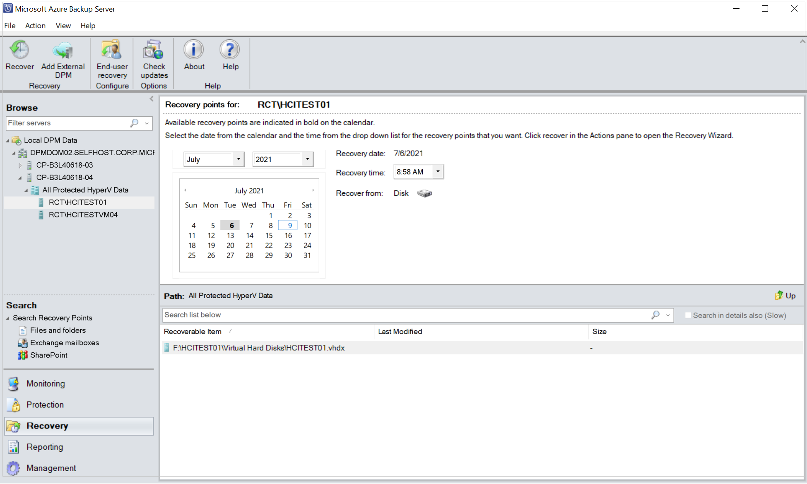
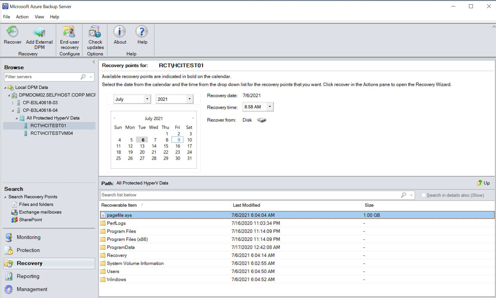
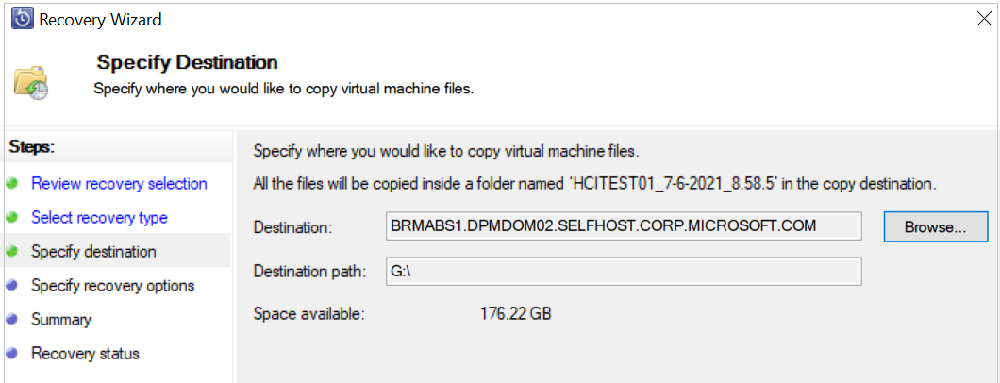

# Back up Hyper-V virtual machines

System Center Data Protection Manager (DPM) protects Hyper-V virtual machines by backing up the data of virtual machines. You can back up data at the Hyper-V host level to enable VM-level and file-level data recovery or back up at the guest-level to enable application-level recovery.

## Supported scenarios

DPM can back up virtual machines running on Hyper-V host servers in the following scenarios:

- **Virtual machines with local or direct storage** - Back up virtual machines hosted on Hyper-V host standalone servers that have local or directly attached storage. For example, a hard drive, a storage area network (SAN) device, or a network attached storage (NAS) device. The DPM protection agent must be installed on all hosts.

- **Virtual machines in a cluster with CSV storage** - Back up virtual machines hosted on a Hyper-V cluster with Cluster Shared Volume (CSV) storage. DPM 2012 SP1 introduced express full backup, parallel backups, and cluster query improvements for CSV backup. The DPM protection agent is installed on each cluster node.

- **Virtual machines with SMB storage** - Back up virtual machines hosted on a Hyper-V standalone server or cluster with SMB 3.0 file server storage. SMB shares are supported on a standalone file server or on a file server cluster. If you're using an external SMB 3.0 file server, the DPM protection agent should be installed on it. If the storage server is clustered, the agent should be installed on each cluster node. You'll need full-share and folder-level permissions for the machine's account of the application server on the SMB share.

- **[Back up virtual machines configured for live migration](#BKMK_Live)** - Live migration allows you to move virtual machines from one location to another while providing uninterrupted access. You can migrate virtual machines between two standalone servers, within a single cluster, or between standalone and cluster nodes. Multiple live migrations can run concurrently. You can also perform a live migration of virtual machine storage so that virtual machines can be moved to new storage locations while they continue to run. DPM can back up virtual machines that are configured for live migration. Read more.

- **[Back up replica virtual machines](#BKMK_Replica)** - Back up replica virtual machines running on a secondary server.

Learn about supported DPM and Hyper-V versions in [What can DPM back up?](dpm-protection-matrix.md).

## <a name="BKMK_Online"></a>Host vs Guest backup

DPM can perform a host or guest-level backup of Hyper-V VMs. At the host level, the DPM protection agent is installed on the Hyper-V host server or cluster and protects the entire VMs and data files running on that host. At the guest level, the agent is installed on each virtual machine and protects the workload present on that machine.

Both methods have pros and cons:

- Host-level backups are flexible because they work regardless of the type of OS running on the guest machines and don't require the installation of the DPM protection agent on each VM. If you deploy host-level backup, you'll be able to recover an entire virtual machine or files and folders (item-level recovery).

- Guest-level backup is useful if you want to protect specific workloads running on a virtual machine. At host-level you can recover an entire VM or specific files, but it won't provide recovery in the context of a specific application. For example, to be able to recover specific SharePoint items from a backed-up VM, you should do guest-level backup of that VM. You must use guest-level backup if you want to protect the data stored on passthrough disks. Passthrough allows the virtual machine to directly access the storage device and doesn't store virtual volume data in a VHD file.

::: moniker range="<=sc-dpm-2019"

## Online and offline backup

> [!IMPORTANT]
> Depending on your DPM configuration and what you're protecting, DPM's online and offline backup behavior differs. If you use DPM 2012 R2 with UR3 (or later) to protect Hyper-V on Windows Server 2012 R2 (or later), the VMs continue running during the backup process. In this case, the rest of this section does not apply.

If you protect a Hyper-V server on Windows Server 2012 or if you use DPM 2012 R2 with UR1 or UR2, the following section applies to your configuration:

DPM works seamlessly with the Hyper-V Volume Shadow Copy Services (VSS) writer to ensure that consistent versions of virtual machines are captured and protected without affecting the virtual machine access. The ability to back up open files is critical for business continuity. By default, DPM performs online backups that don't affect the availability of virtual machines. To perform an online backup, the following is required:

- The Backup integration service must be enabled, so the operating system running on the virtual machine must support Hyper-V integration services.

- The guest operating system must support VSS (Windows 2003 server or later). Online backup isn't supported if virtual machines are running Linux.

- There should be no dynamic disks on the virtual machine.

- All volumes can be either NTFS or ReFS.

- The VSS storage assignment for the volumes shouldn't be modified.

- The virtual machine must be running, and if the virtual machine is in a cluster, the cluster resource group should be online. A Shadow Storage assignment of a volume inside the virtual machine mustn't be explicitly set to a different volume other than itself.

If these conditions aren't met, DPM will perform an offline backup where the virtual machine is paused and placed in a saved state while the snapshot is taken, and then the virtual machine is resumed. This means the virtual machine is unavailable during the backup, usually a short period of less than a minute for many environments.

::: moniker-end

## Protect VMs on SOFS clusters

DPM can back up VMs deployed on both NTFS- and ReFS-based SOFS clusters. To protect VMs on SOFS clusters, do the following procedures:

Add the following machine accounts to the backup operator groups and share permissions:

- If protecting a highly available (HA) VM, provide the machine account name of the host cluster and cluster nodes and DPM server.
- If protecting a non-HA VM, provide the machine name of the Hyper-V host and the DPM server.

To add the machine accounts to the backup operator groups, run the following steps for each node in the SOFS cluster:

1. Open the command prompt, and type **lusrmgr.msc** to open Local Users and Groups.
2. In the Local Users and Groups page, select **Groups**.
3. In the list of groups, right-click **Backup Operators** and select **Properties**.

    The **Backup Operators Properties** page opens.
4. In the **Backup Operators Properties** page, select **Add**.
5. In the **Select Users, Computers, Services Accounts, or Groups** page, select **Object Types**.
    The **Object Types** page opens.
6. In the **Object Types** page, select **Computers** and select **OK**.
    The **Object Types** page closes.
7. In the **Select Users, Computers, Service Accounts, or Groups** page, enter the name of the server or cluster and select **Check Names**.
8. Once you've identified the computers, restart the node.

To give permissions to the share, do the following:

1. On a server where the SOFS/SMB share is hosted, open **Server Manager** > **File and Storage Services** > **Shares**.
2. Right-click the VM storage share, and then select **Properties**.
3. In the **Properties** page, on the left navigation menu, select **Permissions**.
4. Select **Customize permissions** to open the Advanced Security Settings page.
5. On the **Permissions** tab, select **Add**.
6. Select **Select a Principal**.
7. In the **Select User, Computer, Services Account, or Group** page, select **Object Types**.
8. In the **Object Types** page, select **Computers** and select **OK**.
9. In the **Select User, Computer, Service Account, or Group** page, enter the name of the Hyper-V node or cluster name you want to have permission for.
10. Select **Check Names** to resolve the name and select **OK**.
11. In the **Permission Entry for Share** page, select **Full Control** and select **OK**.
12. In the **Advanced Security Settings for Share** page, select the **Share** tab and repeat steps 6-11 for the **Share** tab instead of the **Permissions** tab.
13. When you've finished adding permissions for the servers, select **Apply**.

    This prepares the VMs on SOFS shares for the backup process.

## How the Backup process works

DPM performs backup with VSS as follows:

1. The DPM block-based synchronization engine makes an initial copy of the protected virtual machine and ensures that the copy of the virtual machine is complete and consistent.

2. After the initial copy is made and verified, DPM uses the Hyper-V VSS writer to capture backups. The VSS writer provides a data-consistent set of disk blocks that are synchronized with the DPM server. This approach provides the benefit of a "full backup" with the DPM server while minimizing the backup data that must be transferred across the network.

3. The DPM protection agent on a server that's running Hyper-V uses the existing Hyper-V APIs to determine whether a protected virtual machine also supports VSS.

   - If a virtual machine complies with the requirements for online backup and has the Hyper-V integration services component installed, then the Hyper-V VSS writer recursively forwards the VSS request through to all VSS-aware processes on the virtual machine. This operation occurs without the DPM protection agent being installed on the virtual machine. The recursive VSS request allows the Hyper-V VSS writer to ensure that disk-write operations are synchronized so that a VSS snapshot is captured without the loss of data.

     The Hyper-V integration services component invokes the Hyper-V VSS writer in Volume Shadow Copy Services (VSS) on virtual machines to ensure that their application data is in a consistent state.

   - If the virtual machine doesn't comply with online backup requirements, DPM automatically uses the Hyper-V APIs to pause the virtual machine before they capture data files.

4. After the initial baseline copy of the virtual machine synchronizes with the DPM server, all changes that are made to the virtual machine resources are captured in a new recovery point. The recovery point represents the consistent state of the virtual machine at a specific time. Recovery point captures can occur at least one time a day. When a new recovery point is created, DPM uses block-level replication with the Hyper-V VSS writer to determine which blocks have been altered on the server that's running Hyper-V after the last recovery point was created. These data blocks are then transferred to the DPM server and are applied to the replica of the protected data.

5. The DPM server uses VSS on the volumes that host recovery data so that multiple shadow copies are available. Each of these shadow copies provides a separate recovery. VSS recovery points are stored on the DPM server. The temporary copy that's made on the server running Hyper-V is only stored during DPM synchronization.

## Backup prerequisites

These are the prerequisites for backing up Hyper-V virtual machines with DPM.

::: moniker range="<=sc-dpm-2022"

|Prerequisite|Details|
|------------|-------|
|DPM prerequisites|- If you want to perform item-level recovery for virtual machines (recover files, folders, and volumes) then you'll need to install the Hyper-V role on the DPM server. If you only want to recover the virtual machine and not item-level, then the role isn't required.<br />-   You can protect up to 800 virtual machines of 100 GB each on one DPM server and allow multiple DPM servers that support larger clusters.<br />-   DPM excludes the page file from incremental backups to improve virtual machine backup performance.<br />-   DPM can back up a Hyper-V server or cluster in the same domain as the DPM server or in a child or trusted domain. If you want to back up Hyper-V in a workgroup or an untrusted domain, you'll need to set up authentication. For a single Hyper-V server, you can use NTLM or certificate authentication. For a cluster, you can use certificate authentication only.<br />-   Using host-level backup to back up virtual machine data on passthrough disks isn't supported. In this scenario, we recommend you use host-level backup to back up VHD files and guest-level backup to back up the other data that isn't visible on the host.<br />-   When protecting a Hyper-V cluster using scaled-out DPM protection (multiple DPM server protecting a large Hyper-V cluster), you can't add secondary protection for the protected Hyper-V workloads.<br />-   You can only back up replica virtual machines if DPM is running System Center 2012 R2 and the Hyper-V host is running on Windows Server 2012 R2.<br />-   You can back up deduplicated volumes.|
|Hyper-V VM prerequisites|-   The version of Integration Components that's running on the virtual machine should be the same as the version of Hyper-V on the server that's running Hyper-V.<br />-   For each virtual machine backup, you'll need free space on the volume hosting the virtual hard disk files to allow Hyper-V enough room for differencing disks (AVHDs) during backup. The space must be at least equal to the calculation **Initial disk size\*Churn rate\*Backup** window time. If you're running multiple backups on a cluster, you'll need enough storage capacity to accommodate the AVHDs for each of the virtual machines using this calculation.<br />-   If you want to back up virtual machines located on a Hyper-V host server running Windows Server 2012 R2, the virtual machine should have a SCSI controller specified, even if it's not connected to anything. This is because for online backup in Windows Server 2012 R2, the Hyper-V host mounts a new VHD in the VM and then dismounts it later. Only the SCSI controller can support this and is thus required for online backup of the virtual machine. The SCSI controller doesn't it became clear why we need this SCSI controller. Without this setting, event ID 10103 will be issued when you try to back up the virtual machine.|
|Linux prerequisites|-   You can back up Linux virtual machines using DPM 2012 R2. Only file-consistent snapshots are supported.|
|Back up VMs with CSV storage|-   For CSV storage, install the Volume Shadow Copy Services (VSS) hardware provider on the Hyper-V server. Contact your storage area network (SAN) vendor for the VSS hardware provider.<br />-   If a single node shuts down unexpectedly in a CSV cluster, DPM will perform a consistency check against the virtual machines that were running on that node.<br />-   If you need to restart a Hyper-V server that has BitLocker Drive Encryption enabled on the CSV cluster, you must run a consistency check for Hyper-V virtual machines.|
|Back up VMs with SMB storage|-   Turn on auto-mount on the server that's running Hyper-V to enable virtual machine protection.<br />-   Disable TCP Chimney Offload.<br />-   Ensure that all Hyper-V machine accounts have full permissions on the specific remote SMB file shares.<br />-   Ensure that the file path for all virtual machine components during recovery to alternate location is less than 260 characters. If not, recovery might succeed but Hyper-V can't mount the virtual machine.<br />-   The following scenarios aren't supported:<br />     Deployments where some components of the virtual machine are on local volumes and some are on remote volumes; an IPv4 or IPv6 address for storage location file server; and recovery of a virtual machine to a computer that uses remote SMB shares.<br />-   You'll need to enable the File Server VSS Agent service on each SMB server - Add it in **Add roles and features** > **Select server roles** > **File and Storage Services** > **File Services** > **File Service** > **File Server VSS Agent Service**.|

::: moniker-end

::: moniker range="sc-dpm-2025"

|Prerequisite|Details|
|------------|-------|
|DPM prerequisites|- If you want to perform item-level recovery for virtual machines (recover files, folders, and volumes) then you'll need to install the Hyper-V role on the DPM server. If you only want to recover the virtual machine and not item-level, then the role isn't required.<br />-   You can protect up to 800 virtual machines of 100 GB each on one DPM server and allow multiple DPM servers that support larger clusters.<br />-   DPM excludes the page file from incremental backups to improve virtual machine backup performance.<br />-   DPM can back up a Hyper-V server or cluster in the same domain as the DPM server or in a child or trusted domain. If you want to back up Hyper-V in a workgroup or an untrusted domain, you'll need to set up authentication. For a single Hyper-V server, you can use NTLM or certificate authentication. For a cluster, you can use certificate authentication only.<br />-   Using host-level backup to back up virtual machine data on passthrough disks isn't supported. In this scenario, we recommend you use host-level backup to back up VHD files and guest-level backup to back up the other data that isn't visible on the host.<br />-   When protecting a Hyper-V cluster using scaled-out DPM protection (multiple DPM server protecting a large Hyper-V cluster), you can't add secondary protection for the protected Hyper-V workloads.<br />-   You can back up deduplicated volumes.|
|Hyper-V VM prerequisites|-   The version of Integration Components that's running on the virtual machine should be the same as the version of Hyper-V on the server that's running Hyper-V.<br />-   For each virtual machine backup, you'll need free space on the volume hosting the virtual hard disk files to allow Hyper-V enough room for differencing disks (AVHDs) during backup. The space must be at least equal to the calculation **Initial disk size\*Churn rate\*Backup** window time. If you're running multiple backups on a cluster, you'll need enough storage capacity to accommodate the AVHDs for each of the virtual machines using this calculation.|
|Linux prerequisites|-   You can back up Linux virtual machines using DPM. Only file-consistent snapshots are supported.|
|Back up VMs with CSV storage|-   If a single node shuts down unexpectedly in a CSV cluster, DPM will perform a consistency check against the virtual machines that were running on that node.<br />-   If you need to restart a Hyper-V server that has BitLocker Drive Encryption enabled on the CSV cluster, you must run a consistency check for Hyper-V virtual machines.|
|Back up VMs with SMB storage|-   Turn on auto-mount on the server that's running Hyper-V to enable virtual machine protection.<br />-   Disable TCP Chimney Offload.<br />-   Ensure that all Hyper-V machine accounts have full permissions on the specific remote SMB file shares.<br />-   Ensure that the file path for all virtual machine components during recovery to alternate location is less than 260 characters. If not, recovery might succeed but Hyper-V can't mount the virtual machine.<br />-   The following scenarios aren't supported:<br />     Deployments where some components of the virtual machine are on local volumes and some are on remote volumes; an IPv4 or IPv6 address for storage location file server; and recovery of a virtual machine to a computer that uses remote SMB shares.<br />-   You'll need to enable the File Server VSS Agent service on each SMB server - Add it in **Add roles and features** > **Select server roles** > **File and Storage Services** > **File Services** > **File Service** > **File Server VSS Agent Service**.|

::: moniker-end

## Back up virtual machines

1. Set up your [DPM server](~/dpm/plan-dpm-deployment.md) and [your storage](~/dpm/plan-long-and-short-term-data-storage.md). When setting up your storage, use these storage capacity guidelines.
   - Average virtual machine size - 100 GB
   - Number of virtual machines per DPM server - 800
   - Total size of 800 VMs - 80 TB
   - Required space for backup storage - 80 TB

2. Set up the DPM protection agent on the Hyper-V server or Hyper-V cluster nodes. If you're doing guest-level backup, you'll install the agent on the VMs you want to back up at the guest level.

3. In the DPM Administrator console, select **Protection** > **Create protection group** to open the **Create New Protection Group** wizard.

4. On the **Select Group Members** page, highlight the Hyper-V server, or the Hyper-V Cluster and then select **Refresh** to enumerate the Virtual machines. Select the VMs you want to protect from the Hyper-V host server or Cluster on which they're located.

5. On the **Select Data Protection Method** page, specify a protection group name. Select **I want short-term protection using Disk**, and select **I want online protection** if you want to back up data to Azure using the Azure Backup service. If this option isn't available, complete the wizard to create the group. Ensure that the MARS agent is installed and registered to an Azure recovery services vault and then modify the protection group settings to select this option. You can store data in Azure for up to 3360 days.

   If you've a standalone tape or tape library connected to the DPM server, you'll be able to select **I want long-term protection using tape**.

6. In **Specify Short-Term Goals** > **Retention range**, specify how long you want to retain the disk data. In **Synchronization frequency**, specify how often incremental backups of the data should run. Alternatively, instead of selecting an interval for incremental backups, you can enable **Just before a recovery point**. With this setting, the enabled DPM will run an express full backup just before each scheduled recovery point.

    - If you're protecting application workloads, recovery points are created in accordance with Synchronization frequency, provided the application supports incremental backups. If it doesn't, then DPM runs an express full backup instead of an incremental backup, and creates recovery points in accordance with the express backup schedule.

    - If you enable long-term storage to tape, in **Specify Long-Term Goals** > **Retention range**, specify how long you want to keep your tape data (1-99 years).
        In Frequency of backup, select the backup frequency that you want.

    - The backup frequency is based on the specified retention range. When the retention range is 1-99 years, you can select backups to occur daily, weekly, bi-weekly, monthly, quarterly, half-yearly, or yearly.

    - When the retention range is 1-11 months, you can select backups to occur daily, weekly, bi-weekly, or monthly.
        When the retention range is 1-4 weeks, you can select backups to occur daily or weekly.

    - On a standalone tape drive, for a single protection group, DPM uses the same tape for daily backups until there's insufficient space on the tape. If you enabled colocation, data resources are colocated on the tape.

    - If you configured long-term storage to tape, on the **Select Tape and Library Details** page, specify the tape and library that will be used for backup of this protection group. You can also specify whether to compress or encrypt the backup data.

7. In the **Review disk allocation** page, review the storage pool disk space allocated for the protection group.

   **Total Data size** is the size of the data you want to back up, and **Disk space to be provisioned on DPM** is the space that DPM recommends for the protection group. DPM chooses the ideal backup volume based on the settings. However, you can edit the backup volume choices in the **Disk allocation details**. For the workloads, select the preferred storage in the dropdown menu. Your edits change the values for **Total Storage** and **Free Storage** in the **Available Disk Storage** pane. Underprovisioned space is the amount of storage DPM suggests you add to the volume to continue with backups smoothly in the future.

8. On the **Choose Replica Creation Method** page, specify how the initial replication of data in the protection group will be performed. If you select to replicate over the network, we recommended you choose an off-peak time. For large amounts of data or less than optimal network conditions, consider replicating the data offline using removable media.

9. On the **Consistency Check Options** page, select how you want to automate consistency checks. You can enable a check to run only when replica data becomes inconsistent or according to a schedule. If you don't want to configure automatic consistency checking, you can run a manual check at any time by right-clicking the protection group and selecting **Perform Consistency Check**.

    After you create the protection group, the initial replication of the data occurs in accordance with the method you selected. After the initial replication, each backup takes place in line with the protection group settings. If you need to recover backed-up data, note the following:

## <a name="BKMK_Live"></a>Back up virtual machines configured for live migration

When virtual machines are involved in live migration, DPM continues to protect the virtual machines as long as the DPM protection agent is installed on the Hyper-V host. The way in which DPM protects the virtual machines depends on the type of live migration involved.

**Live migration within a cluster** - When a virtual machine is migrated within a cluster, DPM detects the migration and backs up the virtual machine from the new cluster node without any requirement for user intervention. As the storage location hasn't changed, DPM continues with express full backups. In a scaled scenario with two DPM servers to protect the cluster, a virtual machine that's protected by DPM1 continues to be protected by DPM1 no matter where the virtual machine is migrated.

**Live migration outside the cluster** - When a virtual machine is migrated between standalone servers, different clusters, or between a standalone server and a cluster, DPM detects the migration and can back up the virtual machine without user intervention.

### Requirements for maintaining protection

The following are requirements for maintaining protection during live migration:

- The Hyper-V hosts for the virtual machines must be located in a System Center VMM cloud on a VMM server running at least System Center 2012 with SP1.

- The DPM protection agent must be installed on all Hyper-V hosts.

- DPM servers must be connected to the VMM server. All Hyper-V host servers in the VMM cloud must also be connected to the DPM servers. This allows DPM to communicate with the VMM server so that the DPM can find out on which Hyper-V host server the virtual machine is currently running and to create a new backup from that Hyper-V server. If a connection can't be established to the Hyper-V server, the backup fails with a message that the DPM protection agent is unreachable.

- All the DPM servers, VMM servers, and Hyper-V host servers must be in the same domain.

### Details about live migration

Note the following for backup during live migration:

- Live migration protection doesn't support backup to tape.

- If a live migration transfers storage, DPM performs a full consistency check of the virtual machine and then continues with express full backups. When live migration of storage occurs, Hyper-V reorganizes the virtual hard disk (VHD) or VHDX, which causes a one-time spike in the size of the DPM backup data.

- On the virtual machine host, turn on auto-mount to enable virtual protection and disable TCP Chimney Offload.

- DPM uses port 6070 as the default port for hosting the DPM-VMM Helper Service. To change the registry:

    1. Navigate to **HKLM\Software\Microsoft\Microsoft Data Protection Manager\Configuration**.
    2. Create a 32-bit DWORD value: DpmVmmHelperServicePort, and write the updated port number as part of the registry key.
    3.  Open ```<Install directory>\Microsoft System Center 2012\DPM\DPM\VmmHelperService\VmmHelperServiceHost.exe.config```, and change the port number from 6070 to the new port. For example: ```<add baseAddress="net.tcp://localhost:6080/VmmHelperService/" />```
    4. Restart the DPM-VMM Helper service, and restart the DPM service.

### Set up protection for live migration

To set up protection for live migration:

1. Set up the DPM server and its storage, and install the DPM protection agent on every Hyper-V host server or cluster node in the VMM cloud. If you're using SMB storage in a cluster, install the DPM protection agent on all cluster nodes.

2. Install the VMM console as a client component on the DPM server so that DPM can communicate with the VMM server. The console should be the same version as the one running on the VMM server.

3. Assign the DPMMachineName$ account as a read-only administrator account on the VMM management server.

4. Connect all Hyper-V host servers to all DPM servers with the `Set-DPMGlobalProperty` PowerShell cmdlet. The cmdlet accepts multiple DPM server names. Use the format: `Set-DPMGlobalProperty -dpmservername <dpmservername> -knownvmmservers <vmmservername>`. For more information, see [Set-DPMGlobalProperty](/powershell/module/dataprotectionmanager/set-dpmglobalproperty).

5. After all the virtual machines running on the Hyper-V hosts in the VMM clouds are discovered in VMM, set up a protection group and add the virtual machines you want to protect. Automatic consistency checks should be enabled at the protection group level for protection under virtual machine mobility scenarios.

6. After the settings are configured, when a virtual machine migrates from one cluster to another, all backups continue as expected. You can verify if live migration is enabled as expected as follows:

    1. Check if the DPM-VMM Helper Service is running. If it isn't, start it.

    2. Open Microsoft SQL Server Management Studio and connect to the instance that hosts the DPM database (DPMDB). On DPMDB, run the following query: `SELECT TOP 1000 [PropertyName] ,[PropertyValue] FROM[DPMDB].[dbo].[tbl_DLS_GlobalSetting]`.

        This query contains a property called `KnownVMMServer`. This value should be the same value you provided with the `Set-DPMGlobalProperty` cmdlet.

    3. Run the following query to validate the *VMMIdentifier* parameter in the `PhysicalPathXML` for a particular virtual machine. Replace `VMName` with the name of the virtual machine.

        `select cast(PhysicalPath as XML) from tbl_IM_ProtectedObject where DataSourceId in (select datasourceid from tbl_IM_DataSource where DataSourceName like '%<VMName>%')`

    4. Open the .xml file that this query returns and validate that the *VMMIdentifier* field has a value.

### Run manual migration

After you complete the steps in the previous sections and the DPM Summary Manager job completes, migration is enabled. By default, this job starts at midnight and runs every morning. If you want to run a manual migration to check if everything is working as expected, do the following:

1. Open SQL Server Management Studio and connect to the instance that hosts the DPM database.

2. Run the following query: `select * from tbl_SCH_ScheduleDefinition where JobDefinitionID='9B30D213-B836-4B9E-97C2-DB03C3EB39D7'`. This query returns the **ScheduleID**. Note down this ID, as you'll use it in the next step.

3. In the SQL Server Management Studio, expand **SQL Server Agent** and then expand **Jobs**. Right-click the **ScheduleID** that you noted, and select **Start Job at Step**.

> [!NOTE]
> Backup performance is affected when the job runs. The size and scale of your deployment determines how much time the job takes to finish.

## <a name="BKMK_Replica"></a>Back up replica virtual machines

If DPM is running on Windows Server 2012 R2 or greater, then you can back up replica virtual machines on a secondary server. This is useful for several reasons:

**Reduces the impact of backups on the running workload** - Taking a backup of a virtual machine incurs some overhead as a snapshot is created. By offloading the backup process to a secondary remote site, the running workload is no longer impacted by the backup operation. This is applicable only to deployments where the backup copy is stored on a remote site. For example, you might take daily backups and store data locally to ensure quick restore times, but take monthly or quarterly backups from replica virtual machines stored remotely for long-term retention.

**Saves bandwidth** - In a typical remote branch office/headquarters deployment, you need an appropriate amount of provisioned bandwidth to transfer backup data between sites. If you create a replication and failover strategy, in addition to your data backup strategy, you can reduce the amount of redundant data sent over the network. By backing up the replica virtual machine data rather than the primary, you save the overhead of sending the backed-up data over the network.

**Enables hoster backup** - You can use a hosted datacenter as a replica site with no need for a secondary datacenter. In this case, the host's SLA requires consistent backup of replica virtual machines.

A replica virtual machine is turned off until a failover is initiated, and VSS can't guarantee an application-consistent backup for a replica virtual machine. Thus, the backup of a replica virtual machine will be crash-consistent only. If crash-consistency can't be guaranteed, then the backup will fail and this might occur in the following conditions:

- The replica virtual machine isn't healthy and is in a critical state.

- The replica virtual machine is resynchronizing (in the Resynchronization in Progress or Resynchronization Required state).

- Initial replication between the primary and secondary site is in progress or pending for the virtual machine.

- .hrl logs are being applied to the replica virtual machine or a previous action to apply the .hrl logs on the virtual disk failed or was canceled or interrupted.

- Migration or failover of the replica virtual machine is in progress.

## Recover backed-up virtual machines

>[!NOTE]
>
>If the .vhdx of a Hyper-V virtual machine is of fixed type, by design, DPM restores the .vhdx as the dynamic type.  To convert the dynamic size disk backup to a fixed size disk, use the following PowerShell cmdlet:

  ```powershell

  Convert-VHD –Path c:\VM\my-vhdx.vhdx –DestinationPath c:\New-VM\new-vhdx.vhdx –VHDType Fixed

  ```

When you can recover a backed-up virtual machine, you use the Recovery wizard to select the virtual machine and the specific recovery point. To open the Recovery Wizard and recover a virtual machine:

1. In the DPM Administrator console, type the name of the VM or expand the list of protected items and select the VM you want to recover.

2. In the **Recovery points for** pane, on the calendar, select any date to see the recovery points available. Then in the **Path** pane, select the recovery point you want to use in the Recovery wizard.

3. From the **Actions** menu, select **Recover** to open the Recovery Wizard.

    The VM and recovery point you selected appear in the **Review Recovery Selection** screen. Select **Next**.

4. On the **Select Recovery Type** screen, select where you want to restore the data and then select **Next**.

    - **Recover to original instance**: When you recover to the original instance, the original VHD is deleted. DPM recovers the VHD and other configuration files to the original location using Hyper-V VSS writer. At the end of the recovery process, virtual machines are still highly available.
        The resource group must be present for recovery. If it isn't available, recover to an alternate location, and then make the virtual machine highly available.

    - **Recover as virtual machine to any host**: DPM supports alternate location recovery (ALR), which provides a seamless recovery of a protected Hyper-V virtual machine to a different Hyper-V host, independent of processor architecture. Hyper-V virtual machines that are recovered to a cluster node won't be highly available. If you choose this option, the Recovery Wizard presents you with an additional screen for identifying the destination and destination path.

    - **Copy to a network folder**: DPM supports item-level recovery (ILR), which allows you to perform item-level recovery of files, folders, volumes, and virtual hard disks (VHDs) from a host-level backup of Hyper-V virtual machines to a network share or a volume on a DPM protected server. The DPM protection agent doesn't have to be installed inside the guest to perform item-level recovery. If you choose this option, the Recovery Wizard presents you with an additional screen for identifying the destination and destination path.

    > [!NOTE]
    > DPM does not support item-level recovery of a Dynamic Disk within a Guest VM. For this, the Guest VM should have a Basic Disk.

5. In **Specify Recovery Options**, configure the recovery options and select **Next**:

    - If you're recovering a VM over low bandwidth, select **Modify** to enable **Network bandwidth usage throttling**. After turning on the throttling option, you can specify the amount of bandwidth you want to make available and the time when that bandwidth is available.
    - Select **Enable SAN based recovery using hardware snapshots** if you've configured your network.
    - Select **Send an e-mail when the recovery completes** and then provide the email addresses if you want email notifications sent once the recovery process completes.

6. In the Summary screen, ensure that all the details are correct. If the details aren't correct or you want to make a change, select **Back**. If you're satisfied with the settings, select **Recover** to start the recovery process.

7. The **Recovery Status** screen provides information about the recovery job.

> [!NOTE]
> By default, 8 parallel recoveries are supported. You can increase the number of parallel restore jobs by adding the below registry key:
> - **Key Path**: HKLM\Software\Microsoft\Microsoft Data Protection Manager\Configuration\ MaxParallelRecoveryJobs
>- **32 Bit DWORD**: HyperV
>- **Data**: \<number\>

## Restore an individual file from a Hyper-V VM

::: moniker range="<=sc-dpm-2019"

You can restore individual files from a protected Hyper-V VM recovery point. This feature is only available for Windows Server VMs. Restoring individual files is similar to restoring the entire VM, except you browse into the VMDK and find the file(s) you want, before starting the recovery process. To recover an individual file or select files from a Windows Server VM:

>[!NOTE]
>Restoring an individual file from a Hyper-V VM is available only for Windows VM and Disk Recovery Points.

1. In the DPM Administrator Console, select **Recovery** view.

1. Using the **Browse** pane, browse or filter to find the VM you want to recover. Once you select a Hyper-V VM or folder, the **Recovery points for** pane displays the available recovery points.

    

1. In the **Recovery Points for** pane, use the calendar to select the date that contains the desired recovery point(s). Depending on how the backup policy has been configured, dates can have more than one recovery point. Once you've selected the day when the recovery point was taken, ensure that you've chosen the correct **Recovery time**. If the selected date has multiple recovery points, choose your recovery point by selecting it in the Recovery time dropdown menu. Once you chose the recovery point, the list of recoverable items appears in the Path pane.

1. To find the files you want to recover, in the **Path** pane, double-click the item in the Recoverable item column to open it. Select the file, files, or folders you want to recover. To select multiple items, press the **Ctrl** key while selecting each item. Use the **Path** pane to search the list of files or folders appearing in the **Recoverable Item** column. **Search list below** doesn't search into subfolders. To search through subfolders, double-click the folder. Use the Up button to move from a child folder into the parent folder. You can select multiple items (files and folders), but they must be in the same parent folder. You can't recover items from multiple folders in the same recovery job.

    

1. Once you've selected the item(s) for recovery, in the Administrator Console tool ribbon, select **Recover** to open the **Recovery Wizard**. In the Recovery Wizard, the **Review Recovery Selection** screen shows the selected items to be recovered.

1. On the **Specify Recovery Options** screen, if you want to enable network bandwidth throttling, select **Modify**. To leave network throttling disabled, select **Next**. No other options on this wizard screen are available for VMware VMs. If you choose to modify the network bandwidth throttle, in the Throttle dialog, select **Enable network bandwidth usage throttling** to turn it on. Once enabled, configure the **Settings** and **Work Schedule**.

1. On the **Select Recovery Type** screen, select **Next**. You can only recover your file(s) or folder(s) to a network folder.

1. On the **Specify Destination** screen, select **Browse** to find a network location for your files or folders. DPM creates a folder where all recovered items are copied. The folder name has the prefix, DPM_day-month-year. When you select a location for the recovered files or folder, the details for that location (Destination, Destination path, and available space) are provided.

    

1. On the **Specify Recovery Options** screen, choose which security setting to apply. You can opt to modify the network bandwidth usage throttling, but throttling is disabled by default. Also, **SAN Recovery** and **Notification** aren't enabled.

1. On the **Summary** screen, review your settings and select **Recover** to start the recovery process. The **Recovery status** screen shows the progression of the recovery operation.

::: moniker-end

::: moniker range=">=sc-dpm-2022"

You can restore individual files from a protected Hyper-V VM recovery point. This feature is only available for Windows Server VMs. Restoring individual files is similar to restoring the entire VM, except you browse into the VMDK and find the file(s) you want, before starting the recovery process. To recover an individual file or select files from a Windows Server VM:

::: moniker-end

::: moniker range="sc-dpm-2022"

>[!NOTE]
>- Restoring an individual file from a Hyper-V VM is available only for Windows VM and from Disk and Online Recovery Points.
>- With DPM 2022 UR2 and later, you can restore an individual file from a Hyper-V VM from both disk and online recovery points. The VM should be a Windows Server VM.

::: moniker-end

::: moniker range="sc-dpm-2025"

>[!NOTE]
>- Restoring an individual file from a Hyper-V VM is available only for Windows VM and from Disk and Online Recovery Points.
>- You can restore an individual file from a Hyper-V VM from both disk and online recovery points. The VM should be a Windows Server VM.

::: moniker-end

::: moniker range=">=sc-dpm-2022"

For item-level recovery from an online recovery point, ensure that the Hyper-V role is installed on the MABS Server, automatic mounting of volumes is enabled, and the VM VHD doesn't contain a dynamic disk. The item-level recovery for online recovery points works by mounting the VM recovery point using iSCSI for browsing, and only one VM can be mounted at a given time.

To restore an individual file from a Hyper-V VM, follow these steps:

1. In the DPM Administrator Console, select **Recovery** view.

1. Using the **Browse** pane, browse or filter to find the VM you want to recover. Once you select a Hyper-V VM or folder, the **Recovery points for** pane displays the available recovery points.

    

1. In the **Recovery Points for** pane, use the calendar to select the date that contains the desired recovery point(s). Depending on how the backup policy has been configured, dates can have more than one recovery point. Once you've selected the day when the recovery point was taken, ensure that you've chosen the correct **Recovery time**. If the selected date has multiple recovery points, choose your recovery point by selecting it in the Recovery time dropdown menu. Once you chose the recovery point, the list of recoverable items appears in the Path pane.

1. To find the files you want to recover, in the **Path** pane, double-click the item in the Recoverable item column to open it. If you use an online recovery point, wait until the recovery point is mounted. Once the mount is complete, select the VM, VHD disk, and the volume you want to restore until the files and folders are listed. Select the file, files, or folders you want to recover. To select multiple items, press the **Ctrl** key while selecting each item. Use the **Path** pane to search the list of files or folders appearing in the **Recoverable Item** column. **Search list below** doesn't search into subfolders. To search through subfolders, double-click the folder. Use the Up button to move from a child folder into the parent folder. You can select multiple items (files and folders), but they must be in the same parent folder. You can't recover items from multiple folders in the same recovery job.

    

1. Once you've selected the item(s) for recovery, in the Administrator Console tool ribbon, select **Recover** to open the **Recovery Wizard**. In the Recovery Wizard, the **Review Recovery Selection** screen shows the selected items to be recovered.

1. On the **Specify Recovery Options** screen, if you want to enable network bandwidth throttling, select **Modify**. To leave network throttling disabled, select **Next**. No other options on this wizard screen are available for VMware VMs. If you choose to modify the network bandwidth throttle, in the Throttle dialog, select **Enable network bandwidth usage throttling** to turn it on. Once enabled, configure the **Settings** and **Work Schedule**.

1. On the **Select Recovery Type** screen, select **Next**. You can only recover your file(s) or folder(s) to a network folder.

1. On the **Specify Destination** screen, select **Browse** to find a network location for your files or folders. DPM creates a folder where all recovered items are copied. The folder name has the prefix, DPM_day-month-year. When you select a location for the recovered files or folder, the details for that location (Destination, Destination path, and available space) are provided.

    

1. On the **Specify Recovery Options** screen, choose which security setting to apply. You can opt to modify the network bandwidth usage throttling, but throttling is disabled by default. Also, **SAN Recovery** and **Notification** aren't enabled.

1. On the **Summary** screen, review your settings and select **Recover** to start the recovery process. The **Recovery status** screen shows the progression of the recovery operation.

>[!TIP]
>You can perform item-level restore of online recovery points for Hyper-V VMs running Windows also from Add external DPM Server to recover VM files and folders quickly.

::: moniker-end
