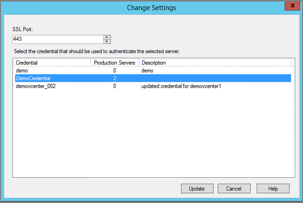
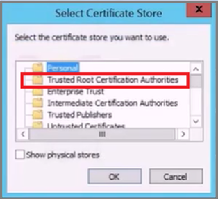
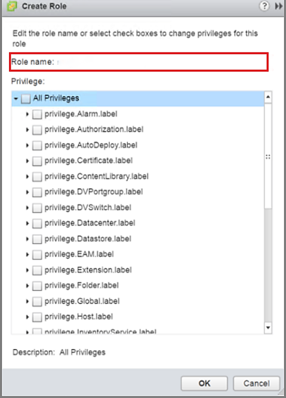

# Use DPM to back up and restore VMware virtual machines

::: moniker range="sc-dpm-2019"
This article explains how to use Data Protection Manager (DPM) to back up virtual machines running on the 5.5, 6.0, 6.5, 6.7, or 7.0 (supported from DPM 2019 UR5) versions of VMware vCenter and vSphere Hypervisor (ESXi).

DPM 2019 UR5 and later don't support vSphere 5.5. Ensure to upgrade to newer vSphere versions as vSphere 5.5 has reached [end of general support](https://blogs.vmware.com/vsphere/2018/02/vsphere-5-5-vsan-5-5-end-general-support-reminder.html).

::: moniker-end

::: moniker range="sc-dpm-2022"
This article explains how to use Data Protection Manager (DPM) to back up virtual machines running on the 6.0, 6.5, 6.7, 7.0, and 8.0 versions of VMware vCenter and vSphere Hypervisor (ESXi).

>[!NOTE]
>DPM 2022 UR1 and later don't support vSphere 6.0. Ensure to upgrade to newer vSphere versions as vSphere 6.0 has reached [end of general support](https://blogs.vmware.com/vsphere/2019/10/vsphere-6-0-reaches-end-of-general-support-eogs-in-march-2020.html). vSphere 8.0 is supported from DPM 2022 UR2.

::: moniker-end

::: moniker range="sc-dpm-2025"
This article explains how to use Data Protection Manager (DPM) to back up virtual machines running on the 6.0, 6.5, 6.7, 7.0, and 8.0 versions of VMware vCenter and vSphere Hypervisor (ESXi).

>[!NOTE]
>DPM 2025 don't support vSphere 6.0. Ensure to upgrade to newer vSphere versions as vSphere 6.0 has reached [end of general support](https://blogs.vmware.com/vsphere/2019/10/vsphere-6-0-reaches-end-of-general-support-eogs-in-march-2020.html).

::: moniker-end

## Supported VMware features

DPM provides the following features when backing up VMware virtual machines:

>[!NOTE]
> Back up of virtual machines to tape is applicable for DPM 2019 and later.

- Agentless backup: DPM doesn't require an agent to be installed on the vCenter or ESXi server to back up the virtual machine. Instead, just provide the IP address or fully qualified domain name (FQDN) and sign in credentials used to authenticate the VMware server with DPM.
- Cloud Integrated Backup: DPM protects workloads to disk, tape, and cloud. DPM's backup and recovery workflow help you manage long-term retention and offsite backup.
- Detect and protect VMs managed by vCenter: DPM detects and protects VMs deployed on a VMware server (vCenter or ESXi server). As your deployment size grows, use vCenter to manage your VMware environment. DPM also detects VMs managed by vCenter, allowing you to protect large deployments.
- Folder-level auto protection: vCenter lets you organize your VMs in VM folders. DPM detects these folders and lets you protect VMs at the folder level and includes all subfolders. When protecting folders, DPM not only protects the VMs in that folder, but also protects VMs added later. DPM detects new VMs on a daily basis and protects them automatically. As you organize your VMs in recursive folders, DPM automatically detects and protects the new VMs deployed in the recursive folders.
- DPM protects VMs stored on a local disk, network file system (NFS), or cluster storage.
- DPM protects VMs migrated for load balancing: As VMs are migrated for load balancing, DPM automatically detects and continues VM protection.
- DPM can recover files/folders from a Windows VM without recovering the entire VM, which helps recover necessary files faster.

::: moniker range="<=sc-dpm-2019"

## Prerequisites and Limitations

Before you start backing up a VMware virtual machine, review the following list of limitations and prerequisites:

- If you've been using DPM to protect vCenter server (running on Windows) as Windows Server, you can't protect that as VMware server using FQDN of the server.
     - You can use static IP address of vCenter Server as a workaround.
     - If you want to use FQDN, you should stop the protection as Windows Server, remove the protection agent, and then add as VMware Server using FQDN.
- If you're protecting vCenter Server (running on Windows) using FQDN as VMware Server, you can't protect the vCenter Server as Windows Server.
- If you use vCenter to manage ESXi servers in your environment, add vCenter (and not ESXi) to the DPM protection group.
- DPM can't protect VMware VMs to a secondary DPM server.
- You can't back up user snapshots before the first DPM backup. Once DPM completes the first backup, then you can back up user snapshots.
- DPM can't protect VMware VMs with pass-through disks and physical raw device mappings (pRDM).
- DPM can't detect or protect VMware vApps.
- DPM can't protect VMware VMs with existing snapshots.
- Ensure the following network ports are open:
     - TCP 443 between MABS and vCenter
     - TCP 443 and TCP 902 between MABS and ESXi host

::: moniker-end

::: moniker range=">=sc-dpm-2022"

## Prerequisites and Limitations

Before you start backing up a VMware virtual machine, review the following list of limitations and prerequisites:

- If you've been using DPM to protect vCenter server (running on Windows) as Windows Server, you can't protect that as VMware server using FQDN of the server.
     - You can use static IP address of vCenter Server as a workaround.
     - If you want to use FQDN, you should stop the protection as Windows Server, remove the protection agent, and then add as VMware Server using FQDN.
- If you're protecting vCenter Server (running on Windows) using FQDN as VMware Server, you can't protect the vCenter Server as Windows Server.
- If you use vCenter to manage ESXi servers in your environment, add vCenter (and not ESXi) to the DPM protection group.
- DPM can't protect VMware VMs to a secondary DPM server.
- You can't back up user snapshots before the first DPM backup. Once DPM completes the first backup, then you can back up user snapshots.
- DPM can't protect VMware VMs with pass-through disks and physical raw device mappings (pRDM).
- DPM can't detect or protect VMware vApps.
- DPM can't protect VMware VMs with existing snapshots.
- Ensure the following network ports are open:
     - TCP 443 between MABS and vCenter
     - TCP 443 and TCP 902 between MABS and ESXi host
- DPM can’t protect Data Sets when backing up vSphere 8.0 VMs.

::: moniker-end

## Configure DPM to protect VMware

The following information details how to configure VMware for DPM protection. To establish communication between DPM and the VMware server, configure the VMware credentials and establish a secure connection between DPM and the VMware vCenter Server or VMware vSphere Hypervisor (ESXi) server. If you use both vCenter Server and ESXi server, configure only the vCenter Server to work with DPM. You don't need to add ESXi servers to DPM. To manage a VMware server, DPM needs valid credentials to access VMware servers.

### Credential management

DPM doesn't use an agent to communicate with a VMware server. Instead, it uses a username and password credential to authenticate its remote communication with the VMware server. Each time DPM communicates with a VMware server, DPM must be authenticated. As it can be necessary to change credentials and a data center can have multiple vCenter servers requiring unique credentials, tracking these credentials can be a problem. However, DPM has a Manage VMware Credentials feature to securely store and manage credentials.

Remember the following details about credentials:

- One credential can be used to authenticate multiple VMware servers.
- Once credential details, such as Description, User name, and Password are updated, DPM uses these credentials to communicate with all VMware servers.
- A credential can be deleted only if it isn't being used to authenticate a VMware server.

#### Open the Manage VMware Credentials feature

1. In the DPM Administrator Console, select **Management**.

    

2. In the list of assets to manage, select **Production Servers**.
3. In the tool ribbon, select **Manage VMware Credentials**.
    The **Manage Credentials** page opens. Using the **Manage Credentials** page, you can add, update, or delete credentials.
    

   Select the required tab for detailed information on adding, updating, or deleting credentials:

# [Add VMware server credentials](#tab/Add)

You add a credential to the DPM server so that you can pair it up with credential on the VMware server. Remember, the credential on the DPM server must be identical to the credential on the VMware server. To add a credential, in the **Manage Credentials** page:

1. Select **Add** to open the **Add Credential** page.
   

2. Enter your information in the **Name**, **Description**, **User name**, and **Password** fields. Once you've added text in the required fields, the **Add** button becomes active.
   - **Name** is what appears in the **Credential** column of the Manage Credentials dialog. **Name** is a required field and is the identifier for the credentials. This field can't be edited later. If you want to change the name of a credential, you must add a new credential.
   - **Description** is the descriptive text or an alternate name so that you can recognize or distinguish the credentials in the Manage Credentials page. The **Description** text is an optional field and appears in the **Description** column of the Manage Credentials page.
   - **User name** and **Password** are the user name and password for the user account used to access the server. Both fields are required.
3. Select **Add** to save your new credentials. Once you've created credentials, you can use them to authenticate with a VMware server.

# [Update VMware server credentials](#tab/Update)

Most organizations need to update credentials due to security reasons or personnel changes. When VMware server credentials are changed, the credentials used by DPM also need to be updated. If a VMware server's credentials (user name and password) have changed, you must add matching credentials in DPM.

Once you've matching credentials in DPM, update the VMware server credentials using the following steps:

1. In the DPM Administrator console, select **Management**.
2. In the list of assets to manage, select **Production Servers**.
3. In the list of computers, select the VMware server whose credentials need to be updated.
   In the example image, *demovcenter1.Contoso.com* is the VMware server with broken credentials.
   
4. On the Administrator console tool ribbon, select **Change Settings**.
    The Change Settings page opens. It displays all credentials on the DPM server. In the example image, *demovcenter_002* is the DPM credential to pair with demovcenter1.Contoso.com.

    
5. From the list, select the credential on the DPM server to match the VMware credential and select **Update**.
    In the image, notice demovcenter_002 authenticates a production server, and demovcenter1.Contoso.com is now protected.
   

# [Delete VMware server credentials](#tab/Delete)

When you delete credentials, you're removing the credential from the list on the DPM server. DPM doesn't allow you to delete a credential that is used to authenticate a production server.

To delete a credential, follow these steps:

1. In the DPM Administrator Console, select Management, select Production Servers, and in the tool ribbon, select Manage VMware Credentials.
2. In the Manage Credentials page, select the credential. Make sure the credential isn't associated with any Production Servers.
3. Select **Delete** to remove the credential from the list.
---

### Set up secure communication between DPM and a VMware server

DPM communicates with the VMware server securely over an HTTPS channel. To create the secure communication, install a trusted certificate on both the VMware server and the DPM server. If the connection to your vCenter isn't secure, you can secure it by installing a certificate on the DPM server. Use the same certificate to make a secure connection with the VMware server.

To verify if there's a secure communication channel between DPM and vCenter, open a browser on the DPM server and access the VMware server. If you're using Chrome and you don't have a valid certificate, you see the strikethrough in the URL, like this example:

:::image type="content" source="./media/back-up-vmware/secure-communication-chrome.png" alt-text="Screenshot of no secure communication channel on Chrome.":::

If you're using Internet Explorer and you don't have a valid certificate, you see this message when you access the URL:


To fix the error, install a valid certificate on the DPM server and the VMware server. In the previous images, the DPM server has a valid certificate, but the certificate isn't in the trusted root certification authority store. To fix this situation, add the certificate to the VMware server.

1. On the Certificate page, on the **Certification Path** tab, select **View Certificate**.

   

2. In the new Certificate page, select the **Details** tab, and then select **Copy to File** to open the Certificate Export Wizard.

   

3. In the **Certificate Export Wizard**, select **Next**.
4. On the **Export File Format** screen, select **DER encoded binary X.509 (.CER)**, and then select **Next**.
5. On the **File to Export** screen, enter a name for your certificate and select **Next**.
6. Select **Finish** to complete the **Certificate Export Wizard**.
7. Locate the exported certificate. Right-click the certificate and select **Install Certificate**.

    

8. In the **Certificate Import wizard**, select **Local Machine** and then select **Next**.
9. To find the location where you want to place the certificate, on the **Certificate Store** screen, select **Place all certificates in the following store** and select **Browse**.
10. In the **Select Certificate Store** page, select **Trusted Root Authority Certificate** and select **OK**.

    

11. Select **Next** and then select **Finish** to import the certificate successfully.
12. Once you've added the certificate, sign in to your vCenter server to verify if the connection is secure.

    

### Add a new user account in VMware server

DPM uses your user name and password as credentials for communicating and authenticating with VMware server. A vCenter user account has at least the following privileges, which are required for successfully protecting a VM.

The following table captures the privileges that you need to assign to the user account that you create:

| Privileges for vCenter 6.5 user account                          | Privileges for vCenter 6.7 and later user account                            |
|----------------------------------------------------------------------------|----------------------------------------------------------------------------|
| Datastore cluster.Configure a datastore cluster                           | Datastore cluster.Configure a datastore cluster                           |
| Datastore.AllocateSpace                                                    | Datastore.AllocateSpace                                                    |
| Datastore.Browse datastore                                                 | Datastore.Browse datastore                                                 |
| Datastore.Low-level file operations                                        | Datastore.Low-level file operations                                        |
| Global.Disable methods                                                     | Global.Disable methods                                                     |
| Global.Enable methods                                                      | Global.Enable methods                                                      |
| Global.Licenses                                                            | Global.Licenses                                                            |
| Global.Log event                                                           | Global.Log event                                                           |
| Global.Manage custom attributes                                            | Global.Manage custom attributes                                            |
| Global.Set custom attribute                                                | Global.Set custom attribute                                                |
| Host.Local operations.Create virtual machine                               | Host.Local operations.Create virtual machine                               |
| Network.Assign network                                                     | Network.Assign network                                                     |
| Resource. Assign virtual machine to resource pool                          | Resource. Assign virtual machine to resource pool                          |
| vApp.Add virtual machine                                                   | vApp.Add virtual machine                                                   |
| vApp.Assign resource pool                                                  | vApp.Assign resource pool                                                  |
| vApp.Unregister                                                            | vApp.Unregister                                                            |
| VirtualMachine.Configuration. Add Or Remove Device                         | VirtualMachine.Configuration. Add Or Remove Device                         |
| Virtual machine.Configuration.Disk lease                                   | Virtual machine.Configuration.Acquire disk lease                           |
| Virtual machine.Configuration.Add new disk                                 | Virtual machine.Configuration.Add new disk                                 |
| Virtual machine.Configuration.Advanced                                     | Virtual machine.Configuration.Advanced configuration                       |
| Virtual machine.Configuration.Disk change tracking                         | Virtual machine.Configuration.Toggle disk change tracking                  |
| Virtual machine.Configuration.Host USB device                              | Virtual machine.Configuration.Configure Host USB device                    |
| Virtual machine.Configuration.Extend virtual disk                          | Virtual machine.Configuration.Extend virtual disk                          |
| Virtual machine.Configuration.Query unowned files                          | Virtual machine.Configuration.Query unowned files                          |
| Virtual machine.Configuration.Swapfile placement                           | Virtual machine.Configuration.Change Swapfile placement                    |
| Virtual machine.Guest Operations.Guest Operation Program Execution         | Virtual machine.Guest Operations.Guest Operation Program Execution         |
| Virtual machine.Guest Operations.Guest Operation Modifications             | Virtual machine.Guest Operations.Guest Operation Modifications             |
| Virtual machine.Guest Operations.Guest Operation Queries                   | Virtual machine.Guest Operations.Guest Operation Queries                   |
| Virtual machine .Interaction .Device connection                            | Virtual machine .Interaction .Device connection                            |
| Virtual machine .Interaction .Guest operating system management by VIX API | Virtual machine .Interaction .Guest operating system management by VIX API |
| Virtual machine .Interaction .Power Off                                    | Virtual machine .Interaction .Power Off                                    |
| Virtual machine .Inventory.Create new                                      | Virtual machine .Inventory.Create new                                      |
| Virtual machine .Inventory.Remove                                          | Virtual machine .Inventory.Remove                                          |
| Virtual machine .Inventory.Register                                        | Virtual machine .Inventory.Register                                        |
| Virtual machine .Provisioning.Allow disk access                            | Virtual machine .Provisioning.Allow disk access                            |
| Virtual machine .Provisioning.Allow file access                            | Virtual machine .Provisioning.Allow file access                            |
| Virtual machine .Provisioning.Allow read-only disk access                  | Virtual machine .Provisioning.Allow read-only disk access                  |
| Virtual machine .Provisioning.Allow virtual machine download               | Virtual machine .Provisioning.Allow virtual machine download               |
| Virtual machine .Snapshot management. Create snapshot                      | Virtual machine .Snapshot management. Create snapshot                      |
| Virtual machine .Snapshot management.Remove Snapshot                       | Virtual machine .Snapshot management.Remove Snapshot                       |
| Virtual machine .Snapshot management.Revert to snapshot                    | Virtual machine .Snapshot management.Revert to snapshot                    |

> [!NOTE]
> The following table lists the privileges for vCenter 6.0 and vCenter 5.5 user accounts.

| Privileges for vCenter 6.0 user account | Privileges for vCenter 5.5 user account |
| --- | --- |
| Datastore.AllocateSpace | Network.Assign |
| Global.Manage custom attributes | Datastore.AllocateSpace |
| Global.Set custom attribute | VirtualMachine.Config.ChangeTracking |
| Host.Local operations.Create virtual machine | VirtualMachine.State.RemoveSnapshot |
| Network. Assign network | VirtualMachine.State.CreateSnapshot |
| Resource. Assign virtual machine to resource pool | VirtualMachine.Provisioning.DiskRandomRead |
| Virtual machine.Configuration.Add new disk | VirtualMachine.Interact.PowerOff |
| Virtual machine.Configuration.Advanced | VirtualMachine.Inventory.Create |
| Virtual machine.Configuration.Disk change tracking | VirtualMachine.Config.AddNewDisk |
| Virtual machine.Configuration.Host USB device | VirtualMachine.Config.HostUSBDevice |
| Virtual machine.Configuration.Query unowned files | VirtualMachine.Config.AdvancedConfig |
| Virtual machine.Configuration.Swapfile placement | VirtualMachine.Config.SwapPlacement |
| Virtual machine.Interaction.Power Off | Global.ManageCustomFields |
| Virtual machine.Inventory. Create new |   |
| Virtual machine.Provisioning.Allow disk access |   |
| Virtual machine.Provisioning. Allow read-only disk access |   |
| Virtual machine.Snapshot management.Create snapshot |   |
| Virtual machine.Snapshot management.Remove Snapshot |   |

The recommended steps for assigning these privileges:

#### Create a role, for example, BackupAdminRole

1. In the vSphere Web Client, from the **Navigator** menu, select **Administration** > **Roles**.
2. From the **Roles provider** dropdown menu, select the vCenter Server to which the role applies.
3. On the **Roles** pane, select '**+**' to open the **Create Role** dialog and create a role.
    
4. Name the role **BackupAdminRole**.
5. Select the privileges (identified in the preceding bulleted list) for the role and select **OK**.

#### Create a new user, for example, BackupAdmin

When you create a user, that user must be in the same domain as the objects you want to protect.

1. In the vSphere Web Client, on the **Navigator** menu, select **Administration**.
2. In the **Administration** menu, select **Users and Groups**.
3. To create a new user, on the **Users** tab, select '**+**' to open the **New User** page.
4. Provide a **User name** and **password** for the role. Use BackupAdmin as the User name. Additional information is optional.

#### Assign the role, BackupAdminRole, to the user, BackupAdmin

1. In the vSphere Web Client, on the Navigator menu, select **Administration**.
2. In the Administration menu, select **Global Permissions**.
3. On the **Global Permissions** pane, select the **Manage** tab.
4. On the **Manage** tab, select '**+**' to open the **Add Permission** page.
5. In the **Add Permissions** page, select **Add**.
6. In the **Select Users/Groups** page, choose the correct domain from the **Domain** menu, then in the **User/Group** column, select **BackupAdmin** and select **Add**.
    The user name appears in the Users field in the format: domain\BackupAdmin.
7. Select **OK** to return to the Add Permissions page.
8. In the **Assigned Role** area, from the dropdown menu, select the role **BackupAdminRole** and select **OK**.
    The new user and role association appear in the Manage tab.

### Add a VMware server to DPM

1. In the DPM Administrator Console, select **Management** > **Production Servers** > **Add** to open the Production Server Addition Wizard.

    

2. On the **Select Production Server type screen**, select **VMware Servers**, and select **Next**.
    
3. On the **Select Computers** screen, provide the following information:
   - **Server Name/IP Address**: Enter the VMware server fully qualified domain name (FQDN) or IP address.
   - **SSL Port**: Select the SSL port number used to communicate with the VMware server. DPM uses Https to communicate with VMware servers over a secured connection. To successfully communicate with VMware servers, DPM requires the SSL port number configured for that VMware server. If the VMware servers aren't explicitly configured with different SSL ports, continue with default port, 443.
   - **Specify Credential**: Select the credential needed to authenticate with this VMware server. If the required credential hasn't yet been added to DPM, choose **Add New Credential**. Then, provide the Name, Description, User name, and Password for the credential.
    Once you've filled out the fields, select **Add** to add the server to the list of VMware Servers. If you would like to add more VMware servers to the list, repeat this step. If you're finished adding servers to the list, select **Next**.

4. On the **Summary** screen, select the server you want to add, and select **Add**.
    After adding the VMware servers to DPM, for information about the available methods of protection, see [Configure Backup](back-up-vmware.md#configure-backup).

### Disable secure communication protocol

If your organization doesn't want to use secure communication protocol (HTTPS), you can create a registry key to disable it. To create this registry key:

1. Copy and paste the following text into a .txt file.

   ```
   Windows Registry Editor Version 5.00

   [HKEY_LOCAL_MACHINE\SOFTWARE\Microsoft\Microsoft Data Protection Manager\VMWare]

   "IgnoreCertificateValidation"=dword:00000001"
    ```

2. Save the file with the name, **DisableSecureAuthentication.reg**, to your DPM server.
3. Double-click the file to activate the registry entry.

## Configure Backup

Once you've added the VMware server(s) to DPM, you're almost ready to start protection in DPM. However, before you begin protection, you need to allocate disk storage that DPM can use for short-term storage. For guidance on adding storage, see [Adding Storage to DPM](/previous-versions/system-center/system-center-2012-R2/hh758075(v=sc.12)). Once you've added storage, you're ready to use the **Create New Protection Group** wizard to create a protection group for the VMware VMs.

### Folder-level protection

VMware provides VM folders that let you organize VMs as you like.

DPM can protect individual VMs and cascading levels of folders that contain VMs. Once you select a folder for protection, all folders (and VMs) within this folder are automatically detected and protected. This is called folder-level protection. DPM detects and configures protection for the VMs at 12 AM (based on the DPM server's local time zone). When DPM detects that new VMs have been created, it configures protection by the end of that day.

### Scale out protection of clustered VMware servers

In large VMware deployments, a single vCenter server can manage thousands of VMs. DPM supports scale-out protection of VMware server clusters. The new scale-out feature removes the limit of a one-to-one relationship between a VMware cluster and a DPM server. You can add a VM to a protection group on any of the recognized DPM servers. Multiple DPM servers can be used to protect VMs managed by a single vCenter server. However, only one DPM server can protect a VM or folder at any given time. VMs and folders that are already protected by one DPM server can't be selected by another DPM server. To deploy scale-out protection, there must be a minimum of two DPM servers. In the following example graphic, D1 and D2 are visible to all virtual machines hosted on nodes N1, N2, N3, and N4. When protection groups on D1 or D2 are created, any virtual machine can be added.


### Back up virtual machines to a disk, tape, or cloud

DPM can back up VMware VMs to disk, tape, and Azure cloud. You can specify the protection method while creating the new Protection Group.

For all operational recovery scenarios like accidental deletion or corruption scenarios, back up to disk. For long-term retention or offsite backup requirements, back up to [tape](./identify-compatible-tape-libraries.md) or [cloud](https://azure.microsoft.com/blog/new-features-in-azure-backup-long-term-retention-offline-backup-seeding-and-more/).

DPM provides application-consistent backups of Windows VMs and file-consistent backups of Linux VMs (provided you install VMware tools on the guest).

### Back up virtual machine to Tape

> [!NOTE]
> Back up of virtual machines to tape is applicable for DPM 2019 and later.

For long-term retention on VMware backup data on-premises, you can now enable VMware backups to tape. The backup frequency can be selected based on the retention range (which will vary from 1-99 years) on tape drives. The data on tape drives could be both compressed and encrypted. DPM 2019 and later supports both OLR (Original Location Recovery) and ALR (Alternate Location Recovery) for restoring the protected VM.

**Use the following procedure**:

1. In the DPM Administrator console, select **Protection** > **Create protection group** to open the Create New Protection Group wizard.
2. On the **Select Group Members** page, select the VMware VMs you want to protect.
3. On the **Select Data Protection Method** page, select **I want long-term protection using tape**.
4. In **Specify Long-Term Goals** > **Retention range**, specify how long you want to keep your tape data (1-99 years). In Frequency of backup,  select the backup frequency you want.
5. On the **Select Tape and Library Details** page, specify the tape and library that will be used for backup of this protection group. You can also specify whether to compress or encrypt the backup data.

### Create a Protection Group for VMware VMs

1. In the Administrator Console, select **Protection**.
2. On the tool ribbon, select **New** to open the **Create New Protection Group** wizard.
3. In the **Select Protection Group Type** screen, select **Servers** and then select **Next**.

    
4. In the **Select Group Members** screen, expand the **Available members** folders and select the folders to protect and select **Next**.
    Once you select a folder, the member is added to the Selected members list. Items already protected by a DPM server can't be selected again. View the DPM server that protects an item by hovering over the item in the Available members list.

    
5. On the **Select Data Protection Method** screen, enter a **Protection group name** and then select the protection method.
    For protection method, you can choose: short-term protection to a hard drive, long-term backup to tape, or online protection to the cloud. Once you've selected your protection method, select **Next**.

    If you've a standalone tape or tape library connected to the DPM server, you'll be able to select **I want long-term protection using tape**.

6. On the **Specify Short-Term Goals** screen, for the **Retention Range**, specify the number of days your data is kept on disk.
    If you want to change the schedule when application recovery points are taken, select **Modify**. On the Express Full Backup tab, choose a new schedule for the time(s) and days of the week when Express Full Backups are taken. The default is daily at 8 PM local time for the DPM server. When you've the short-term goals you like, select **Next**.

7. If you want to store data on tape for long-term storage in **Specify long-term goals**, indicate how long you want to keep tape data (1-99 years). In **Frequency of backup**,  specify how often backups to tape should run. The frequency is based on the retention range you've specified:
    - When the retention range is 1-99 years, you can select backups to occur daily, weekly, bi-weekly, monthly, quarterly, half-yearly, or yearly.
    - When the retention range is 1-11 months, you can select backups to occur daily, weekly, biweekly, or monthly.
    - When the retention range is 1-4 weeks, you can select backups to occur daily or weekly.

    On a standalone tape drive, for a single protection group, DPM uses the same tape for daily backups until there's insufficient space on the tape. You can also collocate data from different protection groups on tape.

    On the **Select Tape and Library Details** page, specify the tape/library to use and whether data should be compressed and encrypted on tape.

8. On the **Review Disk Allocation** screen, recommended disk allocations are displayed. Recommendations are based on the retention range, the type of workload, and the size of the protected data. Select **Next**.
9. On the **Choose Replica Creation Method** screen, specify how the initial replication of data in the protection group is performed. If you choose to replicate over the network, we recommend you choose an off-peak time. For large amounts of data or less than optimal network conditions, consider replicating the data offline using removable media.
10. On the **Consistency Check Options** screen, select how you want to automate consistency checks. You can enable a check to run only when replica data becomes inconsistent or according to a schedule. If you don’t want to configure automatic consistency checking, you can run a manual check. To run a manual check, right-click the protection group in the Protection area of the DPM console and select **Perform Consistency Check**.
11. On the **Specify Online Protection Data** screen, select the data source(s) that you want to protect.
12. On the **Specify Online Backup Schedule** screen, specify how often you want to take a backup from the disk backup to Azure. A recovery point is created each time a backup is taken.
13. On the **Specify Online Retention Policy** screen, specify how long you want to retain your data in Azure. For more information on backing up DPM to Azure, see [Backup DPM workloads with Azure Backup](/azure/backup/backup-azure-dpm-introduction).
14. On the **Choose Online Replication** screen, choose your method for creating your initial backup copy. The default choice is to send the initial backup copy of your data over the network. However, if you've a large amount of data, it might be more timely to use the Offline Backup feature. For more information, including a step-by-step walkthrough, see [Offline Backup with Azure](/azure/backup/offline-backup-overview).
15. On the Summary screen, review the settings. If you're interested in optimizing the performance of the protection group, see [Optimizing DPM operations](/previous-versions/system-center/system-center-2012-R2/jj628105(v=sc.12)) that affect performance. Once you're satisfied with all the settings for the protection group, select **Create Group** to create the protection group and trigger the initial backup copy.

The Status screen appears and gives you an update on the creation of your protection group and the state of your initial backup.

## Restore VMware virtual machines

This section explains how to use DPM to restore VMware VM [recovery points](/previous-versions/system-center/system-center-2012-R2/jj627975(v=sc.12)). For an overview on using DPM to recover data, see [Recover protected data](/previous-versions/system-center/system-center-2012-R2/jj628056(v=sc.12)). In the DPM Administrator Console, there are two ways to find recoverable data: search or browse. When recovering data, you might or might not want to restore data or a VM to the same location. For this reason, DPM supports these three recovery options for VMware VM backups.

- **Original location recovery (OLR)** - Use OLR to restore a protected VM to its original location. You can restore a VM to its original location only if no disks have been added or deleted since the backup occurred. If disks have been added or deleted, you must use alternate location recovery.
- **Alternate location recovery (ALR)** - When the original VM is missing or you don't want to disturb the original VM, recover the VM to an alternate location. To recover a VM to an alternate location, you must provide the location of an ESXi host, resource pool, folder, and the storage datastore and path. To help differentiate the restored VM from the original VM, DPM appends **-Recovered** to the name of the VM.
- **Individual file location recovery (ILR)** - If the protected VM is a Windows Server VM, individual files/folders inside the VM can be recovered using the ILR capability of the DPM. To recover individual files, see the procedure later in this article.

### Restore a recovery point

1. In the DPM Administrator Console, select **Recovery** view.
2. Using the Browse pane, browse or filter to find the VM you want to recover. Once you select a VM or folder, the Recovery points for pane displays the available recovery points.

    
3. In the **Recovery points for** field, use the calendar and dropdown menus to select a date when a recovery point was taken. Calendar dates in bold have available recovery points.
4. On the tool ribbon, select **Recover** to open the **Recovery Wizard**.
    
5. Select **Next** to advance to the **Specify Recovery Options** screen.
6. On the **Specify Recovery Options** screen, if you want to enable network bandwidth throttling, select **Modify**. To leave network throttling disabled, select **Next**. No other options on this wizard screen are available for VMware VMs.
    If you choose to modify the network bandwidth throttle, in the Throttle page, select **Enable network bandwidth usage throttling** to turn it on. Once enabled, configure the **Settings** and **Work Schedule**.
7. On the **Select Recovery Type** screen, choose whether to recover to the original instance or to a new location, and select **Next**.
   - If you choose **Recover to original instance**, you don't need to make any more choices in the wizard. The data for the original instance is used.
   - If you choose **Recover as virtual machine on any host**, then on the **Specify Destination** screen, provide the information for **ESXi Host**, **Resource Pool**, **Folder**, and **Path**.
     
8. On the **Summary** screen, review your settings and select **Recover** to start the recovery process.
   The **Recovery status** screen shows the progression of the recovery operation.

### Restore an individual file from a VM

::: moniker range="<=sc-dpm-2019"

>[!NOTE]
> Restore of an individual file from a VM backup is possible only from the disk recovery points.

You can restore individual files from a protected VM recovery point. This feature is only available for Windows Server VMs. Restoring individual files is similar to restoring the entire VM, except you browse into the VMDK and find the file(s) you want before starting the recovery process. To recover an individual file or select files from a Windows Server VM:

1. In the DPM Administrator Console, select the **Recovery** view.
2. Using the **Browse** pane, browse or filter to find the VM you want to recover. Once you select a VM or folder, the Recovery points for pane displays the available recovery points.
    
3. In the **Recovery Points for:** pane, use the calendar to select the date that contains the desired recovery point(s).
    Depending on how the backup policy has been configured, dates can have more than one recovery point. Once you've selected the day when the recovery point was taken, ensure that you've chosen the correct Recovery time. If the selected date has multiple recovery points, choose your recovery point by selecting it in the **Recovery time** dropdown menu. Once you chose the recovery point, the list of recoverable items appears in the **Path:** pane.
4. To find the files you want to recover, in the **Path** pane, double-click the item in the **Recoverable item** column to open it. Select the file, files, or folders you want to recover. To select multiple items, press the **Ctrl** key while selecting each item.
    Use the **Path** pane to search the list of files or folders appearing in the **Recoverable Item** column. **Search list below** doesn't search into subfolders. To search through subfolders, double-click the folder. Use the **Up** button to move from a child folder into the parent folder. You can select multiple items (files and folders), but they must be in the same parent folder. You can't recover items from multiple folders in the same recovery job.
5. When you've selected the item(s) for recovery, in the Administrator Console tool ribbon, select **Recover** to open the **Recovery Wizard**.
    In the Recovery Wizard, the **Review Recovery Selection** screen shows the selected items to be recovered.

     
6. On the **Specify Recovery Options** screen, if you want to enable network bandwidth throttling, select **Modify**. To leave network throttling disabled, select **Next**. No other options on this wizard screen are available for VMware VMs.
    If you choose to modify the network bandwidth throttle, in the Throttle dialog, select **Enable network bandwidth usage throttling** to turn it on. Once enabled, configure the **Settings** and **Work Schedule**.
7. On the **Select Recovery Type** screen, select **Next**. You can only recover your file(s) or folder(s) to a network folder.
8. On the **Specify Destination** screen, select **Browse** to find a network location for your files or folders. DPM creates a folder where all recovered items are copied. The folder name has the prefix, DPM_day-month-year. When you select a location for the recovered files or folder, the details for that location (Destination, Destination path, and available space) are provided.

    
9. On the **Specify Recovery Options** screen, choose which security setting to apply. You can opt to modify the network bandwidth usage throttling, but throttling is disabled by default. Also, **SAN Recovery** and **Notification** aren't enabled.
10. On the **Summary** screen, review your settings and select **Recover** to start the recovery process.
    The **Recovery status screen shows the progression of the recovery operation**.

::: moniker-end

::: moniker range="sc-dpm-2022"

>[!NOTE]
> Restore of an individual file from a VM backup is possible only for Windows VMs from the disk and online recovery points.

With DPM 2022 UR2 and later, you can restore an individual file from a VMware VM from both disk and online recovery points. The VM should be a Windows Server VM.

::: moniker-end

::: moniker range="sc-dpm-2025"

>[!NOTE]
> Restore of an individual file from a VM backup is possible only for Windows VMs from the disk and online recovery points.

You can restore an individual file from a VMware VM from both disk and online recovery points. The VM should be a Windows Server VM.

::: moniker-end

::: moniker range=">=sc-dpm-2022"

Additionally, for item-level recovery from an online recovery point, ensure that automatic mounting of volumes is enabled. The item-level recovery for online recovery points works by mounting the VM recovery point using iSCSI for browsing, and only one VM can be mounted at a given time.

You can restore individual files from a protected VM recovery point. This feature is only available for Windows Server VMs. Restoring individual files is similar to restoring the entire VM, except you browse into the VMDK and find the file(s) you want before starting the recovery process. To recover an individual file or select files from a Windows Server VM:

1. In the DPM Administrator Console, select the **Recovery** view.
2. Using the **Browse** pane, browse or filter to find the VM you want to recover. Once you select a VM or folder, the Recovery points for pane displays the available recovery points.
    
3. In the **Recovery Points for:** pane, use the calendar to select the date that contains the desired recovery point(s).
    Depending on how the backup policy has been configured, dates can have more than one recovery point. Once you've selected the day when the recovery point was taken, ensure that you've chosen the correct Recovery time. If the selected date has multiple recovery points, choose your recovery point by selecting it in the **Recovery time** dropdown menu. Once you chose the recovery point, the list of recoverable items appears in the **Path:** pane.
4. To find the files you want to recover, in the **Path** pane, double-click the item in the **Recoverable item** column to open it. If you use an online recovery point, wait until the recovery point is mounted. Once the mount is complete, select the VM, disk, and the volume you want to restore until the files and folders are listed. Select the file, files, or folders you want to recover. To select multiple items, press the **Ctrl** key while selecting each item.
    Use the **Path** pane to search the list of files or folders appearing in the **Recoverable Item** column. **Search list below** doesn't search into subfolders. To search through subfolders, double-click the folder. Use the **Up** button to move from a child folder into the parent folder. You can select multiple items (files and folders), but they must be in the same parent folder. You can't recover items from multiple folders in the same recovery job.
5. When you've selected the item(s) for recovery, in the Administrator Console tool ribbon, select **Recover** to open the **Recovery Wizard**.
    In the Recovery Wizard, the **Review Recovery Selection** screen shows the selected items to be recovered.

     
6. On the **Specify Recovery Options** screen, if you want to enable network bandwidth throttling, select **Modify**. To leave network throttling disabled, select **Next**. No other options on this wizard screen are available for VMware VMs.
    If you choose to modify the network bandwidth throttle, in the Throttle dialog, select **Enable network bandwidth usage throttling** to turn it on. Once enabled, configure the **Settings** and **Work Schedule**.
7. On the **Select Recovery Type** screen, select **Next**. You can only recover your file(s) or folder(s) to a network folder.
8. On the **Specify Destination** screen, select **Browse** to find a network location for your files or folders. DPM creates a folder where all recovered items are copied. The folder name has the prefix, DPM_day-month-year. When you select a location for the recovered files or folder, the details for that location (Destination, Destination path, and available space) are provided.

    
9. On the **Specify Recovery Options** screen, choose which security setting to apply. You can opt to modify the network bandwidth usage throttling, but throttling is disabled by default. Also, **SAN Recovery** and **Notification** aren't enabled.
10. On the **Summary** screen, review your settings and select **Recover** to start the recovery process.
    The **Recovery status screen shows the progression of the recovery operation**.

>[!TIP]
>You can perform item-level restore of online recovery points for VMware VMs running Windows also from Add external DPM Server to recover VM files and folders quickly.

### Fallback to crash consistent backups for VMware VMs

Application consistent backups for VMware VMs running Windows can fail with **ApplicationQuiesceFault** error if the VSS providers in the VM aren't in a stable state or if the VM is under heavy load. If you encounter this quiescing error, use the following registry key on the DPM server running 2022 UR2 or later to retry the failed application consistent backup with a crash consistent backup.

```
Windows Registry Editor Version 5.00

[HKEY_LOCAL_MACHINE\SOFTWARE\MICROSOFT\MICROSOFT DATA PROTECTION MANAGER\VMWare]
" FailbackToCrashConsistentBackup"=dword:00000001
```

::: moniker-end

::: moniker range=">=sc-dpm-2019"

## VMware parallel backups

With earlier versions of DPM, parallel backups were performed only across protection groups. With DPM 2019 and later, all your VMware VMs back up within a single protection group would be parallel, leading to faster VM backups. All VMware delta replication jobs would run in parallel. By default, number of jobs to run in parallel is set to 8.

You can modify the number of jobs by using the registry key as shown below (not present by default, you need to add):

**Key Path:** *HKLM\Software\Microsoft\Microsoft Data Protection Manager\Configuration\MaxParallelIncrementalJobs*
**32 Bit DWORD:** VMware
**Data:** `number`
The value should be the number (decimal) of virtual machines that you select for parallel backup.

> [!NOTE]
> You can modify the number of jobs to a higher value. If you set the jobs number to 1, replication jobs run serially. To increase the number to a higher value, you must consider the VMWare performance. Considering the number of resources in use and additional usage required on VMWare vSphere Server, you should determine the number of delta replication jobs to run in parallel. Also, this change will affect only the newly created Protection Groups. For existing Protection groups, you must temporarily add another VM to the protection group. This should update the Protection Group configuration accordingly. You can remove this VM from the Protection Group after the procedure is completed.

::: moniker-end

::: moniker range=">=sc-dpm-2022"

## VMware parallel restore

DPM supports restore of more than one VMware VMs protected from same vCenter in parallel. By default, eight parallel recoveries are supported. You can increase the number of parallel restore jobs by adding below registry key.

>[!Note]
>Before you attempt to increase the number of parallel recoveries, you need to consider the VMware performance. Considering the number of resources in use and additional usage required on VMware vSphere Server, you need to determine the number of recoveries to run in parallel.

**Key Path**: *HKLM\Software\Microsoft\Microsoft Data Protection Manager\Configuration\MaxParallelRecoveryJobs*

**32 Bit DWORD**: VMware

**Data**: \<number\>

The value should be the number (decimal) of virtual machines that you select for parallel recovery.

::: moniker-end

::: moniker range=">=sc-dpm-2019"

## VMware vSphere 6.7 and 7.0

::: moniker-end

::: moniker range=">=sc-dpm-2022"

To back up vSphere 6.7 and 7.0, do the following:

::: moniker-end

::: moniker range="sc-dpm-2019"

To back up vSphere 6.7 and 7.0 (supported for DPM 2019 UR5), do the following:

::: moniker-end

::: moniker range=">=sc-dpm-2019"

- Enable TLS 1.2 on DPM Server
  >[!Note]
  >VMWare 6.7 onwards have enabled TLS as communication protocol.

- Set the registry keys as follows:  

    ```text
    Windows Registry Editor Version 5.00

    [HKEY_LOCAL_MACHINE\SOFTWARE\WOW6432Node\Microsoft\.NETFramework\v2.0.50727]
    "SystemDefaultTlsVersions"=dword:00000001
    "SchUseStrongCrypto"=dword:00000001

    [HKEY_LOCAL_MACHINE\SOFTWARE\WOW6432Node\Microsoft\.NETFramework\v4.0.30319]
    "SystemDefaultTlsVersions"=dword:00000001
    "SchUseStrongCrypto"=dword:00000001

    [HKEY_LOCAL_MACHINE\SOFTWARE\Microsoft\.NETFramework\v2.0.50727]
    "SystemDefaultTlsVersions"=dword:00000001
    "SchUseStrongCrypto"=dword:00000001

    [HKEY_LOCAL_MACHINE\SOFTWARE\Microsoft\.NETFramework\v4.0.30319]
    "SystemDefaultTlsVersions"=dword:00000001
    "SchUseStrongCrypto"=dword:00000001
    ```

::: moniker-end

::: moniker range=">=sc-dpm-2019"

## Exclude disk from VMware VM backup

> [!NOTE]
> This feature is applicable for DPM 2019 UR1 and later.

With DPM 2019 UR1, you can exclude the specific disk from VMware VM backup. The configuration script **ExcludeDisk.ps1** is located at C:\Program Files\Microsoft System Center\DPM\DPM\bin folder.

To configure the disk exclusion, follow the steps below:

**Identify the VMWare VM and disk details to be excluded**

  1. On the VMware console, go to VM settings for which you want to exclude the disk.
  2. Select the disk that you want to exclude and note the path for that disk.

        For example, to exclude the Hard Disk 2 from the TestVM4, the path for Hard Disk 2 is **[datastore1] TestVM4/TestVM4\_1.vmdk**.

        

**Configure DPM Server**

Navigate to DPM server where the VMware VM is configured for protection to configure disk exclusion.

  1. Get the details of VMware host that is protected on the DPM server.

        ```powershell
        PS C:\>$psInfo = get-DPMProductionServer
        PS C:\> $psInfo

        ServerName   ClusterName 	Domain 	 	   ServerProtectionState
        ----------	  ----------- 	------ 		   ---------------------
        Vcentervm1	              Contoso.COM  	  NoDatasourcesProtected
        ```

  2. Select the VMware host and list the VMs protection for the VMware host.

        ```powershell
        PS C:\> $vmDsInfo = get-DPMDatasource -ProductionServer $psInfo[0] -Inquire
        PS C:\> $vmDsInfo

        Computer     Name     ObjectType
        --------     ----     ----------
        Vcentervm1  TestVM2      VMware
        Vcentervm1  TestVM1      VMware
        Vcentervm1  TestVM4      VMware
        ```

  3. Select the VM for which you want to exclude a disk.

        ```powershell
        PS C:\>$vmDsInfo[2]

        Computer     Name    ObjectType
        --------     ----    ----------
        Vcentervm1  TestVM4  VMware
        ```

  4. To exclude disk, navigate to Bin folder and run the *ExcludeDisk.ps1* script with the following parameters:

        > [!NOTE]
        > Before running this command, stop the DPMRA service on the DPM server. Else, the script returns success but doesn't update the exclusion list. Ensure that there are no jobs in progress before stopping the service.
        >
        > With DPM 2019 UR2, this experience is improved. You can run the script without stopping the DPMRA service.


     **Add/remove the disk from exclusion, run the following command:**

      ```powershell
      ./ExcludeDisk.ps1 -Datasource $vmDsInfo[0] [-Add|Remove] "[Datastore] vmdk/vmdk.vmdk"
      ```

     **Example: Add the disk exclusion for TestVM4, run the following command**

       ```powershell
       PS C:\Program Files\Microsoft System Center\DPM\DPM\bin> ./ExcludeDisk.ps1 -Datasource $vmDsInfo[2] -Add "[datastore1] TestVM4/TestVM4\_1.vmdk"
       Creating C:\Program Files\Microsoft System Center\DPM\DPM\bin\excludedisk.xml
       Disk : [datastore1] TestVM4/TestVM4\_1.vmdk, has been added to disk exclusion list.
       ```

5. Verify that the disk has been added for exclusion

   **View the existing exclusion for specific VMs, run the following command:**

    ```powershell
    ./ExcludeDisk.ps1 -Datasource $vmDsInfo[0] [-view]
    ```

   **Example**

    ```powershell
    PS C:\Program Files\Microsoft System Center\DPM\DPM\bin> ./ExcludeDisk.ps1 -Datasource $vmDsInfo[2] -view
    <VirtualMachine>
    <UUID>52b2b1b6-5a74-1359-a0a5-1c3627c7b96a</UUID>
    <ExcludeDisk>[datastore1] TestVM4/TestVM4\_1.vmdk</ExcludeDisk>
    </VirtualMachine>
    ```

  Once you configure the protection for this VM, the excluded disk won't be listed during protection.

  > [!NOTE]
  > If you're performing these steps for already protected VM, you need to run the consistency check manually after adding the disk for exclusion.

**Remove the disk from exclusion**

To remove the disk from exclusion, run the following command:

```powershell
PS C:\Program Files\Microsoft System Center\DPM\DPM\bin> ./ExcludeDisk.ps1 -Datasource $vmDsInfo[2] -Remove "[datastore1] TestVM4/TestVM4\_1.vmdk"
```

::: moniker-end
