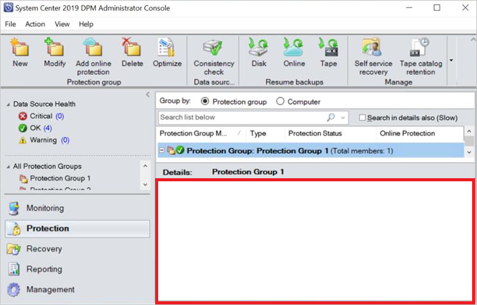
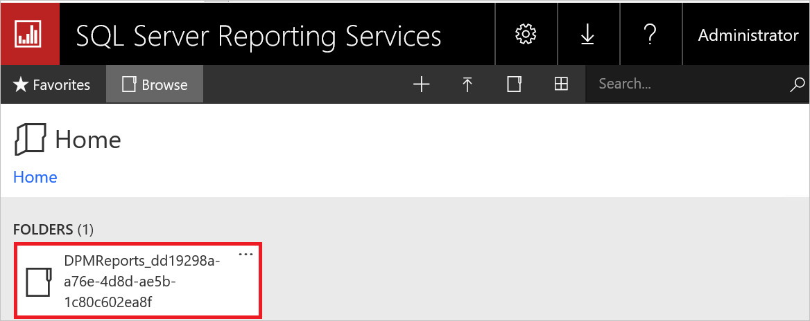
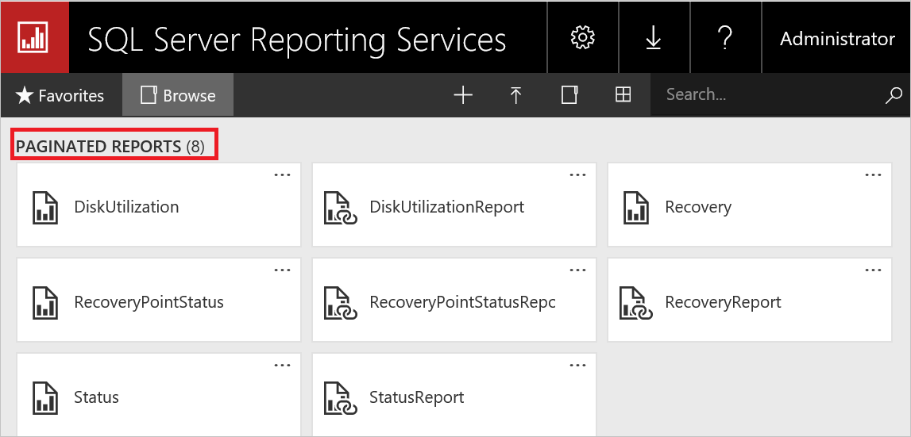
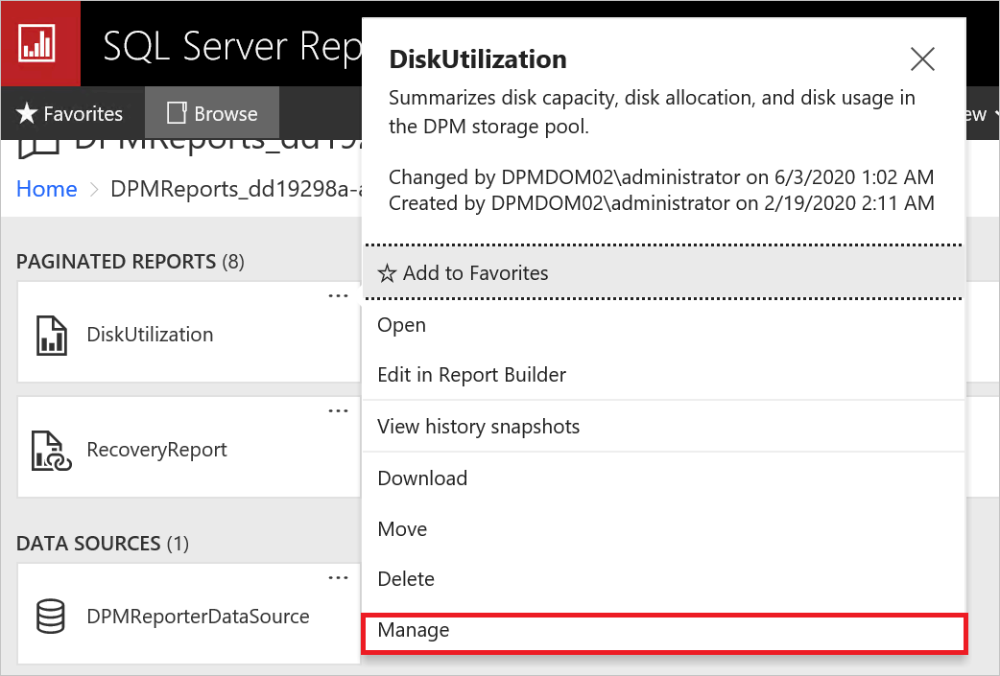
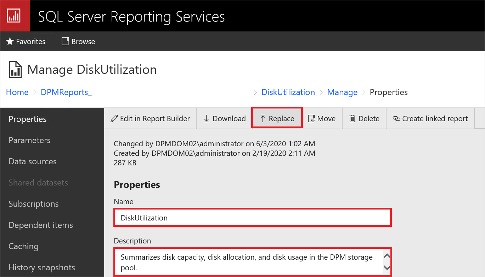

---
ms.assetid:
title: Release Notes for System Center DPM
description: Release notes about the DPM 2016, 2019, 2022 and 2025 releases.
author: Jeronika-MS
ms.author: v-gajeronika
ms.date: 11/13/2025
ms.update-cycle: 180-days
ms.service: system-center
ms.subservice: data-protection-manager
ms.topic: release-notes
ms.custom:
  - UpdateFrequency.5
  - engagement-fy23
  - engagement-fy24
  - sfi-image-nochange
  - sfi-ropc-nochange
---

# System Center DPM Release Notes

::: moniker range="sc-dpm-2025"

[!INCLUDE [discontinue-spf-2025.md](../includes/discontinue-spf-2025.md)]

This article lists the release notes for System Center 2025 - Data Protection Manager (DPM), including the known issues and workarounds for DPM 2025.

We recommend you to see the following articles for detailed information about what DPM supports and can back up:

- [What can DPM back up](dpm-protection-matrix.md)
- [What DPM supports](dpm-support-issues.md)

## DPM 2025 release notes

### Communication with the SQL instance might fail

**Description**: Communication with the SQL instances (existing SQL, SharePoint backups or SQL instance enumeration) might fail post upgrading to DPM 2025 if OLEDB 19 isn't installed.

**Workaround**: Install latest version of [OLEDB 19](/sql/connect/oledb/download-oledb-driver-for-sql-server?view=sql-server-ver16&preserve-view=true) (19.3 and above) on all the machines where SQL instances are present and are being backed-up by the DPM server. Also, install on DPM server before enabling backups for DPM database.

In addition, following are the improvements:

- Upgrading a licensed DPM server to Eval build is blocked.
- Upgrading Eval to a licensed build is blocked.
- Improved/fixed duplicate summary manager jobs post upgrade.

::: moniker-end

::: moniker range="sc-dpm-2019"

This article lists the release notes for System Center 2019 - Data Protection Manager (DPM), including the known issues and workarounds for DPM [2019](#dpm-2019-release-notes), DPM [2019 UR1](#dpm-2019-ur1-release-notes), DPM [2019 UR2](#dpm-2019-ur2-release-notes), DPM [2019 UR3](#dpm-2019-ur3-release-notes), DPM [2019 UR4](#dpm-2019-ur4-release-notes), [2019 UR5](#dpm-2019-ur5-release-notes), and [2019 UR6](#dpm-2019-ur6-release-notes) as applicable.

We recommend you see the following articles for detailed information about what DPM supports and can back up:

- [What can DPM back up](dpm-protection-matrix.md)
- [What DPM supports](dpm-support-issues.md)

::: moniker-end

::: moniker range="sc-dpm-2022"

This article lists the release notes for System Center 2022 - Data Protection Manager (DPM), including the known issues and workarounds for DPM [2022](#dpm-2022-release-notes), [2022 UR1](#dpm-2022-ur1-release-notes) and [2022 UR2](#dpm-2022-ur2-release-notes).

This article also includes the [release notes for DPM 2022 Hotfix KB 5015376](#dpm-2022-hotfix-kb-5015376-release-notes).

We recommend you to see the following articles for detailed information about what DPM supports and can back up:

- [What can DPM backup](dpm-protection-matrix.md)
- [What DPM supports](dpm-support-issues.md)

## DPM 2022 release notes

DPM 2022 has the known issues that are observed in DPM [2019 RTM](/system-center/dpm/dpm-release-notes?view=sc-dpm-2019#&preserve-view=truedpm-2019-release-notes).

In addition, the following known issues are observed.

### No DPM SQL Self-Service Recovery Tool in DPM 2022 RTM

DPM SQL Self-Service Recovery isn't available in DPM 2022 RTM. Support for SQL Self-Service Recovery is available from DPM 2022 UR1. [Learn More](/system-center/dpm/what-s-new-in-dpm?view=sc-dpm-2022&preserve-view=true#sql-self-service-recovery-tool).

### DPM self-service recoveries doesn't list any recovery points for client machines

**Description**: DPM client machine backups aren't listed for domain users in the local administrators’ group for self-service recoveries.

**Workaround**: Upgrade to DPM 2022 UR2 to fix this issue and add non-administrative users manually via Authorization Manager.

### Upgrade from DPM 2019 to DPM 2022 might fail when the DPM database name is **DPMDB**

**Description**: If the name of the existing DPM database is **DPMDB**, the upgrade will fail.  

The DPM upgrade process will always rename the DPM database name to **DPMDB**. If the same SQL Instance is used by multiple DPM servers, the subsequent upgrade of the other DPM server will fail as there's already a database with the name DPMDB.

**Workaround**: Rename the corresponding DPM database before you start the upgrade.

Use these steps to rename the database:

1. Stop the DPM service on the DPM server.  
2. Run the following SQL commands to rename the database; update the DPM server name in the query below.

   ```sql  
   USE master
   GO
   ALTER DATABASE DPMDB  
   SET SINGLE_USER  
   WITH ROLLBACK IMMEDIATE
   GO
   EXEC master..sp_renamedb 'DPMDB','DPMDB_<DPMSERVERNAME>'
   GO
   ALTER DATABASE DPMDB_<DPMSERVERNAME>
   SET MULTI_USER  
   GO
   ```

3. Update the following registry keys to reflect the updated database name.

   *Computer\HKEY_LOCAL_MACHINE\SOFTWARE\Microsoft\Microsoft Data Protection Manager\DB\ConnectionString*

   *Computer\HKEY_LOCAL_MACHINE\SOFTWARE\Microsoft\Microsoft Data Protection Manager\DB\DatabaseName*

   *Computer\HKEY_LOCAL_MACHINE\SOFTWARE\Microsoft\Microsoft Data Protection Manager\DB\GlobalDatabaseName*

   *Computer\HKEY_LOCAL_MACHINE\SOFTWARE\Microsoft\Microsoft Data Protection Manager\DB\GlobalDbConnectionString*

   :::image type="registry editor" source="media/release-notes/registry-editor.png" alt-text="Screenshot showing registry editor that reflects the database name.":::

4. Run DPMsync on the DPM server using the DPM management shell.  

   ```
   DPMSync -Sync
   ```

### Online recovery point creation of a data source might fail with error ID 33505 or 100195

**Description**: In some scenarios, the online recovery point creation of a data source might fail intermittently with error ID 33505 or 100195.

:::image type="error" source="media/release-notes/error.png" alt-text="Screenshot showing error when creating online recovery point.":::

:::image type="error message" source="media/release-notes/error1.png" alt-text="Screenshot showing error message when creating online recovery point.":::

**Workaround**:  

1. Upgrade the [MARS agent](https://aka.ms/azurebackup_agent) to the latest version.  

2. Retry the online backup for the failed data source.  

3. Create a new disk recovery point and then try the online recovery point again.

4. Run the consistency check and try the online backup again.  

5. If the online backup is still failing, contact the support team.

## DPM 2022 Hotfix (KB 5015376) release notes

In addition to the issues listed in DPM 2022 release notes, the following additional issues are identified in DPM 2022 and are fixed in Hotfix (KB 5015376); we recommend you apply the hotfix. For more information, see the [KB article](https://support.microsoft.com/topic/intermittent-online-backup-failures-and-other-issues-in-data-protection-manager-2022-30df8903-f779-41c5-9b66-13a4b8461d0e).

 - Intermittent online backup failures with error 100195.
 - Secondary protection consistency check failure with VSS non-transient error.
 - Remote admin console crash right after opening the console.
 - Backup failures due to DpmFilter.sys not loading on DPM agent.
 - DPM crashes when tape backup failure alerts are inactive.

## DPM 2022 UR1 release notes

The following issues were identified after the release of DPM 2022 UR1 (KB 5019645) and are fixed in Hotfix for DPM 2022 UR1 (KB 5026073); We recommend that you apply the hotfix if you are running into the following issues. For more information, see the [KB article](https://support.microsoft.com/help/5026073) for the Hotfix.

### Backups for VMware VMs that have VMware Tools start failing with error "Disk SubSystem 0x80990EF1"

**Description**: DPM 2022 UR1 had a bug where backups VMware VMs would fail if VMware tools is installed. This was due to a faulty configuration in DPM.

**Workaround**: Apply Hotfix for DPM 2022 UR1 or DPM 2022 UR2.

### DPM 2022 RTM and Update Rollup 1 can't discover databases in SQL Server 2017 and 2016 over TLS 1.2.

**Description**: DPM 2022 RTM and UR1 didn't support MSOLEDB 18 for SQL Server 2017 and 2016 which is required to perform discovery and protection of SQL Server over TLS 1.2. This issue is observed after [KB5021128](https://support.microsoft.com/topic/kb5021128-description-of-the-security-update-for-sql-server-2016-sp3-azure-connect-feature-pack-february-14-2023-89e54794-460a-41bd-981f-998290e7d46e) or [KB5021127](https://support.microsoft.com/help/5021127) is installed for SQL Server 2016 and 2017 respectively to mandate TLS 1.2 or when TLS 1.0 and 1.1 are disabled on the protected server.

**Workaround**: Apply Hotfix for DPM 2022 UR1 or DPM 2022 UR2, update the DPM Agents and then install [MSOLEDB 18](https://www.microsoft.com/en-us/download/details.aspx?id=56730) on the protected SQL Servers.

## DPM 2022 UR2 release notes

We're recalling the release of Update Rollup 2 for System Center DPM 2022 due to the known issues listed below:

1. Hyper-V scheduled backups take a long time to complete because each backup job triggers a consistency check.
     Error message: *The replica of Microsoft Hyper-V RCT on \<Machine Name\> is not consistent with the protected data source. DPM has detected changes in file locations or volume configurations of protected objects since the data source was configured for protection. (ID 30135).*
2. Removing a data source from protection group or stopping backup, results in an error with ID 33469 - This operation is not supported on the current version of the MARS agent.
3. DPM console occasionally crashes when SMTP alerts or reports are configured.

An updated build (Update Rollup 2 Refresh for System Center DPM 2022) fixing the known issues has been released.

If you had installed Update Rollup 2 for System Center DPM 2022 (10.22.189.0), We recommend you to install Update Rollup 2 Refresh (10.22.197.0) on your DPM server and update the protection agents.  

Reach out to Microsoft Support for queries or additional information.

In addition to the issues documented above, DPM 2022 UR2 has the following issues:

### DPM 2022 UR1 email reports with Microsoft 365 credentials fail after upgrading to DPM 2022 UR2

**Description**: DPM 2022 UR2 adds support for Windows and Basic SMTP authentication methods. Basic SMTP authentication will work for Microsoft 365 and other mail providers who support it. But if you are using DPM 2022 UR1 with Microsoft 365 credentials, your email reports and alerts will start failing since the credentials can’t be read by DPM 2022 UR2.

**Workaround**: Re-configure email credentials for Microsoft 365 using the basic authentication type added in DPM 2022 UR2.

### DPM can’t enumerate SQL databases for protection 

**Description**: DPM can’t enumerate SQL databases for protection when MSOLEDB 18 is missing on the protected server since DPM requires MSOLEDB18 to enumerate databases for protection.  

**Workaround**: Install SQL [MSOLEDB 18](/sql/connect/oledb/release-notes-for-oledb-driver-for-sql-server?view=sql-server-ver16&viewFallbackFrom=sql-server-2016%22%20%5Cl%20%221867&preserve-view=true) driver if it is missing on the protected server. SQL Server 2022 ships with MSOLEDB 18 by default.  

### Stop protection with delete online data fails from remote management console

**Description**: The stop protection with delete online data operation fails from the remote management console when enhanced Hybrid security option is enabled on the vault.  

**Workaround**: To prevent this, perform stop protection with delete online data directly from the DPM console.  

### Stopping protection of a data source from fails with ID: 33469

**Description**: Removing a data source from protection group or stopping backup results in an error with ID 33469 - *This operation is not supported on the current version of the MARS agent*.

This issue occurs because DPM erroneously checks for an installed version of MARS (Microsoft Azure Recovery Services) agent 2.0.9262.0 or later and fails when no MARS agent is available on the DPM server.

**Workaround**: Install Update Rollup 2 Refresh for System Center DPM 2022.

## DPM 2022 UR2 Refresh release notes

DPM 2022 UR2 Refresh fixes the known issues in DPM 2022 UR2.

::: moniker-end

::: moniker range="sc-dpm-2016"

This article lists the release notes for System Center 2016 - Data Protection Manager (DPM).

::: moniker-end

::: moniker range="sc-dpm-2019"

## DPM 2019 release notes

The following sections summarize the release notes for DPM 2019 and include the applicable known issues and workarounds.

### DPM console crashes due to MSDPM Service crash

**Description**: The presence of duplicate summary management jobs, after DPM upgrade, might lead to failure of any in-progress jobs at zero hours, eventually leading to a crash. As a result, you might observe the following:

- Replica is inconsistent.
- Storage bloat caused due to non-deletions of recovery points.
- Outdated DPM reports.
- No clean-up for job history and garbage collection jobs.

**Workaround**:
1. Back up the current DPM database.
2. Open SQL Management Studio and connect to the SQL Instance hosting the DPMDB for this server.
3. Run the following query and check if you've two or more summary manager jobs scheduled and see which the older schedule was:
   ```
    SELECT SCH.ScheduleId, SCH.JobDefinitionId, jd.CreationTime
    FROM tbl_JM_JobDefinition JD
    JOIN tbl_SCH_ScheduleDefinition SCH
    ON JD.JobDefinitionId = SCH.JobDefinitionId
    WHERE JD.Type = '282faac6-e3cb-4015-8c6d-4276fcca11d4'        
    AND JD.IsDeleted = 0
    AND SCH.IsDeleted = 0
    ```
4. If you've more than one row returned, take the resulting ScheduleID and JobDefinitionID of the older entry and mark them as deleted.
   ```
    update tbl_SCH_ScheduleDefinition
    set IsDeleted = 1
    where ScheduleId = ‘ScheduleID '               --- Replace with Your ScheduleID
    update dbo.tbl_JM_JobDefinition
    set IsDeleted = 1
    where JobDefinitionId = ‘JobDefinitionID'             --- Replace with Your JobDefinitionID
   ```
5. Delete the SQL job that is matching the ScheduleID under the SQL Server Agent – JOBS. Once deleted, the crash at zero hours would be resolved.

   ScheduleId is the SQL Jobs under SQL agent:
   ```
   UPDATE MSDB.dbo.sysjobs
   SET Enabled = 0
   WHERE [Name] LIKE ‘ScheduleID’  --- Replace with Your ScheduleID  
   ```

### Hyper-V VMs are protected twice on VM upgrade

**Description**: When upgrading a Hyper-V VM from Windows Server 2012 R2 to Windows Server 2016, two versions of the VM appear in the Create Protection Group wizard.

**Workaround**: For protected VMs that are about to be upgraded, ensure that you stop protection with retain data before upgrading the VM. Then upgrade the VM and reprotect it in a new protection group. While configuring reprotection, do a refresh on the VM host for DPM to detect the VM upgrade and protect it as RCT VM.

### Restoration of a previous version for an upgraded Hyper-V VM causes future recovery points to fail

**Description**: When you upgrade a protected 2012 R2 Hyper-V VM to the 2016 version, stop protecting the VM (but retain data) and then re-enable protection. If you then recover a 2012 R2 copy at the original location, further backups might fail.

**Workaround**: After recovery, change the VM version to 2016 and then run a consistency check.

### Bare Metal Recovery protection failures

**Description**: If you configure Bare Metal Recovery (BMR) protection, the BMR protection job might fail with the message that the replica size isn't sufficiently large.

**Workaround**: Use the following registry path to change the default replica size for BMR data sources. Open the registry editor and increase the replica size for the following key:

**HKLM\Software\Microsoft\Microsoft Data Protection Manager\ConfigurationReplicaSizeInGBForSystemProtectionWithBMR (DWORD)**

### DPM database protection stops in case of upgrade scenarios

**Description**: When you upgrade DPM, database name might change in some scenarios.

**Workaround**: If you're protecting a DPM database, ensure that you enable the protection for the new DPM database. Once the DPM upgrade is validated, you can remove protection for the previous DPM database.

### Hyper-V RCT - recover as files for D-T backup fails

**Description**: Recovery of Hyper-V RCT VMs as files created directly on tape (D-T) fails. D-D-T backups do not exhibit this issue.

**Workaround**: Use Alternate Location Recovery as a VM, and then transfer those files to the desired location.

>[!NOTE]
> This feature is fixed in DPM 2019 UR1. You can install UR1 to get this issue fixed. For detailed information about installing UR1, [see the KB article for UR1](https://support.microsoft.com/help/4533416/update-rollup-1-for-system-center-2019-data-protection-manager).

### DPM 2019 does not support file server end user recovery with Modern Backup Storage (MBS)

**Description**: DPM 2019 doesn't support end user recovery (EUR) with Modern Backup Storage (MBS).

**Workaround**: None. File Server EUR isn't supported when using MBS.

### Recovery Points not being pruned, leading to an accumulation of Recovery Points

**Description:** DPM prunes recovery points older than the retention range. During the pruning process, DPM calculates the storage consumed by those recovery points to be pruned. Storage calculation delays pruning.

**Workaround:** Configure DPM to skip calculating the size of recovery points to be pruned. As a result, the pruning script runs faster and prunes all recovery points older than the retention range, relieving any storage pressures. The storage consumed per data source isn't updated until DPM finishes pruning. The storage consumption per volume continues to reflect the correct values.
Use a PowerShell script to turn on size calculation. The following script runs complete size calculations.

**Location:** Program Files\Microsoft System Center\DPM\DPM\bin\Manage-DPMDSStorageSizeUpdate.ps1

**Script:** ```Manage-DPMDSStorageSizeUpdate.ps1 -ManageStorageInfo [StopSizeAutoUpdate | StartSizeAutoUpdate | GetSizeAutoUpdateStatus | UpdateSizeInfo ] [-UpdateSizeForDS <FilePath>] [-UpdatedDSSizeReport <FilePath>] [-FailedDSSizeUpdateFile <FilePath>]```

- **ManageStorageInfo:** Specifies the kind of operation needed.

    - ***StopSizeAutoUpdate:*** Stops the size calculations completely. Both UI and PowerShell won't report sizes.

    - ***StartSizeAutoUpdate:*** Resumes the size calculations. Immediately after enabling size calculations, use ```UpdateSizeInfo``` (in the following options) to recalculate sizes for all the data sources, until which sizes reported in PowerShell and UI might not be correct.

    - ***GetSizeAutoUpdateStatus:*** Tells whether size calculations are enabled or disabled.

    - ***UpdateSizeInfo:*** Triggers the size calculation and reports the size consumed by the data source. As this can be a long-running operation, use it only when needed, for scenarios such as billing. During this time, backups might fail with vhd mount errors.

- **UpdateSizeForDS:** Path to a text file with a list of Datasource IDs for which size needs to be calculated with a datasourceID on each line. When not passed, size calculation is triggered for all the data sources.
    Use after using ```UpdateSizeInfo``` in ```ManageStorageInfo```.
    To get the Datasource IDs of specific data sources, use ``` Get-DPMProtectionGroup | Get-DPMDatasource | Format-table -Property Computer,name,ObjectType,Id```.

- **UpdatedDSSizeReport:** Path to a file that stores the updated data source sizes. When not passed, sizes.csv file is created in the execution directory.
    Use after ```UpdateSizeInfo``` in ```ManageStorageInfo```.

- ***FailedDSSizeUpdateFile:*** Path to a file to store the Datasource IDs for the data sources for which the storage consumption couldn’t be calculated. This might happen due to reasons such as ongoing backups. When not passed, failedDS.txt file is created in the execution directory. This file can be given as input to “UpdateSizeForDS” to update the sizes of all the data sources.
    This should be used after using ```UpdateSizeInfo``` in ```ManageStorageInfo```.

### DPM Datasources not being reflected on Recovery Services Vault

**Description**: Some data sources in the *Backup items (DPM)* view from recovery service vault in Azure portal aren't getting refreshed/updated.

**Cause**: You might have decommissioned a protected server and stopped protection of the data sources but chosen to maintain the online recovery points and then you uninstalled the DPM/MABS agent from the console.

You can verify if this is the cause by opening the GatewayProvider0Curr.errlog file in *C:\ProgramFiles\Microsoft Azure Backup Server\DPM\MARS\Temp* folder in notepad and search for the word **Mis-Match**.

If you find an entry as the following, it will detail the protected server that is mis-matched.

In the example below, the agent for the server called *mjlc-dc.Contoso.com* was uninstalled and missing from the DPM/MABS server.

```
GetData of Provider failed. |Backup Service Exception: FMException: [ErrorCode:GPPowershellScriptHrError, DetailedCode:-2146233079, Source:   at System.Management.Automation.MshCommandRuntime.ThrowTerminatingError(ErrorRecord errorRecord), Message:Production Server **mis-match** DSId :9adaec12-5b5a-455e-86b9-1fac2d605fe1 DSName : S:\ DSType : Volume PSName :**mjlc-dc.Contoso.com** PSId: a494f940-b480-41d2-9ef5-4194ad737c7b]
```

**Workaround**

1. If the original protected server is still available, reinstall the DPM agent even if you plan on taking that server offline in the future. You can disable the agent in DPM/MABS; don’t remove it until you delete the online recovery points.
1. If the online recovery points for the decommissioned server are no longer needed, then you can delete the data sources on the DPM/MABS server that are in stopped protection.

## DPM 2019 UR1 release notes

### VM restore with excluded disk (to alternate host) restores empty disk

**Description**: Restoring the VM with excluded disk to alternate host will restore the excluded disk as empty disk. The excluded disk won't be attached to the VM. The disk can be deleted to save the storage space.

**Workaround**: None

For issues fixed in DPM 2019 UR1, [see the KB article](https://support.microsoft.com/help/4533416/update-rollup-1-for-system-center-2019-data-protection-manager).

## DPM 2019 UR2 release notes

The following sections detail the known issues and workarounds for DPM 2019 UR2.

For issues fixed in DPM 2019 UR2, [see the KB article](https://support.microsoft.com/help/4563392/update-rollup-2-for-system-center-2019-data-protection-manager).

### Protection group details are not displayed in DPM console

**Description**: After installing DPM 2019 UR2, sometimes, DPM console might not display Protection Group details in the **Details** pane.



**Workaround**: Use *Get-DPMProtectionGroup* PowerShell command to view the Protection Group details.

>[!NOTE]
> This issue is fixed in DPM 2019 UR3. For more information about the issues fixed in UR3, see the [KB article](https://support.microsoft.com/topic/fa5eb310-1886-43fb-be5d-c7829bfaf63d).  

### Latest report files are not automatically updated

**Description**: With DPM 2019 UR2, issue with DPM report formatting and volume-to-volume migration reporting is fixed. However, the existing  report files aren't automatically replaced with the updated files.

**Workaround**:
Follow these steps to replace the existing report files:

#### Replace the ReportSRV10.dll

1. Stop the SQL Server Reporting service.
2. Select the updated *ReportSRV10.dll* file present in *C:\Program Files\Microsoft System Center\DPM\DPM\bin* and replace the existing DLL  files in the following folders:
    - For SQL Server 2017 and later -  C:\Program Files\Microsoft SQL Server Reporting Services\SSRS\ReportServer\bin
    - For SQL Server 2016 -  C:\Program Files\Microsoft SQL Server\MSRS13.MSDPM2012\Reporting Services\ReportServer\bin
3. Start the SQL Server Reporting service.

#### Replace the RDL files

1. On DPM, open the SQL Reporting Services portal URL.
2. On the portal, the DPMReports folder is present in the format  **DPMReports_\<GUID>**.

    

     >[!NOTE]
     > You can see only one folder with this naming convention. If DPM is upgraded from a previous version, the previous folder might still exist but you can’t open it.

3. Select and open the **DPMReports_\<GUID>** folder. The individual report files are displayed.

    

4. Select the report files that don't end with *Report*, right-click **Option**, and then select **Manage**.

    

5. On the new page, select **Replace** to replace with the latest report files.

    

    The latest report files are available in the DPM installation path:

    For example: C:\Program Files\Microsoft System Center\DPM\DPM\bin\DpmReports

6. After the files are replaced, ensure that the **Name** and **Description** are intact and aren't empty.

7. Restart DPM and use the report files.

## DPM 2019 UR3 release notes

The following section provides details of the known issue in DPM 2019 UR3 and the workaround.

### DPM Remote console might fail to connect to DPM server, after upgrading to Update Rollup 3

**Description**: After upgrading DPM Remote Administration Console to Update Rollup 3, it might fail to connect to DPM server with an error **The DPM Administrator Console version is incompatible with the DPM server version**.

**Workaround**:

1. On the server running the DPM Remote Administration console, run the following PowerShell command (enter the DPM server name as applicable); this command copies the required DLL files from the DPM server:

   ```PowerShell
   $RemoteUIPath = "C:\Program Files\Microsoft Data Protection Manager\DPM2019\bin"
   $RemoteUidlls = Get-Item "$RemoteUIPath\*" | ? {$_.name -match ".dll"}
   Write-Host -MessageData "Copying required $($RemoteUidlls.count) DLL's for Remote UI"
   foreach ($dll in $RemoteUidlls) {
   Copy-Item -Path "\\<FQDN of the DPM Server>\c$\Program Files\Microsoft System Center\DPM\DPM\bin\$($dll.name)" -Destination $RemoteUIPath
   }
   $RemoteUIUR3Dlls = "Microsoft.ApplicationInsights.dll",
   "Microsoft.Diagnostics.Tracing.EventSource.dll",
   "Microsoft.SystemCenter.DPM.Instrumentation.dll",
   "Microsoft.SystemCenter.DPM.InstrumentationScheduler.dll",
   "Microsoft.SystemCenter.Instrumentation.dll",
   "Microsoft.WindowsAzure.Storage.dll",
   "Newtonsoft.Json.dll"
   foreach ($dll in $RemoteUIUR3Dlls) {
   $SourceDllPath = "\\<FQDN of the DPM Server>\c$\Program Files\Microsoft System Center\DPM\DPM\bin\" + $dll
   Copy-Item -Path $SourceDllPath -Destination $RemoteUIPath
   }
   Write-Host -MessageData "All required DLL files for DPM Remote UI UR3 has been copied"
   ```

   > [!NOTE]
   > If you're using DPM Remote UI on a SCOM machine then copy for below files might fail, this can be ignored.
   > - *SCOMHelperLibrary.dll*
   > - *ScopingCommonHelper.dll*
   > - *ViewAlertsAndAffectedItemsHelper.dll*
   > - *Wpfhelpers.dll*

2. If you're using a language other than English, copy the respective language folder from the DPM server. Update the DPM server name and language folder in the following command, and then run the command.

   ```PowerShell
   Copy-Item -Path \\<FQDN of the DPM_Server>\c$\Program Files\Microsoft System Center\DPM\DPM\bin\<Language folder>\*.dll -Destination C:\Program Files\Microsoft Data Protection Manager\DPM2019\bin\<Language folder>  
   ```

   >[!NOTE]
   > This command uses the default installation path for DPM. If you've changed the installation path, update the path accordingly.

## DPM 2019 UR4 release notes

The following section provides details of the known issue in DPM 2019 UR4 and the workaround.

### Remote UI and Central Console UR4 update installation

**Description**: Remote UI and Central Console must be installed on RTM, UR1, UR2.  

**Workaround**: If Remote UI and Central Console are on UR3, you need to uninstall it, install RTM version and then upgrade to UR4. Only UR4 remote UI can connect to DPM 2019 UR4.

## DPM 2019 UR5 release notes

Currently there are no known issues in DPM 2019 UR5.

## DPM 2019 UR6 release notes

The following section provides details of the known issue in DPM 2019 UR6 and the workaround.

For the issues fixed in UR6 and the installation instructions for UR6, see the [KB article](https://support.microsoft.com/help/5035307).

### Offline Seeding does not work with MARS agent 2.0.9254.0 and later

**Description**: Subsequent online recovery points creation fails after the first online recovery point is successfully created for data sources backed up through Databox only, when the MARS agent version is greater than 2.0.9254.0.

**Workaround**: None. Contact Microsoft support for assistance.

::: moniker-end

::: moniker range="sc-dpm-2016"

## System Center DPM 2016 Release Notes

The following sections summarize the release notes for DPM 2016 and include the applicable known issues and workarounds.

### Silent Installation of System Center DPM with SQL Server 2008

**Description**: DPM 2016 RTM won't silently install on SQL Server 2008.

**Workaround**: Deploy DPM 2016 RTM on a version of SQL Server higher than 2008 or use the DPM 2016 Setup user interface.

### Remove-DPMDiskStorage cmdlet might delete volumes with active or inactive backups

**Description**: If the volume's data sources are being backed up (actively or inactively), when the [Remove-DPMDiskStorage](/powershell/systemcenter/systemcenter2016/dataprotectionmanager/vlatest/Remove-DPMDiskStorage) cmdlet is used to remove volumes from DPM, the data sources can be removed too.

**Workaround**: Before using the cmdlet to remove the volumes, ensure that the volume's data sources aren't in use (actively or inactively).

### DPM 2016 on Windows Server 2016 hangs

**Description**: Memory consumption on the DPM Server increases continuously until it reaches 90%. Memory consumption slows the DPM server.

**Workaround**: Upgrade DPM to DPM UR2 and install [KB4013429](https://support.microsoft.com/help/4013429/windows-10-update-kb4013429) to fix this issue.

### Hyper-V VMs are protected twice on VM upgrade

**Description**: When upgrading a Hyper-V VM from Windows Server 2012 R2 to Windows Server 2016, two versions of the VM appear in the Create Protection Group Wizard.

**Workaround**: For the VMs that haven't been upgraded, stop protection with Retain Data. Upgrade the VM and create a new protection group. Then refresh the data sources and protect the VMs. When you reapply protection, the VMs are protected using Resilient Change Tracking (RCT).

### Agent installation fails on Windows Server 2008, Windows Server 2008 R2

**Description**: When protecting Windows Server 2008 or Windows Server 2008 R2, installing the agent can fail.

**Workaround**: Upgrade the Windows Management Framework (WMF) on the production server to 4.0. Download the WMF from Windows Management Frame 5.1(https://www.microsoft.com/download/details.aspx?id=54616). Install WMF and then install the agent.

### Restoring a previous version of an upgraded Hyper-V VM causes future recovery points to fail.

**Description**: If you upgrade a protected 2012 R2 Hyper-V VM to the 2016 version, then stop protecting the VM (but retain data) and then re-enable protection. If you then recover a 2012 R2 copy at the original location, further backups might fail.

**Workaround**: After recovery, change the VM Version to 2016 and then run a Consistency Check.

### Bare Metal Recovery protection failures

**Description**: If you configure Bare Metal Recovery (BMR) protection, the BMR protection job might fail with the message that the replica size isn't sufficiently large.

**Workaround**: Use the following registry path to change the default replica size for BMR data sources. Open the registry editor and increase the replica size for the following key:

**HKLM\Software\Microsoft\Microsoft Data Protection Manager\ConfigurationReplicaSizeInGBForSystemProtectionWithBMR (DWORD)**

### Reprotecting the DPM database after upgrading to DPM 2016

**Description**: When you upgrade from System Center DPM 2012 R2 to System Center Data Protection Manager 2016, the DPM database name can change in some scenarios.

**Workaround**: If you're protecting a DPM database, be sure to enable protection for the new DPM database. Once the DPM upgrade is validated, you can remove protection for the old DPM database.

### Recovery Points not being pruned, leading to an accumulation of Recovery Points

**Description:** DPM prunes recovery points older than the retention range. During the pruning process, DPM calculates the storage consumed by those recovery points to be pruned. Storage calculation delays pruning.

**Workaround:** Configure DPM to skip calculating the size of recovery points to be pruned. As a result, the pruning script runs faster and prunes all recovery points older than the retention range, relieving any storage pressures. The storage consumed per data source isn't updated until DPM finishes pruning. The storage consumption per volume continues to reflect the correct values.
Use a PowerShell script to turn on size calculation. The following script runs complete size calculations.

**Location:** Program Files\Microsoft System Center 2016\DPM\DPM\bin\Manage-DPMDSStorageSizeUpdate.ps1

**Script:** ```Manage-DPMDSStorageSizeUpdate.ps1 -ManageStorageInfo [StopSizeAutoUpdate | StartSizeAutoUpdate | GetSizeAutoUpdateStatus | UpdateSizeInfo ] [-UpdateSizeForDS <FilePath>] [-UpdatedDSSizeReport <FilePath>] [-FailedDSSizeUpdateFile <FilePath>]```

- **ManageStorageInfo:** - Specifies the kind of operation needed.

    - ***StopSizeAutoUpdate:*** Stops the size calculations completely. Both UI and PowerShell won't report sizes.

    - ***StartSizeAutoUpdate:*** Resumes the size calculations. Immediately after enabling size calculations, use ```UpdateSizeInfo``` (in the following options) to recalculate sizes for all the data sources, until which sizes reported in PowerShell and UI might not be correct.

    - ***GetSizeAutoUpdateStatus:*** Tells whether size calculations are enabled or disabled.

    - ***UpdateSizeInfo:*** Triggers the size calculation and reports the size consumed by data source. As this can be a long-running operation, use it only when needed, for scenarios such as billing. During this time, backups might fail with vhd mount errors.

- **UpdateSizeForDS:** Path to a text file with a list of Datasource IDs for which size needs to be calculated with a datasourceID on each line. When not passed, size calculation is triggered for all the data sources.
    Use after using ```UpdateSizeInfo``` in ```ManageStorageInfo```.
    To get the Datasource IDs of specific data sources, use ``` Get-DPMProtectionGroup | Get-DPMDatasource | Format-table -Property Computer,name,ObjectType,Id```.

- **UpdatedDSSizeReport:** Path to a file that stores the updated data source sizes. When not passed, sizes.csv file is created in the execution directory.
    Use after ```UpdateSizeInfo``` in ```ManageStorageInfo```.

- ***FailedDSSizeUpdateFile:*** Path to a file to store the Datasource IDs for the data sources for which the storage consumption couldn’t be calculated. This might happen due to reasons such as ongoing backups. When not passed, failedDS.txt file is created in the execution directory. This file can be given as input to “UpdateSizeForDS” to update the sizes of all the data sources.
    This should be used after using ```UpdateSizeInfo``` in ```ManageStorageInfo```.

### Hyper-V RCT - recover as files for D-T backup fails

**Description**: Recovery of Hyper-V RCT VMs as files created directly on tape (D-T) fails. D-D-T backups won't exhibit this issue.

**Workaround**: Use Alternate Location Recovery as a VM, and then transfer those files to the desired location.

### File Server end user recovery (EUR) not available when using Modern Backup Storage (MBS)

**Description**: If you use Modern Backup Storage (MBS) with DPM 2016, File Server end user recovery (EUR) isn't available.

**Workaround**: None. File Server EUR isn't supported when using MBS.

### Error 4387 might appear while installing DPM

**Description**: While installing the Data Protection Manager, when you enter a SQL Instance in the **Data Protection Manager Setup** > **Prerequisites check**> **Instance of SQL server** text box, error 4387 might appear.

**Workaround**: Perform the required actions as detailed in this [KB article](https://support.microsoft.com/en-in/help/956013/error-message-when-you-open-sql-server-configuration-manager-in-sql-se) and try the  DPM setup again.

### Latest report files are not automatically updated

**Description**: With DPM 2016 UR10, issue with DPM report formatting and volume to volume migration reporting is fixed. However, the existing  report files aren't automatically replaced with the updated files.

**Workaround**:
Follow these steps to replace the existing report files:

#### Replace the ReportSRV10.dll

1. Stop the SQL Server Reporting service
2. Select the updated *ReportSRV10.dll* file present in *C:\Program Files\Microsoft System Center\DPM\DPM\bin* and replace the existing DLL files in the following folder:

    *C:\Program Files\Microsoft SQL Server\MSRS13.MSDPM2012\Reporting Services\ReportServer\bin*

3. Start the SQL Server Reporting service.

#### Replace the RDL files

1. On DPM, open the SQL Reporting Services portal URL.
2. On the portal, the DPMReports folder is present in the format  **DPMReports_\<GUID>**.

    

     >[!NOTE]
     > You can see only one folder with this naming convention. If DPM is upgraded from a previous version, the previous folder might still exist but you can’t open it.

3. Select and open the **DPMReports_\<GUID>** folder. The individual report files are displayed.

    

4. Select the report files that don't end with *Report*, right-click **Option**, and then select **Manage**.

    

5. On the new page, select **Replace** to replace with the latest report files.

    

    The latest report files are available in the DPM installation path:

    For example: C:\Program Files\Microsoft System Center\DPM\DPM\bin\DpmReports

6. After the files are replaced, ensure that the **Name** and **Description** are intact and aren't empty.

7. Restart DPM and use the report files.

::: moniker-end

## Next steps

- To know the new features included, see [What's new](what-s-new-in-dpm.md).
- To install DPM, see the article, [Install DPM](install-dpm.md).
- If you would like to consult planning information for your environment, see [Preparing your environment for System Center Data Protection Manager](prepare-environment-for-dpm.md).
- See these KBs for ReFS specific issues - [KB4016173](https://support.microsoft.com/en-us/help/4016173/fix-heavy-memory-usage-in-refs-on-windows-server-2016-and-windows-10), [KB4035951](https://support.microsoft.com/en-us/help/4035951/refs-volume-using-dpm-becomes-unresponsive-on-windows-server-2016).
