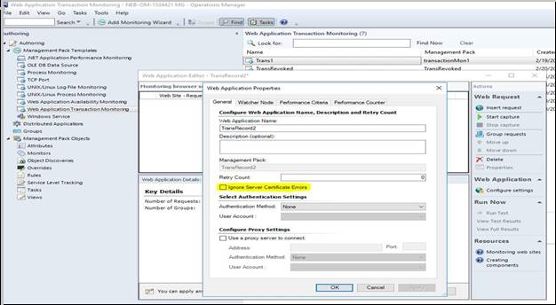

# How to Edit settings or requests in a Web application

You can use the Web Application Editor to manually create or edit a request in a Web Application Transaction Monitoring template. For editing a particular request, there is no difference whether the request was created manually or by capturing a browser session. For detailed information about the properties that you can set for the request, see Web Application Request Properties.

##Edit the settings in  Web Application Editor
Follow these steps:

1. Start the operations console with an account that has Author credentials in the management group.

2. Open the authoring workspace.

3. In the **Authoring** navigation pane, expand **Management Pack Templates**, and then click **Web Application Transaction Monitoring**.

4. Select the template that you want to edit, and then click **Edit Web Application settings**.

5. Set the properties of the application and then click **Apply**.

## Edit an existing request in a Web Application

Follow these steps:

1. In the  Web Application Editor, select the request that you want to edit.

2. In the **Actions** pane, click **Properties**.

3. Set the properties of the request and then click **OK**.

4. Click **Apply** to save the web application settings.

## Add a request to a Web application
Follow these steps:

1. In the  Web Application Editor, select the request that you want to edit.

2. In the **Actions** pane, click **Insert Request**.

3. Type the URL of the request in the **Request URL** box.

4. Optionally, set other properties of the request, and then click **OK**.

## URL monitoring enhancements with certificate errors

URL monitoring, web application availability and transaction monitoring are used to test a URL/website/web-based application, by sending WinHttp requests, validating their response, and measuring their performance.

The Website that is being monitored can be an internal or an external URL. The monitoring is done from a watcher node computer, on which you need to install the Operations Manager agent. You need to configure the web-based URL that you want to test (this configuration goes to MP). The monitoring module establishes and connects to a HTTP/HTTPS session, depending on URL, and then sends a WinHttp request. In releases prior to Operations Manager 2019,  If this send request fails due to a security error, it sets the flags to ignore the server certificate CN, expiry date, untrusted CA, incorrect usage and then retries the send request. This retry ignores the server certificate errors.

With Operations Manager 2019, the URL monitoring capability has been enhanced. This capability, now, does not ignore server certification errors by default, send request will not be retried for the URLs with certification errors.

However, you can ignore the server certificate errors if you wish to, while monitoring a website. To facilitate this option, we have introduced a new option **Ignore Server Certificate Errors** under Web application **Properties**.  To monitor a website for which there is no valid SSL certificate, select this option.    

For existing websites, which are being monitored, you can either select this new options  in the **Properties** wizard or edit in the management pack. To allow this enhancement, MP schema changes are done for URLProbe. [Learn more](url-probe-schema.md).
