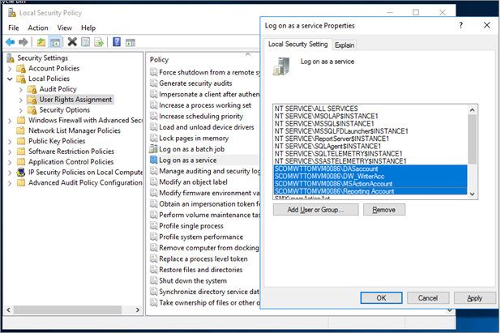
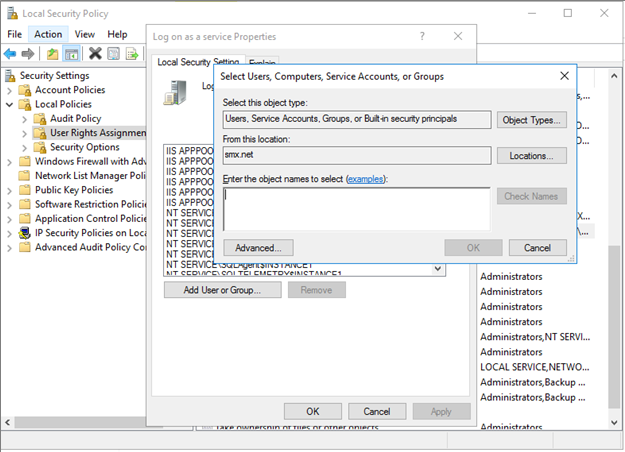
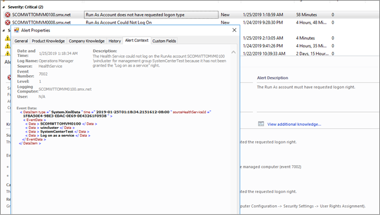
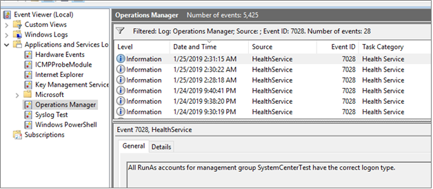
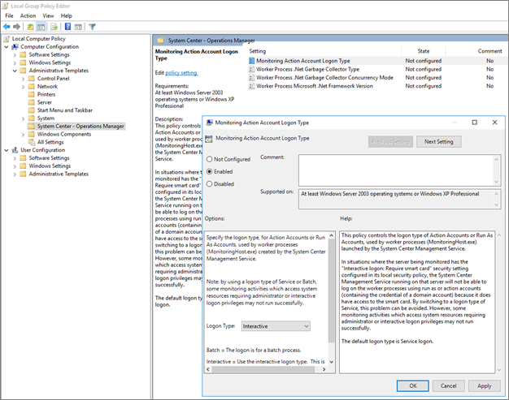

# Enable Service Logon by default for Operations Manager

It is a security best practice to disable  interactive and remote interactive logon rights for service accounts. Security teams across organizations have strict controls to enforce this best practice to prevent credential theft and associated attacks.

System Center 2019 - Operations Manager (OM) supports the hardening of service accounts and does not require Interactive and Remote Interactive logon rights for service accounts.

SCOM 2019 uses *Service Logon* as the logon type, by default. This leads to the following changes:

-	Health Service uses logon type **Service** by default. In SCOM 1807 and prior versions, health service used **Interactive** as logon type.
-	SCOM action accounts and service accounts now have **Log on as a Service** permission.     
-	Run As accounts need to have **Log on as a service** permission.
-	Monitoring Host now uses **Log  on as a Service** instead of **Log on locally**.

## Changes to OM action accounts and service accounts
 Following accounts are granted **Log on as a Service** permission during the SCOM installation as well as during upgrade from previous SCOM version:
 -	Management Server Action account
 -	SDK and Config service  
 -	Agent Installation account
 -	Data Warehouse Writer account
 -	Data Reader accounts

 

After this change, **Run As accounts**, which are created by OM administrators for the Management Packs (MPs), require **Log on as a Service** permission.

Follow the steps below to provide Log on as Service permission to run as accounts:

1. Logon to the computer with administrative privileges.
2. Go to **Administrative Tools** and click **Local Security Policy**.
3. Expand **Local Policy** and click **User Rights Assignment**.
4. In the right pane, right-click **Log on as a service** and select **Properties**.
5. Click **Add User or Group** option to add the new user.
6. In the **Select Users or Groups** dialogue, find the user you wish to add and click **OK**.
7. Click **OK** in the **Log on as a service Properties** to save the changes.

    

> [!NOTE]

> If you are upgrading to OM 2019 from a previous  version or installing a new OM 2019 environment, you will need to follow the steps above to provide **Logon as a service** permission to Run as accounts.

## Troubleshooting steps

If any of the **Run as Account** does not have required **Logon as a Service** permission, a critical monitor-based alert appears. This alert displays the  details of **Run as account** which does not have **Logon as a Service** permission.

In the event viewer, on the agent computer, see the information under event ID 7002 for details about all the **Run as account** that requires **Log on as a Service** permission.

|Parameter|Message|
|--------------------|---------------|
|Alert Name|Run As account does not have requested logon type|
|Alert Description|The Run As account must have the requested logon type|
|Alert Context |Health Service could not logon as the Run As account <Run As Account>  for management group name <group name> because it has not been granted the **Log on as a service** permission.|
|Monitor|<add monitor name…>|

You will need to provide **Logon As A Service** permission to the Run As accounts, which are identified in the event 7002.

When all the **Run As accounts** are given the **Logon as a Service** permission, event ID 7028 is displayed as below and the monitor changes to healthy state.

## Change logon type of a health service
If you need to change the logon type of SCOM health service to interactive, you can use the local group policy on the agent computer to change the logon type, as shown below.

> [!NOTE]
> A monitor-based alert is generated for this event.

## Co-existence with OM 2016 agent
SCOM 2016 agent uses the **Interactive** logon type as default. As SCOM 2019 service accounts have both service logon as well as interactive logon privileges, SCOM 2019 management server can interoperate with SCOM 2016 agent.
