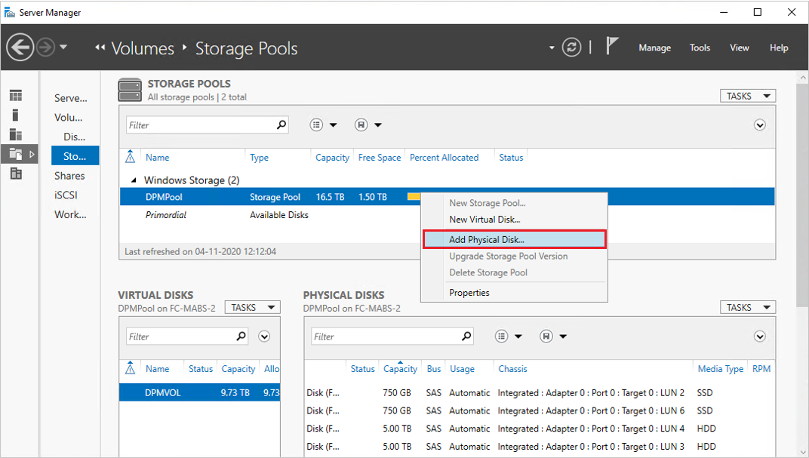

# Extend tiered volume

This article provides information about how to extend tiered volume in Data Protection Manager (DPM).

Before you resize a volume, ensure that you have enough capacity in the storage pool to accommodate its new, larger footprint. For example, when resizing a three-way mirror volume from 1 TB to 2 TB, its footprint would grow from 3 TB to 6 TB. For the resize to succeed, you would need at least (6 - 3) = 3 TB of available capacity in the storage pool. For additional capacity, you can add a new disk using the steps in the [add disk to storage pool](#add-disk-to-storage-pool) section.

For the virtual disk that uses storage tiers, you can resize each tier separately using the **Resize-StorageTier** cmdlet.

## Resize the virtual disk

Run the following PowerShell cmdlets to get the names of the storage tiers by following the associations from the virtual disk:

```PowerShell
Get-VirtualDisk <FriendlyName> | Get-StorageTier | Select FriendlyName
```

Then, for each tier, provide the new size in the **-Size** parameter.

```PowerShell
Get-StorageTier <FriendlyName> | Resize-StorageTier -Size <Size>
```

> [!NOTE]
> If your tiers are different physical media types (such as **MediaType = SSD** and **MediaType = HDD** ), ensure that you have enough capacity of each media type in the storage pool to accommodate the new, larger footprint of each tier.

When you resize the **StorageTier** (s), the **VirtualDisk** and **Disk** follow automatically and are resized too.

## Resize the partition

Next, resize the partition using the **Resize-Partition** cmdlet. The virtual disk is expected to have two partitions: the first partition is reserved and shouldn't be modified; the one you need to resize is **PartitionNumber = 2** and **Type = Basic**.

Provide the new size in the **-Size** parameter. We recommend using the maximum supported size, as shown below:

```PowerShell
# Choose virtual disk
$VirtualDisk = Get-VirtualDisk <FriendlyName>

# Get its partition
$Partition = $VirtualDisk | Get-Disk | Get-Partition | Where PartitionNumber -Eq 2

# Resize to its maximum supported size
$Partition | Resize-Partition -Size ($Partition | Get-PartitionSupportedSize).SizeMax

```

## Add disk to storage pool

You can add more capacity to the tiered volume by adding new disks. Based on the requirement, you can add additional HDDs or SSDs.

To add disks to a storage pool, follow these steps:

1. Physically connect the additional disks that you want to add, and [initialize these disks](add-storage.md#initialize-disks).
    After initialization, the newly added disks appear in the **Primordial** storage pool.

    

2. To add a new disk to an existing storage pool used for DPM, right-click the storage pool name, and then select **Add Physical Disk…**.

    

3. Select the disk from the list of available disks and select **OK**.

    

    Server Manager displays the updated capacity. Now, you can [extend the volume size](#extend-tiered-volume).

    

    >[!NOTE]
    > In some cases, **MediaType** for the newly added disk might be displayed as *unassigned*. You can run the following PowerShell command to [set the **MediaType**](./add-storage.md#set-mediatype-to-ssd-or-hdd):
    >
    >```PowerShell
    >Set-PhysicalDisk -UniqueId <Unique ID of the Disk> -MediaType <HDD/SSD>
    >```
