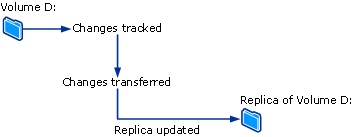
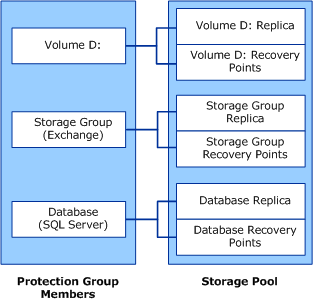

# How does DPM work?

>Applies To: System Center 2016 Technical Preview - Data Protection Manager

The method Data Protection Manager (DPM) uses to protect data varies according to the type of data being protected, and the method of protection you select. This article serves as a primer for how DPM functions. It is intended to educate those new to DPM, or those who may have basic questions about *how* DPM works. This article covers Disk-Based protection processes, Tape-Based protection processes, recovery process, as well as the protection policy.

## Disk-Based Protection process

To provide disk-based data protection, the DPM server creates and maintains a replica, or copy, of the data that is on protected servers. The replicas are stored in the storage pool which consists of a set of disks on the DPM server, or on a custom volume. The following illustration shows the basic relationship between a protected volume and its replica.

Whether you are protecting file data or application data, protection begins with the creation of the replica of the data source.

The replica is synchronized, or updated, at regular intervals according to the settings that you configure. The method that DPM uses to synchronize the replica depends on the type of data being protected. For more information, see The File Data Synchronization Process and The Application Data Synchronization Process. If a replica is identified as being inconsistent, DPM performs a consistency check, which is a block-by-block verification of the replica against the data source.

A simple example of a protection configuration consists of a DPM server and a protected computer. The computer is protected when you install a DPM protection agent on the computer and add its data to a protection group.

Protection agents track changes to protected data and transfer the changes to the DPM server. The protection agent also identifies data on a computer that can be protected and is involved in the recovery process. You must install a protection agent on each computer that you want to protect by using DPM. Protection agents can be installed by DPM or you can install protection agents manually using applications such as Systems Management Server (SMS).

Protection groups are used to manage the protection of data sources on computers. A protection group is a collection of data sources that share the same protection configuration. The protection configuration is the collection of settings that are common to a protection group, such as the protection group name, protection policy, disk allocations, and replica creation method.

DPM stores a separate replica for each protection group member in the storage pool. A protection group member can be any of the following data sources:

- A volume, share, or folder on a desktop computer, file server, or server cluster.
- A storage group on an Exchange server or server cluster
- A database of an instance of SQL Server or server cluster

>[AZURE.NOTE] DPM does not protect data stored in USB drives.

### The File Data Synchronization Process

In DPM, for a file volume or share on a server, the protection agent uses a volume filter and the change journal to determine which files have changed and then performs a checksum procedure for these files to synchronize only the changed blocks. During synchronization, these changes are transferred to the DPM server and then applied to the replica to synchronize the replica with the data source. The following figure illustrates the file synchronization process.

If a replica becomes inconsistent with its data source, DPM generates an alert that specifies which computer and which data sources are affected. To resolve the problem, the administrator repairs the replica by initiating a synchronization with consistency check, also known as simply a consistency check, on the replica. During a consistency check, DPM performs a block-by-block verification and repairs the replica to bring it back into consistency with the data source.

You can schedule a daily consistency check for protection groups or initiate a consistency check manually.

At regular intervals that you can configure, DPM creates a recovery point for the protection group member. A recovery point is a version of the data from which data can be recovered. For files, a recovery point consists of a shadow copy of the replica, which is created by using the Volume Shadow Copy Service (VSS) functionality of the operating system on the DPM server.

### The Application Data Synchronization Process

For application data, after the replica is created by DPM, changes to volume blocks that belong to application files are tracked by the volume filter.

How changes are transferred to the DPM server depends on the application and the type of synchronization. The operation that is labeled synchronization in DPM Administrator Console is analogous to an incremental backup, and it creates an accurate reflection of the application data when combined with the replica.

During the type of synchronization that is labeled express full backup in DPM Administrator Console, a full Volume Shadow Copy Service (VSS) snapshot is created but only changed blocks are transferred to the DPM server.

Each express full backup creates a recovery point for application data. If the application supports incremental backups, each synchronization also creates a recovery point. The synchronization type supported by each type of application data is summarized as follows:

-	For protected Exchange data, synchronization transfers an incremental VSS snapshot using the Exchange VSS writer. Recovery points are created for each synchronization and express full backup.

- SQL Server databases that are log-shipped, in read-only mode, or that use the simple recovery model do not support incremental backup. Recovery points are created for each express full backup only. For all other SQL Server databases, synchronization transfers a transaction log backup, and recovery points are created for each incremental synchronization and express full backup. The transaction log is a serial record of all the transactions that have been performed against the database since the transaction log was last backed up.

- Windows SharePoint Services and Microsoft Virtual Server do not support incremental backup. Recovery points are created for each express full backup only.

Incremental synchronizations require less time than performing an express full backup. However, the time required to recover data increases as the number of synchronizations increases. This is because DPM must restore the last full backup and then restore and apply all the incremental synchronizations up to the point in time selected for recovery.

To enable faster recovery time, DPM regularly performs an express full backup, a type of synchronization that updates the replica to include the changed blocks.

During the express full backup, DPM takes a snapshot of the replica before updating the replica with the changed blocks. To enable more frequent recovery point objectives, as well as to reduce the data loss window, DPM also performs incremental synchronizations in the time between two express full backups.

As with the protection of file data, if a replica becomes inconsistent with its data source, DPM generates an alert that specifies which server and which data source are affected. To resolve the problem, the administrator repairs the replica by initiating a synchronization with consistency check on the replica. During a consistency check, DPM performs a block-by-block verification and repairs the replica to bring it back into consistency with the data sources.

You can schedule a daily consistency check for protection groups or initiate a consistency check manually.

### The Difference between File Data and Application Data

Data that exists on a file server and which needs to be protected as a flat file qualifies as file data, such as Microsoft Office files, text files, batch files, and so forth.

Data that exists on an application server and which requires DPM to be aware of the application qualifies as application data, such as Exchange storage groups, SQL Server databases, Windows SharePoint Services farms, and Virtual Server.

Each data source is presented in DPM Administrator Console according to the type of protection that you can select for that data source. For example, in the Create New Protection Group Wizard, when you expand a server that contains files and is also running Virtual Server and an instance of SQL Server, the data sources are treated as follows:

- If you expand All Shares or All Volumes, DPM displays the shares and volumes on that server and will protect any data source selected in either of those nodes as file data.

- If you expand All SQL Servers, DPM displays the instances of SQL Server on that server and will protect any data source selected in that node as application data.

- If you expand Microsoft Virtual Server, DPM displays the host database and virtual machines on that server and will protect any data source selected in that node as application data.

## Tape-based Protection Process

When you use short-term disk-based protection and long-term tape-based protection, DPM can back up data from the replica volume to tape so that there is no impact on the protected computer. When you use tape-based protection only, DPM backs up the data directly from the protected computer to tape.

DPM protects data on tape through a combination of full and incremental backups from either the protected data source (for short-term protection on tape or for long-term protection on tape when DPM does not protect the data on disk) or from the DPM replica (for long-term protection on tape when short-term protection is on disk).

> [AZURE.NOTE] If a file was open when the replica was last synchronized, the backup of that file from the replica will be in a crash consistent state. A crash consistent state of the file will contain all data of the file that was persisted to disk at the time of last synchronization. This applies only to file system backups. Application backups will always be consistent with the application state.

For specific backup types and schedules, see Planning Protection Groups

## Recovery Process

The method of data protection, disk-based or tape-based, makes no difference to the recovery task. You select the recovery point of data that you want to recover, and DPM recovers the data to the protected computer.

DPM can store a maximum of 64 recovery points for each file member of a protection group. For application data sources, DPM can store up to 448 express full backups and up to 96 incremental backups for each express full backup. When storage area limits have been reached and the retention range for the existing recovery points is not met yet, protection jobs will fail.

>[AZURE.NOTE] To support end-user recovery, the recovery points for files are limited to 64 by Volume Shadow Copy Service (VSS).

As explained in The File Data Synchronization Process and The Application Data Synchronization Process, the process for creating recovery points differs between file data and application data. DPM creates recovery points for file data by taking a shadow copy of the replica on a schedule that you configure. For application data, each synchronization and express full backup creates a recovery point.

The following illustration shows how each protection group member is associated with its own replica volume and recovery point volume.

Administrators recover data from available recovery points by using the Recovery Wizard in DPM Administrator Console. When you select a data source and point in time from which to recover, DPM notifies you if the data is on tape, whether the tape is online or offline, and which tapes are needed to complete the recovery.

DPM gives administrators the ability to enable their end users to perform their own recoveries by leveraging the Previous Versions feature in Windows. If you do not want to provide this capability to your end users, you recover the data for desktop computers using the using the Recovery Wizard.

## Protection Policy

DPM configures the protection policy, or schedule of jobs, for each protection group based on the recovery goals that you specify for that protection group. Examples of recovery goals are as follows:

- "Lose no moreo than 1 hour of production data"

- "Provide me with a retention range of 30 days"

- "Make data available for recovery for 7 years"

Your recovery goals quantify your organization's data protection requirements. In DPM, the recovery goals are defined by retention range, data loss tolerance, recovery point schedule, and, for database applications, the express full backup schedule.

The retention range is how long you need the backed-up data available. For example, do you need data from today to be available a week from now? Two weeks from now? A year from now?

Data loss tolerance is the maximum amount of data loss, measured in time, that is acceptable to business requirements, and it will determine how often DPM should synchronize with the protected server by collecting data changes from the protected server. You can change the synchronization frequency to any interval between 15 minutes and 24 hours. You can also select to synchronize just before a recovery point is created, rather than on a specified time schedule.

The recovery point schedule establishes how many recovery points of this protection group should be created. For file protection, you select the days and times for which you want recovery points created. For data protection of applications that support incremental backups, the synchronization frequency determines the recovery point schedule. For data protection of applications that do not support incremental backups, the express full backup schedule determines the recovery point schedule.

> [AZURE.NOTE] When you create a protection group, DPM identifies the type of data being protected and offers only the protection options available for the data.

## Auto Discovery process

Auto discovery is the daily process by which DPM automatically detects new or removed computers on the network. Once a day, at a time that you can schedule, DPM sends a small packet (less than 10 kilobytes) to the closest domain controller. The domain controller responds to the LDAP request with the computers in that domain, and DPM identifies new and removed computers. The network traffic created by the auto discovery process is minimal.

Auto discovery does not discover new and removed computers in other domains. To install a protection agent on a computer in another domain, you must identify the computer by using its fully qualified domain name.

## DPM Directory Structure

When you begin protecting data with DPM, you will notice that the installation path of DPM contains three folders in the Volumes directory:

- \Microsoft DPM\DPM\Volumes\DiffArea

- \Microsoft DPM\DPM\Volumes\Replica

- \Microsoft DPM\DPM\Volumes\ShadowCopy

The DiffArea folder contains mounted shadow copy volumes that store the recovery points for a data source.

The Replica folder contains mounted replica volumes.

The ShadowCopy folder contains local backup copies of the DPM database. In addition, when you use DPMBackup.exe to create backup shadow copies of the replicas for archive by third-party backup software, the backup shadow copies are stored in the ShadowCopy folder.
