# Add Storage to DPM 2016

>Applies To: System Center 2016

DPM 2016 comes with Modern Backup Storage which delivers 50% storage savings, 3x faster backups, and more efficient storage with Workload-Aware storage. Modern Backup Storage can be used by setting up DPM 2016 on Windows Server 2016.

If DPM 2016 runs on an older version of Windows Server, DPM 2016 will protect the workloads the legacy way. More information on preparing storage to back up the legacy way can be found here.

DPM 2016 accepts volumes for storage. Hence, once a volume is added, DPM will format it to ReFS to use the new features of Modern Backup Storage. To add a volume, and to expand it later if needed, here is the suggested workflow:

1.	Setup DPM 2016 on a VM
2.	Create a volume on a virtual Disk in a Storage Pool:
    
    a.	Add a disk to a Storage Pool and create a virtual disk with Simple Layout
    b.	Add any more disks, and extend the virtual disk
    c.	Create Volumes on the virtual disk

3.	Add these volumes to DPM
4.	Configure Workload-Aware Storage
5.	Expand the Volumes when needed by adding disks to the Storage Pool.

## Create a volume for DPM Modern Backup Storage

DPM 2016 accepts volumes as disk storage.  This helps customers in maintaining full control over the storage.  While the volume can be coming from a single disk, for future extension purposes, we propose creating volume out of a disk crated out of storage spaces.  This will help in expanding volume needed for backup storage.  This section provides best practice for creating a volume with this configuration.

First step is to create a Virtual Disk.  Through the File and Storage Services section of the Server Manager, create a Storage Pool, and add the available disks to it. Create a Virtual Disk from that Storage Pool. The Virtual Disk should be created with Simple Layout with number of columns set to 1.

If you are using PowerShell to create the virtual disks (using new-VirtualDisk), the new Virtual Disk can be created on a Storage Pool with any number of Physical Disks by setting –NumberOfColumns to 1.

Step 1: Add a disk to a Storage Pool and create a virtual disk with Simple Layout
Create a Storage Pool with one disk added.  (Adding only one disk in the beginning will set the number of columns to 1

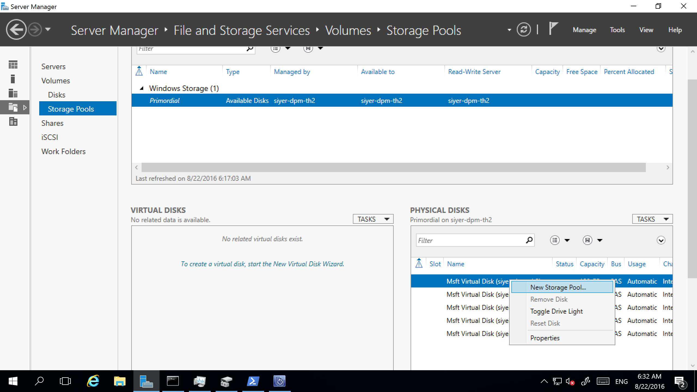

Create a virtual disk out of this Storage Pool and select the layout to be Simple

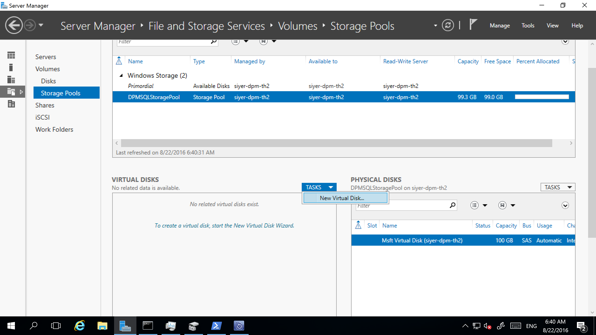

Step 2: Now add as many disks as needed and extend the virtual disk
Having created a Virtual disk with Simple layout and the number of columns set to 1, any more disks that may be needed for storing backups.

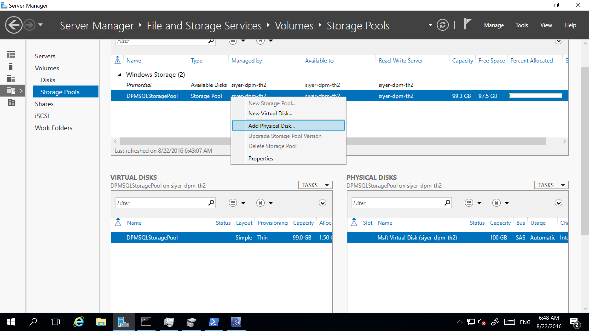

Extend the Virtual Disk to reflect the added disks.

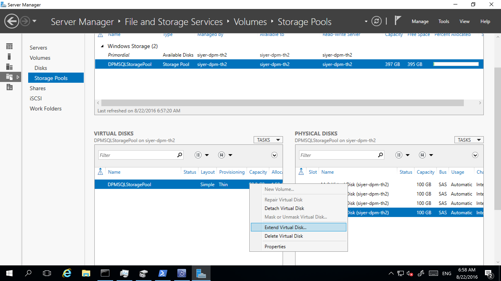

Step 3: Create Volumes on the Storage Pool

After creating the Virtual Disk with sufficient storage, create volumes on the Virtual Disk.
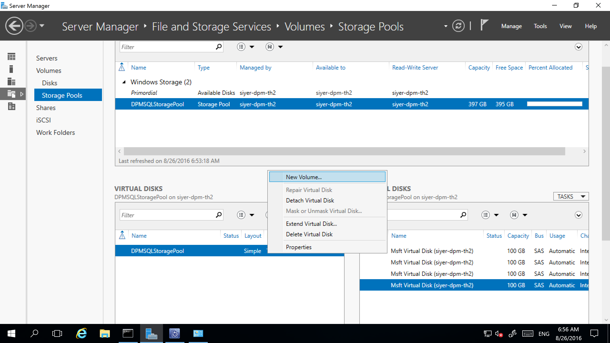

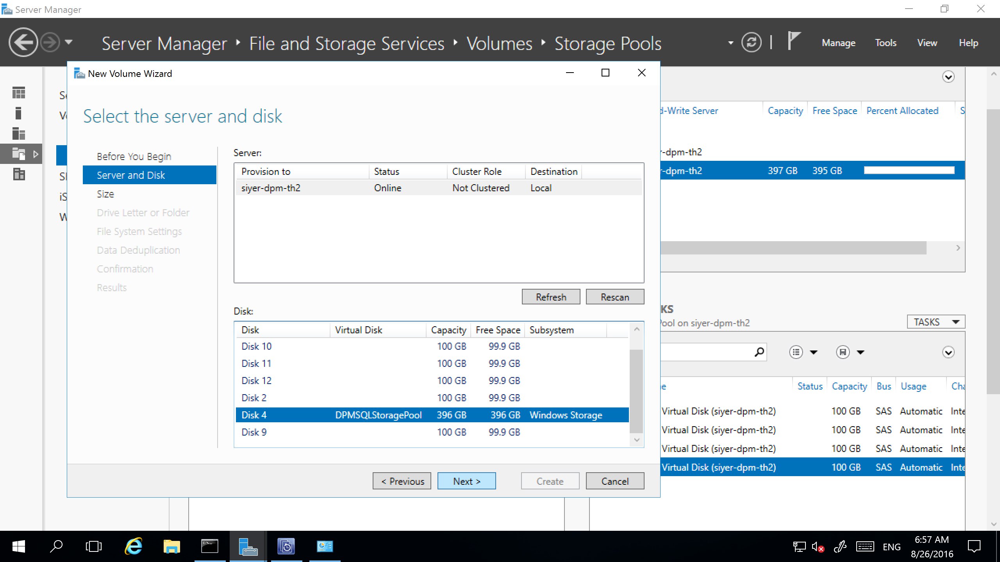

Adding volumes to DPM Disk Storage

To add a volume to DPM, in the Management pane, Rescan the Storage and Click on Add. This will give a list of all the volumes available to be added for DPM Storage. After they are added to the list of selected volumes, they can also be given a Friendly name for easy recall. Clicking on OK will format these volumes to ReFS to enable DPM to use the benefits of Modern Backup Storage.

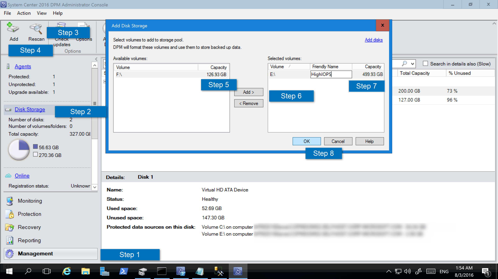

Configure Workload-Aware Storage

With Workload Aware Storage, the volumes can be selected to preferentially store certain kinds of workloads. For example, expensive volumes that support high IOPS can be configured to store only the workloads that require frequent, high-volume backups like SQL with Transaction Logs. Other workloads that are backed up less frequently, say VMs, can be backed up to other low-cost volumes.

This can be done through PowerShell commandlet, Update-DPMDiskStorage, which updates the properties of a volume in the storage pool on a DPM server.

**Update-DPMDiskStorage**

**Syntax**

`Parameter Set: Volume`

```
Update-DPMDiskStorage [-Volume] <Volume> [[-FriendlyName] <String> ] [[-DatasourceType] <VolumeTag[]> ] [-Confirm] [-WhatIf] [ <CommonParameters>]
```

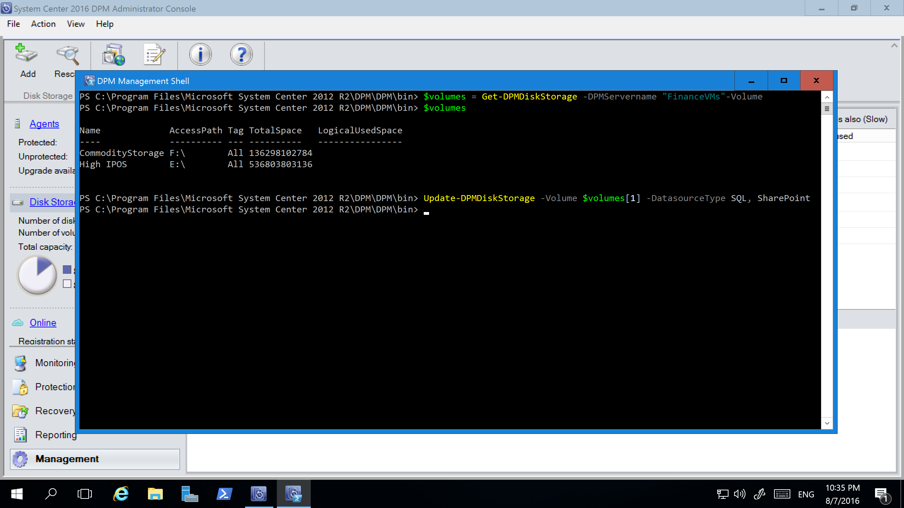

The changes made through PowerShell are reflected in the UI.

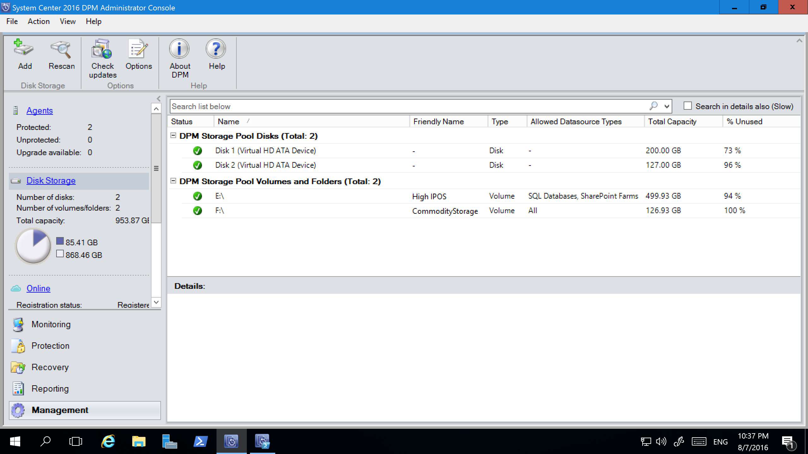

Add Disks to the Storage Pool and Expand the Volumes when needed
Whenever more storage needs to be added to a volume, it can be done by adding more disks to the storage pool, expanding the relevant virtual disk, and expanding the corresponding volume.

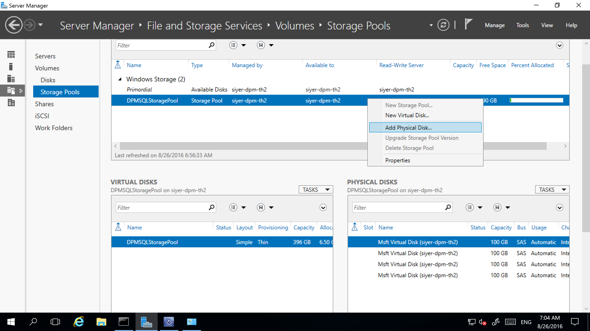

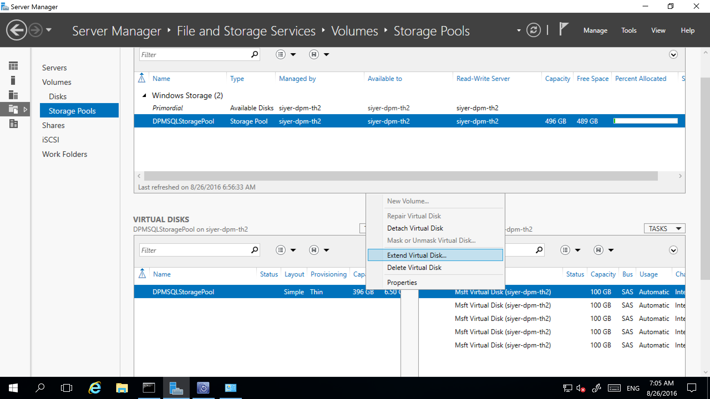

The increased size of the volume will directly be reflected on DPM UI. If that is not the case, rescan the available storage to view the new size of the expanded volumes.

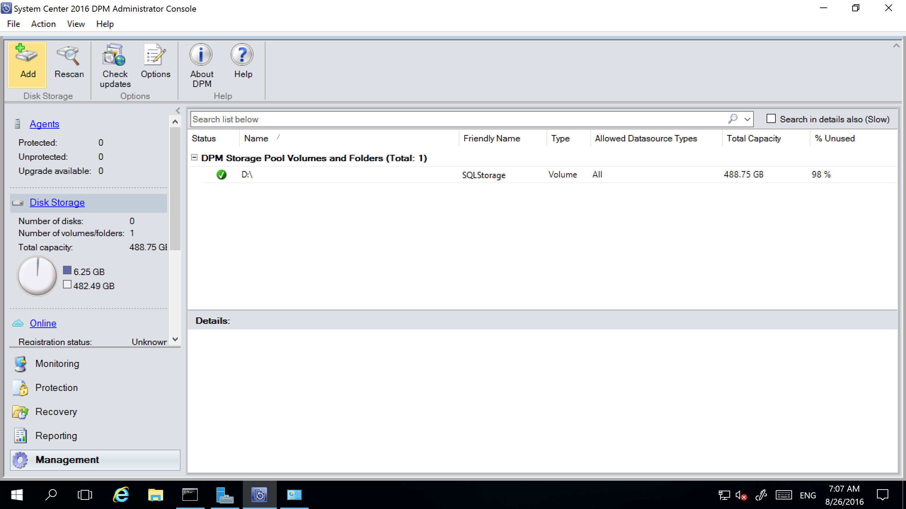
