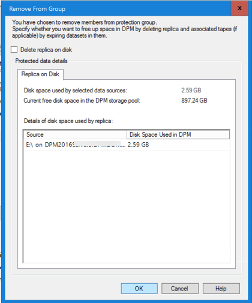

# Upgrade to DPM 2016

>Applies To: System Center 2016

You can install DPM 2016 on Windows Server 2012 R2 with Update Rollup 10, or on Windows Server 2016. However, before you upgrade or install DPM 2016, please read the [Installation prerequisites](./get-dpm-installed.md#BKMK_Prereq).


## Upgrade path for DPM 2016
If you are going to upgrade from a previous version of DPM to DPM 2016, make sure your installation has the necessary updates:

- Upgrade DPM 2012 R2 to DPM 2012 R2 Update Rollup 10. You can obtain the Update Rollups from Windows Update.
- Upgrade DPM 2012 R2 Update Rollup 10 to DPM 2016.
- Update the agents on the protected servers.
- Upgrade Windows Server 2012 R2 to Windows Server 2016.
- Upgrade DPM Remote Administrator on all production servers.
- Backups will continue without rebooting your production server.


### Upgrade steps for DPM

1. To install DPM, double-click Setup.exe to open the System Center 2016 Wizard.
2. Under Install, click Data Protection Manager. This starts Setup. Agree to the license terms and conditions and follow the setup wizard.

Some DPM 2016 features, such as Modern Storage (MDS), require the Windows Server 2016 RTM build. It is possible to upgrade DPM 2016 from DPM 2012 R2, running on Windows Server 2012 R2. However, customers receiving DPM 2016 will want the latest features, so Microsoft recommends installing DPM 2016 on a new installation of Windows Server 2016 RTM. For instructions on installing DPM, see the article, [Installing DPM 2016](./get-dpm-installed.md).

## Adding Storage for Modern Storage (MDS)

To store backups efficiently, DPM 2016 uses Volumes. Disks can also be used to continue storing backups like DPM 2012 R2.

### Add Volumes and Disks
If you run DPM 2016 on Windows Server, you can use volumes to store backup data. Volumes provide storage savings and faster backups. You can give the volume a friendly name, and you can change the name. You apply the friendly name while adding the volume, or later by clicking the **Friendly Name** column of the desired volume. You can also use PowerShell to add or change friendly names for volumes.

To add a volume in the administrator console:

1. In the DPM Administrator console, select the **Management** feature > **Disk Storage** > **Add**.

2. In the **Add Disk Storage** dialog, select an available volume > click **Add** > type a friendly name for the volume ** > click **OK**.

      

If you want to add a disk, it must belong to a protection group with legacy storage. Those disks can only be used for those protection groups. If the DPM server doesn't have sources with legacy protection, the disk won't appear.
See the topic, [Adding disks to increase legacy storage](upgrade-to-system-center-2016.md#adding-disks-to-increase-legacy-storage), for more information on adding disks. You can't give disks a friendly name.


### Assign Workloads to Volumes

DPM 2016 allows the user to specify which kinds of workloads should be assigned to which volumes. For example, expensive volumes that support high IOPS can be configured to store only the workloads that require frequent, high-volume backups like SQL with Transaction Logs.
To update the properties of a volume in the storage pool on a DPM server, use the PowerShell cmdlet, Update-DPMDiskStorage.

**Update-DPMDiskStorage**

**Syntax**

`Parameter Set: Volume`

```
Update-DPMDiskStorage [-Volume] <Volume> [[-FriendlyName] <String> ] [[-DatasourceType] <VolumeTag[]> ] [-Confirm] [-WhatIf] [ <CommonParameters>]
```

The changes made through PowerShell are reflected in the UI.


## Protecting Data Sources
To begin protecting data sources, create a Protection Group. The following procedure highlights changes or additions to the **New Protection Group** wizard.

To create a Protection Group:

1. In the DPM Administrator Console, select the **Protection** feature.

2. On the tool ribbon, click **New**.

    The **Create new Protection Group** wizard opens.

  

3. Click **Next** to advance the wizard to the **Select Protection Group Type** screen.
4. On the **Select Protection Group Type** screen, select the type of Protection Group to be created and then click **Next**.

  

5. On the **Select Group Members** screen, in the **Available members** pane, DPM lists the members with protection agents. For the purposes of this example, select volume D:\ and E:\ to add them to the **Selected members** pane. Once you have chosen the members for the protection group, click **Next**.

  

6. On the **Select Data Protection Method** screen, type a name for the **Protection group**, select the protection method(s) and click **Next**.
    If you want short term protection, you must use Disk backup.

  

7. On the **Specify Short-Term Goals** screen specify the details for **Retention Range** and **Synchronization Frequency**, and click **Next**. If desired, click **Modify** to change the schedule when recovery points are taken.

  

8. The **Review Disk Storage Allocation** screen provides details about the selected data sources, their size, the **Space to be Provisioned**, and **Target Storage Volume**.

  

  The storage volumes are determined based on the workload volume allocation (set using PowerShell) and the available storage. You can change the storage volumes by selecting other volumes from the drop-down menu. If you change the **Target Storage**, the **Available disk storage** dynamically changes to reflect the **Free Space** and **Underprovisioned Space**.

  The **Underprovisioned Space** column in **Available disk storage**, reflects the amount of additional storage needed if the data sources grow as planned. Use this value to help plan your storage needs to enable smooth backups. If the value is zero, then there are no potential problems with storage in the foreseeable future. If the value is a number other than zero, then you do not have sufficient storage allocated  - based on your protection policy and the data size of your protected members.

  

The remainder of the New Protection Group wizard is unchanged from DPM 2012 R2. Continue through the wizard to complete creation of your new protection group.

## Migrating legacy storage to Modern Storage
After upgrading DPM 2012 R2 to DPM 2016 and the operating system to Windows Server 2016, you can update your existing protection groups to the new DPM 2016 features. By default, protection groups are not changed, and continue to function as they were configured in DPM 2012 R2. Updating protection groups to use modern storage is optional. To update the protection group, stop protection of all data sources with Retain Data, and add the data sources to a new protection group. DPM begins protecting these data sources the new way.

1. In the Administrator Console, select the **Protection** feature, and in the **Protection Group Member** list, right-click the member, and select **Stop protection of member...**.

  

    The **Remove from Group** dialog opens.

2. In the **Remove from Group** dialog, review the used disk space and the available free space in the storage pool. The default is to leave the recovery points on the disk and allow them to expire per their associated retention policy. Click **OK**.

    If you want to immediately return the used disk space to the free storage pool, select **Delete replica on disk**. This will delete the backup data (and recovery points) associated with that member.

    

3. Create a new protection group that uses Modern Storage. and include the unprotected data sources.


## Adding Disks to increase legacy storage

If you want to use legacy storage with DPM 2016, it may become necessary to add disks to increase legacy storage. To add disk storage:

1. On the Administrator Console, click **Management**.

2. Select **Disk Storage**.

3. On the tool ribbon click **Add**.

    The **Add Disk Storage** dialog opens.

    

4. In the **Add Disk Storage** dialog, click **Add disks**.

    DPM provides a list of available disks.

5. Select the disks, click **Add** to add the disks, and click **OK**.

## New PowerShell cmdlets

For DPM 2016, two new cmdlets: [Mount-DPMRecoveryPoint](https://technet.microsoft.com/library/mt787159.aspx) and [Dismount-DPMRecoveryPoint](https://technet.microsoft.com/library/mt787158.aspx) are available. Click the cmdlet name to see its reference documentation.


## Enable Cloud Protection

You can back up a DPM server to Azure. The high level steps are:
- create an Azure subscription,
- register the server with the Azure Backup service,
- download vault credentials and the Azure Backup Agent,
- configure the server's vault credentials and backup policy,

For more information on backing up DPM to the cloud, see the article, [Preparing to backup workloads to Azure with DPM] (https://azure.microsoft.com/en-us/documentation/articles/backup-azure-dpm-introduction/).
