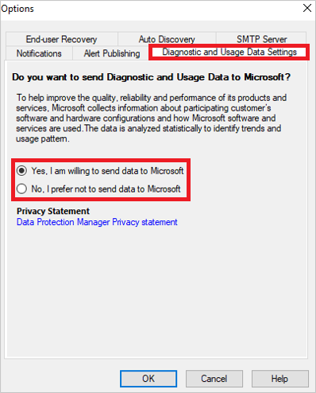

# Manage telemetry settings

::: moniker range="sc-dpm-2019"

> [!NOTE]
> This feature is applicable for DPM 2019 UR2 and later.

::: moniker-end

This article provides information about how to manage the telemetry (Diagnostics and utility data) settings in System Center – Data Protection Manager (DPM).

By default, Data Protection Manager sends diagnostic and connectivity data to Microsoft. Microsoft uses this data to provide and improve the quality, security, and integrity of Microsoft products and services.

Administrators can turn off this feature at any point in time. For more information on the data collected, see the [following section](#telemetry-data-collected).

## Turn on/off telemetry from console

1. In the Data Protection Manager console, go to **Management** and click **Options** in the top pane.
2. In the **Options** dialog box, select **Diagnostic and Usage Data Settings**.

    

3. Select the diagnostic and usage data sharing preference from the options displayed and then select **OK**.

    > [!NOTE]
    > We recommend you to read the [Privacy Statement](https://privacy.microsoft.com/privacystatement) before you select an option.
    > - To turn on telemetry, select **Yes, I am willing to send data to Microsoft**.
    > - To turn off telemetry, select **No, I prefer not to send data to Microsoft**.

::: moniker range="sc-dpm-2016"

## Telemetry data collected

| **Data related To** | **Data collected** |
| --- | --- |
| **Setup** | Version of DPM installed.   Version of the DPM update rollup installed.    Unique machine identifier.    Operating system on which DPM is installed.    If DPM is connected to Microsoft Azure, unique cloud subscription identifier.   If DPM is connected to Microsoft Azure, MARS agent version.   Whether tiered storage is enabled. |
| **Workload Protected** | Workload unique Identifier.   Size of the workload being backed up.   Workload type and its version number.   If the workload is currently being protected by DPM.   Unique Identifier of the Protection Group under which the workload is protected.   Location where the workload is getting backed up - to disk/tape or cloud.|
| **Restore Jobs** | Status of the restore job - whether successful or failed.   Size of the data restored.   Failure message, in case of restore job fails.  Time taken for the restore job.  Details of the workload for which the restore job was run. |
| **Telemetry change status** | The status change details for the telemetry settings, if enabled or disabled, and when. |
| **DPM Console Crash Error** | The details of the error when a DPM console crashes.|

::: moniker-end

::: moniker range="sc-dpm-2019"

## Telemetry data collected

| **Data related To** | **Data collected** |
| --- | --- |
| **Setup** | Version of DPM installed.   Version of the DPM update rollup installed.    Unique machine identifier.    Operating system on which DPM is installed.    If DPM is connected to Microsoft Azure, unique cloud subscription identifier.   If DPM is connected to Microsoft Azure, MARS agent version.   Whether tiered storage is enabled.    Size of the storage used. |
| **Workload Protected** | Workload unique Identifier.   Size of the workload being backed up.   Workload type and its version number.   If the workload is currently being protected by DPM.   Unique Identifier of the Protection Group under which the workload is protected.   Location where the workload is getting backed up - to disk/tape or cloud.|
| **Jobs** | Status of the backup/restore job.    Size of the data backed up/restored.   Failure message, in case backup/restore job fails.   Time taken for the restore job.  Details of the workload for which the backup/restore job was run. |
| **Telemetry change status** | The status change details for the telemetry settings, if enabled or disabled, and when. |
| **DPM Console Crash Error** | The details of the error when a DPM console crashes.|

::: moniker-end

## Next steps

[Deploy the DPM protection agent](deploy-dpm-protection-agent.md)
