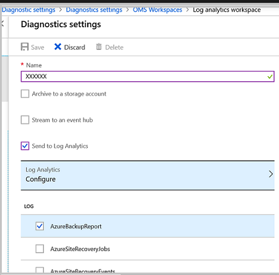
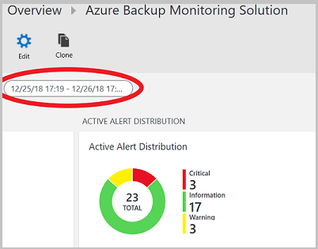

# Monitor DPM

You can monitor a single System Center Data Protection Manager (DPM) server from the DPM Administrator console, multiple DPM servers from the Central Console, or monitor DPM activity with Operations Manager.

## Monitor with the DPM console
To monitor DPM in the console, you should be logged on to the DPM server with a local admin account. Here's what you can monitor:

-   On the **Alerts** tab you can monitor errors, warnings, and general information for a protection group, for a specific protected computer, or by message severity.  You can view active and inactive alerts and set up email notifications

-   On the **Jobs** tab you can view jobs initiated by DPM for a specific protected computer or protection group. You can  follow job progress or check resources consumed by jobs.

-   In the **Protection** task area, you can check the status of volumes and shares in protection group, and check configuration settings such as recovery settings, disk allocation, and backup schedule.

-   In the **Management** task area you can view the **Disks,Agents**, and **Libraries** tab to check the status of disks in the storage pool, deployed DPM agent status, and the state of tapes and tape libraries.

## Monitor DPM in the Central Console
Central Console is a System Center Operations Manager console that you can deploy to manage and monitor multiple DPM servers from a single location. In the Central Console you can monitor and track the status of multiple DPM servers,  jobs, protection groups, tapes, storage, and disk space.

-   In **View Jobs**, you can get a list of jobs running on all DPM server monitored by Central Console.

-   In **Alert View**, you can get a list of all DPM alerts that require action. You can using the **Troubleshoot** option to get more details for an alert.

    You can consolidate alerts in the console.  You can display a single alert for repeated alerts, or display a single alert for multiple alerts that have the same root cause. If you're using a ticketing system, you can generate a single ticket only for repeated alerts.

-   In **State View**, you can get information about the state of  DPM objects.

## Monitor DPM in the Azure console
You use the Dashboard to get a quick overview of the state of your System Center - Data Protection Manager (DPM) backups in Windows Azure Backup. The Dashboard provides a centralized gateway to view servers protected by backup vaults, as follows:

-   **Usage Overview** shows how you are using the backup vault. You can select a vault and see how much storage is being consumed by the vault, versus the amount of storage provided by your subscription. You can also see the number of servers registered to the vault.

-   **Quick Glance** displays crucial configuration information about the backup vault. It tells you whether the vault is online, which certificate is assigned to it, when the certificate expires, the geographic location of the storage servers, and subscription details for the service.

From the dashboard you can download the Backup agent for installation on a server, modify settings for certificates uploaded to the vault, and delete a vault if necessary.

::: moniker range="sc-dpm-2019"

##	Central Monitoring
All DPM-A customers (customer connected to Azure) have the flexibility of using Central Monitoring, a monitoring solution provided by Microsoft Azure Backup. You can monitor both on premise and cloud backups, using Log Analytics with Central Monitoring. You can use this monitoring solution to monitor your key backup parameters such as backups jobs, backup alerts, and cloud storage across all your recovery service vaults & subscriptions. You can also create alert notifications and open tickets using webhooks or ITSM integration.

> [!NOTE]
> You must have a valid Azure subscription to be able to centrally monitor.

**Enable central monitoring**

1.	Logon to Azure portal.
2.	[Create a Recovery Service vault](https://docs.microsoft.com/azure/backup/backup-azure-vms-first-look-arm#back-up-from-azure-vm-settings), or if you already have one, select the same.
3.	Select **Diagnostic Settings** under **Monitoring** section.
    
4. Click **Turn on Diagnostic Settings**.
5. In the **Diagnostic settings** window, give a valid setting name, select **Send to Log Analytics**, select the relevant log analytics workspace or [create one](https://docs.microsoft.com/azure/azure-monitor/learn/quick-create-workspace), select the relevant log, *AzureBackupReport* and click **Save**.

    > [!NOTE]
    > Choose the same workspace for all the vaults to get a centralized view in the workspace. Allow 24 hours for initial data push to complete post completing the configuration.

    Here is a sample backup report:

    

**Monitor Backup Data**
1.	Select your Log Analytics workspace.
2.	Click **OMS Portal**.
    The solution dashboard is displayed and provides you with all the backup information as shown below:

    Sample 1:

    

    Sample 2:

    

3. You can also monitor active alerts, current data sources being backed up and cloud storage as shown below:

    
4. You can also specify the desired time range for monitoring the backup parameters.

    

**Create Custom Alerts**
1.	Click any values in the above graph to view more details in the Logs window.
2.	Click **Alert** icon.
3.	Select **Take me to Azure Alerts**.
4.	In Log Analytics workspace, click **New Alert Rule**.
5.	Define the **alert condition**, **alert details** and **action group**.
6.	[Learn more](https://docs.microsoft.com/azure/azure-monitor/learn/tutorial-response#create-alerts) about how to configure new alerts.

::: moniker-end

## Monitor DPM in Operations Manager
You can use monitor and report on the health and status of DPM servers using System Center Operations Manager Management Packs for DPM. DPM provides the following management packs, use these as applicable for the DPM version you are using:

-   **Reporting management pack** (Microsoft.SystemCenter.DataProtectionManager.Reporting.mp) - Collects and displays reporting data from all DPM servers, and exposes a set of Operations Manager warehouse views for DPM. You can query these views to generate custom reports.

-   **Discovery and monitoring management pack** (Microsoft.SystemCenter.DataProtectionManager.Discovery.mp)

-   **Library management pack** - (Microsoft.SystemCenter.DataProtectionManager.Library)

Using these packs you can:

-   Centrally monitor the health and status of DPM servers, protected servers and computers, and backups.

-   View the state of all roles on DPM servers and protected data sources.
    Monitor, identify, action and troubleshoot alerts.

-   Use Operations Manager alerts to monitor DPM server memory, CPU, and disk resources, and database.

-   Monitor resource usage and performance trends on DPM servers.

### Prerequisites

-   To use the DPM Management Packs, you need a System Center Operations Manager server running. The Operations Manager Data Warehouse must be up and running.

-   If you're running a previous version of the Discover and Library Management Packs obtained from the DPM installation media, you should remove them from the DPM server and install the new versions from the download page.

-   You can only run one language version of the Management Pack at one time. If you want to use the pack in a different language uninstall the pack in the existing language and then install it with the new language.

-   If any previous versions of a DPM Management Pack are installed on the Operations Manager server, remove them before installing the new pack.

### Set up the Management Packs
Install the Operations Manager agent on each DPM server you want to monitor.
Then obtain the Management Packs, import the Discovery and Library Management Packs, install the DPM Central Console, and import the Reporting Management Pack

#### Install the agent and obtain the Management Packs

1.  For agent installation options read [Operations Manager Installation Methods](https://docs.microsoft.com/en-us/system-center/scom/deploy-overview?view=sc-om-1807).
    If you need to obtain the latest version of the agent see [Microsoft Monitoring Agent](https://www.microsoft.com/download/details.aspx?id=40316) in the Download Center.

2.  Download the packs from the [Download Center](https://www.microsoft.com/download/details.aspx?id=45525).
    The download places the Discovery and Library Management Packs in the C:\Program Files\System Center Management Packs folder. The reporting management pack is placed in a separate folder inside that folder.

#### Import the Management Packs
Import the Discovery and Library Management Packs
Log on to the Operations Manager server with an account that is a member of the Operations Manager Administrators role.
Remember to remove any previous versions of the Library or Discover Management Packs running on the server.

1.  In the Operations console, click **Administration**. Right-click **Management Packs** > **Import Management Packs**.
     Select **Microsoft.SystemCenter.DataProtectionManagerDiscovery.MP** > **Open** and then **Microsoft.SystemCenter.DataProtectionManagerLibrary.MP** > **Open**

2.  Follow the instructions in the Import Management Packs wizard. You can get more information about running this wizard in [How to Import an Operations Manager Management Pack](https://technet.microsoft.com/library/hh212691.aspx).

#### Set up Central Console
You'll need to install the DPM Central Console on the Operations Manager server. This console is used to manage multiple DPM servers in Operations Manager.

1.  In the **Setup** screen of Operations Manager, select the following:

    -   Select **Install Central Console Server and Client side Components** if you want to monitor DPM servers with the Management Pack and you want to use the Central Console to manage settings and configuration on the DPM servers.

    -   Select **Install Central Console Server side Components** if you only want to monitor DPM servers with the Management Pack, but don't want to use Central Console to manage settings and configuration on the DPM servers.

2.  DPM adds firewall exceptions for port 6075 for the console. You should also open ports for SQL Server.exe and SQL browser.exe

#### Import the Reporting Manager Pack

1.  Log on to the Operations Manager server with an account that is a member of the Operations Manager Administrators role.

2.  In the Operations console, click **Administration**. Right-click **Management Packs** > **Import Management Packs**.

3.  Select **Microsoft.SystemCenter.DataProtectionManagerReporting.MP** > **Open**.
    Follow the instructions in the Import Management Packs wizard.

#### Tweaking Management Pack settings

After you import the Management Packs they discover and monitor data without requiring any additional configuration. You can optionally tweak settings like monitors and rules for your environment. For example if you find that performance-measuring rules that are enable degrade server performance with slow WAN links, you can disable them. For instructions, see [How to enable or disable a rule or monitor](https://technet.microsoft.com/library/hh212818.aspx).
