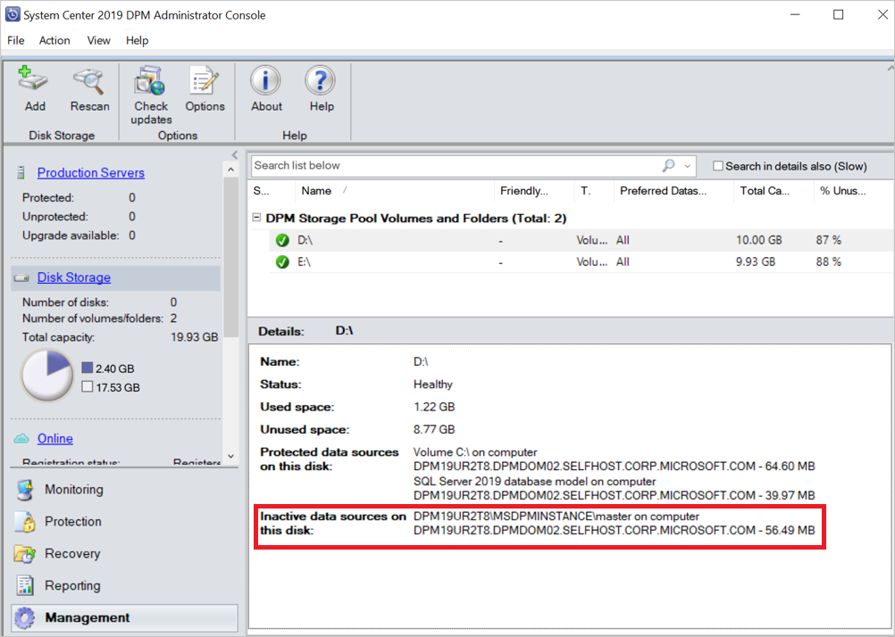

# Migrate data sources to new volumes

::: moniker range="sc-dpm-2016"

> [!NOTE]
> This feature is applicable for DPM 2016 UR10 and later.

::: moniker-end

This article provides information on how to migrate data sources from one volume to another.

There're various reasons why a [volume migration](add-storage.md#migrate-data-to-newly-created-volumes) is required:
- The underlying storage in the old volume can have fragmentation
- The old volume would've reached the limit of maximum allowed storage size
- You want to store your backups on a high-performance underlying storage

DPM supports the following two options to migrate data to a new volume:

- **Full migration (default)** - All the data for a particular data source is migrated from the current volume to the new volume. The time to complete the migration is based on the size of the protected data source and the number and size of the recovery points. Larger data sources or data sources with a large number of recovery points takes more time to migrate to the other volume.

- **Optimized migration** - Allows you to move data sources to the new volume much faster. The enhanced migration process migrates only the active backup copy (active replica) to the new volume. All the new recovery points are created on the new volume, while the existing recovery points are maintained on the existing volume and are purged as per the retention policy.

::: moniker range="sc-dpm-2019"

   > [!NOTE]
   > This option is applicable from DPM 2019 UR2 and later.

   ::: moniker-end

  To use this option, first, add the registry key as per the details below:

  - **Key Path**: HKLM\SOFTWARE\Microsoft\Microsoft Data Protection Manager\Configuration\DiskStorage <br>
  - **Type**: DWORD <br>
  - **Name**: OptimizedMigrate <br>
  - **Value**: 1

## Migrate data sources to new volumes using console

Follow these steps:

1. In the DPM administrator console, select **Protection**.

2. In the **Protection** workspace, select the data source you want to migrate.

   

3. Select **Move Disk Storage**.

   

4. Select the *target disk storage* that you want to migrate to and select **OK**.

   

   This begins the migration process. For monitoring scheduled jobs, you can open another DPM console in parallel while the migration is in progress.

## Migrate data sources to new volumes using PowerShell

   Here's an example for migrating a data source from one volume to the other volume using PowerShell cmdlets:

```powershell
   #Create a modifiable Protection Group of the PG the datasource is in.
   $pg = Get-DPMProtectionGroup
   $mpg = Get-DPMModifiableProtectionGroup $pg[0]
   #Get the datasource you wish to migrate, and the volume you wish to migrate it to.
   $ds = Get-DPMDatasource $mpg
   $vols = Get-DPMDiskStorage -Volumes
   #Modify the disk allocation for the datasource, and save the PG.
   Set-DPMDatasourceDiskAllocation -ProtectionGroup $mpg -Datasource $ds[0] -TargetStorage $vols[0] -MigrateDatasourceDataFromDPM
   Set-ProtectionGroup $mpg
```

   These steps give you more control over your storage while giving you the flexibility to balance storage utilization across volume.

## Monitor storage consumption of migrated data source using optimized migration

After you complete the optimized volume migration, you can view the details of the total amount of storage consumed by the data source and the details of the recovery points.

Use the following tabs to view the required information:

- In the **Protection** tab:

   - **Storage consumed** – displays the storage consumed across both the existing and new volumes.
   - **Latest recovery point** – displays the latest recovery point on the new volume.
   - **Oldest recovery point** – displays the oldest recovery point across both the volumes.
   - **Total recovery point** – displays the sum of recovery points on both the volumes.

   

- In the **Management** tab:

   - Migrated data source is listed under **Protected data sources on this disk** on the new volume.

     

   - On the existing volume, the data source is displayed under **Inactive data sources on this disk**. As per the retention policies, the inactive data source and the recovery points are purged.

     
