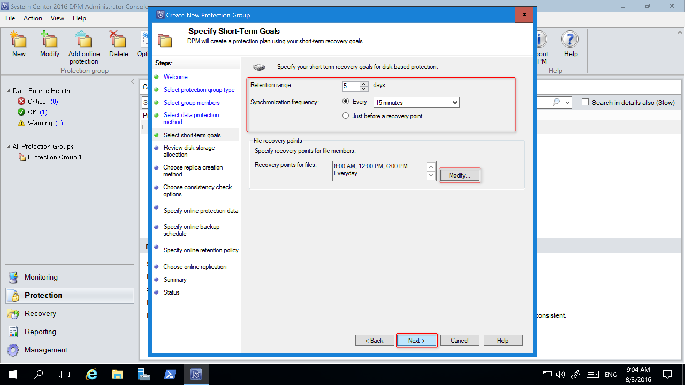
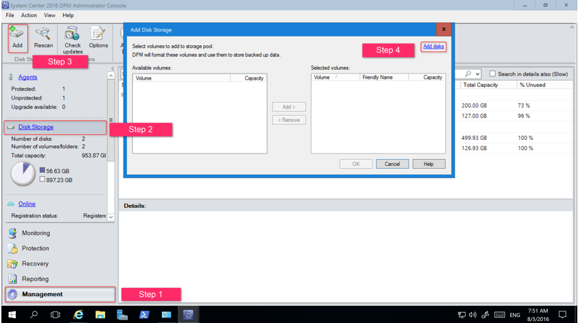

# Upgrade to System Center 2016

>Applies To: System Center 2016

If you are already running System Center 2012 R2 you can upgrade your environment to System Center 2016 by following the procedures and guidance in this article. Microsoft only supports upgrading from System Center 2012 R2 from one of the supported update rollup installations listed in the supported upgrade paths sections.


> [!IMPORTANT]
> Make sure you are upgrading to a supported platform by reviewing the [System Requirements topics](../system-requirements/system-requirements-for-system-center-technical-preview.md).

## Supported upgrade paths
Microsoft supports the following upgrade paths.

|Component|Previous Version|
|---------|----------------|
|Data Protection Manager|System Center 2012 R2 with UR10 or later|
|Operations Manager|System Center 2012 R2 with UR9 or later|
|Orchestrator|System Center 2012 R2 with UR9 or later|
|Service Manager|System Center 2012 R2 with UR9 or later|
|Service Provider Foundation|See the SPF section for details|
|Virtual Machine Manager|System Center 2012 R2 with UR9 or later

## Component Specific Notes

The following sections provide detailed considerations for each component.

### DPM Upgrade Notes

You can install DPM 2016 on Windows Server 2012 R2 with Update Rollup 10, or on Windows Server 2016. However, before you upgrade or install DPM 2016, please read the [Installation prerequisites](../dpm/get-started/get-dpm-installed.md#BKMK_Prereq).


### Upgrade path for DPM 2016
If you are going to upgrade from a previous version of DPM to DPM 2016, make sure your installation has the necessary updates:

- Upgrade DPM 2012 R2 to DPM 2012 R2 Update Rollup 10. You can obtain the Update Rollups from Windows Update.
- Upgrade DPM 2012 R2 Update Rollup 10 to DPM 2016.
- Update the agents on the protected servers.
- Upgrade Windows Server 2012 R2 to Windows Server 2016.
- Upgrade DPM Remote Administrator on all production servers.
- Backups will continue without rebooting your production server.


### Upgrade steps for DPM

1. To install DPM, double-click Setup.exe to open the System Center 2016 Wizard.
2. Under Install, click Data Protection Manager. This starts Setup. Agree to the license terms and conditions and follow the setup wizard.

Some DPM 2016 features, such as Modern Storage (MDS), require the Windows Server 2016 RTM build. It is possible to upgrade DPM 2016 from DPM 2012 R2, running on Windows Server 2012 R2. However, customers receiving DPM 2016 will want the latest features, so Microsoft recommends installing DPM 2016 on a new installation of Windows Server 2016 RTM. For instructions on installing DPM, see the article, [Installing DPM 2016](../dpm/get-started/get-dpm-installed.md).

### Adding Storage for Modern Storage (MDS)

To store backups efficiently, DPM 2016 uses Volumes. Disks can also be used to continue storing backups like DPM 2012 R2.

#### Add Volumes and Disks
If you run DPM 2016 on Windows Server, you can use volumes to store backup data. Volumes provide storage savings and faster backups. You can give the volume a friendly name, and you can change the name. You apply the friendly name while adding the volume, or later by clicking the **Friendly Name** column of the desired volume. You can also use PowerShell to add or change friendly names for volumes.

To add a volume in the administrator console:

1. In the DPM Administrator console, select the **Management** feature > **Disk Storage** > **Add**.

2. In the **Add Disk Storage** dialog, select an available volume > click **Add** > type a friendly name for the volume ** > click **OK**.

      

If you want to add a disk, it must belong to a protection group with legacy storage. Those disks can only be used for those protection groups. If the DPM server doesn't have sources with legacy protection, the disk won't appear.
See the topic, [Adding disks to increase legacy storage](upgrade-to-system-center-2016.md#adding-disks-to-increase-legacy-storage), for more information on adding disks. You can't give disks a friendly name.


#### Assign Workloads to Volumes

DPM 2016 allows the user to specify which kinds of workloads should be assigned to which volumes. For example, expensive volumes that support high IOPS can be configured to store only the workloads that require frequent, high-volume backups like SQL with Transaction Logs.
To update the properties of a volume in the storage pool on a DPM server, use the PowerShell cmdlet, Update-DPMDiskStorage.

**Update-DPMDiskStorage**

**Syntax**

`Parameter Set: Volume`

```
Update-DPMDiskStorage [-Volume] <Volume> [[-FriendlyName] <String> ] [[-DatasourceType] <VolumeTag[]> ] [-Confirm] [-WhatIf] [ <CommonParameters>]
```

The changes made through PowerShell are reflected in the UI.


### Protecting Data Sources
To begin protecting data sources, create a Protection Group. The following procedure highlights changes or additions to the **New Protection Group** wizard.

To create a Protection Group:

1. In the DPM Administrator Console, select the **Protection** feature.

2. On the tool ribbon, click **New**.

    The **Create new Protection Group** wizard opens.

  

3. Click **Next** to advance the wizard to the **Select Protection Group Type** screen.  
4. On the **Select Protection Group Type** screen, select the type of Protection Group to be created and then click **Next**.

  

5. On the **Select Group Members** screen, in the **Available members** pane, DPM lists the members with protection agents. For the purposes of this example, select volume D:\ and E:\ to add them to the **Selected members** pane. Once you have chosen the members for the protection group, click **Next**.

  

6. On the **Select Data Protection Method** screen, type a name for the **Protection group**, select the protection method(s) and click **Next**.
    If you want short term protection, you must use Disk backup.

  

7. On the **Specify Short-Term Goals** screen specify the details for **Retention Range** and **Synchronization Frequency**, and click **Next**. If desired, click **Modify** to change the schedule when recovery points are taken.

  

8. The **Review Disk Storage Allocation** screen provides details about the selected data sources, their size, the **Space to be Provisioned**, and **Target Storage Volume**.

  

  The storage volumes are determined based on the workload volume allocation (set using PowerShell) and the available storage. You can change the storage volumes by selecting other volumes from the drop-down menu. If you change the **Target Storage**, the **Available disk storage** dynamically changes to reflect the **Free Space** and **Underprovisioned Space**.

  The **Underprovisioned Space** column in **Available disk storage**, reflects the amount of additional storage needed if the data sources grow as planned. Use this value to help plan your storage needs to enable smooth backups. If the value is zero, then there are no potential problems with storage in the foreseeable future. If the value is a number other than zero, then you do not have sufficient storage allocated  - based on your protection policy and the data size of your protected members.

  

The remainder of the New Protection Group wizard is unchanged from DPM 2012 R2. Continue through the wizard to complete creation of your new protection group.  

### Migrating legacy storage to Modern Storage
After upgrading DPM 2012 R2 to DPM 2016 and the operating system to Windows Server 2016, you can update your existing protection groups to the new DPM 2016 features. By default, protection groups are not changed, and continue to function as they were configured in DPM 2012 R2. Updating protection groups to use modern storage is optional. To update the protection group, stop protection of all data sources with Retain Data, and add the data sources to a new protection group. DPM begins protecting these data sources the new way.

1. In the Administrator Console, select the **Protection** feature, and in the **Protection Group Member** list, right-click the member, and select **Stop protection of member...**.

  

    The **Remove from Group** dialog opens.

2. In the **Remove from Group** dialog, review the used disk space and the available free space in the storage pool. The default is to leave the recovery points on the disk and allow them to expire per their associated retention policy. Click **OK**.

    If you want to immediately return the used disk space to the free storage pool, select **Delete replica on disk**. This will delete the backup data (and recovery points) associated with that member.

    

3. Create a new protection group that uses Modern Storage. and include the unprotected data sources.


### Adding Disks to increase legacy storage

If you want to use legacy storage with DPM 2016, it may become necessary to add disks to increase legacy storage. To add disk storage:

1. On the Administrator Console, click **Management**.

2. Select **Disk Storage**.

3. On the tool ribbon click **Add**.

    The **Add Disk Storage** dialog opens.

    

4. In the **Add Disk Storage** dialog, click **Add disks**.

    DPM provides a list of available disks.

5. Select the disks, click **Add** to add the disks, and click **OK**.

### New PowerShell cmdlets

For DPM 2016, two new cmdlets are available. The reference for these new cmdlets are provided in this Upgrade section. For General Availability, the DPM 2016 PowerShell reference on TechNet will be updated.

#### Mount-DPMRecoveryPoint

Mounts the recovery point for a Data source.

**Syntax**
`
Parameter Set: Datasource
`

`
Mount-DPMRecoveryPoint [-Datasource] <Datasource> [[-RecoveryPoint] <RecoverySource>] [-Confirm] [-WhatIf] [ <CommonParameters>]
`

**Detailed Description**

Mounts the replica volume for data source. Replica volume needs to be dismounted after using it by running *Dismount-DPMRecoveryPoint* cmdlet. Keeping the replica volume mounted may lead to backup job failures.

**PARAMETERS**

`
-Datasource<Datasource> Specifies the data source for which the replica needs to be mounted.
`

`
Aliases:	None

Required?	True

Position?	1

Default Value:	None

Accept Pipeline Input?	true(ByValue)

Accept Wildcard Characters?	False


`
-RecoveryPoint <RecoverySource> Specifies a recovery point which is mounted with this cmdlet.
`

Aliases:	None

Required?	False

Position?	named

Default Value	None

Accept Pipeline Input?	true(ByValue)

Accept Wildcard Characters?	False
`

`
-CONFIRM Prompts you for confirmation before running the cmdlet.
`

Required?	false

Position?	named

Default Value	false

Accept Pipeline Input?	false

Accept Wildcard Characters?	false

`
-WHATIF  Shows what would happen if the cmdlet runs. The cmdlet is not run.
`

Required?	false

Position?	named

Default Value	false

Accept Pipeline Input?	false

Accept Wildcard Characters?	false

**COMMONPARAMETERS** This cmdlet supports the common parameters:


`-Debug, -ErrorAction, -ErrorVariable, -InformationAction, -InformationVariable, -OutVariable, -OutBuffer, -PipelineVariable, -Verbose, -WarningAction, and -WarningVariable.
`

` For more information, see about_CommonParameters.

*Inputs* - The input type is the type of the objects that you can pipe to the cmdlet.

*Outputs* - The output type is the type of the objects that the cmdlet emits.

**EXAMPLES**

EXAMPLE 1: MOUNT A RECOVRERY POINT
```
PS C:\> $datasource = Get-DPMDatasource -DPMServerName “TestingServer”
PS C:\> Mount-DPMRecoveryPoint -Datasource $datasource[0]
```

First command uses the Get-DPMDatasource cmdlet to get the Data sources on the DPM server named TestingServer. It stores them in the $datasource variable.
Second command mounts the replica for this data source.


#### Dismount-DPMRecoveryPoint

Dismounts the recovery point for a Data source.

**Syntax**
`
Parameter Set: Datasource
`

`
Dismount-DPMRecoveryPoint [-Datasource] <Datasource> [[-RecoveryPoint] <RecoverySource>] [-Confirm] [-WhatIf] [ <CommonParameters>]
`

** Detailed Description**

Dismounts the replica volume for data source. Replica volume needs to be dismounted after being mounted manually as keeping the replica volume mounted may lead to backup job failures.

** PARAMETERS**

`
-DATASOURCE<DATASOURCE>  Specifies the data source for which the replica needs to be dismounted.
`


Aliases	None

Required?	True

Position?	1

Default Value	None

Accept Pipeline Input?	true(ByValue)

Accept Wildcard Characters?	False

`
-RECOVERYPOINT <RECOVERYSOURCE>  Specifies a recovery point which is dismounted with this cmdlet.
`


Aliases	None

Required?	False

Position?	named

Default Value	None

Accept Pipeline Input?	true(ByValue)

Accept Wildcard Characters?	False

`
-CONFIRM  Prompts you for confirmation before running the cmdlet.
`

Required?	false

Position?	named

Default Value	false

Accept Pipeline Input?	false

Accept Wildcard Characters?	false

`
-WHATIF  Shows what would happen if the cmdlet runs. The cmdlet is not run.
`

Required?	false

Position?	named

Default Value	false

Accept Pipeline Input?	false

Accept Wildcard Characters?	false

**COMMONPARAMETERS**  This cmdlet supports the common parameters:


`
 -Debug, -ErrorAction, -ErrorVariable, -InformationAction, -InformationVariable, -OutVariable, -OutBuffer, -PipelineVariable, -Verbose, -WarningAction, and -WarningVariable.
`

For more information, see about_CommonParameters.

*Inputs* - The input type is the type of the objects that you can pipe to the cmdlet.

*Outputs* - The output type is the type of the objects that the cmdlet emits.

**EXAMPLES**

EXAMPLE 1: DISMOUNT A RECOVRERY POINT

`
PS C:\> $datasource = Get-DPMDatasource -DPMServerName “TestingServer”
PS C:\> Dismount-DPMRecoveryPoint -Datasource $datasource[0]
`

First command uses the Get-DPMDatasource cmdlet to get the Data sources on the DPM server named TestingServer. It stores them in the $datasource variable.
Second command dismounts the replica VHD for this data source.

#### Enable Cloud Protection

You can back up a DPM server to Azure. The high level steps are:
- create an Azure subscription,
- register the server with the Azure Backup service,
- download vault credentials and the Azure Backup Agent,
- configure the server's vault credentials and backup policy,

For more information on backing up DPM to the cloud, see the article, [Preparing to backup workloads to Azure with DPM] (https://azure.microsoft.com/en-us/documentation/articles/backup-azure-dpm-introduction/).

### OM Upgrade
[!NOTE]
If your Operations Manager 2012 R2 management group is integrated with Microsoft Operations Management Suite (OMS), its configuration will be retained and continue to function normally after the upgrade is complete.  

> [!WARNING]
> If you are upgrading two or more System Center components, you must follow the procedures that are documented in Upgrade Sequencing for System Center 2012 R2.
>  
> The order in which you perform component upgrades is important. Failure to follow the correct upgrade sequence might result in component failure for which no recovery options exist. The affected System Center components are:
  > 1. Configuration Manager
  > 2. Data Protection Manager
  > 3. Orchestrator
  > 4. Configuration Manager
  > 5. Virtual Machine Manager

Before you upgrade to System Center 2016 - Operations Manager, you must first determine whether all servers in your Operations Manager management group meet the minimum supported configurations. For more information, see System Requirements: System Center 2016 - Operations Manager.

There are several options for upgrade:

1. If you run upgrade on a single-server management group, you only need to run upgrade one time since all features are installed on a single server. The Operations Manager Upgrade wizard performs system prerequisite checks and provides resolution steps for any issues. Installation will not continue until you resolve all issues.

2. If you are upgrading a distributed management group, you must upgrade certain features before others. For example, you upgrade the management servers first, followed by the gateways, operations consoles, and then agents. Next, you can upgrade any remaining features, such as the web console, reporting and Audit Collection Services (ACS). You must also perform a number of pre-upgrade and post-upgrade tasks.

3. If you want to maintain your Operations Manager 2012 R2 environment you can install System Center 2016 - Operations Manager in parallel and upgrade your agents and multi-home between both management groups.

#### High Level Overview of System Center 2016 Operations Manager Upgrade Steps for a Distributed Management Group

The following steps outline the process for upgrading a distributed management group:

1. Accomplish Pre-Upgrade Tasks

2. Upgrade the initial management server and then additional management servers (each management server must be upgraded)

3. Upgrade ACS (because the ACS server must be on same machine as a management server, we recommend you perform this step along with the upgrade of the management server on which ACS resides.)

4. \*Upgrade Gateway(s)

5. Upgrade Console

6. Push Install to Agent(s) / Upgrading Manually Installed Agents

7. Upgrade Web Console

8. Upgrade Reporting Server

9. Perform Post-Upgrade Tasks

\*Steps 4 through 8 can be performed in parallel after all Management Servers have been upgrade.


### Orchestrator Upgrade Notes

Before you upgrade:

1. Ensure that there are no pending restarts on the computer.
2. Perform a full back up  of Orchestrator database. For information about backing up the Orchestrator database, see the <a href ="https://technet.microsoft.com/en-us/library/hh852622(v=sc.12).aspx">How to Back up Orchestrator </a> topic.
3. Upgrade the hardware, operating system, and other software if necessary to meet the requirements of Orchestrator in System Center 2016.

Upgrading:

1. Stop all Orchestrator runbooks.
2. Uninstall the Orchestrator management server, any runbook servers, the Web Service, and the Runbook Designer.
3. Install the Orchestrator management server in System Center 2016, as described [here](../orch/deploy/Install-Orchestrator.md).
4. Install any Orchestrator runbook servers in System Center 2016.
5. Install the Orchestrator Runbook Designer in System Center 2016.
6. If needed, install the Orchestrator Web Service in System Center 2016.


### SMA Upgrade Notes

Before you upgrade:

1. Perform a full backup of the SMA database as a precaution. This is a standard SQL Server database, and you can standard tools and processes for [backing up SQL Server](http://go.microsoft.com/fwlink/p/?LinkId=216936).
2. Upgrade the hardware, operating system, and other software if necessary to meet the requirements of Service Management Automation in System Center 2016.

Upgrade:

1. If SMA servers are being monitored by Operations Manager, put them in maintenance mode to prevent false alerts.
2. Uninstall the SMA web service and SMA runbook workers using the instructions at <a href="https://technet.microsoft.com/en-us/library/dn469636(v=sc.12).aspx">How to uninstall Service Management Automation</a> for details.
3. Install the SMA runbook workers using the instructions at [How to install the Service Management Automation runbook worker](../sma/Deploy/How-to-install-the-Service-Management-Automation-runbook-worker.md).
4. Install the SMA web service using the instructions at [How to install the Service Management Automation web service](../sma/Deploy/How-to-install-the-Service-Management-Automation-web-service.md).
5. Remove SMA servers from maintenance mode.

### SM Upgrade Notes

- For Service Manager data warehouse database restoration, the Reporting database also needs to be restored after you install the data warehouse.
- Use the published information for the order of System Center components as well as Service Manager components.
- Do not mix Service Manager 2016 and Service Manager 2012 R2 with different Service Manager components - all should use the same version. For example, both the Self Service portal and the Service Manager management server  should use the same version.
- When upgrading from Service Manager 2012 R2 to Service Manager 2016, you should not enable or disable the Active Directory group expansion for any of the Active Directory connectors.

    In other words, if it is off, let it remain off and if it is on, let it remain on until the connector runs for the first time. See the screenshot below. This applies only to the first time that the Active Directory connector runs after you upgrade. You can change your preferences for Active Directory group expansion workflow after the first time that the Active Directory connector sync completes.

    

#### Upgrade steps for custom development
With the System Center 2016 - Service Manager release, the product has moved to support .Net 4.5.1. The tool set to support this movement to .Net 4.5.1 required to break a few dependencies and has led to the movement of classes across the assemblies. Hence, the upgrade to Service Manager 2016 may break the custom solutions made in house or by 3rd party (non-Microsoft). Please refer the [steps to upgrade your custom solutions](https://blogs.technet.microsoft.com/servicemanager/2016/08/03/scsm-2016-upgrade-steps-for-custom-development/), to avoid getting into this problem.

#### Upgrade steps for Service Manager Self Service Portal
##### - Upgrading the Self Service Portal from a standalone installation of the Service Manager 2012 R2 Silverlight-based Self Service portal
Use the following steps to upgrade your Self Service portal and Service Manager management servers when they are **installed on different computers**.

On the Service Manager 2012 R2 Silverlight Self Service Portal:
1. Uninstall the Silverlight-based Self Service portal. Support for Silverlight was removed with Service Manager 2016.
2. Install the new HTML5-based Self Service Portal, using the information at [Deploy the Self-Service Portal for Service Manager](../sm/deploy/Deploy-the-Self-Service-Portal-for-Service-Manager.md)

##### - Upgrading the Self Service Portal from a standalone installation of the Service Manager 2012 R2 HTML5-based Self Service portal
Use the following step to upgrade your Self Service portal and Service Manger management servers when they are **installed on different computers**.

1. Upgrade the Self Service portal directly from Service Manager 2012 R2 to Service Manager 2016.

##### - Upgrading the Silverlight-based Self Service Portal from Service Manager 2012 R2, which is installed on same computer as the Service Manager **secondary** management server
1.  Uninstall Service Manager 2012 R2. This step uninstalls the management server role from the computer.
2.  Upgrade the primary Management Server from Service Manager 2012 R2 to Service Manager 2016.
3.  Install the secondary Management Server 2016 role on new computer.
4.  Install the Service Manager 2016 version of the Self Service Portal (HTML5) on same computer as the secondary management server.

##### - Upgrading the Silverlight-based Self Service Portal from Service Manager 2012 R2, which is installed on same computer as the Service Manager **primary** management server
Installing the Self Service portal on the same computer as the primary management server is not recommended. However, in the event that you are using this combination, then use the following steps to upgrade to Service Manager 2016. Enabling the upgrade is the first step to move the primary Management Server to a Secondary management server by using the following steps

1.	Add new the Service Manager 2012 R2 secondary management server to a management group.
2.	Promote the secondary management server to a primary management server role, which will move the current primary management server to a secondary role.
3.	Follow the steps mentioned in the "Upgrading the Silverlight-based Self Service Portal from Service Manager 2012 R2, which is installed on same computer as the Service Manager **secondary** management server"  section of this document, or in the "Upgrading the HTML5-based Self Service Portal from Service Manager 2012 R2, which is installed on same computer as the Service Manager **secondary** management server" section of this document, to upgrade your management server and Self Service portal to Service Manager 2016.


##### - Upgrading the HTML5-based Self Service Portal from Service Manager 2012 R2, which is installed on same computer as the Service Manager **secondary** management server
1.	**Do not uninstall the Self Service Portal or Management Server, attempting uninstallation might create an unstable state**
2.	Download and install the patch "SM2016SSP_UpgradeFix_20160601.exe" from [here](http://go.microsoft.com/fwlink/?LinkID=798214) (installation instructions are available on the same link)
3.	Upgrade both primary and secondary Management Servers from Service Manager 2012 R2 to Service Manager 2016.
4.	Self Service Portal will also get upgraded along with the secondary management server.

##### - Upgrading the HTML5-based Self Service Portal from Service Manager 2012 R2, which is installed on same computer as the Service Manager **primary** management server
*Installing the Self Service portal on the same computer as the primary management server is not recommended.* However, in the event that you are using this combination, then use the following steps to upgrade to Service Manager 2016.

1.	**Do not uninstall the Self Service Portal or Management Server, attempting uninstallation might create an unstable state **
2.	Download and install the patch "SM2016SSP_UpgradeFix_20160601.exe" from [here](http://go.microsoft.com/fwlink/?LinkID=798214) (installation instructions are available on the same link)
3.	Upgrade the primary Management Server from Service Manager 2012 R2 to Service Manager 2016.
4.	Self Service Portal will also get upgraded along with the primary management server.


##### - Upgrading the Self Service Portal from Service Manager 2016 Technical Preview 5 Self Service portal (stand alone or with a management server)
  You can upgrade the Self Service portal directly from Service Manager 2016 Technical Preview 5 to Service Manager 2016.

### SPF Upgrade Notes

- If you have integrated SPF with Windows Azure Pack, your version of Windows Azure Pack must be running Update Rollup 10 or later. Also, both System Center 2012 R2 - VMM and SPF must be running Update Rollup 9 or later.

### VMM Upgrade Notes

### Steps for installing VMM
You will follow  the same general steps for upgrading to System Center 2016 from System Center 2012 R2 for all System Center components. The general steps are:
1. Uninstall the 2012 R2 version of the component with "retain database" option if appropriate.
2. Upgrade the operating system to a version supported with System Center 2016.
3. Install any other software required by the component (see list below).
4. Install the new version of the component with the "Upgrade database" option if appropriate.

- For all upgrades to VMM 2016 you can either continue with the current version of SQL Server, or, you can upgrade to the supported version of SQL Server. Review [SQL Server Requirements](../system-requirements/SQL-server-version-compatibility-for-system-center-technical-preview.md) for the list of supported versions of SQL Server.
- You can upgrade both host and guest VMM agents from the VMM console.

#### Upgrading a highly available VMM environment.

The following procedures describe the steps to take if you are upgrading a  VMM management server deployed on a highly available cluster.

1.	Backup and retain the VMM database
2.	Uninstall VMM 2012 R2 from the highly available passive node.
3.	Upgrade to Windows Server 2016 and to a supported version of SQL Server on the passive node.
4.	Upgrade to the Windows 10 version of the ADK.
5.  Install System Center 2016 – Virtual Machine Manager in the highly available environment and when prompted, upgrade the database.
6.  Failover to the passive node.
7.  Repeat steps 2 - 5 for the other nodes in your HAVMM environment.
8.	[Optional] Install the appropriate SQL Command line utilities.

Note: If the VMMM database is hosted on a SQL Server running in the "Always on" mode, and the VMM database is in the availability group, you must remove it from the availability group before upgrading the SQL Server to a later version.
