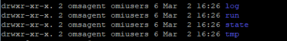

---
ms.assetid:
title: include file
description: This include file details the Linux log file monitoring in Operations Manager
author: jyothisuri
ms.author: jsuri
ms.date:  05/08/2023
ms.topic:  include
ms.service: system-center
ms.subservice: operations-manager
---

## Overview of configuration

Log file monitoring requires the following steps. The detailed information is provided in the following sections:

::: moniker range="sc-om-2019"
1. Import the [latest System Center Operations Manager 2019 Linux management pack](https://www.microsoft.com/download/details.aspx?id=58208).
2. Install the latest version of the Linux agent on each Linux computer to be monitored.
3. Install latest [OMSAgent](https://github.com/microsoft/OMS-Agent-for-Linux) on each Linux computer to be monitored.
4. Create Fluentd configuration file to collect logs.
5. Copy configuration file to Linux agents.
6. Create rules and monitors using the sample management pack to collect events from the log and create alerts.
::: moniker-end
::: moniker range="sc-om-2022"
1. Import the [latest System Center Operations Manager 2022 Linux management pack](https://www.microsoft.com/download/details.aspx?id=104213).
2. Install the latest version of the Linux agent on each Linux computer to be monitored.
3. Install latest [OMSAgent](https://github.com/microsoft/OMS-Agent-for-Linux) on each Linux computer to be monitored.
4. Create Fluentd configuration file to collect logs.
5. Copy configuration file to Linux agents.
6. Create rules and monitors using the sample management pack to collect events from the log and create alerts.
::: moniker-end

## Install the log monitoring management pack

Install the **Microsoft.Linux.Log.Monitoring** management pack to enable Linux log file monitoring.

> [!NOTE]
> If you have the OMS agent configured and you try to uninstall UNIX and LINUX agent from the console, then OMS component won't be uninstalled from the agent.


## Configure Linux log file monitoring

To configure Linux log file monitoring, perform the following steps:

::: moniker range="sc-om-2019"
1. Import the [latest System Center Operations Manager 2019 Linux management pack](https://www.microsoft.com/download/details.aspx?id=58208) using the standard process for installing a management pack.
2. Install the new Linux agent on the Linux servers manually or by [using Discovery wizard](/system-center/System Center Operations Manager/manage-deploy-crossplat-agent-console).
3. Install the latest OMSAgent on each Linux computer that you want to monitor.
   Use the following commands:

   ```bash
   # Download latest OMS Agent from GitHub
   wget https://raw.githubusercontent.com/Microsoft/OMS-Agent-for-Linux/master/installer/scripts/onboard_agent.sh
   
   # Run onboarding script
   sh onboard_agent.sh
   ```

   Perform the following steps on the Linux agent:

::: moniker-end
::: moniker range="sc-om-2022"
1. Import the [latest System Center Operations Manager 2022 Linux management pack](https://www.microsoft.com/download/details.aspx?id=104213) using the standard process for installing a management pack.
2. Install the new Linux agent on the Linux servers manually or by [using Discovery wizard](/system-center/System Center Operations Manager/manage-deploy-crossplat-agent-console).
3. Install the latest OMSAgent on each Linux computer that you want to monitor.
   Use the following commands:

   ```bash
   # Download latest OMS Agent from GitHub
   wget https://raw.githubusercontent.com/Microsoft/OMS-Agent-for-Linux/master/installer/scripts/onboard_agent.sh
   
   # Run onboarding script
   sh onboard_agent.sh
   ```

   Perform the following steps on the Linux agent:
::: moniker-end

 4. Create the folders in the following paths with the below commands:

      ```bash
      # Create omsagent.d folder
      mkdir -p /etc/opt/microsoft/omsagent/scom/conf/omsagent.d
      
      # Create certs folder
      mkdir /etc/opt/microsoft/omsagent/scom/certs
      
      # Create log folder
      mkdir -p /var/opt/microsoft/omsagent/scom/log
      
      # Create run folder
      mkdir /var/opt/microsoft/omsagent/scom/run
      
      # Create state folder
      mkdir /var/opt/microsoft/omsagent/scom/state
      
      # Create tmp folder
      mkdir /var/opt/microsoft/omsagent/scom/tmp
      
      # Create fluent-logging folder (used for log file position file, this location is flexible)
      mkdir -p /home/omsagent/fluent-logging
      ```
      
 5. Set ownership on each of the above folders to `omsagent:omiusers`:
      ```bash
      # Change owner of System Center Operations Manager folder
      chown omsagent:omiusers /etc/opt/microsoft/omsagent/scom
      
      # Change owner of log folder
      chown omsagent:omiusers /var/opt/microsoft/omsagent/scom/log
      
      # Change owner of run folder
      chown omsagent:omiusers /var/opt/microsoft/omsagent/scom/run
      
      # Change owner of state folder
      chown omsagent:omiusers /var/opt/microsoft/omsagent/scom/state
      
      # Change owner of tmp folder
      chown omsagent:omiusers /var/opt/microsoft/omsagent/scom/tmp
      
      # Change owner of fluent-logging folder (used for log file position file, this location is flexible)
      chown omsagent:omiusers /home/omsagent/fluent-logging
      ```
      

 6. Create omsagent and omsconfig files:
      ```bash
      # Create omsadmin.conf file
      touch /etc/opt/microsoft/omsagent/scom/conf/omsadmin.conf
      
      # Create omsagent.conf file
      touch /etc/opt/microsoft/omsagent/scom/conf/omsagent.conf
      ```
      
 7. Set ownership on each of the above files to `omsagent:omiusers`:
      ```bash
      # Change owner of omsadmin.conf file
      chown omsagent:omiusers /etc/opt/microsoft/omsagent/scom/conf/omsadmin.conf
      
      # Change owner of omsagent.conf file
      chown omsagent:omiusers /etc/opt/microsoft/omsagent/scom/conf/omsagent.conf
      ```
      
 8. Edit the file `/etc/opt/microsoft/omsagent/scom/conf/omsadmin.conf`, and add the following information after changing the highlighted information.
      > ```
      > WORKSPACE_ID=scom
      > System Center Operations Manager_ENDPOINT=https://<mark>\<MSFQDN\></mark>:8886
      > MONITORING_ID={274F8D7B-DBCA-8FC3-1451-8DCD55092156}
      > ```
   
 9. Restart the OMSAgent:
      ```bash
      /opt/microsoft/omsagent/bin/service_control restart
      ```

10. Verify the status in the omsagent log:
      ```bash
      tail -100 /var/opt/microsoft/omsagent/scom/log/omsagent.log
      ```


## Enable the OMED service
   Enable the OMED service on each management server in the resource pool, managing the Linux agents.

   The OMED service collects events from Fluentd and converts them to Operations Manager events. You import a custom management pack, which can generate alerts based on the events received from the Linux servers.

   You can enable the OMED service either from the Operations console or manually on the management server or gateway server.

# [Enable the OMED service from Operations console](#tab/OpsConsole)

1. From the Operations console, go to **Monitoring**>**Operations Manager**>**Management Server**>**Management Servers State**.
2. Select the management server in the **Management Servers state**.
3. From **Tasks**, select **Health Service Tasks**>**Enable System Center OMED Server**.

# [Enable the OMED service manually](#tab/Manually)
You have two options when enabling the OMED service manually on the management server, automatically via PowerShell or manually.

> #### Set automatically with PowerShell
>   Run the following PowerShell command as Administrator to set the **System Center Operations Manager External DataSource Service** to automatically start, and to start running:
>   ```PowerShell
>   Set-Service -Name OMED -StartupType Automatic -Status Running
>   ```

> #### Set manually with services.msc
>   1. Select **Start** in the **Start Search** box, enter **services.msc**, and then press **Enter**.
>   2. In the details pane, right-click the service **System Center Operations Manager External DataSource Service**, and select **Properties**.
>   3. On **General**, in **Startup** type, select **Automatic**, and select **OK**.
>   4. In the details pane, right-click **Service** and select **Start**.
---

### Add OMED Firewall Rule

In order to enable to OMED Firewall Rule you have two options, either add the port (TCP/8886) automatically via PowerShell or manually.

# [Automatically add rule with PowerShell](#tab/AutomaticFirewallRule)
Follow these steps to automatically add rule with PowerShell:

The following command allows you to automatically add the firewall rule:
```PowerShell
Set-NetFirewallRule -DisplayName "System Center Operations Manager External DataSource Service" -Direction Inbound -Action Allow -Protocol TCP -LocalPort 8886
```

# [Manually add rule with Windows Firewall](#tab/ManualFirewallRule)
Follow these steps to manually add rule with Windows Firewall:

1. Open Windows Defender Firewall with Advanced Security.
    1. Right-click the Windows icon in your taskbar and select **Run**.
    2. Enter in the run box: `wf.msc` and click OK.
2. Select **Inbound Rules**.
3. Right-click Inbound Rules and select: **New Rule...**
4. Select **Port**, click Next.
5. Select **TCP** and select **Specific local ports:**. Enter `8886`.
6. Select **Allow the connection**, click Next.
7. Select the Appropriate Profiles to apply the Firewall Rule (*Domain, Private, Public*).
8. Enter `System Center Operations Manager External DataSource Service`in the name box and select Finish.
---

## Assign a Client Certificate for OMSAgent

You have two options when assigning the client certificate for OMSAgent.

1. Link to the signed certificate from the OMI Agent.
2. Generate a client certificate manually for the OMS Agent.

Select the required tab for steps to link to the signed certificate from the OMI Agent or generate a client certificate manually from the OMS Agent:

# [Link OMI Agent Certificate to OMS Agent](#tab/LinkOMIAgentCertificate)

1. Set ownership on the `omi.pem` and `omikey.pem` file to `omsagent:omiusers`:
      ```bash
      # Change owner of System Center Operations Manager-cert.pem file
      chown omsagent:omiusers /etc/opt/microsoft/omsagent/scom/certs/scom-cert.pem
      
      # Change owner of System Center Operations Manager-key.pem file
      chown omsagent:omiusers /etc/opt/microsoft/omsagent/scom/certs/scom-key.pem
      ```

2. Run the following command on your Linux machine to set the OMS Agent Client Certificate to the OMI Certificate (*Operations Manager Linux Agent Certificate*):

      ```bash
      # Link file omi.pem to System Center Operations Manager-cert.pem
      ln -s /etc/opt/omi/ssl/omi.pem /etc/opt/microsoft/omsagent/scom/certs/scom-cert.pem
      
      # Link file omikey.pem to System Center Operations Manager-key.pem
      ln -s /etc/opt/omi/ssl/omikey.pem /etc/opt/microsoft/omsagent/scom/certs/scom-key.pem
      ```

# [Generate a Client Certificate for OMS Agent](#tab/GenerateOMSAgentCertificate)

Follow these steps to generate a client certificate for OMS Agent:

1. Generate the certificate and key to the ***omsagent*** folder: 
   ```bash
   # Generate Certificate to omsagent Folder
   /opt/microsoft/scx/bin/tools/scxsslconfig -c -g /etc/opt/microsoft/omsagent/scom/certs/
   ```

   > [!NOTE]
   > New certificate must be signed by the Management Server. To do this, copy to management server, sign the certificate using `scxcertconfig -sign`, and copy it back to the linux agent

2. Rename the generated certificate on the Linux side:
   ```bash
   # Rename omi-host-server.domain.pem to scom-cert.pem
   mv omi-host-server.domain.pem scom-cert.pem
   
   # Rename omikey.pem to scom-key.pem
   mv omikey.pem scom-key.pem
   ```
3. Change ownership of the certificate file:
   ```bash
   # Change owner of the scom-cert file
   chown omsagent:omiusers /etc/opt/microsoft/omsagent/scom/certs/scom-cert.pem
   
   # Change owner of the scom-key file
   chown omsagent:omiusers /etc/opt/microsoft/omsagent/scom/certs/scom-key.pem
   ```
---

## Create Fluentd configuration file

You configure Fluentd operation using a configuration file. To utilize log monitoring, you must create a configuration file. The configuration file includes information such as source log file name, path, and filters to define the data to collect.

The master Fluentd configuration file **omsagent.conf** is located in `/etc/opt/microsoft/omsagent/scom/conf/`. You can add log file monitoring configuration directly to this file, but should create a separate configuration file to better manage the different settings. You then use an @include directive in the master file to include your custom file.

For example, if you created **logmonitoring.conf** in `/etc/opt/microsoft/omsagent/scom/conf/omsagent.d`, you would add one of the following lines to the **omsagent.d** file:

```
# Include all configuration files
@include omsagent.d/*.conf
```
or
```
# Include single configuration file
@include omsagent.d/logmonitoring.conf
```

For more information on Fluentd configuration files, see [Fluentd Configuration file syntax](https://docs.fluentd.org/).

The following sections describe settings in different directives of the configuration file that are unique to log file monitoring. Each includes sample settings that you can paste into a configuration file and modify for your requirements.

A complete [sample configuration file for log monitoring](../scom/manage-sample-configuration-file.md) is available for you to review and evaluate before creating your own.

### Source

The **Source** directive defines the source of the data you're collecting which is where you define the details of your log file. Fluentd picks up each record written to the source and submits an event for it into Fluentd's routing engine. Specify a tag here in this directive. The tag is a string that is used as the directions for Fluentd's internal routing engine to correlate different directives.

The following example shows syslog records collected and tagged for processing by Operations Manager.

```
<source>

    # Specifies input plugin. Tail is a fluentd input plugin - http://docs.fluentd.org/v0.12/articles/in\_tail
    type tail

    # Specify the log file path. Supports wild cards.
    path /var/log/syslog

    # Recommended so that Fluentd will record the position it last read into this file.
    pos_file /home/user1/fluent-test/demo_syslog.log.pos

    # Used to correlate the directives.
    tag System Center Operations Manager.log.syslog

    format /(?<message>.*)/

</source>
```

### Filter

The  **filter**  directive has the same syntax as **Match** but allows more complex filtering of which data to process. Collected events must match the criteria of all the filters to be added to the output.

There are six filter plugins for log file monitoring described here. Use one or more of these filters to define the events that you want to collect from your log file.

- Simple match: filter_System Center Operations Manager_simple_match
- Exclusive match: filter_System Center Operations Manager_excl_match
- Repeated correlation: filter_System Center Operations Manager_repeated_cor
- Correlated match: filter_System Center Operations Manager_cor_match
- Exclusive correlation: filter_System Center Operations Manager_excl_correlation
- Operations Manager converter: filter_System Center Operations Manager_converter

Select the required tab to copy the code for the respective filter plugin:

# [Simple match](#tab/Simple)

Takes up to 20 input patterns. Sends an event to Operations Manager whenever any pattern is matched.

```
<filter tag>

    type filter_System Center Operations Manager_simple_match
    regexp1 <key> <pattern>
    event_id1 <event ID>
    regexp2 <key> <pattern>
    event_id2 <event ID>
    .
    .
    .
    regexp20 <key> <pattern>
    event_id20 <event ID>
</filter>
```

# [Exclusive match](#tab/ExclusiveMatch)

Takes two input patterns. Sends an event to Operations Manager when a single record matches pattern 1 but doesn't match pattern 2.

```
<filter tag>
    type filter_System Center Operations Manager_excl_match
    regexp1 <key> <pattern1>
    regexp2 <key> <pattern2>
    event_id <event ID>
</filter>
```

# [Repeated correlation](#tab/Repeated)

Takes three inputs: a patterns, a time interval, and  number of occurrences. When a match is found for the first pattern, a timer starts. An event is sent to Operations Manager if the pattern is matched the specified number of times before the timer ends.

```
<filter tag>
    type filter_System Center Operations Manager_repeated_cor
    regexp <key> <pattern>
    event_id <event ID>
    time_interval <interval in seconds>
    num_occurences <number of occurrences>
</filter>
```

# [Correlated match](#tab/Correlated)

Takes three inputs: two patterns and a time interval. When a match is found for the first pattern, a timer starts. An event is sent to Operations Manager if there's a match for the second pattern before the timer ends.

```
<filter tag>
    type filter_System Center Operations Manager_cor_match
    regexp1 <key> <pattern1>
    regexp2 <key> <pattern2>
    event_id <event ID>
    time_interval <interval in seconds>
</filter>
```

# [Exclusive correlation](#tab/Exclusive)

Takes three inputs: two patterns and a time interval. When a match is found for the first pattern, a timer starts. An event is sent to Operations Manager if there's no match for the second pattern before the timer ends.

```
<filter tag>
    type filter_System Center Operations Manager_excl_correlation
    regexp1 <key> <pattern1>
    regexp2 <key> <pattern2>
    event_id <event ID>
    time_interval <interval in seconds>
</filter>
```

# [Operations Manager converter](#tab/OpsManagerConverter)

Sends an event to Operations Manager for all records it receives. Sends the specified event ID and description as part of the event.

```
<filter tag>
    type filter_System Center Operations Manager_converter
    event_id <event ID>
    event_desc <event description>
</filter>
```
---

### Match

The **match** directive defines how to process events collected from the source with matching tags. Only events with a **tag** matching the pattern are sent to the output destination. When multiple patterns are listed inside one **match** tag, events can match any of the listed patterns. The **type** parameter specifies the type of plugin to use for these events.

This example processes events with tags matching **System Center Operations Manager.log.** \*\* and  **System Center Operations Manager.alert**  (\*\* matches zero or more tag parts). It specifies the  **out\_System Center Operations Manager**  plugin, which allows the events to be collected by the Operations Manager management pack.

```
<match System Center Operations Manager.log.** System Center Operations Manager.event>

    # Output plugin to use
     type out_System Center Operations Manager

    log_level trace
    num_threads 5

    # Size of the buffer chunk. If the top chunk exceeds this limit or the time limit flush_interval, a new empty chunk is pushed to the top of the
    queue and bottom chunk is written out.
    buffer_chunk_limit 5m
    flush_interval 15s

    # Specifies the buffer plugin to use.
    buffer_type file

    # Specifies the file path for buffer. Fluentd must have write access to this directory.
    buffer_path /var/opt/microsoft/omsagent/scom/state/out_System Center Operations Manager_common*.buffer

    # If queue length exceeds the specified limit, events are rejected.
    buffer_queue_limit 10

    # Control the buffer behavior when the queue becomes full: exception, block, drop_oldest_chunk
    buffer_queue_full_action drop_oldest_chunk

    # Number of times Fluentd will attempt to write the chunk if it fails.
    retry_limit 10

    # If the bottom chunk fails to be written out, it will remain in the queue and Fluentd will retry after waiting retry_wait seconds
    retry_wait 30s

    # The retry wait time doubles each time until max_retry_wait.
    max_retry_wait 9m

</match>
```

> [!NOTE]
> To disable Server Authentication on the Linux computers that are using Fluentd communication, add a parameter **enable\_server\_auth false** to the Operations Manager plugin for Fluentd, such as the following:

```
<match System Center Operations Manager.log.** System Center Operations Manager.event>
type out_System Center Operations Manager

max_retry_wait 9m
enable_server_auth false

</match>
```

## Copy configuration file to agent

The Fluentd configuration file must be copied to **/etc/opt/microsoft/omsagent/scom/conf/omsagent.d** on all Linux computers you want to monitor. You must also add an @include directive in the master configuration file as described above.

## Restart omsagent

You can run the following command to restart the omsagent:
```bash
/opt/microsoft/omsagent/bin/service_control restart
```

## Check status of System Center Operations Manager Workspace

Run the following command to check the System Center Operations Manager Workspace on the OMSAgent:
```bash
sh /opt/microsoft/omsagent/bin/omsadmin.sh -l
```

> [!NOTE]
> On the Management Server running the OMED service, ensure the firewall on port 8886 is open and that the intermediate certificate authorities cert store only contains intermediate certificate authorities.

## Event Log for System Center Operations Manager External DataSource Service

The **System Center OMED Service** event log is created only when there's an event sent successfully to the System Center Operations Manager External DataSource Service (OMED) Service.

## Create rules and monitors

The Linux management pack doesn't provide modules to collect events from FluentD, the Linux management pack is bundled with the Linux agent. It's the fluentd module in the Linux agent and the OMED service on the management and gateway server that provides the capabilities for enhanced log file monitoring.

You need to create your own management pack with custom rules and monitors that use the module **Microsoft.Linux.OMED.EventDataSource** to collect the events from Fluentd. Be aware, the computer name in the Event sent via the **System Center OMED Service** event log has to match the name of the machine in your UNIX/Linux Computers view. If the computer name doesn't match you won't receive any alert.

The following table lists the parameters of **Microsoft.Linux.OMED.EventDataSource**.

| Parameter| Type | Description |
| --- | --- | --- |
| ComputerName | String | Required. Specifies the name of the Linux computer for which events are to be read. The ComputerName parameter is most commonly passed to the module by using the $Target notation, although it can be specified as any string. This module attempts to read events generated by the given Linux computer. |
| ManagedEntityId | String | Required. Specifies the managed entity ID of monitored entity. The ManagedEntityId parameter is most commonly passed to module by using $Target\Id$. |
| EventNumber | Integer | Optional. Indicates the event number of the event to retrieve. If this option is omitted, the module returns all the events generated for that computer and managed entity |
