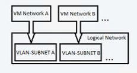

This article describes how to create logical networks in System Center Virtual Machine Manager (VMM). VMM offers a simplified flow of logical network creation. It supports network types and illustrations in the product based on use cases.

You have different types of networks in your organization, such as corporate networks and management networks. In VMM, each of these networks is defined as a logical network. Logical networks are logical objects that mirror your physical networks.

When you create logical networks, you assign them properties that match your physical environment. You specify the type of logical network and the associated network sites. You specify static address pools if you don't use DHCP to assign IP addresses to VMs that you create in the network site. You also specify whether networks are isolated physically or virtually by using network virtualization and virtual LANs (VLANs).

You use logical networks when you provision virtualization hosts in the VMM fabric. You associate physical adapters on hosts with logical networks.

VMM virtual machine (VM) networks are based on logical networks. VM networks provide an interface through which VMs connect to a logical network. A logical network can have a single VM network or multiple VM networks mapped to it.

## Before you start

Before you start, it's important to understand how logical networks work in VMM.

- **Automatic logical networks**: By default, VMM creates logical networks automatically. When you provision a host in the VMM fabric and there's no VMM logical network associated with a physical network adapter on that host, VMM automatically creates a logical network and associates it with an adapter. By default, for the logical network, VMM assigns the first DNS suffix label of the connection-specific DNS suffix. By default, VMM also creates a connected VM network.
- **Manual logical networks**: When you create a logical network manually, you specify:
    - **Network type**: Specify whether the network is a connected network or an independent network and the type of connected network. Then when you create VM networks based on the logical network, they're created with the type of network you specified.

        - **Connected network**: The VLAN and subnet pairs of the underlying physical networks are logically equivalent. A single VM network is created on top of this logical network, and this VM network provides access to all the underlying VLAN-subnet pairs. This network type was earlier known as *One Connected Network*.

            

            **Example scenario**:
            Enterprise Contoso needs a network to host their DevTest workloads. This network might have multiple VLANs or subnets. Contoso creates a logical network of the type *Connected network*. VMM is responsible for assigning the VLAN or subnet to the VMs based on the host group on which the VM is placed.

       - **Independent network**: Multiple VM networks can be created on top of this logical network. Each VM network created provides access to a specific VLAN-subnet pair. The VM networks are independent of each other.

         

           There are two types of independent networks:
           - VLAN-based independent networks
           - PVLAN-based independent networks

           **Example scenario**:
           Woodgrove IT is a host. Woodgrove IT has Contoso and Fabrikam as its tenants. Both Contoso and Fabrikam need a DevTest network. Contoso's network must be isolated from that of Fabrikam. All VMs of Contoso must be connected to the *Contoso-DevTest* VM network. The VMs of Fabrikam must be connected to the *Fabrikam-DevTest* VM network.

           Woodgrove IT creates a logical network of the *Independent network* type and names it *DevTest*. This logical network has two VLAN-subnet pairs. Two VM networks are created on top of this logical network, and each VM network gets access to a specific VLAN-subnet. One VM network is named *Contoso-DevTest* and is provided for Contoso's use. The other VM network is named *Fabrikam-DevTest* and is provided for Fabrikam's use.

- **Virtualized network**:
    This is the fabric network. Multiple virtualized VM networks can be created on top of this logical network. Each VM network has its own virtualized address space.

    

    >[!NOTE]
    >- A typical setup might be an infrastructure network with no isolation or VLAN isolation, a load balancer back end and internet-facing network with PVLAN, and tenant networks with isolation using network virtualization.
    >- You can use only one type of isolation on a single logical network. If you do need isolation, you need multiple logical networks.
    >- There's a practical limit of approximately 2,000 tenants and approximately 4,000 VM networks for a single VMM server.

- **Network sites**: If your organization has different locations and datacenters, you can include information about those sites in your logical network settings. For example, you can specify a New York site with an IP subnet and VLAN settings. You can specify a London site with different IP or VLAN settings. You can then assign an IP address to VMs based on network, location, and VLAN settings.

    >[!NOTE]
    >- Assign an IP subnet to a site if VMM is going to distribute static IP addresses to VMs in the site. If you use DHCP, you don't need a subnet.
    >- Configure a VLAN if one is used in your physical site. If you don't use VLANs and you use DHCP, you don't need to define network sites in your logical network.

## Create logical networks automatically

If you want VMM to automatically create logical networks (and VM networks), you can specify how VMM determines the logical network name.

1. Select **Settings** > **General**. Double-click **Network Settings**.
1. Configure the **Logical network matching** setting.

    >[!NOTE]
    >- For Hyper-V hosts, you can use the entire DNS suffix label or the first one. For example, if the DNS suffix is corp.contoso.com, the logical network is corp-contoso.com or just corp. This capability isn't supported for VMware hosts.
    >- For Hyper-V and VMware hosts, you can select the network connection name or the virtual network switch name. The switch name is the name of the virtual network switch to which the physical adapter of the host is bound.
    >- By default, VMware hosts use the virtual network switch option.
    >- You can also specify a fallback option if the first logical matching fails.

If you don't want VMM to create logical and VM networks automatically, you can disable the global setting.

1. Select **Settings** > **General**. Double-click **Network Settings**.
1. Clear **Create logical networks automatically**.

## Create logical networks manually

1. In VMM console, go to **Fabric** > **Home** > **Show** > **Fabric Resources**. In **Fabric**, expand **Networking** > **Logical Networks** > **Home** > **Create** > **Create Logical Network**.
1.  In the **Create Logical Network Wizard**, select **Name**, and specify a name and description.

1.  Specify how you want to isolate VM networks associated with this logical network.

    

    To simplify logical network creation, descriptions and illustrations of the logical network types are available in VMM. Each type of logical network has an in-product description and an illustration that describes the use case.

    - If you want to create a single VM network that has access to all the underlying VLAN-subnet pairs, choose **Connected network**. Here, the VLAN and IP subnet pairs of the underlying physical network are logically equivalent.
        - To allow Microsoft Network Controller to manage the logical network, choose **Managed by Microsoft Network controller**.
        - If the logical network provides public IP addresses, choose **IP address network**.
    - To create multiple VM networks that are independent of each other, choose **Independent Network**. Each VM network will have access to a specific VLAN subnet pair or a PVLAN subnet pair.
    - To create a multiple virtualized VM network that has its own virtualized address space, choose **Virtualized network**.

1. In **Network Site**, add network sites to the logical network. If you don't need to create network sites, select **Next**.

    IP pools can be created when you add network sites in the **Create Logical Network Wizard**.

    - **DHCP no VLAN**: If you use DHCP to allocate IP addresses and you don't have VLANs, you don't need a network site. 
      > [!NOTE]
      > VMM automatically suggests a site name. A network name is limited to a length of 64 characters.
      
    - **Static IP**: If you use static IP addresses, create at least one network site and associate at least one IP subnet with it.
    - **VLAN**: If you use VLANs with static IP addressing, create corresponding network sites for the VLAN and subnet pairs. If you use DHCP, create corresponding network sites for VLAN information only.
    - **Network virtualization**: If you use network virtualization, create at least one network site with an associated IP subnet so that the logical network has an IP address pool.
    - **Load balancer**: If the logical network will contain a load balancer, create at least one network site with an associated IP subnet.
1. If you use an external network managed by a vendor network management console or virtual switch extension manager outside VMM, you can configure settings in the vendor console and import them into VMM.
1. In **Host groups that can use this network site**, select each host group to which you want to make the logical network available.
1. In **Associated VLANs and IP subnets**, select **Insert Row** to specify the settings that you want to assign to the network site. If you select **PVLAN**, you need to add a **Secondary VLAN** for each VLAN. Ensure that the VLANs and subnets are available in your physical network. If you leave the **VLAN** field empty, VMM assigns a value of 0 to indicate that VLANs aren't used. In trunk mode, 0 indicates a native VLAN.
1. If you created network sites and associated one or more IP subnets with them (when you're not using DHCP), you can create static IP address pools from those subnets. Then VMM can automatically allocate IP addresses to VMs in the network site. IP pools can be created within the **Create Logical Network Wizard**.

To set up an IP address pool on a logical network, [follow these steps](../vmm/network-pool.md#create-a-static-address-pool-for-a-logical-network).

## Next steps

- [Create a VM network](../vmm/network-virtual.md).
- [Set up static IP address pools in the VMM fabric](../vmm/network-pool.md).