## Upgrade to DPM 2016

You can install DPM 2016 on Windows Server 2012 R2 or on Windows Server 2016. If you're installing DPM 2016 on Windows Server 2012 R2, you must upgrade an existing DPM installation from DPM 2012 R2 with Update Rollup 10 or greater. Before you upgrade or install DPM 2016, read the [Installation prerequisites](../dpm/install-dpm.md#setup-prerequisites).


>[!NOTE]
> If you use DPM 2012 R2 to protect VMware VMs, you can't upgrade to DPM 2016 even after you stop the protection. Upgrade fails with an error *34517 - DPM 2016 does not support VMware Backup yet*. To fix this issue, follow the upgrade procedure [here](/troubleshoot/system-center/dpm/upgrade-dpm-vmware-vm-protection).

## Upgrade path for DPM 2016
If you're going to upgrade from a previous version of DPM to DPM 2016, ensure that your installation has the necessary updates:

- Upgrade DPM 2012 R2 to DPM 2012 R2 Update Rollup 10. You can obtain the Update Rollups from Windows Update.
- Upgrade DPM 2012 R2 Update Rollup 10 to DPM 2016.
- Update the agents on the protected servers.
- Upgrade Windows Server 2012 R2 to Windows Server 2016.
- Upgrade DPM Remote Administrator on all production servers.
- Backups will continue without rebooting your production server.


### Upgrade steps for DPM

1. To install DPM, double-click Setup.exe to open the System Center 2016 Wizard.
2. Under Install, select Data Protection Manager to start the setup wizard. Agree to the license terms and conditions and follow the setup wizard.

Some DPM 2016 features, such as Modern Backup Storage, require the Windows Server 2016 RTM build. It's possible to upgrade DPM 2016 from DPM 2012 R2, running on Windows Server 2012 R2. However, customers receiving DPM 2016 will want the latest features, so Microsoft recommends installing DPM 2016 on a new installation of Windows Server 2016 RTM. For instructions on installing DPM, see the article [Installing DPM 2016](../dpm/install-dpm.md).

## Migrating the DPM database during upgrade

You may want to move the DPM Database as part of an upgrade. For example:
- You're merging instances of SQL Server. 
- You're moving to a remote, more powerful SQL Server.
- You want to add fault tolerance by using a SQL Server cluster
- You want to move from a remote SQL server to a local SQL server or vice versa.

DPM 2016 setup allows you to migrate the DPM database to different SQL Servers during an upgrade.

### Possible database migration scenarios

1. Upgrading DPM 2012 R2 using a local instance and migrating to a remote instance of SQL Server during setup.
2. Upgrading DPM 2012 R2 using a remote instance and migrating to a local instance of SQL Server during setup.
3. Upgrading DPM 2012 R2 using a local instance and migrating to a remote SQL Server Cluster instance during setup.
4. Upgrading DPM 2012 R2 using a local instance and migrating to a different local instance of SQL Server during setup.
5. Upgrading DPM 2012 R2 using a remote instance and migrating to a different remote instance of SQL Server during setup.
6. Upgrading DPM 2012 R2 using a remote instance and migrating to a remote SQL Server Cluster instance during setup.

### Preparing for a database migration

The new SQL Server that you want to use to migrate the DPM database to must have the same SQL Server requirements, setup configuration, firewall rules, and DPM Support files (sqlprep) installed before performing the DPM Upgrade.

Once you've the new instance of SQL Server installed and prepped for use by DPM, you must create a backup of the current DPM 2012 R2 UR10 KB3143871 (4.2.1473.0) or a later database and restore it on the new SQL Server.

### Pre-upgrade steps: Back up and restore DPM 2012 R2 DPM database to a new SQL instance

In this example, we'll prepare a remote SQL Server cluster to use for the migration.

1. On the System Center Data Protection Manager 2012 R2 server or on the remote SQL Server hosting the DPM database, start **Microsoft SQL Management Studio** and connect to the SQL instance hosting the current DPM 2012 R2 DPMDB.
2. Right-click the DPM database, and under **Tasks**, select the **Back Up…** option.

      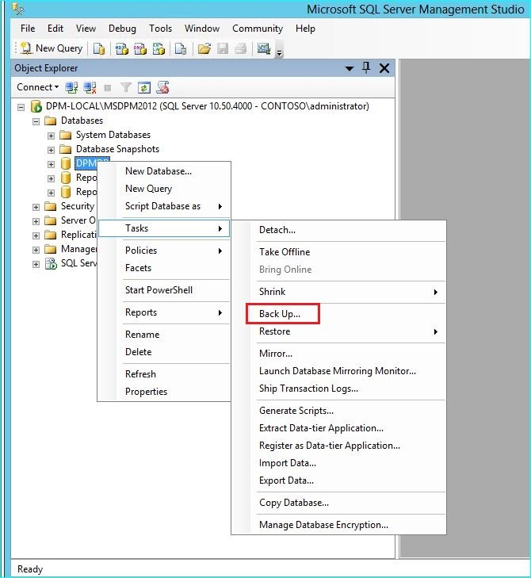

3. Add a backup destination and file name, and then select **OK** to start the backup.

      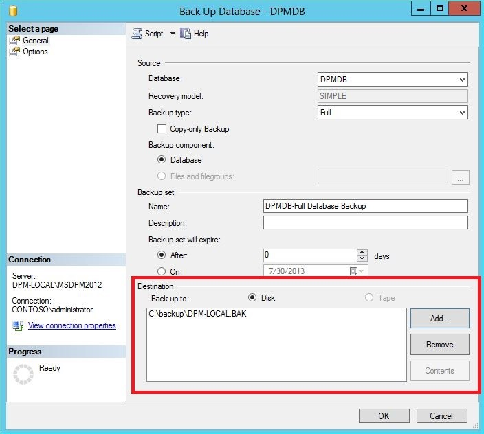

4. After the backup is complete, copy the output file to the remote SQL Server.  If this is a SQL Cluster, copy it to the active node hosting the SQL instance you want to use in the DPM upgrade.  You've to copy it to the Shared Cluster disk before you can restore it.
5. On the Remote SQL Server, start **Microsoft SQL Management Studio** and connect to the SQL instance you want to use in the DPM upgrade. If this is a SQL Cluster, do this on the Active node that you copied the DPM backup file to. The backup file should now be located on the shared cluster disk.
6. Right-click the Databases icon, then select the **Restore Database…** option. This starts the restore wizard.

      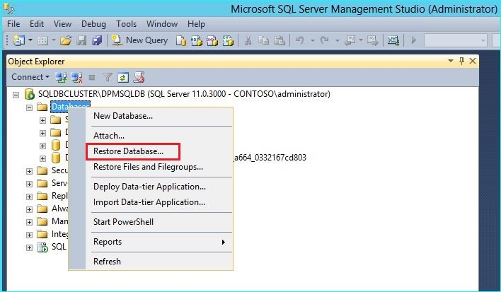        

7. Select **Device** under **Source**, and then locate the database backup file that was copied in the previous step and select it. Verify the restore options and restore location, and then select **OK** to start the restore. Fix any issue that arises until the restore is successful.

      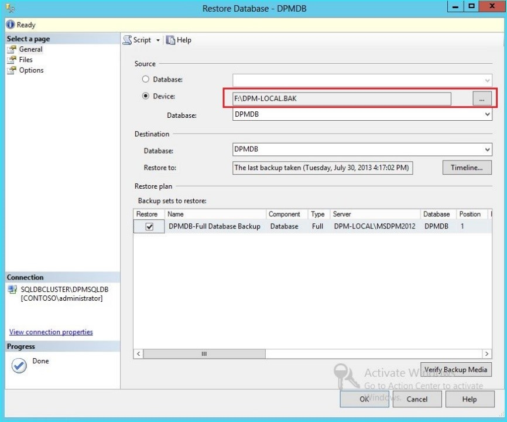

8. After the restore is complete, the restored database will be seen under the **Databases** with the original name. This Database will be used during the upgrade. You can exit **Microsoft SQL Management Studio** and start the upgrade process on the original DPM Server.

      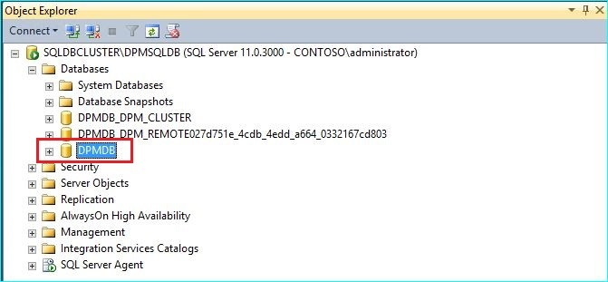

9. If the new SQL Server is a remote SQL Server, install the SQL management tools on the DPM server. The SQL management tools must be the same version matching the SQL Server hosting the DPMDB.

### Starting upgrade to migrate DPMDB to a different SQL Server

> [!NOTE]
> If sharing a SQL instance, run the DPM installations (or upgrades) sequentially. Parallel installations may cause errors.

1. After the pre-migration preparation steps are complete, start the DPM 2016 Installation process. DPM setup shows the information about current instance of SQL Server pre-populated. This is where you can select a different instance of the SQL Server or change to a Clustered SQL instance used in the migration.

      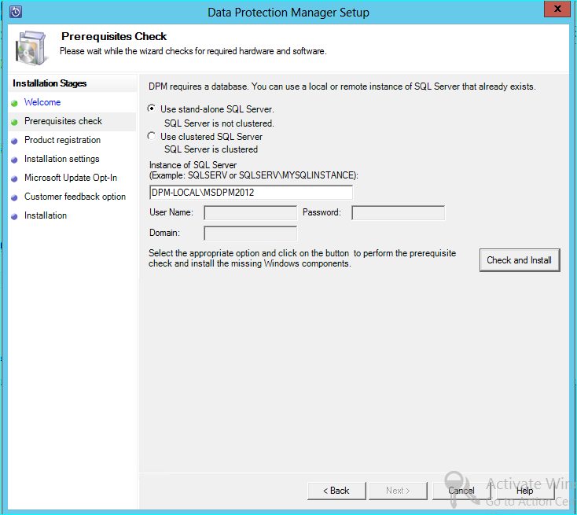

2. Change the SQL Settings to use the instance of SQL Server you restored the DPM Database to. If it’s a SQL cluster, you must also specify a separate instance of the SQL Server used for SQL reporting. It's presumed that firewall rules and SQLPrep have already run. You've to enter the correct credentials and then select the **Check and Install** button.

      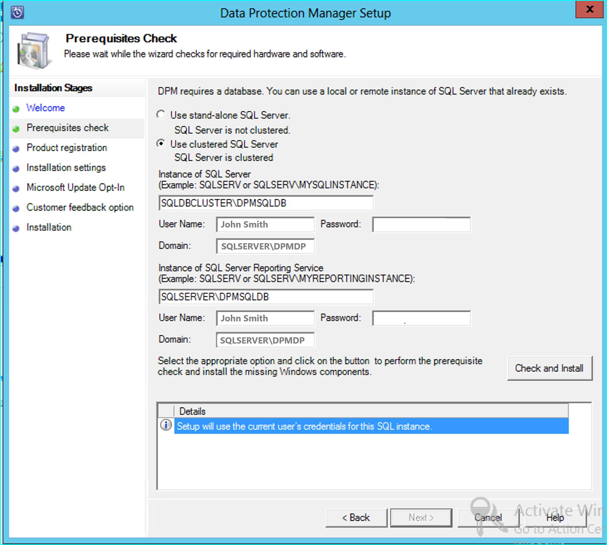

3. Prerequisite check should succeed, and then press **NEXT** to continue with the upgrade.

      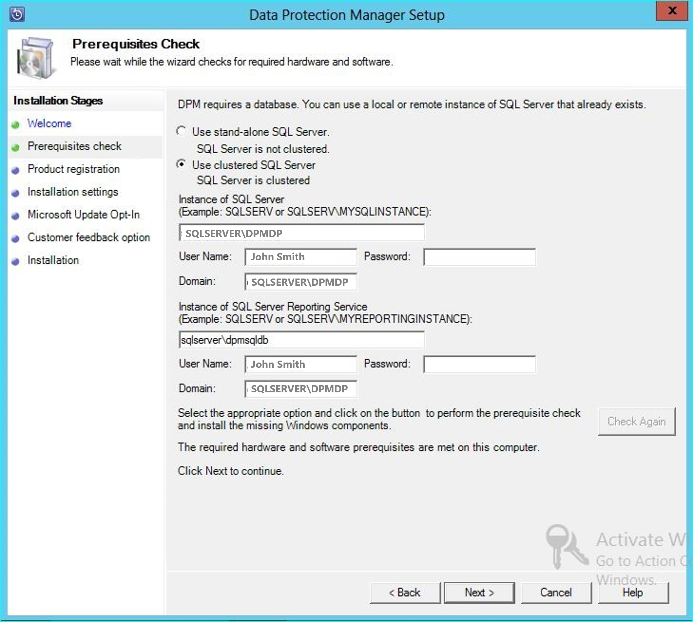

4. Continue with the wizard options and complete the setup.

5. After setup is complete, the corresponding database name on the instance specified will now be DPMPB_DPMServerName. As this may be shared with other DPM servers, the naming convention for the DPM database will now be: DPM2016$DPMDB_DPMServerName

## Adding Storage for Modern Backup Storage

To store backups efficiently, DPM 2016 uses volumes. Disks can also be used to continue storing backups like DPM 2012 R2.

### Add Volumes and Disks
If you run DPM 2016 on Windows Server, you can use volumes to store backup data. Volumes provide storage savings and faster backups. You can give the volume a friendly name, and you can change the name. You can apply the friendly name while adding the volume or later by selecting the **Friendly Name** column of the desired volume. You can also use PowerShell to add or change friendly names for volumes.

To add a volume in the administrator console:

1. In the DPM Administrator console, select the **Management** feature > **Disk Storage** > **Add**.

2. In the **Add Disk Storage** page, select an available volume > select **Add** > enter a friendly name for the volume > select **OK**.

      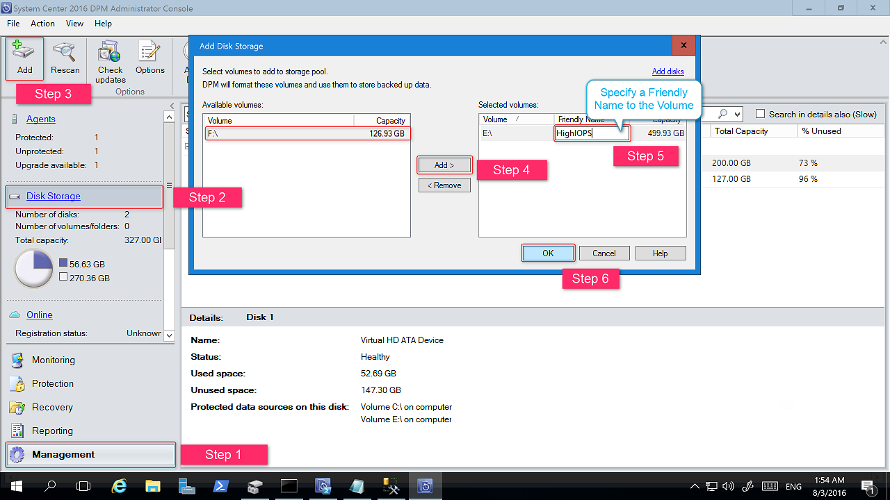

If you want to add a disk, it must belong to a protection group with legacy storage. Those disks can only be used for those protection groups. If the DPM server doesn't have sources with legacy protection, the disk won't appear.
For more information on adding disks, see [Screenshot showing how to add disks to increase legacy storage.](#adding-disks-to-increase-legacy-storage). You can't give disks a friendly name.


### Assign Workloads to Volumes

DPM 2016 allows the user to specify which kinds of workloads should be assigned to which volumes. For example, expensive volumes that support high IOPS can be configured to store only the workloads that require frequent, high-volume backups like SQL with transaction Logs.

To update the properties of a volume in the storage pool on a DPM server, use the PowerShell cmdlet *Update-DPMDiskStorage*.

**Update-DPMDiskStorage**

**Syntax**

`Parameter Set: Volume`

```
Update-DPMDiskStorage [-Volume] <Volume> [[-FriendlyName] <String> ] [[-DatasourceType] <VolumeTag[]> ] [-Confirm] [-WhatIf] [ <CommonParameters>]
```

The changes made through PowerShell are reflected in the UI.


## Protecting Data Sources
To begin protecting data sources, create a Protection Group. The following procedure highlights changes or additions to the **New Protection Group** wizard.

To create a Protection Group:

1. In the DPM Administrator Console, select the **Protection** feature.

2. On the tool ribbon, select **New**.

    The **Create new Protection Group** wizard opens.

   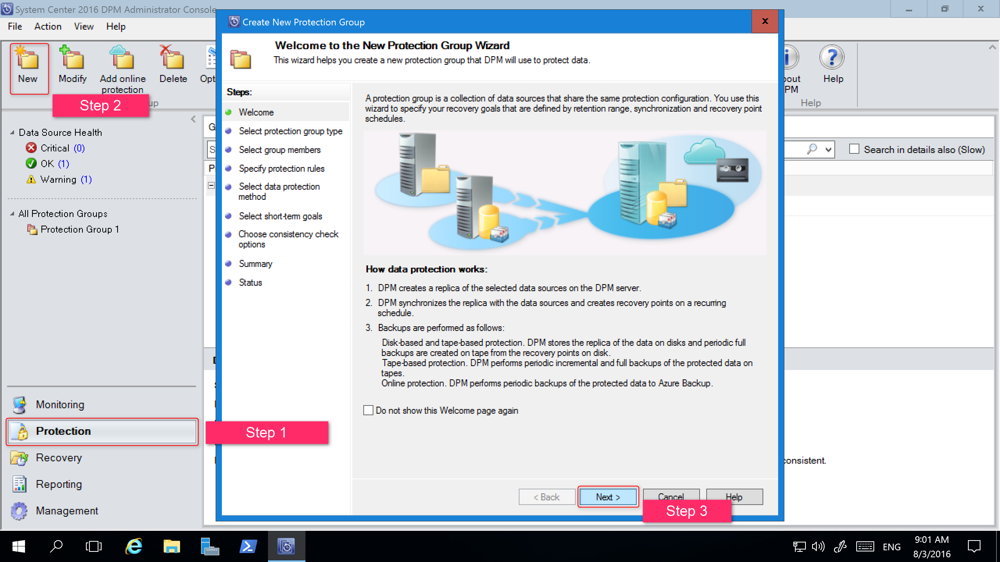

3. Select **Next** to advance the wizard to the **Select Protection Group Type** screen.
4. On the **Select Protection Group Type** screen, select the type of Protection Group to be created and then select **Next**.

   

5. On the **Select Group Members** screen, in the **Available members** pane, DPM lists the members with protection agents. For the purposes of this example, select volume D:\ and E:\ to add them to the **Selected members** pane. Once you've chosen the members for the protection group, select **Next**.

   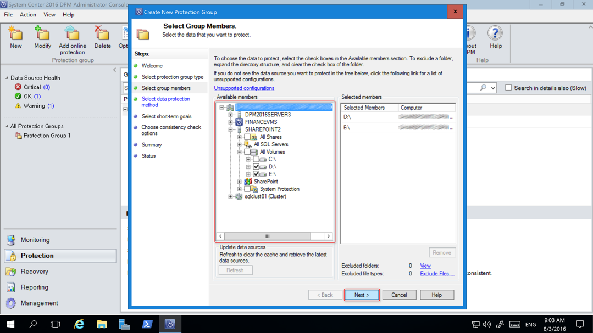

6. On the **Select Data Protection Method** screen, enter a name for the **Protection group**, select the protection method(s) and select **Next**.
    If you want short-term protection, you must use Disk backup.

   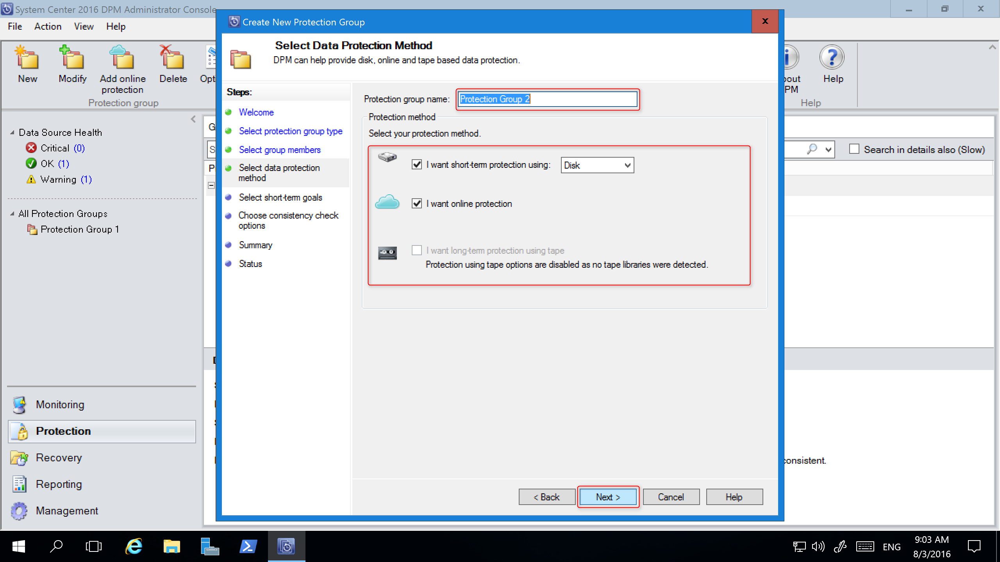

7. On the **Specify Short-Term Goals** screen, specify the details for **Retention Range** and **Synchronization Frequency**, and select **Next**. If desired, select **Modify** to change the schedule when recovery points are taken.

   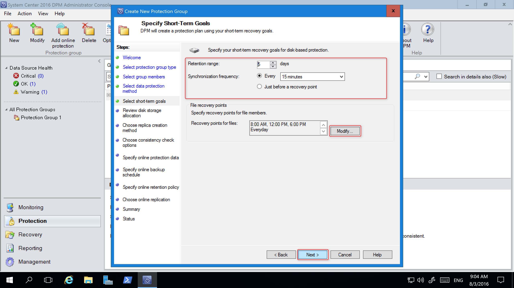

8. The **Review Disk Storage Allocation** screen provides the details about the selected data sources, their size, the **Space to be Provisioned**, and **Target Storage Volume**.

   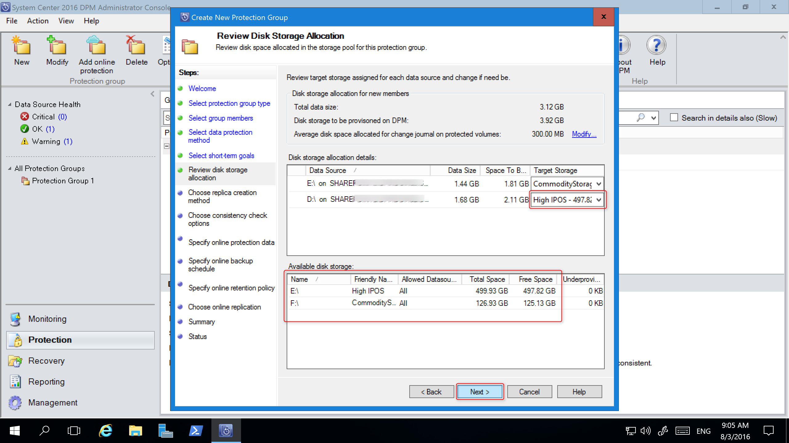

   The storage volumes are determined based on the workload volume allocation (set using PowerShell) and the available storage. You can change the storage volumes by selecting other volumes from the dropdown menu. If you change the **Target Storage**, the **Available disk storage** dynamically changes to reflect the **Free Space** and **Underprovisioned Space**.

   The **Underprovisioned Space** column in **Available disk storage** reflects the amount of additional storage needed if the data sources grow as planned. Use this value to help plan your storage needs to enable smooth backups. If the value is zero, then there are no potential problems with storage in the foreseeable future. If the value is a number other than zero, then you don't have sufficient storage allocated - based on your protection policy and the data size of your protected members.

   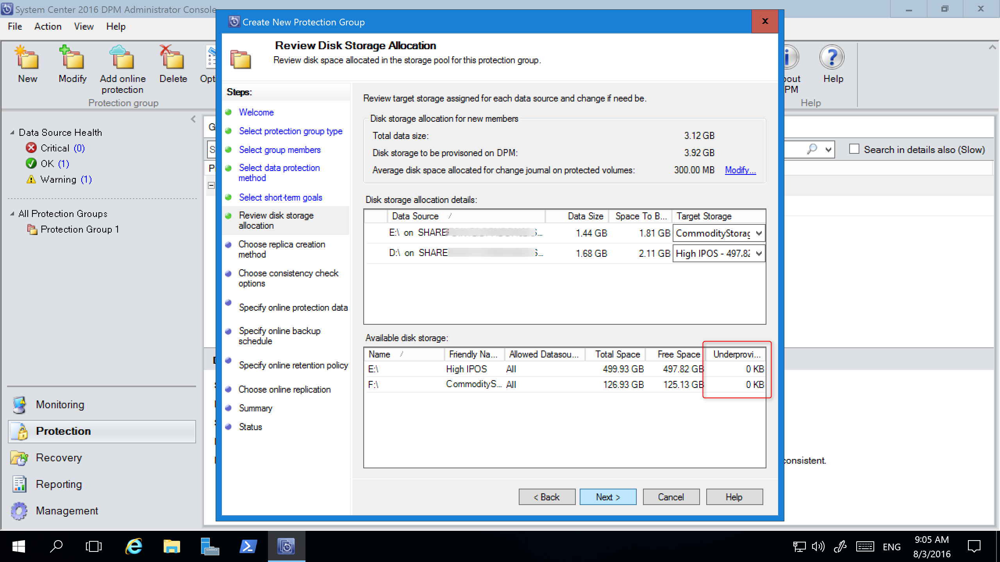

The remainder of the New Protection Group wizard is unchanged from DPM 2012 R2. Continue through the wizard to complete the creation of your new protection group.

## Migrating legacy storage to Modern Backup Storage
After upgrading DPM 2012 R2 to DPM 2016 and the operating system to Windows Server 2016, you can update your existing protection groups to the new DPM 2016 features. By default, protection groups aren't changed and continue to function as they were configured in DPM 2012 R2. Updating protection groups to use Modern Backup Storage is optional. To update the protection group, stop the protection of all the data sources with Retain Data and add the data sources to a new protection group. DPM begins protecting these data sources the new way.

1. In the Administrator Console, select the **Protection** feature, and in the **Protection Group Member** list, right-click the member and select **Stop protection of member...**.

   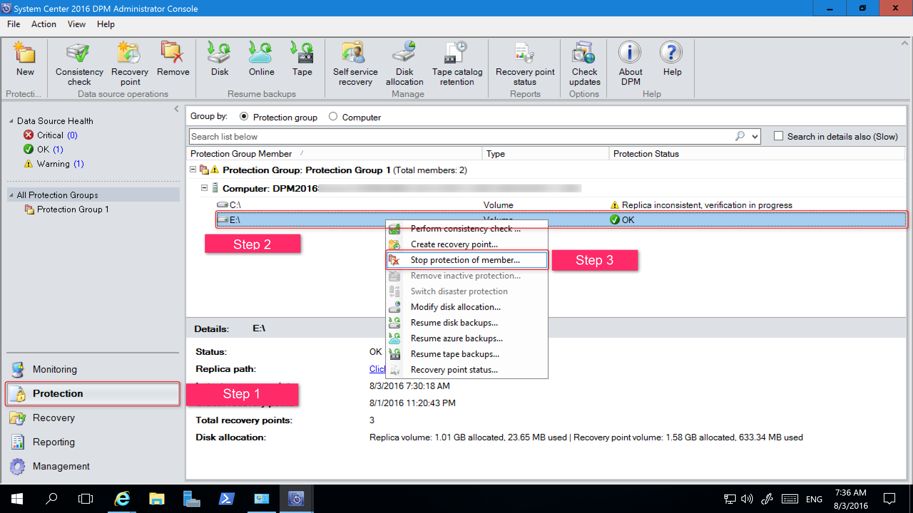

   The **Remove from Group** page opens.

2. In the **Remove from Group** page, review the used disk space and the available free space in the storage pool. The default is to leave the recovery points on the disk and allow them to expire per their associated retention policy. Select **OK**.

    If you want to immediately return the used disk space to the free storage pool, select **Delete replica on disk**. This will delete the backup data (and recovery points) associated with that member.

    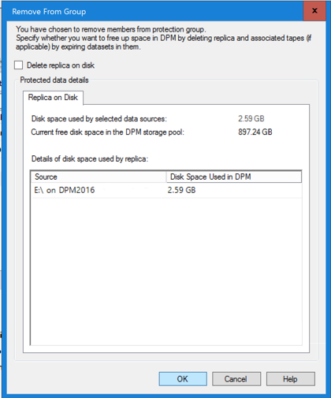

3. Create a new protection group that uses Modern Backup Storage and include the unprotected data sources.

## Adding Disks to increase legacy storage

If you want to use legacy storage with DPM 2016, it may become necessary to add disks to increase legacy storage. To add disk storage:

1. On the Administrator Console, select **Management**.

2. Select **Disk Storage**.

3. On the tool ribbon, select **Add**.

    The **Add Disk Storage** page opens.

    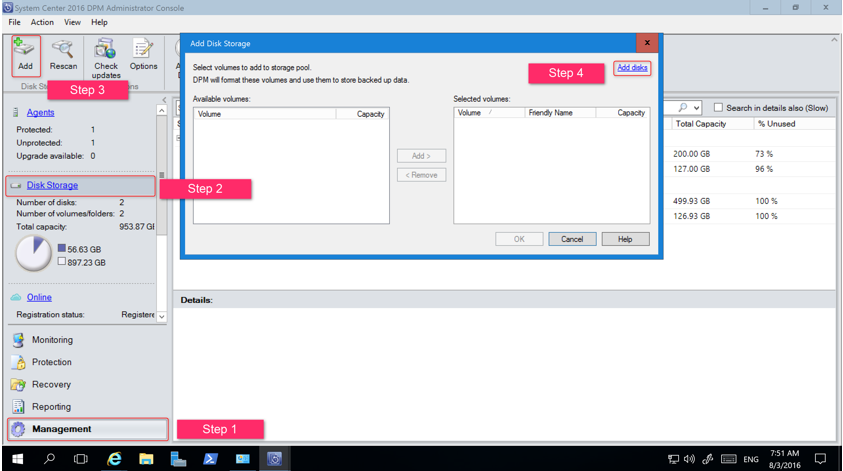

4. In the **Add Disk Storage** page, select **Add disks**.

    DPM provides a list of available disks.

5. Select the disks, select **Add** to add the disks, and select **OK**.

## New PowerShell cmdlets

For DPM 2016, two new cmdlets: [Mount-DPMRecoveryPoint](/powershell/module/dataprotectionmanager/mount-dpmrecoverypoint) and [Dismount-DPMRecoveryPoint](/powershell/module/dataprotectionmanager/dismount-dpmrecoverypoint) are available. Select the cmdlet name to see its reference documentation.


## Enable Cloud Protection

You can back up a DPM server to Azure. The high-level steps are:
- create an Azure subscription,
- register the server with the Azure Backup service,
- download vault credentials and the Azure Backup Agent,
- configure the server's vault credentials and backup policy.

For more information on backing up DPM to the cloud, see [Preparing to backup workloads to Azure with DPM](/azure/backup/backup-azure-dpm-introduction).
