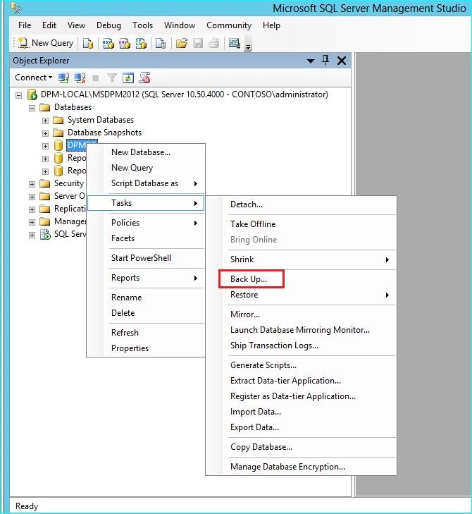
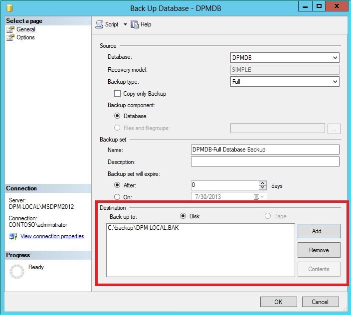
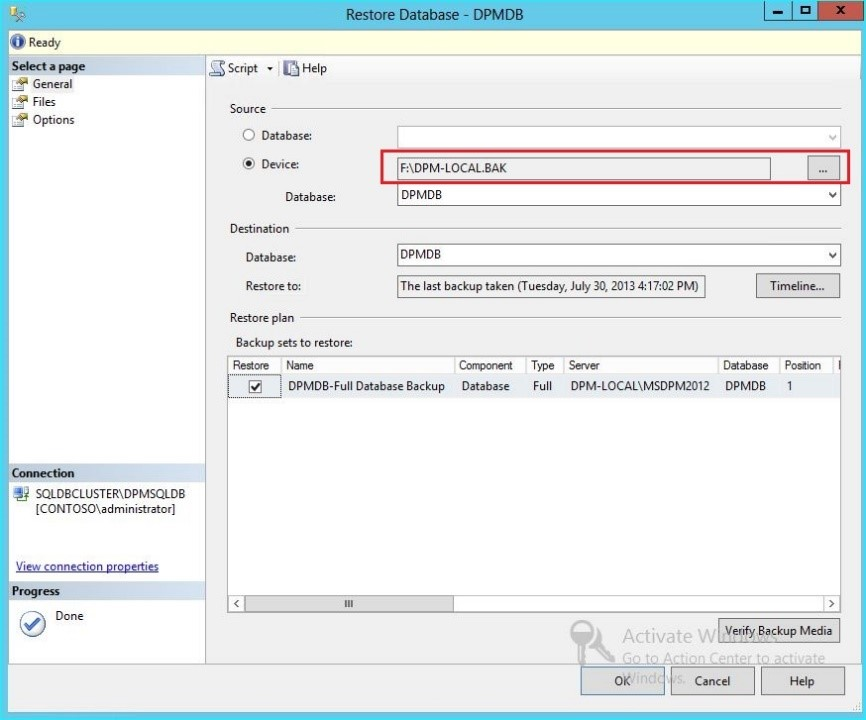
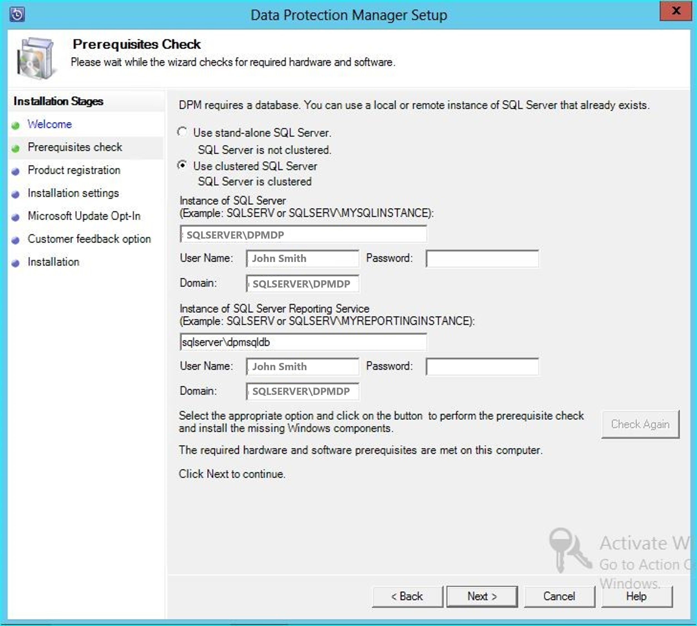

## Upgrade to DPM 2025

You can install System Center - 2025 Data Protection Manager (DPM) on Windows Server 2025.
You can upgrade to DPM 2025 from the following versions:

- DPM 2022

  Before you upgrade to or install DPM 2025, read the [Installation prerequisites](../dpm/install-dpm.md#setup-prerequisites).

## Upgrade path for DPM 2025

If you upgrade from DPM 2022 to DPM 2025, ensure that your installation has the following necessary updates:

- Upgrade the DPM server to DPM 2025.
- Upgrade the [MARS agent](https://aka.ms/azurebackup_agent) to the latest version (if installed).
- Update the agents on the protected servers.
- Upgrade the DPM Remote Administrator on all production servers.
- Backups continue without rebooting your production server.

### Upgrade steps for DPM

>[!Note]
>If the name of the existing DPM database is DPMDB or the DPM server is using a remote SQL server instance shared by multiple DPM servers, rename the database before you upgrade. See related known issues and workaround here.

1. To install the DPM, select Setup.exe to open the System Center 2025 wizard.
2. Under Install, select Data Protection Manager to start the setup wizard. Agree to the license terms and conditions and follow the setup wizard.

   For instructions on installing DPM, see [Installing DPM](../dpm/install-dpm.md).

## Migrate the DPM database during the upgrade

You may want to move the DPM Database as part of an upgrade. For example:
- You're merging instances of SQL Server.
- You're moving to a remote, more powerful SQL Server.
- You want to add fault tolerance by using a SQL Server cluster or you want to move from a remote SQL Server to a local SQL Server or vice versa.

DPM 2022 setup allows you to migrate the DPM database to different SQL Servers during an upgrade.

### Possible database migration scenarios

The following scenarios exist when you're upgrading DPM 2022 to DPM 2025 using a:

- Local instance and migrating to a remote instance of SQL Server during setup.
- Remote instance and migrating to a local instance of SQL Server during setup.
- Local instance and migrating to a remote SQL Server Cluster instance during setup.
- Local instance and migrating to a different local instance of SQL Server during setup.
- Remote instance and migrating to a different remote instance of SQL Server during setup.
- Remote instance and migrating to a remote SQL Server Cluster instance during setup.

### Prepare for a database migration

If you want to use a new SQL server to migrate the DPM database before you upgrade DPM, ensure that both the SQL Servers have the same:
- SQL Server requirements
- Setup configuration
- Firewall rules
- DPM Support files (sqlprep)

Additionally, review the [SQL Server prerequisites for DPM](/system-center/dpm/install-dpm#setup-prerequisites).

Once you've the new instance of SQL Server installed and prepared for DPM use, you must create a backup of the current DPM database and restore it on the new SQL Server.

### Pre-upgrade steps: Back up and restore DPM 2022 database to a new SQL instance

This example prepares a remote SQL Server cluster to use in migration.

1. On the System Center Data Protection Manager server or the remote SQL Server hosting the DPM database, start **Microsoft SQL Management Studio** and connect to the SQL instance hosting the current DPM DPMDB.
2. Right-click the DPM database, and under **Tasks**, select the **Back Up…** option.

      

3. Add a backup destination and file name, and then select **OK** to start the backup.

      

4. After the backup is complete, copy the output file to the remote SQL Server.  If this is a SQL Cluster, copy it to the active node hosting the SQL Instance you want to use in the DPM upgrade.  Before you can restore the DPM database, you must copy it to the Shared Cluster disk.
5. On the Remote SQL Server, start **Microsoft SQL Management Studio** and connect to the SQL Instance you want to use in the DPM upgrade. If this is a SQL Cluster, do this on the Active node that you copied the DPM backup file to. The backup file should now be located on the shared cluster disk.
6. Right-click the Databases icon, then select the **Restore Database…** option. This starts the restore wizard.

      

7. Select **Device** under **Source**, and then locate the database backup file that was copied in the previous step and select it. Verify the restore options and restore location, and then select **OK** to start the restore. Fix any issue that arises until the restore is successful.

      

8. After the restore is complete, the restored database will be seen under **Databases** with the original name. This database will be used during the upgrade. You can exit **Microsoft SQL Management Studio** and start the upgrade process on the original DPM server.

      

9. If the new SQL server is a remote SQL Server, install the SQL management tools on the DPM server. The SQL management tools must be the same version matching the SQL Server hosting the DPMDB.

### Start upgrade to migrate DPMDB to a different SQL Server

> [!NOTE]
> If sharing a SQL Instance, run the DPM installations (or upgrades) sequentially. Parallel installations may cause errors.

1. After the pre-migration preparation steps are complete, start the DPM 2022 Installation process. DPM Setup shows the information about the current instance of the SQL Server pre-populated. This is where you can select a different instance of the SQL Server or change to a Clustered SQL Instance used in the migration.

      

2. Change the SQL Settings to use the instance of the SQL Server you restored the DPM Database to. If it's a SQL cluster, you must also specify a separate instance of the SQL Server used for SQL reporting. It's presumed that firewall rules and SQLPrep have already run. You've to enter the correct credentials and then select **Check and Install**.

      

3. The Prerequisite check should succeed, and then select **Next** to continue with the upgrade.

      

4. Continue with the wizard options and complete the setup.

5. After the setup is complete, the corresponding database name on the instance specified will be *DPMPB_DPMServerName*. As this may be shared with other DPM servers, the naming convention for the DPM database will now be: *DPM2016$DPMDB_DPMServerName*.

## Add storage for Modern Backup Storage

To store backups efficiently, DPM 2025 uses Volumes. Disks can also be used to continue storing backups.

### Add volumes and disks
If you run DPM 2025 on the Windows Server, you can use volumes to store the backup data. Volumes provide storage savings and faster backups. You can give the volume a friendly name, and you can change the name. You can apply the friendly name while adding the volume or later by selecting the **Friendly Name** column of the desired volume. You can also use PowerShell to add or change friendly names for volumes.

To add a volume in the administrator console:

1. In the DPM Administrator console, select the **Management** feature > **Disk Storage** > **Add**.

2. In the **Add Disk Storage** page, select an available volume > **Add**, enter a friendly name for the volume and then select **OK**.

      

If you want to add a disk, it must belong to a protection group with legacy storage. Those disks can only be used for those protection groups. If the DPM server doesn't have sources with legacy protection, the disk won't appear.
For more information on adding disks, see [Screenshot showing how to add disks to increase legacy storage.](#add-disks-to-increase-legacy-storage). You can't give disks a friendly name.


### Assign Workloads to Volumes

DPM 2022 allows you to specify the types of workloads to be assigned to specific volumes. For example, expensive volumes that support high IOPS can be configured to store only the workloads that require frequent, high-volume backups like SQL with transaction logs.

To update the properties of a volume in the storage pool on a DPM server, use the PowerShell cmdlet, *Update-DPMDiskStorage*.

**Update-DPMDiskStorage**

**Syntax**

`Parameter Set: Volume`

```
Update-DPMDiskStorage [-Volume] <Volume> [[-FriendlyName] <String> ] [[-DatasourceType] <VolumeTag[]> ] [-Confirm] [-WhatIf] [ <CommonParameters>]
```

The changes made through PowerShell are reflected in the UI.

## Migrate legacy storage to Modern Backup Storage
After upgrading to DPM 2019 and the operating system to Windows Server 2019, you can update your existing protection groups to the new DPM 2022 features. By default, protection groups aren't changed and continue to function as they were configured in the earlier version of your DPM. Updating protection groups to use Modern Backup Storage is optional. To update the protection group, stop the protection of all data sources with the **Retain Data** option and add the data sources to a new protection group. DPM begins protecting these data sources the new way.

Use the following steps:

1. In the Administrator Console, select the **Protection** feature, and in the **Protection Group Member** list, right-click the member and then select **Stop protection of member...**.

   

   The **Remove from Group** page opens.

2. In the **Remove from Group** page, review the used disk space and the available free space in the storage pool. The default is to leave the recovery points on the disk and allow them to expire per their associated retention policy. Select **OK**.

    If you want to immediately return the used disk space to the free storage pool, select **Delete replica on disk**. This will delete the backup data (and recovery points) associated with that member.

    

3. Create a new protection group that uses Modern Backup Storage and include the unprotected data sources.


## Add Disks to increase legacy storage

If you want to use legacy storage with DPM 2025, it may be required to add disks to increase legacy storage. To add disk storage:

1. On the Administrator Console, select **Management**.

2. Select **Disk Storage**.

3. On the tool ribbon, select **Add**.

    The **Add Disk Storage** page opens.

    

4. In the **Add Disk Storage** page, select **Add disks**.

    DPM provides a list of available disks.

5. Select the disks, select **Add** to add the disks, and then select **OK**.

## Enable Cloud Protection

You can back up a DPM server to Azure. The high-level steps are:
- Create an Azure subscription,
- Register the server with the Azure Backup service,
- Download vault credentials and the Azure Backup Agent,
- Configure the server's vault credentials and backup policy.

For more information on backing up DPM to the cloud, see [Preparing to backup workloads to Azure with DPM](/azure/backup/backup-azure-dpm-introduction).
