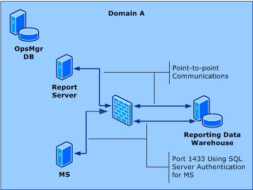

# Configuring a Firewall for Operations Manager

>Applies To: System Center 2016 Technical Preview - Operations Manager

This section describes how to configure your environment to place  a Report data warehouse behind a firewall.

## Enabling communications across a firewall
In an environment where the Reporting data warehouse is separated from the management server and Reporting Server by a firewall, Windows Integrated Authentication cannot be used. You need to take steps to configure SQL Server Authentication. The following sections explain how to enable SQL Server Authentication between the management server (or management server), the Reporting Server, and the Reporting data warehouse, as shown in the following illustration.

 

### Management Server and Reporting Data Warehouse
Follow these steps to setup SQL Server authentication

1.  On the computer hosting the Reporting data warehouse, create a SQL Server Login in the proper role for reader and writer. The credentials you supply for this account must be made a member of the following roles in the data warehouse database on the computer running SQL Server:

    1.  OpsMgrWriter

    2.  db_owner (only for the owning management group in the database)

2.  On the computer hosting the management server, create a Run As Account (of type Simple) with the credentials from the previous step.

3.  Associate this Run As Account with the Run As Profile called Data Warehouse SQL Server Authentication Account, targeting this Run As Profile to each management server. For more information, see [How to Associate a Run As Account to a Run As Profile](https://technet.microsoft.com/library/hh212825.aspx).

If there is a firewall between the management server and the Reporting data warehouse, you will have to open port 1433.

### Reporting Server and Reporting Data Warehouse
If there is a firewall or trust boundary between the Reporting Server and the Reporting data warehouse, point-to-point communications will need to be established.

The account that was specified as the Data Reader Account during setup of Reporting becomes the Execution Account on Reporting Server, and it is this account that will be used to connect to the Reporting data warehouse.

You should determine what port number the computer running SQL Server on the Reporting data warehouse is using and enter this number into the dbo.MT_DataWarehouse table in the Operations Manager database. See [How to Configure the Operations Manager Database to Listen on a Specific TCP/IP Port](https://technet.microsoft.com/library/hh467903.aspx) .

### Reporting Server and Management Server Separated by a Firewall
A "Could not verify if current user is in sysadmin Role" error message might display when installing Reporting if the reporting server and the management server are separated by a firewall. This error message might display even if the proper firewall ports have been opened. This error occurs after entering the computer name for the management server and clicking **Next**. This error might also display because Reporting Setup was unable to connect to the operational database on the management server. In this environment you must determine what port number is being used by the computer running SQL Server and configure the Operations Manager database to use the port number. See the topic [How to Configure the Operations Manager Database to Listen on a Specific TCP/IP Port](https://technet.microsoft.com/library/hh467903.aspx).

### Port Assignments
The following table shows Operations Manager feature interaction across a firewall, including information about the ports used for communication between the features, which direction to open the inbound port, and whether the port number can be changed.

|Operations Manager Feature A|Port Number and Direction|Operations Manager Featuret B|Configurable|Note|
|--------------------------------|-----------------------------|---------------------------------|----------------|--------|
|management server|1433 --->|Operations Manager database|Yes (Setup)||
|management server|5723, 5724 --->|management server|No|Port 5724 must be open to install this feature and can be closed after this feature has been installed.|
|gateway server|5723 --->|management server|No||
|management server|1433 --->|Reporting data warehouse|No||
|Reporting server|5723, 5724 --->|management server|No|Port 5724 must be open to install this feature and can be closed after this feature has been installed.|
|Operations console|5724 --->|management server|No||
|Connector framework source|51905 --->|management server|No||
|web console server|Web site port --->|management server|No||
|web console browser|51908 --->|web console server|Yes (IIS Admin)|Port 51908 is the default port used when selecting Windows Authentication. If you select Forms Authentication, you will need to install an SSL certificate and configure an available port for https functionality for the Operations Manager web console web site.|
|connected management server (Local)|5724 --->|connected management server (Connected)|No||
|Agent installed using MOMAgent.msi|5723 --->|management server|Yes (Setup)||
|Agent installed using MOMAgent.msi|5723 --->|management server|Yes (Setup)||
|Agent installed using MOMAgent.msi|5723 --->|gateway server|Yes (Setup)||
|gateway server|5723 --->|management server|Yes (Setup)||
|Agent (Audit Collection Services forwarder)|51909 --->|management server Audit Collection Services collector|Yes (Registry)||
|Agentless Exception Monitoring data from client|51906 --->|management server Agentless Exception Monitoring file share|Yes (Client Monitoring Wizard)||
|Customer Experience Improvement Program data from client|51907 --->|management server (Customer Experience Improvement Program End) Point|Yes (Client Monitoring Wizard)||
|Operations console (reports)|80 --->|SQL Reporting Services|No|The Operations console uses Port 80 to connect to the SQL Reporting Services web site.|
|Reporting server|1433 --->|Reporting data warehouse|Yes||
|management server (Audit Collection Services collector)|1433 --->|Audit Collection Services database|Yes||

