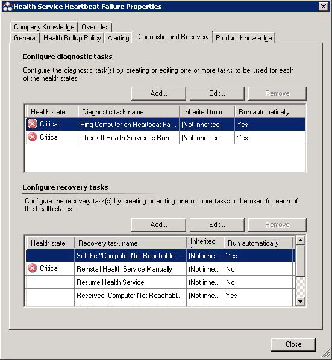

# Diagnostic and Recovery Tasks

>Applies To: System Center 2016 Technical Preview - Operations Manager

Monitors in System Center Operations Manager can do more than notify you of problems by sending an alert. Some monitors also provide diagnostic and recovery tasks to help investigate and resolve those problems.

A task is a script or other executable code that runs either on the computer running the Operations console or on the server, client, or device that is being managed. Tasks can potentially perform any kind of activity, including restarting a failed application and deleting files.

Monitors can have two kinds of tasks associated with them: diagnostic tasks that try to discover the cause of a problem or provide you with additional information to assist with that diagnosis, and recovery tasks that try to fix the problem.

Diagnostic and recovery tasks can run a script or command line executable. These tasks can be run automatically when the monitor enters an error state, providing an automated way to solve problems.

Diagnostic and recovery tasks can only be created for a specific monitor. A diagnostic or recovery task that you create for one monitor cannot be shared with or associated with a different monitor; you must recreate the task for each monitor. In addition, tasks that you create in the **Authoring** workspace using the **Create Task Wizard** cannot be used as a diagnostic or recovery for a monitor.

For example, the **Health Service Heartbeat Failure** monitor has several diagnostic and recovery tasks associated with it. The following list provides a sample of the tasks associated with the monitor.

-   **Ping Computer on Heartbeat Failure** and **Check If Health Service Is Running**

    These are diagnostic tasks that run automatically when the state for this monitor changes to critical (red).

-   **Set the "Computer Not Reachable" monitor to success because the "Ping Computer on Heartbeat Failure" diagnostic succeeded**

    This is a recovery task that runs automatically when the **Ping Computer on Heartbeat Failure** task succeeds.

-   **Restart Health Service**

    This is a recovery task that you can run manually or you can enable it to run automatically by using an override.

You can see the tasks available for a monitor on the **Diagnostic and Recovery** tab in the properties of the monitor, as shown in the following illustration.

On this tab, you can also add tasks or edit tasks that you have added previously. For more information on how to add diagnostic and recovery tasks, see [Diagnostics and Recoveries](http://go.microsoft.com/fwlink/?LinkId=230462) in the Author's Guide. Tasks that are configured by a sealed management pack can only be modified by using overrides. For more information, see [How to enable recovery and diagnostic tasks](https://technet.microsoft.com/library/hh212768.aspx) in the Operations Manager 2012 documentation.

