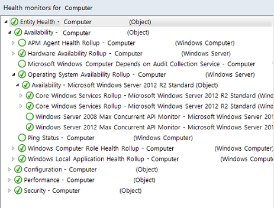

# Identifying the Computer Experiencing a Problem

This topic helps you answer questions such as "I see an alert that says logical disk defragmentation is high. Where is it high?"  
  
### To identify the computer experiencing a problem  
  
1.  Click the alert.  
  
      
  
2.  Look in the **Details** section for the **Path**.  
  
      
  
    Notice that this alert also includes the affected computer in the **Description**.  
  
3.  Click **Windows Computers** to view the state of the computer.  
  
      
  
4.  Right\-click the computer, point to **Open**, and click **Health Explorer**:  
  
      
  
In this illustration, you see that the logical disk fragmentation levels for C: and D: on this computer are in a warning state. Notice that the state rolls up to the **Performance** state for each disk, then to **Hardware Performance** for the computer, then to **Performance** for the computer, and finally to **Entity Health** for the computer.  
  
## Next steps
  
[How Heartbeats Work in Operations Manager](How-Heartbeats-Work.md)  
[Resolving Heartbeat Alerts](Resolving-Heartbeat-Alerts.md)  

