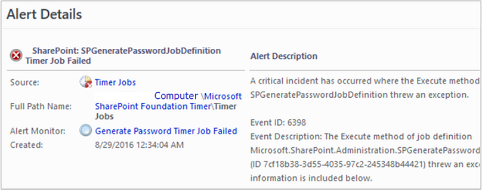

# Viewing Alert Details

Alerts in System Center 2016 - Operations Manager include information to help you investigate and resolve the issues that caused the alerts.  
  
To view the details for an alert, in the **Monitoring** workspace, click **Active Alerts**, and then click an alert in the results pane.    
  
## Tips
  
-   Locate and investigate monitors in the **Warning** and **Error** states in the Health Explorer of the computer that was the source of the alert. \(To open Health Explorer, right\-click the alert, point to **Open**, and click **Health Explorer**.\) If there are unhealthy monitors, they may correlate with the alert you are researching. Check out the **Context** pane of the **State Change Events** tab for possible additional clues to the root cause.  
  
-   Read all text in the alert properties. \(Right\-click the alert, and select **Properties**.\) In particular, carefully review the **Alert Description** field on the **General** tab and the **Description** field on the **Alert Context** tab.  
  
-   Right\-click the alert, and open the **Event** view. Sort the events by the **Level** column, and then locate the events with the **Error** and **Warning** event levels. Events may correlate with the alert you are investigating and provide insight to its resolution.  
  
## Next steps

- Before changing the number of missed heartbeats allowed. first review [How Heartbeats Work in Operations Manager](How-Heartbeats-Work.md)  

