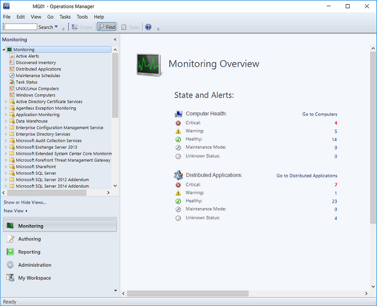
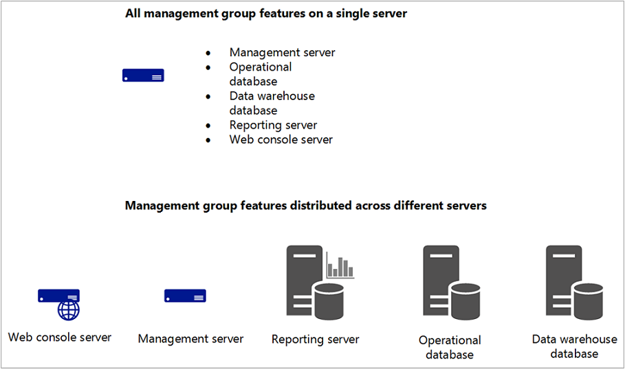
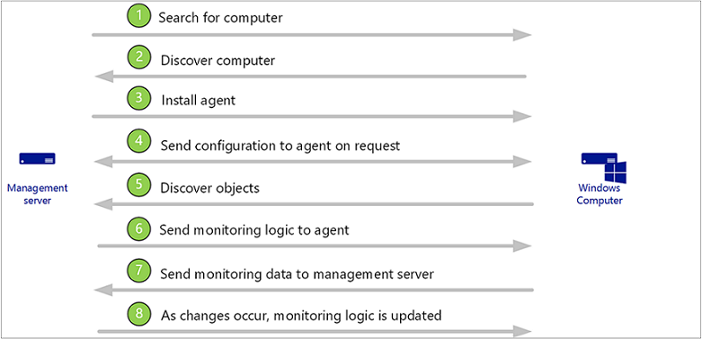

# Operations Manager Key Concepts

>Applies To: System Center 2016 - Operations Manager

Operations Manager, a component of Microsoft System Center 2016, is software that helps you monitor services, devices, and operations for many computers from a single console. This topic explains basic concepts about Operations Manager for the administrator who manages the Operations Manager infrastructure and the operator who monitors and supports the IT services for your business.

## What Operations Manager does

Businesses, small and large, are typically dependent on the services and applications provided by their computing environment. IT departments are responsible for ensuring the performance and availability of those critical services and applications. That means that IT departments need to know when there is a problem, identify where the problem is, and figure out what is causing the problem, ideally before the users of the applications encounter the problems. The more computers and devices in the business, the more challenging this task becomes.

Using Operations Manager in the environment makes it easier to monitor multiple computers, devices, services, and applications. The Operations console, shown in the following image, enables you to check the health, performance, and availability for all monitored objects in the environment and helps you identify and resolve problems.

> [!NOTE]
> To learn how to use the Operations Manager consoles, see [Using the Operations Manager Consoles](http://go.microsoft.com/fwlink/p/?LinkID=207747) in the Operations Guide.

Operations Manager will tell you which monitored objects are not healthy, send alerts when problems are identified, and provide information to help you identify the cause of a problem and possible solutions. As the administrator, you configure what will be monitored by selecting computers and devices to be monitored and importing management packs that provide monitoring for specific features and applications. To decide which objects to monitor and what to monitor for, you need to understand the features that comprise the Operations Manager infrastructure and how Operations Manager works.

## The Operations Manager infrastructure

Installing Operations Manager creates a *management group*. The management group is the basic unit of functionality. At a minimum, a management group consists of a *management server*, the *operational database*, and the *reporting data warehouse database*.

-   The **management server** is the focal point for administering the management group and communicating with the database. When you open the Operations console and connect to a management group, you connect to a management server for that management group. Depending on the size of your computing environment, a management group can contain a single management server or multiple management servers.

-   The **operational database** is a SQL Server database that contains all configuration data for the management group and stores all monitoring data that is collected and processed for the management group. The operational database retains short-term data, by default 7 days.

-   The **data warehouse database** is a SQL Server database that stores monitoring and alerting data for historical purposes. Data that is written to the Operations Manager database is also written to the data warehouse database, so reports always contain current data. The data warehouse database retains long-term data.

When Operations Manager reporting functionality is installed, the management group also contains a *Reporting server* which builds and presents reports from data in the data warehouse database.

These core components of a management group can exist on a single server, or they can be distributed across multiple servers, as shown in the following image.

For information about installing management group features, see [Operations Manager 2016 Deployment Guide](../deploy/deploying-system-center-2016-operations-manager.md).

### Management servers

The role of the management server is to administer the management group configuration, administer and communicate with agents, and communicate with the databases in the management group.

The management group can contain multiple management servers to provide additional capacity and continuous availability. When two or more management servers are added to a management group, the management servers become part of a *resource pool* and work is spread across the members of the pool. When a member of the resource pool fails, other members in the resource pool will pick up that member’s workload. When a new management server is added, the new management server automatically picks up some of the work from existing members in the resource pool. All members in the resource pool will manage a distinct set of remote objects; at any given time, two members in the same pool will not manage the same object at the same time.

A specialized type of management server is the *gateway server*. A gateway server enables the monitoring of computers in untrusted domains. For more information, see [Planning a management group design](../plan/planning-a-management-group-design.md#gateway-server).

### Agents

An Operations Manager *agent* is a service that is installed on a computer. The agent collects data, compares sampled data to predefined values, creates alerts, and runs responses. A management server receives and distributes configurations to agents on monitored computers.

Every agent reports to a management server in the management group. This management server is referred to as the agent's primary management server.

Agents watch data sources on the monitored computer and collect information according to the configuration that is sent to it from its management server. The agent also calculates the health state of the monitored computer and objects on the monitored computer and reports back to the management server. When the health state of a monitored object changes or other criteria are met, an alert can be generated from the agent. This lets operators know that something requires attention. By providing health data about the monitored object to the management server, the agent provides an up-to-date picture of the health of the device and all the applications that it hosts.

An agent can be configured to act as a *proxy agent*. A proxy agent is an agent that can forward data to a management server on behalf of a computer or network device other than its host computer. For example, an agent that is installed on the physical node of an SQL cluster can be enabled to act as proxy to monitor the cluster resource. Proxy agents enable monitoring of computers and devices on which an agent cannot be installed. For more information, see [Agentless Monitoring](http://go.microsoft.com/fwlink/p/?LinkID=207757).

### Services

On a monitored computer, the Operations Manager agent is listed as the Microsoft Monitoring Agent service. The Microsoft Monitoring Agent service collects performance data, executes tasks, and so on. Even when the service is unable to communicate with the management server it reports to, the service continues to run and queues the collected data and events on the disk of the monitored computer. When the connection is restored, the Microsoft Monitoring Agent service sends collected data and events to the management server.

> [!NOTE]
> The Microsoft Monitoring Agent service is sometimes referred to as the Health Service.

The Microsoft Monitoring Agent service also runs on management servers. On a management server, the service runs monitoring workflows and manages credentials. To run workflows, the service initiates MonitoringHost.exe processes using specified credentials. These processes monitor and collect event log data, performance counter data, Windows Management Instrumentation (WMI) data, and run actions such as scripts.

Management servers also run the System Center Data Access service and the System Center Management Configuration service.

The System Center Data Access service provides access for the Operations console to the operational database and writes data to the database.

The System Center Management Configuration service manages the relationships and topology of the management group. It also distributes management packs to monitored objects.

### Management packs

The workflows that the System Center Management service runs are defined by *management packs*. Management packs define the information that the agent collects and returns to the management server for a specific application or technology. For example, the BizTalk Server Management Pack contains rules and monitors that collect and evaluate events and operations that are important to ensuring the health and efficiency of the BizTalk Server application.

After Operations Manager installs an agent on a computer, it sends an initial configuration to the agent. The initial configuration includes *object discoveries* from management packs. The management pack defines the types of objects, such as applications and features, that will be monitored on computers that have been discovered by Operations Manager. Agents send data to the management server that identifies the instances of objects discovered on the computer. The management server then sends the agents the elements of management packs that apply to the discovered objects for each computer, such as rules and monitors.

A *rule* defines the events and performance data to collect from computers and what to do with the information after it is collected. A simple way to think about rules is as an If/Then statement. For example, a management pack for an application might contain rules such as the following:

-   If a message indicating that the application is shutting down appears in the event log, create an alert.

-   If upload of a source file fails, collect the event that indicates this failure.

As these examples show, rules can create alerts and collect events or performance data, which the agent sends to the management server. Rules can also run scripts, such as allowing a rule to attempt to restart a failed application.

Discovered objects have a health state, which is reflected in the Operations console as green (successful or healthy), yellow (warning), or red (critical or unhealthy). *Monitors* define the health states for particular aspects of the monitored object. For example, a monitor for disk drive capacity might define green as less than 85 percent full, yellow as over 85 percent full, and red as over 90 percent full. A monitor can be configured to generate an alert when a state change occurs.

## How objects are discovered and monitored

The following image is a simplified illustration of how objects are discovered and monitored.

1.  The administrator configures Operations Manager to search for computers to manage. For more information about discovering computers, see [Managing Discovery and Agents](../Manage/managing-discovery-and-agents.md).

2.  Computers that meet the specified criteria and are not already managed are identified.

3.  An Operations Manager agent is installed on the discovered computer.

4.  The agent requests configuration data, and then the management server sends the agent configuration data from installed management packs that includes classes to be discovered. For example, if the Windows Server operating system management packs are installed, the management server will send the agent the operating system classes.

5.  The agent compares the configuration data to the computer, identifies any objects that it discovers, and returns the information to the management server. For example, the agent will return to the management server that an instance of Windows Server 2016 operating system is on the computer.

6.  The management server sends the agent all monitoring logic from installed management packs that applies to the discovered objects. For example, the agent will receive all monitoring logic that applies to Windows Server 2016.

7.  The agent applies the monitoring logic, such as rules and monitors, runs workflows, and returns data to the management server.

8.  As changes occur to discovered objects, such as applications being added or uninstalled, the agent sends the updated information to the management server, which then sends updated monitoring logic.

> [!NOTE]
> Operations Manager can also discover and monitor network devices, computers running UNIX and Linux operating systems, and provide agentless monitoring. For more information, see [Operations Manager Monitoring Scenarios](http://go.microsoft.com/fwlink/p/?LinkID=218372) in the Operations Guide.

### Communication between agents and management servers

The Operations Manager agent sends alert and discovery data to the primary management server, which writes the data to the operational database. The agent also sends events, performance, and state data to the primary management server for that agent, which writes the data to the operational and data warehouse databases simultaneously.

The agent sends data according to the schedule parameters for each rule and monitor. For optimized collection rules, data is only transmitted if a sample of a counter differs from the previous sample by a specified tolerance, such as 10%. This helps reduce network traffic and the volume of data stored in the operational database.

Additionally, all agents send a packet of data, called a *heartbeat*, to the management server on a regular schedule, by default every 60 seconds. The purpose of the heartbeat is to validate the availability of the agent and communication between the agent and the management server. For more information on heartbeats, see [How Heartbeats Work in Operations Manager](../Manage/how-heartbeats-work.md).

For each agent, Operations Manager runs a *health service watcher*, which monitors the state of the remote Health Service from the perspective of the management server.

### Other resources for Operations Manager

-   [TechNet Library main page for System Center - Operations Manager](../welcome-to-operations-manager.md)

-   To learn how to install Operations Manager and deploy a management group, see [Deploying System Center 2016 - Operations Manager](../deploy/deploying-system-center-2016-operations-manager.md)

-   To learn how to use Operations Manager after the management group is set up, see [System Center 2016 - Operations Manager Operations Guide](../Manage/Operations-Manager-Operations-Guide.md)

-   To learn how to create a management pack, see [Author’s Guide for Operations Manager for System Center 2012](http://go.microsoft.com/fwlink/p/?LinkID=212377)

-   [Operations Manager Community](http://go.microsoft.com/fwlink/p/?LinkID=221328)
