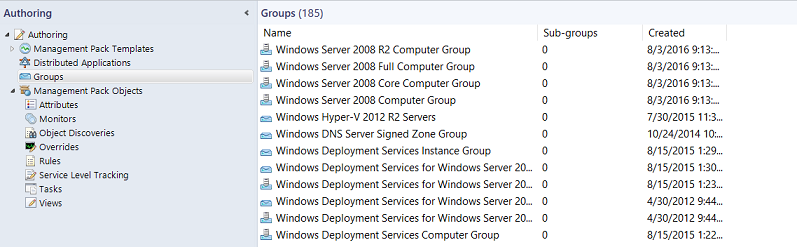
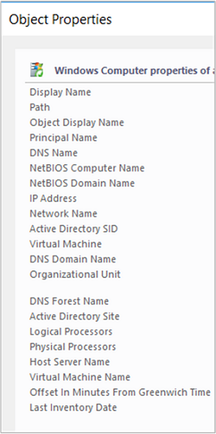

# Creating and Managing Groups

>Applies To: System Center 2016 - Operations Manager

In System Center 2016 - Operations Manager, groups are logical collections of objects, such as Windows-based computers, hard disks, or instances of Microsoft SQL Server. You create a group by using the Create Group Wizard. You can explicitly assign membership to a group or you can create rules that will generate a dynamic group membership.  
  
Some of the purposes for using groups are:  
  
-   To scope overrides to a specific subset of computers. 
  
-   To scope alert notifications or product connector subscriptions for a specific set of computers.   
  
-   To scope user consoles, so the user role only sees the servers they are responsible for.  
  
-   To scope a set of computers that need to go into a scheduled maintenance mode.  
  
-   To scope application views only to computers that host a given application. 
  
-   To create a rollup health state view of an otherwise unrelated set of computers. 
  
-   To create a set of computers for a report.  
  
Using the Operations console in the **Authoring** workspace, you can only create instance groups. To create a computer group, you must use the Authoring console or work directly in the XML of a management pack.  The following image shows the display of groups in the Operations console. 

  

Computer groups only contain computers. Instance groups can contain all object types, such as an instance of a health service or an instance of a SQL database. Both computer groups and instance groups can contain other computer and instance groups. Another way to view the difference between the group types is:  
  
-   An instance group is populated with objects that match your criteria.  
  
-   A computer group is populated by computers that host objects that match your criteria.  
  
To create a group based on a hosting relationship, such as all computers that are running SQL Server, you must use the Visual Studio Authoring Extensions for Operations Manager or work directly in the XML of a management pack.

The most common objects you will place in your groups are **Windows Computer** objects. The most common way to dynamically assign computers to the groups is by using a *property* of the **Windows Computer** class. For example, **Organizational Unit** is a property of the **Windows Computer** class, so you can create a group that makes all computers in a specific organizational unit members of the same group. The following image shows the properties of an object in the **Windows Computer** class, which you can view in the details pane of the **Monitoring** workspace by selecting the **Windows Computers** state view.  
  
  
  
You can assign both explicit and dynamic members in the same group definition, and you can exclude explicit members. For examples of dynamic group queries and formulas, see [Operations Manager Dynamic Group Examples](http://go.microsoft.com/fwlink/p/?LinkId=242241).  
  
## To create a group in Operations Manager  
  
1.  Log on to the computer with an account that is a member of the Operations Manager Administrators role.  
  
2.  In the Operations console, click **Authoring**.  
  
3.  Right-click **Groups**, and then click **Create a new Group** to start the Create Group Wizard.  
  
4.  On the **Enter a name and description for the new group** page, do the following:  
  
    1.  Type the **Name** for the group.  
  
    2.  Optionally, type the **Description** for the group. A description of the group membership makes it easier to select the right group for views, overrides, and so forth.  
  
    3.  Select a **destination management pack** from the list, or click **New** to create a management pack with the Create a Management Pack Wizard.  
  
    4.  Click **Next**.  
  
5.  On the **Explicit Members** - **Choose Members from a List**  page, you can add explicit objects to the group or click **Next** to continue to the **Dynamic Members** configuration. To add explicit group members, click **Add/Remove Objects** and then perform the following steps:  
  
    1.  In the **Search for** list, select an object type, such as **Windows Computer**.  
  
    2.  Optionally, in the **Filter by part of the name** box, type all or part of the object name, and then click **Search**.  
  
    3.  In the **Available items** box, select the desired objects, click **Add**, and then click **Next**.  
  
6.  On the **Dynamic Members** - **Create a Membership Formula** page, you can add a dynamic membership formula to the group or click **Next** to continue to the **Subgroups** page. To add a dynamic membership formula, click **Create/Edit rules** and then perform the following steps:  
  
    > [!WARNING]  
    > This procedure tells you how to create a query for Windows computers based on NetBIOS computer name.  
  
    1.  In the **Query Builder** dialog box, leave the default **Windows Computer** and click **Add**.  
  
    2.  In the **Property** list, select **NetBIOS computer name**.  
  
    3.  In the **Operator** list, select **Contains**.  
  
    4.  Set **Value** to part of the name of the computers you want in the group, such as **NY** or **MKTG**.  
  
        > [!NOTE]  
        > Click **Insert** to add an **Expression** or group expressions with **OR** or **AND** operators. Repeat the preceding steps to add additional object types to the rule.  
  
    5.  Click **OK**, review the **Query formula**, and then click **Next**.  
  
7.  On the **Choose Optional Subgroups** page, either click **Next** to not add groups to the group, or click **Add/Remove Subgroups** to add groups, for example.  
  
    1.  In the **Group Selection** dialog box, in **Filter by part of name**, you can optionally type part or the all of the group's names, and then click **Search**.  
  
    2.  In the **Available items** text box, select the desired groups, click **Add**, click **OK**, and then click **Next**.  
  
8.  On the **Excluded Members** - **Specify Exclude List** page, click **Finish** to not exclude objects from the group, or click **Exclude Objects**, and then perform the following steps:  
  
    1.  In the **Object Exclusion** dialog box, from the **Search for** list, select an object type, such as **Windows Computer**.  
  
    2.  Optionally, in the **Filter by part of the name** box, type all or part of the object name, and then click **Search**.  
  
    3.  In the **Available items** text box, select the objects you want to exclude, click **Add**, click **OK**, and then click **Finish**.  
  
    > [!NOTE]  
    > It can take approximately one minute to populate the membership of a group.  
   

## To view members, state, and diagram of a group

1. In the **Authoring** workspace, click **Groups**.

2. In the results pane, click the group you want to view.

3. In the **Tasks** pane, click:

 - **View Group Members** to view a list of all members of the group with the health state of each member.

 - **View Group State** to view a state view of the group.

 - **View Diagram** to view a diagram of the group.

  
## Next steps

- To understand the differences between classes and groups in Operations Manage and how workflows apply to each, review [Using Classes and Groups for Overrides in Operations Manager](Using-Classes-and-Groups-for-Overrides.md). 

- Before making changes to the monitoring settings defined in an Operations Manager management pack, review [How to Override a Rule or Monitor](How-to-Override-a-Rule-or-Monitor.md) to understand how to configure the change.