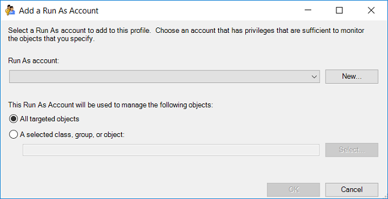

# Distribution and Targeting for Run As Accounts and Profiles

>Applies To: System Center 2016 - Operations Manager

Run As accounts are associated with Run As profiles to provide the necessary credentials for workflows that use that Run As profile to run successfully. Both distribution and targeting of Run As accounts must be correctly configured for the Run As profile to work properly.  
  
When you configure a Run As profile, you select the Run As accounts you want to associate with the Run As profile. When you create that association, you specify the class, group, or object that the Run As account will be used to manage, as shown in the following image. This establishes the target of the Run As account.  
  
  
  
Distribution is an attribute of a Run As account in which you specify which computers will receive the Run As account credentials. You can choose to distribute the Run As account credentials to every agent-managed computer or only to selected computers.  
  
**Example of Run As account targeting and distribution:**  
  
Physical computer ABC hosts two instances of Microsoft SQL Server, instance X and instance Y. Each instance uses a different set of credentials for the **sa** account. You create a Run As account with the **sa** credentials for instance X, and a different Run As account with the **sa** credentials for instance Y. When you configure the SQL Server Run As profile, you associate both Run As account credentials for instance X and Y with the profile and specify that the Run As account instance X credentials are to be used for SQL Server instance X and that the Run As account Y credentials are to be used for SQL Server instance Y. Then, you configure both Run As accounts to be distributed to physical computer ABC.  
  
## Selecting a target for a Run As account  

As shown in the previous image, your options for selecting a target for a Run As account are **All targeted objects** and **A selected class, group, or object**.  
  
When you select **All targeted objects**, the Run As profile will use this Run As account for all objects for the workflows that use the Run As profile.   
  
When you select **A selected class, group, or object**, you can limit the use of the Run As account to the class, group, or object that you specify.  
  
> [!NOTE]  
> The Run As account credentials must be distributed the specific agent-managed systems the Run As credential should be authenticating with before configuring the Run As profile.     
  
## Comparing more secure and less secure distribution  

Operations Manager distributes the Run As account credentials to either all agent-managed computers (the less secure option) or only to computers that you specify (the more secure option). If Operations Manager automatically distributed the Runs As account according to discovery a security risk would be introduced into your environment as illustrated in the following example. This is why an automatic distribution option was not included in Operations Manager.  
  
For example, Operations Manager identifies a computer as hosting SQL Server 2014 based on the presence of a registry key. It is possible to create that same registry key on a computer that is not actually running an instance of SQL Server 2014. If Operations Manager were to automatically distribute the credentials to all agent managed computers that have been identified as SQL Server 2014 computers, then the credentials would be sent to the imposter SQL Server and they would be available to someone with administrator rights on that server.  
  
When you create a Run As account, you are prompted to choose whether the Run As account should be treated in a **Less secure** or **More secure** fashion. More secure means that when you associate the Run As account with a Run As Profile, you have to provide the specific computer names that you want the Run As credentials distributed to. By positively identifying the destination computers, you can prevent the spoofing scenario that was described before. If you choose the less secure option, you will not have to provide any specific computers and the credentials will be distributed to all agent-managed computers.  
  
> [!NOTE]  
> Operations Manager will perform tests to validate the Run As credentials, including whether the credentials can be used to log on locally to the computer. If the account does not have the right to log on locally, an alert will be generated.  
  
## Next steps
  
- To understand how to create a Run As account, how to modify an existing Run As account, and how to configure a Run As profile to use a Run As account see, [How to Create a Run As Account and Associate with a Run As Profile](How-to-Create-a-Run-As-Account-and-associate-to-a-profile.md).
 

  
  
