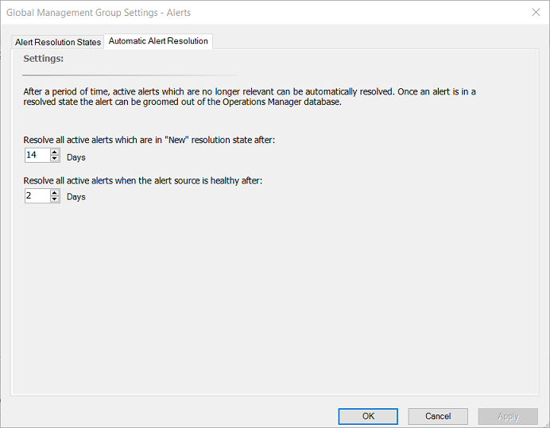

# How to configure automatic alert resolution

>Applies To: System Center 2016 - Operations Manager

In System Center 2016 - Operations Manager, alerts are resolved automatically after a specific number of days. You can change the automatic alert resolution settings globally for the management group. Using automatic alert resolution, you can configure all active alerts with a resolution state of **New** to be changed to **Closed** after a specific number of days. You can also configure all active alerts with a resolution state of **New** to be changed to **Closed** after a specific number of days when the alert source is healthy.  
  
### To change the global settings for automatic alert resolution  
  
1.  In the Operations console, click **Administration**.  
  
2.  Click **Settings**.  
  
3.  Double-click **Alerts**.  
  
4.  Click the **Automatic Alert Resolution** tab.  
  
5.  Change the days for either or both of the following settings:  
  
      
  
6.  Click **OK**.  
  
## Next steps
 
-  To get better visibility with the alerts being generated in your environment and determine which are candidates for additional configuration to reduce alert noise and improve alert accuracy, see [Data-driven Alert Management](data-driven-alert-management.md) from the Operations console.   
 
- To understand how alerts are generated for monitored objects in your management group, see [How an Alert is Produced](how-an-alert-is-produced.md).
 
- Review [Viewing Active Alerts](viewing-active-alerts-and-alert-details.md) to understand how it can help you review alerts that have been generated by rules and monitors which are still active.  
