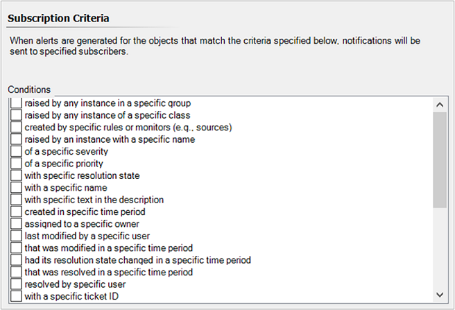
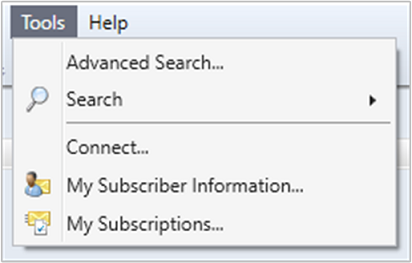

# How to create notification subscriptions

>Applies To: System Center 2016 - Operations Manager 

In System Center 2016 - Operations Manager, when an alert is generated, Operations Manager can notify designated individuals by email, instant message (IM), or text message (SMS). Notifications can also run commands automatically when an alert is raised on a monitored system. A notification requires a channel, a subscriber, and a subscription.  

These procedures will explain how to specify the criteria or conditions that determine the alerts that will generate a notification, use of classes and groups, and criteria or conditions in your subscriptions to filter and align notifications with your organizational escalation path.  A subscription also defines the channel to be used for the notification and the subscribers to receive the notification.  You can use the combination of subscriber and subscription to tailor which alerts are sent to individuals or teams.      
  
Notification channels and subscribers must be configured before you create a subscription.

## Subscription filtering options

Before creating a subscription, we will review the two methods you can use to filter alert notifications so that you can deliver alerts that meet certain conditions, such as all critical severity alerts with high priority notify IT Operations or from specific monitored objects like all systems for a particular remote location notify that on-site IT support team.   

### Specifying which alerts generate notifications (Conditions)

When you create a subscription to be notified when Operations Manager generates alerts, you must specify the criteria or conditions that determine the alerts that will generate a notification. The following illustration shows the conditions you can choose from.  
  
  
  
When you select a condition, it is added to the **Criteria description**. In the **Criteria description** box, the word **specific** is blue and underlined, and is a placeholder for the value for the condition. Click **specific** to set the value for that condition.  
  
For example, for the condition of **a specific severity**, click **specific**, and then select from the available values: **Information**, **Warning**, and **Critical**.  
  
When you create a notification subscription from an alert that has been generated, the conditions for the subscription are configured automatically with values from the specific alert.   
  
### Using classes and groups to include specific alerts 

You can use classes and groups to configure the subscription. Two of the conditions for alerts that you can select for a subscription are:  
  
-   Raised by any instance in a specific group.  
  
-   Raised by any instance in a specific class.  
  
You can select multiple groups or classes when you set the value for either condition.  
  
> [!NOTE]  
> Operations Manager does not support using "not equal to" or "not a member of" for notification subscriptions.  
  
#### Groups  

Groups are logical collections of objects, such as Windows\-based computers, hard disks, or instances of Microsoft SQL Server. Some groups are created by Operations Manager, such as the Operations Manager Agent Managed Computer Group and the All Windows Computers group. You can create groups to meet your specific monitoring needs, such as all Windows computers in a specific organizational unit \(OU\). For more information on creating groups, see [Creating and Managing Groups](creating-and-managing-groups.md).  
  
Groups can have explicit or dynamic membership. Suppose you wanted to create a subscription that would send notifications for alerts generated by five specific servers to one person and notifications for alerts generated by a different five servers to a second person. You could create two groups and explicitly assign each server to one of the groups, and then create a subscription that would send notifications for each group to the appropriate person.  
  
When you select a specific group as a condition for an alert notification, notifications are sent for alerts raised by any member of the specified group.  
  
#### Classes  

A class represents a kind of object, and every object in Operations Manager is considered an instance of a particular class. All instances of a class share a common set of properties. Each object has its own values for these properties which are determined when the object is discovered. Most management packs define a set of classes that describe the different components that make up the application that is being monitored and to the relationships between those classes.  
  
Every class in Operations Manager has a base class. A class has all the properties of its base class and potentially adds more. All of the classes from the different management packs installed in your management group can be arranged in a tree with each class positioned under its base class. If you start at any class, and then walk up the tree following its base class, and then the base class of that class, and so on, you eventually reach the **Object** class which is the root of the System Center class library.  
  
When you select a specific class as a condition for an alert notification, notifications are sent for alerts raised by any instance of the specified class.  
  
#### Examples  

**Example 1:** To send notifications of alerts for UNIX computers to your UNIX administrator, you create a subscription using the condition **Raised by any instance in a specific group**, select the **UNIX\/Linux Computer Group** as the value for the condition, and select the UNIX administrator as the subscriber.  
  
**Example 2:** To send notifications of new alerts with a critical severity and high priority to your IT Operations team, you create a subscription using the condition **of Critical severity**, **of a High priority**, **with New (0) resolution state**, and select your subscriber representing the IT Operations team.     
  
In the first example, the UNIX administrator would be notified of alerts raised by the operating system on a UNIX computer, as well as any other alerts that are raised by a UNIX computer. In the second example, the notifications would only be sent when new alerts are raised with critical severity and high priority.  

## To create a notification subscription as an administrator  
  
1.  Log on to the computer with an account that is a member of the Operations Manager Administrators role.  
  
2.  In the Operations console, click **Administration**.  
  
3.  In the **Administration** workspace, expand **Notifications**, right-click **Subscriptions,** and then click **New subscription**. The Notification Subscription Wizard starts.  
  
4.  On the **Description** page, in **Subscription name,** type a descriptive name for the subscription, type a short description, and then click **Next**.  
  
5.  On the **Subscription Criteria** page, you can set conditions that will determine when notifications will be sent to specified subscribers. If you do not set conditions, notifications will be sent for all alerts. Click **Next**.  
  
    > [!NOTE]  
    > You will also receive notifications when an alert is updated.  
  
6.  On the **Subscribers** page, click **Add** to add subscribers who are already defined, or click **New** to add new subscribers. For more information on defining subscribers, see [How to Create Notification Subscribers](how-to-create-notification-subscribers.md).  
  
7.  Click **Next**.  
  
8.  On the **Channels** page, click **Add** to add a channel that is already defined, or click **New** to add a new channel. For more information on defining channels, see [How to Enable an Email Notification Channel](how-to-enable-an-email-notification-channel.md), [How to Enable an Instant Message Notification Channel](how-to-enable-an-instant-message-notification-channel.md), [How to Enable a Text Message Notification Channel](how-to-enable-a-text-message-notification-channel.md), and [How to Enable a Command Notification Channel](how-to-enable-a-command-notification-channel.md).  
  
9. In the **Alert aging** section on the **Channels** page, select to send notifications without delay or set a value in minutes that notification should be delayed unless conditions remain unchanged, and then click **Next**.  
  
10. Review the settings on the **Summary** page, click **Finish**, and then click **Close**.  
  
## To create a notification subscription as an operator  
  
1.  Log on to the computer with an account that is a member of the Operations Manager Operators or Advanced Operators role.  
  
2.  In the Operations console, click **Tools** in the top menu bar, and then click **My Subscriptions**.      
  
3.  In the **Notification Subscriptions** window, click **New**.  
  
4.  On the **Description** page, in **Subscription name,** type a descriptive name for the subscription, type a short description, and then click **Next**.  
  
5.  On the **Subscription Criteria** page, you can set conditions that will determine when notifications will be sent to specified subscribers. If you do not set conditions, notifications will be sent for all alerts. Click **Next**.  
  
    > [!NOTE]  
    > You will also receive notifications when an alert is updated.  
  
6.  On the **Subscribers** page, click **Add** to add subscribers who are already defined, or select a subscriber in the **Selected subscribers** box and click **Edit** to change the settings for this subscription. For more information on defining subscribers, see [How to Create Notification Subscribers](how-to-create-notification-subscribers.md).  
  
7.  Click **Next**.  
  
8.  On the **Channels** page, click **Add** to add a channel that is already defined, or click **New** to create a customized copy of an existing channel. For more information on defining channels, see [How to Enable an Email Notification Channel](how-to-enable-an-email-notification-channel.md), [How to Enable an Instant Message Notification Channel](how-to-enable-an-instant-message-notification-Channel.md), [How to Enable a Text Message (SMS) Notification Channel](how-to-enable-a-text-message-notification-channel.md), and [How to Enable a Command Notification Channel](how-to-enable-a-command-notification-channel.md).  
  
9. In the **Alert aging** section on the **Channels** page, select to send notifications without delay or set a value in minutes that notification should be delayed unless conditions remain unchanged, and then click **Next**.  
  
10. Review the settings on the **Summary** page, click **Finish**, and then click **Close**.  
  
## Next steps

* To designate when to send notifications and the addresses to which the notifications should be sent to, review [How to Create Notification Subscribers](how-to-create-notification-subscribers.md)

