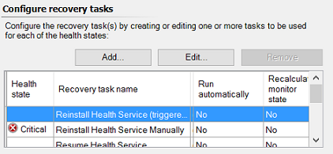

# How to Enable Recovery and Diagnostic Tasks

>Applies To: System Center 2016 - Operations Manager

Monitors in System Center 2016 - Operations Manager can do more than notify you of problems by sending an alert. Some monitors also provide diagnostic and recovery tasks to help investigate and resolve those problems.  
  
A task is a script or other executable code that runs either on the computer running the Operations console or on the server, client, or device that is being managed. Tasks can potentially perform any kind of activity, including restarting a failed application and deleting files.  
  
Monitors can have two kinds of tasks associated with them: diagnostic tasks that try to discover the cause of a problem or provide you with additional information to assist with that diagnosis, and recovery tasks that try to fix the problem.  
  
Some monitors have diagnostic or recovery tasks that are disabled by default. You can enable any of these tasks that you want the monitor to run. For example, in the following image, you see that some recovery tasks for the **Health Service Heartbeat Failure** monitor are not configured to run automatically.  
  
  
  
## To enable a diagnostic or recovery task  
  
1.  In the Operations console, in the **Authoring** workspace, right\-click a monitor and click **Properties**.  
  
2.  Click the **Diagnostic and Recovery** tab.  
  
3.  On the **Diagnostic and Recovery** tab, in the **Configure diagnostic tasks** or **Configure recovery tasks** section, ensure the desired task is selected and then click **Edit**.  
  
4.  On the **Overrides** tab, click **Override**. You can choose to override this monitor for objects of a specific type or for all objects within a group. After you choose which group or object type to override, the **Override Properties** dialog box opens. For more information about applying an override, see [Using Classes and Groups for Overrides in Operations Manager](Using-Classes-and-Groups-for-Overrides.md).  
  
5.  In the **Override\-controlled parameters** section, click **Enabled** and set the override value to **True**.  
  
6.  Either select a management pack from the **Select destination management pack** list or create a new unsealed management pack by clicking **New**. For more information about selecting a destination management pack, see [Creating a Management Pack for Overrides](how-to-create-a-management-pack-for-overrides.md).  
  
7.  Click **OK**. Close the open properties windows.  
  
## Next steps

- To understand the differences between classes and groups in Operations Manage and how workflows apply to each, review [Using Classes and Groups for Overrides in Operations Manager](Using-Classes-and-Groups-for-Overrides.md)  

- To learn how to create a custom writeable management pack to store your overrides, see [How to Create a Management Pack for Overrides](how-to-create-a-management-pack-for-overrides.md)

- Before making changes to the monitoring settings defined in an Operations Manager management pack, review [How to Override a Rule or Monitor](How-to-Override-a-Rule-or-Monitor.md) to understand how to configure the change.    

  
