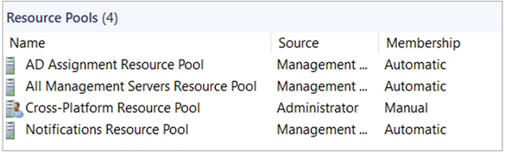

# How to manage resource pools

>Applies To: System Center 2016 - Operations Manager

A Resource Pool is a collection of management servers and/or gateway servers used to distribute work among themselves and take over work from a failed member.  In this section we will cover how to create and modify resource pools and their membership, as well as properly configure a resource pool dedicated to monitor UNIX and Linux computers.


## To create a resource pool

1.  Log on to the Operations console with an account that is a member of the Operations Manager Administrators role.

2.  Click **Administration**.

3.  In the navigation pane, click **Resource Pools**.

4.  In the **Tasks** pane, click **Create Resource Pool**.

5.  In the **Create Resource Pool** wizard, on the **General Properties** page, enter a name and, optionally, a description for the resource pool, and then click **Next**.

6.  On the **Pool Membership** page, click **Add**.

7.  In the **Member Selection** window, enter text to filter the search results if desired, and then click **Search**. If you click **Search** without entering anything in the filter field, all available management servers will be displayed.

8.  In **Available items**, select the servers that you want in the resource pool, click **Add**, and then click **OK**.

9. Click **Next**.

10. On the **Summary** page, review the settings and then click **Create**.

11. When the wizard completes, click **Close**.

## Modifying resource pool membership

When you view the resource pools in the **Administration** workspace, you will see that resource pools that you create have a manual membership type and resource pools created when Operations Manager was installed have an automatic membership type, as shown in the following image.



By default, all management servers are members of the resource pools created when Operations Manager is installed, and any management servers added to the management group are automatically added to the resource pools that have an automatic membership type. You can remove individual management servers from those resource pools, however that will change the membership type to manual. If you add a management server to a management group after the membership type of the resource pools created when Operations Manager was installed is changed to manual, you must add the management server to the resource pool manually.

> [!NOTE]
> The membership of the All Management Servers Resource Pool is read-only.  To change its membership  from automatic to manual, run the following PowerShell code in the Operations Manager Command Shell:
>  
> ```Get-SCOMResourcePool -DisplayName "All Management Servers Resource Pool" | Set-SCOMResourcePool -EnableAutomaticMembership 0```

#### To remove a member from an automatic resource pool

1.  Log on to the Operations console with an account that is a member of the Operations Manager Administrators role.

2.  Click **Administration**.

3.  In the navigation pane, click **Resource Pools**.

4.  In the results pane, click the resource pool that you want to modify.

5.  In the **Tasks** pane, click **Manual Membership**, and then click **Yes** in the **Manual Membership** message.

    > [!IMPORTANT]
    > When you click **Yes**, the membership type of the selected resource pool changes to manual. Even if you make no changes to the resource pool membership and cancel the properties dialog box, the membership type will remain manual after this step.

6.  On the **General Properties** page for the resource pool, click **Next**.

7.  On the **Pool Membership** page, click the management servers that you want to remove from the resource pool, click **Remove**, and then click **Next**.

8.  On the **Summary** page, click **Save**.


## Configure certificates for UNIX and Linux dedicated resource pools 

An additional task must be performed in order to configure management servers that are members of a resource pool dedicated for managing UNIX and Linux computers. Operations Manager uses certificates to authenticate access to the computers it is managing. When the Discovery Wizard deploys an agent, it retrieves the certificate from the agent, signs the certificate, deploys the certificate back to the agent, and then restarts the agent.

To configure high availability, each management server in the resource pool must have all the root certificates that are used to sign the certificates that are deployed to the agents on the UNIX and Linux computers. Otherwise, if a management server becomes unavailable, the other management servers would not be able to trust the certificates that were signed by the server that failed. The process for this task is as follows:

1.  Export the root certificates from each management server in the resource pool to a file.

2.  Import all the exported certificate files into each management server (except for the file that was exported by that same server).

#### To configure certificates for high availability

1.  Log on to a management server to start the process of exporting certificates.

2.  At the command prompt, change the directory to %ProgramFiles%\System Center Operations Manager 2012\Server.

3.  Run the following command, specifying a file name of your choosing such as **Server3.cert**:

    `scxcertconfig.exe - export <filename>`

4.  Copy the exported file to a shared directory that is accessible by all the management servers in the resource pool.

5.  Repeat the previous four steps until the shared directory contains all the exported certificate files from each management server in the resource pool.

6.  Log on to a management server to start the process of importing certificates.

7.  At the command prompt, change the directory to %ProgramFiles%\System Center Operations Manager 2012\Server.

8.  Run the following command for each exported certificate file (except for the file that was exported by the current management server):

    `scxcertconfig.exe -import <filename>`

    > [!NOTE]
    > If you attempt to import the certificate file that was exported by that same management server, the process will fail with an error message that the object or property already exists.

9. Repeat the previous three steps until all the certificate files have been imported to the applicable management servers in the resource pool.

10. Delete the certificate files from the shared directory. Although the file contains only the public key of the certificate, you should still treat it as a security-sensitive file.

Perform this procedure whenever you add a new management server to the resource pool so that high availability is maintained.

## Next steps

For information about deployment considerations for resource pools, see [Planning Resource Pool Design](../../scom/plan-resource-pool-design.md)
