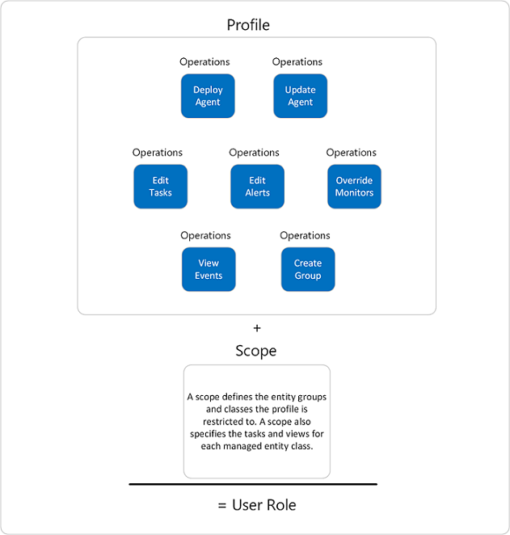

# Implementing User Roles

>Applies To: System Center 2016 - Operations Manager

In System Center 2016 - Operations Manager, user roles are the method you use to assign the rights needed to access monitoring data and perform actions. User roles are designed to apply to groups of users that need access to and perform actions on the same group of monitored objects. By default, only the Operations Manager Administrator account has the right to view and act on all monitoring data. All other users must have a user role assigned in order to view or act on specific or all monitoring data.  
  
User roles are created using the Create User Role Wizard. In this wizard, you configure which Active Directory security groups are assigned this user role, which Operations Manager group or groups of monitored objects this user can access, and which tasks. dashboards and views this user role can access.  
  
A user role is the combination of a profile and scope as shown in as shown in the following illustration. A user can be a part of multiple roles and the resultant scope is the union of all the user roles.  
  

## Understand profiles 

Before you create user roles in your management group, select one profile that applies to the user role you are creating. A profile determines the actions that a user can perform. Profiles have a defined set of rights and you cannot add or remove any of these assigned rights. When creating user roles for operators and other users, select the profile that most closely matches the responsibilities of the group of users in your System Center 2016 - Operations Manager deployment.  
  
Because Operations Manager is an enterprise monitoring platform which can monitor  infrastructure, workload, or applications deployed in your enterprise, you may want to align access to monitor data with your service operation processes, so that the different incident escalation support tiers or the application developer team will be able to see the operational data relevant to their role.  Role-based security allows you to limit privileges that users have for various aspects of Operations Manager.  
  
> [!IMPORTANT]  
> Adding a machine account to a user role member allows all services on that computer to have access in Operations Manager. It is recommended that you do not add a machine account to any user role.  
  
In Operations Manager, operations-such as resolving alerts, running tasks, overriding monitors, creating user roles, viewing alerts, viewing events, and so on-have been grouped into profiles, with each profile representing a particular job function as shown in the following table. For a list of specific operations associated with each profile, see [Operations Associated with User Role Profiles](Operations-Associated-with-User-Role-Profiles.md).  
  
> [!NOTE]  
> A scope defines the entity groups, object types, tasks, or views that a profile is restricted to. Not all scopes apply to all profiles.  
  
|Profile|Job Functions and Scope|  
|-----------|---------------------------|  
|Administrator|Includes full privileges available in Operations Manager. **Note:** You can only add Active Directory security groups to the Administrator role.|  
|Advanced Operator|Includes a set of privileges designed for users who need access to limited adjustment of monitoring configurations in addition to the Operator privileges. Grants members the ability to override the configuration of rules and monitors for specific targets or groups of targets within the configured scope. Advanced Operator also inherits Operator privileges.|  
|Application Monitoring Operator|Includes a set of privileges designed for users that need access to **Application Diagnostics**. A user role based on the Application Monitoring Operator profile grants members the ability to see the Application Monitoring events in **Application Diagnostics** web console. **Note:** Access to the **Application Advisor** feature requires the Report Operator or Administrator profile.|  
|Author|Includes a set of privileges designed for authoring of monitoring configurations. Grants members the ability to create, edit, and delete monitoring configuration \(for example, tasks, rules, monitors, and views\) for specific targets or groups of targets within the configured scope.|  
|Operator|Includes a set of privileges designed for users who need access to alerts, views, and tasks. Grants members the ability to interact with alerts, run tasks, and access views according to their configured scope. **Security Note:** When a dashboard view uses data from the data warehouse database, operators might be able to view data that they would not otherwise have access to in views that use data from the operational database.|  
|Read\-only Operator|Includes a set of privileges designed for users who need read\-only access to alerts and views. Grants members the ability to view alerts and access views according to their configured scope. **Note:** Members of the Read\-only Operator role are not assigned rights to the Task Status view. **Security Note:** When a dashboard view uses data from the data warehouse database, operators might be able to view data that they would not otherwise have access to in views that use data from the operational database.|  
|Report Operator|Includes a set of privileges designed for users who need access to Reports. Grants members the ability to view reports according to their configured scope. **Caution:** Users assigned to this role have access to all report data in the Reporting Data Warehouse and are not limited by scope.|  
|Report Security Administrator|Enables the integration of SQL Server Reporting Services security with Operations Manager user roles. This gives Operations Manager Administrators the ability to control access to reports. This role can have only one member account and cannot be scoped.|  
  
## Define a scope using Operations Manager groups

The scope of a user role determines which objects that user role can view and perform actions on in System Center 2016 – Operations Manager. A scope is comprised of one or more Operations Manager groups and is defined when creating a user role as part of the Create User Role Wizard. The Group Scope page of the Create User Role Wizard provides a list of all existing Operations Manager groups. You can choose all or some of these groups as the scope of the user role you are creating. 

Groups, like other Operations Manager objects, are defined in management packs. In Operations Manager, groups are logical collections of objects, such as Windows-based computers, hard disks, or instances of Microsoft SQL Server. Several groups are created by the management packs that are imported automatically during an Operations Manager installation. If these groups do not contain the monitored objects you need for a scope, you can create a group that does. To do this, you must exit the Create User Role Wizard, switch to the Monitoring workspace and use the Create Group Wizard to create a group that better suits your needs.
  
## Assign tasks, dashboards and views

A task is a user-initiated action from the Operations console that is run on an Operations Manager agent or on the system the console is launched from.  Tasks that you grant to a user role you are creating can perform those specific commands or actions for the user role you are creating.  The default setting is that all users assigned that user role can run all tasks and open all dashboard and views as long as their profile and scope allows it. The alternative in the Create User Role wizard Tasks page is to list the specific tasks the user rule you are creating can access.  Similarly on the Create User Role Dashbaords and Views page is to specify dashboards and views, as well as what specific dashboards that are available for access from the Tasks pane, can be accessed.  

## How to assign members to built-in user roles

Operations Manager provides eight standard user roles that are created during setup. You can assign groups and individuals directly to these built-in user roles to provide them with the ability to perform certain tasks and to access certain information.  These built-in roles have global scope for the management group.
  
To limit the scope for a user, create a new user role.  
  
### To assign members to a built-in user role
  
1.  In the Operations console, click **Administration**.  
  
2.  In **Security**, click **User Roles**.  
  
3.  In the results pane, right\-click any of the user roles, such as **Operations Manager Operators**, and click **Properties**.  
  
4.  On the **General Properties** tab, in **User role members**, click **Add**.  
  
5.  In **Enter the object names to select**, type in name of the user or group account that you want to add to the user role, and then click **OK** to close the dialog box.  
  
6.  Click **OK** to close the properties for the user role.  