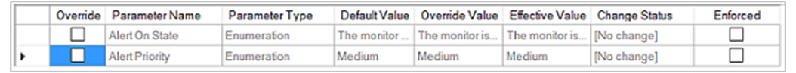

# Using classes and groups for overrides 

>Applies To: System Center 2016 - Operations Manager

This topic describes the differences between classes and groups in System Center 2016 - Operations Manager, and how workflows, such as rules and monitors, apply to each. The following sections define classes and groups, and provide examples for applying overrides with the available override options.  
  
## Classes  

In Operations Manager, a *class* is a definition of an item that can be discovered and managed. A class can represent a computer, a database, a service, a disk, an application, or any other kind of object that requires monitoring. Monitors, rules, discoveries, overrides, and tasks can apply to a class. For example, **Windows Server&nbsp;2012 Logical Disk** is a class that defines logical disks on a computer that is running the Windows Server&nbsp;2003 operating system. A monitor that applies to the **Windows Server&nbsp;2012 Logical Disk** class will be applied only to objects that meet that class definition.  
  
> [!NOTE]  
> In the Operations console, the term *target* is used instead of *class*.  
  
Classes are defined in the Operations Manager management pack libraries and in individual product management packs that you import.  
  
## Groups  

In Operations Manager, a *group* is a logical set of objects that can be used to define the scope of overrides, views, user roles, and notifications. Some groups are provided in the Operations Manager installation, such as **All Windows Computers** group and **Agent Managed Computer Group**. You can create your own groups and add members to groups explicitly or dynamically.  
  
## Overrides  

You have seen that classes are used to target workflows such as rules and monitors. A monitor or rule is applied to a specific class. To change the value for a parameter of a rule or monitor, you create an override. You have the following options for applying your override:  
  
-   **For all objects of class:** *Class*  
  
    When you select this option for your override, the override settings apply to all objects in the class at which the rule or monitor is targeted.  
  
-   **For a group**  
  
    When you select this option for your override, the override settings apply only to members of the group. The rule or monitor without the override settings continues to apply to all objects in the targeted class except for those objects that are also members of the group used for the override.  
  
    When you create a group, you save it to an unsealed management pack. However, an element in an unsealed management pack, such as an override, cannot reference an element in a different unsealed management pack, such as a group. If you are going to use a group to limit the application of an override, you must either save the group to the same unsealed management pack as the override, or you must seal the management pack that contains the group.  
  
-   **For a specific object of class:** *Class*  
  
    When you select this option for your override, the override settings apply only to the specified object. The rule or monitor without the override settings continues to apply to all other objects in the targeted class.  
  
-   **For all objects of another class**  
  
    When you select this option for your override, the override settings apply only to objects of a class other than the targeted class. The rule or monitor without the override settings continues to apply to all objects in the targeted class.  
  
Overrides that apply to a class are applied first, then overrides that apply to a group, and finally overrides that apply to a specific object. For more information, see [Using the Enforced Attribute in Overrides](#using-the-enforced-attribute-in-overrides) below.  
  
## How to apply overrides  

Here are some examples of when you would use the override options.  
  
### You want to change the priority of an alert  

Select to override **For all objects of class:** *Class*.  
  
### You want to change the priority of an alert for computers that meet specific criteria  

Select to override **For a group** and create a group that dynamically adds members based on specific criteria.  
  
### You want to change the priority of an alert for a specific computer only  

Select to override **For a specific object of class:** *Class*. You could also select **For a group** and create a group that has the specific computer added as an explicit member.  
  
### You want to change the priority of an alert that applies to all operating systems for a specific operating system 
 
Select **For all objects of another class** and select the class that represents the operating system for which you want to have a different alert priority.  
  
### You want the rule or monitor to apply only to specific computers  

In this common scenario, you must perform the following two tasks:  
  
1.  Select to override **For all objects of class:** *Class*, and change **Enabled** to **False**. This will disable the rule or monitor.  
  
2.  Select to override **For a group**, **For a specific object of class:** *Class*, or **For all objects of another class**, and change **Enabled** to **True**. This enables the rule or monitor for members of that group, the specified object, or the selected class only.  

## Using the Enforced Attribute in Overrides

When you configure an override to a rule, monitor, or discovery in Operations Manager, you will notice an **Enforced** check box in the row for each value that you can override, as shown in the following illustration.  
  
  
  
When the Enforced attribute is selected for an override, this setting ensures that the override will take precedence over all other overrides of the same type and context that do not have **Enforced** set.  
  
Overrides that apply to a class are applied first, then overrides that apply to a group, and finally overrides that apply to a specific object. The Enforced attribute assures that the override will take precedence when two overrides of the same type and context conflict.  
  
For example, you have two Windows computers, COMPUTER1 and COMPUTER2. COMPUTER1 is member of GROUP\-A and is also member of GROUP\-B. COMPUTER2 is not a member of any group. The default threshold for a CPU monitor is 80%.  
  
You apply an override to the Windows Computer class that changes the CPU monitor threshold to 70%. You create another override to that monitor that applies to GROUP\-A and sets the threshold to 90%. At this point, the threshold for COMPUTER1 is 90% and the threshold for COMPUTER2 is 70%.  
  
If you create an override that applies to GROUP\-B and sets the threshold to 95%, the resulting threshold for COMPUTER1, which is member of both GROUP\-A and GROUP\-B, is unpredictable. However, if you used the Enforced attribute on the override that applies to GROUP\-B, you ensure that the 95% threshold applies to COMPUTER1.  
  
If you create an override that applies to COMPUTER1 and sets the threshold to 60%, the resulting threshold for COMPUTER1 is 60% because the object override takes precedence over the class and group overrides.  

  
## Next steps

- To learn how to create a custom writeable management pack to store your overrides, see [How to Create a Management Pack for Overrides](How-to-Create-a-Management-Pack-for-Overrides.md)

- See [How to Import, Export, and Remove an Operations Manager Management Pack](how-to-import-remove-export-management-packs.md) to perform common administrative tasks with management packs in your management group.

- Review [How to Enable Recovery and Diagnostic Tasks](How-to-Enable-Recovery-and-Diagnostic-Tasks.md) to understand how they can help investigate and auto-remediate issues identified by monitors.  
  
