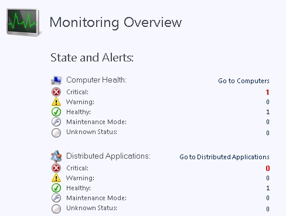

# Using the Operations console

>Applies To: System Center 2016 - Operations Manager

In System Center 2016 - Operations Manager, the Operations console is the primary interface for interacting with operational data reported and perform management and configuration changes in the management group.  There are five workspaces in the console:

- **Monitoring workspace**, which is the primary workspace for operators. The Monitoring workspace is basically the same in both the Operations and Web consoles. 

- **Authoring workspace** allows you to create new or change existing monitoring scenarios, create or modify groups for scoping, define service level objectives for measuring and reporting on service availability, and other authoring tasks.  

- **Reporting workspace** provides extensive reporting capabilities, including multiple report libraries that you can select from to view historical operational data from the Reporting data warehouse and customize for your specific requirements.   

-  **Administration workspace**, where you configure a management group to manage such things as agent deployment, network device discovery, role-based security, and much more.  

- **My Workspace** provides you with a private area in the Operations and Web console that you can customize to display operational data which meet your specific needs.  For more information on how to use My Workspace, see [Using My Workspace](using-my-workspace-in-operations-manager.md)

## Using the Monitoring workspace

When you open the Monitoring workspace, you see an overview that summarizes the health of distributed applications and computers, as well as the objects that are in maintenance mode, as shown in the following image.  
  
  
  
In the **State and Alerts** overview, click any of the numbers to see a detailed view. For example, if you click the number shown for **Maintenance Mode**, a state view of all computers in maintenance mode opens.  
  
The health states that are summarized in the overview only tell you part of what is going on in your environment. You will also want to review the alerts that have been generated. In the navigation pane, click **Active Alerts** to see all alerts. For more information about dealing with alerts, see [Managing Alerts](managing-alerts.md).  
  
There are number of views and dashboards in the **Monitoring** workspace that allow you to view the status of your IT services. For information on each view, see [Standard Views in Operations Manager](standard-views-in-operations-manager.md). For information on using dashboards, see [Creating and Scoping Views in Operations Manager](how-to-create-and-scope-views-in-operations-manager.md). You can change the display options of a view and save it as a personalized view. For more information, see [How to Personalize a View in Operations Manager](how-to-personalize-a-view-in-operations-manager.md).  
  
As you work with Operations Manager, you may discover that there are specific views that you frequently access. You can create a customized workspace that displays your favorite views and searches. For more information, see [Using My Workspace in Operations Manager](using-my-workspace-in-operations-manager.md).  
  
## Using the Authoring workspace 

The options in the Authoring workspace allow you to create new monitoring scenarios. This could be to change or add monitoring in an existing management pack or to create a new management pack for an application that doesn't have one.  
  
Authoring is described in detail in the [Operations Manager 2012 Authoring Guide](http://go.microsoft.com/fwlink/p/?LinkID=212377). The sections below describe the different options in the Authoring workspace.  
  
### Management pack templates  
*Management Pack Templates* allow you to create complete monitoring scenarios with minimal input. Once you complete a wizard, the management pack template creates monitors, rules, and even classes to implement the particular scenario. There is no requirement for you to understand the management pack elements that are created since you can continue to use the template to perform configuration. It will make any necessary modifications to the underlying elements.  
  
| Template| Description|  
|---------|------------|  
|OLE DB Data Source|Monitor the availability and performance of a database. Sample queries can be executed from one or more watcher nodes.|  
|Process Monitoring|Monitor the availability and performance of a wanted process or verify that an unwanted process is not running.|  
|TCP Port|Monitor the availability of an application listening on a specific TCP port. Test can be performed from one or more watcher nodes.|  
|Unix/Linux LogFile|Monitor a Unix or Linux log file for a specific log entry one a specific computer or group of computers.|  
|Unix/Linux Service|Monitor the availability of a service on a Unix or Linux computer or group of computers.|  
|Windows Service|Monitor the availability and performance of a service running on one or more Windows computers.|  
  
### Distributed applications  
*Distributed Applications* allow you to group together multiple components that are part of a single application. The health of each included object are used to calculate an overall health for the application itself. This health can be used to support alerts, views, and reports.  
  
### Groups  
*Groups* contain a particular set of managed objects. They are used to scope views, reports, and certain monitoring scenarios. Criteria can be provided to automatically populate a group based on properties of the objects, or you can add specific objects to a group.You can create new groups and edit existing groups. You can also view the current members of a group. Once it has been created, a group can be used in the Monitoring workspace for scoping views, the Reporting workspace for scoping reports, or in the Authoring workspace for overrides, management pack templates, or service level objects.  
  
### Management pack objects  
The Management Pack Objects section provides access to the different elements that are available. Depending on the kind of object, you may be able to create new objects, edit existing objects, or view existing objects.  

| Object | Description |   
|--------|-------------|  
|Attributes|An *attribute* is a property of a class in a management pack. You can add additional attributes to collect additional information about managed objects. These attributes can be used to support group membership or accessed by monitors or rules.|  
|Monitors|*Monitors* are workflows that run on an agent and determine the current health of an object. Each monitor uses a particular data source as the event log, performance data, or a script to collect its information.  You can create new monitors and edit existing monitors in the Operations console for specific monitoring scenarios which will address the requirements of most users. More complex monitors must be created and modified using the Authoring console.|  
|Object Discoveries|*Object Discoveries* are workflows that run on an agent and discover objects to manage.  You cannot create new object discoveries in the Operations console. You can view existing object discoveries in management packs and use overrides to modify the frequency that they run and potentially other parameters.|  
|Overrides|*Overrides* are used to change parameters on workflows including monitors, rules, and discoveries.  Overrides are created from the property page of the workflow that they apply to. This option allows you to view and modify existing overrides.|  
|Rules|*Rules* are workflows that run on an agent that create an alert, collect information for analysis and reporting, or run a command on a schedule. Each rule uses a particular data source as the event log, performance data, or a script to collect its information.  You can create new rules and edit existing rules in the Operations console for specific monitoring scenarios which will address the requirements of most users. More complex rules must be created and modified using the Authoring console.|  
|Service Level Tracking|*Service Level Tracking* allows you to compare the availability of managed objects to a specific object.  This option allows you to create new *Service Level Objectives* and edit existing Service Level Objectives.|  
|Tasks|*Tasks* are workflows that run when you request them in the Operations console. *Agent tasks* run on one more agent computers. *Console tasks* run on the Operations console workstation.  You can create new tasks and edit existing tasks in the Operations console for specific monitoring scenarios which will address the requirements of most users. More complex tasks must be created and modified using the Authoring console.|  
|Views|*Views* display managed objects and collected data in the Operations Console.  Views are created and modified in the Monitoring workspace. This option displays the existing views available for each target class.|  

# Using the Reporting workspace 

Operations Manager provides extensive reporting capabilities, including multiple report libraries that you can select from to customize reports for your specific requirements. Reports perform a query against the data warehouse database and return the results in an easy-to-read format.  
  
> [!IMPORTANT]  
> Users must be a member of the Report Operator Users role to run reports.  
  
### Reporting  

Reporting in the Reporting workspace contains all reports installed with Operations Manager, as well as those reports included in management packs that you have imported.  
  
The report library contains generic reports (for example, Availability and Configuration Changes reports). Generic reports have no specified context. The context for the report is defined in the parameter header, located at the top of the Report window.  
  
For more information on using the reports library, see [Using Reports in Operations Manager](using-reports-in-operations-manager.md).  
  
### Authored reports  

Authored reports are based on existing reports from the report library. You configure a report with prepopulated parameters and then make it available to other users.  
  
After you run a report, click **File**, and then click **Publish** to publish the report with the configured parameters to **Authored Reports**.  
  
### Favorite reports  

You can save configured reports to **Favorite Reports** to make them continually available to you and to save you the time of reconfiguring a report you run frequently.  
  
After you run a report, click **File**, and then click **Save to favorites** to save the report.  
  
### Scheduled reports  

You can schedule configured reports to run on a one-time or recurring basis.  
  
After you run a report, click **File**, and then click **Schedule** to configure the report subscription. For more information, see [How to Configure and Modify Report Schedules](how-to-configure-modify-report-schedules.md).  

## Using the Administration workspace

In the System Center 2016 - Operations Manager Operations console, the Administration workspace is the primary workspace for administrators. You use the Administration workspace to configure a management group and its managed objects.  
  
When you first open the Administration workspace or when you click **Administration** in the navigation pane, the Administration Overview opens, which displays task links for any required or optional configuration steps that have not been completed yet.  
  
The sections below describe the different options in the Administration workspace and link to more detailed information about the task or option.  
  
### Connected management groups  

You can connect management groups to enable the forwarding of alerts and other monitoring data from a connected management group to the local management group. Tasks can be initiated from a local management group to run on managed objects of a connected management group.  
  
Use **Connected Management Groups** in the Administration workspace to connect a management group or to edit the properties of a connected management group.  
  
For more information, see [Connecting Management Groups in Operations Manager](connecting-management-groups-in-operations-manager.md).  
  
### Device management  

You can use **Device Management** in the Administration workspace to perform configuration of specific management servers, agent-managed computers, agentless-managed computers, UNIX servers, and Linux servers. The following table summarizes the uses of the items in Device Management and provides links to more detailed information.  
  
|Item|Use|For more information|  
|--------|-------|------------------------|  
|Agent Managed|To modify the configuration of agent-managed computers, such as:  -   Change the primary management server for agent-managed computers. -   Repair the agent installation. -   Uninstall an agent. -   Override the management group agent heartbeat settings on a specific agent. A heartbeat is a periodic pulse from an agent to its management server. -   Configure an agent-managed computer as a proxy for agentless-managed computers.|-   [Managing Discovery and Agents](managing-discovery-and-agents.md) -   [Agentless Monitoring in Operations Manager](https://technet.microsoft.com/library/hh212910%28v=sc.12%29.aspx)|  
|Agentless Managed|To change the proxy agent for an agentless-managed computer. The proxy agent can be any agent-managed computer in the management group configured to be a proxy.|[Agentless Monitoring in Operations Manager](https://technet.microsoft.com/library/hh212910%28v=sc.1229.aspx)|  
|Management Servers|To modify the configuration of management servers, such as:  -   Override the management group heartbeat failure setting and configure the number of missed heartbeats a management server will allow for an agent before it changes the state of the respective computer to critical. -   Override the Management Group Manual Agent Installs setting and configure a management server to reject or put in Pending Management agents installed with MOMAgent.msi. -   Configure a management server as a proxy for agentless managed computers. -   Configure the Internet proxy settings for a management server.|-   [How Heartbeats Work in Operations Manager](how-heartbeats-work.md) -   [Managing Discovery and Agents](managing-discovery-and-agents.md) -   [Agentless Monitoring in Operations Manager](https://technet.microsoft.com/library/hh212910%28v=sc.12%29.aspx) -   [How to Configure the Internet Proxy Settings for an Operations Manager 2016 Management Server](http://go.microsoft.com/fwlink/?LinkId=207768) in the Deployment Guide|  
|Pending Management|To approve or reject an agent that was installed with MOMagent.msi if the management group for the agent is configured to **Review new manual agent installations in pending management view** but not **Auto-approve new manually installed agents**. Agents pending approval are displayed for this item.|[Process Manual Agent Installations](process-manual-agent-installations.md)|  
|UNIX/Linux Servers|To modify the configuration of agent-managed UNIX and Linux servers.|-   [Managing Discovery and Agents](Managing-Discovery-and-Agents.md) -   [Monitoring UNIX and Linux Computers by Using Operations Manager](https://technet.microsoft.com/library/hh212754%28v=sc.12%29.aspx)|  
  
### Management packs  

When you select **Management Packs** in the Administration workspace, you see a list of all management packs imported into your management group. When you right-click an individual management pack in the results pane, you can view its properties, delete it, or export any customizations to another management group. You can use links in the tasks pane to create, import, and download management packs.  
  
For more information, see [Using Management Packs](using-management-packs.md).  
  
### Operations Management Suite

You can use **Operations Management Suite** in the Administration workspace to configure your management group to connect and integrate with your OMS workspace.  This allows you to collect data from your agent-managed systems in the management group and analyze it further in Log Analytics.   

For more information about integrating and configuring Operations Manager with Log Analytics, see [Connect Operations Manager to Log Analytics](https://azure.microsoft.com/documentation/articles/log-analytics-om-agents/).

### Network management  

You can use **Network Management** in the Administration workspace to discover network devices and managed discovered network devices. The following table summarizes the uses of the items in Network Management and provides links to more detailed information.  
  
|Item|Use|For more information|  
|--------|-------|------------------------|  
|Discovery Rules|-   To create rules for discovering network devices -   To modify existing discovery rules|[How to Discover Network Devices in Operations Manager](https://technet.microsoft.com/library/hh278846%28v=sc.12%29.aspx)|  
|Network Devices|To view properties of discovered network devices|[Monitoring Networks by Using Operations Manager](monitoring-networks-by-using-operations-manager.md)|  
|Network Devices Pending Management|To retry or reject discovered network devices that are pending management|[How to Discover Network Devices in Operations Manager](https://technet.microsoft.com/library/hh278846%28v=sc.12%29.aspx)|  
  
### Notifications  

Notifications generate messages or run commands automatically when an alert is raised on a monitored system. By default, notifications for alerts are not configured. For Operations Manager users to be notified immediately when an alert is generated, you need to configure a channel for notifications, add subscribers, and then create a notification.  
  
In **Notifications** in the Administration workspace, you can create channels, subscribers, subscriptions, and modify the channels, subscribers, and subscriptions that you create. For more information, see [Subscribing to Alert Notifications](https://technet.microsoft.com/library/hh212725%28v=sc.12%29.aspx).  
  
### Product connectors  

Product connectors are used to synchronize Operations Manager data with other management systems such as those that monitor non-Windows computers or create incident records. Product connectors can integrate a deployment of Operations Manager into another management platform or connect other management systems into a full Operations Manager management solution. Any product connectors that you integrate with Operations Manager will be displayed in this section of the Administration workspace.  
  
When you install Operations Manager, two internal product connectors are installed. These are used by Operations Manager.  
  
For more information, see [Connecting Operations Manager With Other Management Systems](connecting-operations-manager-with-other-management-systems.md).  
  
### Run As configuration  

You can use **Run As Configuration** in the Administration workspace to manage Run As accounts and profiles. The following table summarizes the uses of the items in **Run As Configuration** and provides links to more detailed information.  
  
|Item|Use|For more information|  
|--------|-------|------------------------|  
|Accounts|To modify the credentials and distribution for Run As accounts.|[Managing Access in Operations Manager](managing-access-in-operations-manager.md)|  
|Profiles|To add, edit, and remove Run As accounts associated with a Run As profile.|[Managing Access in Operations Manager](managing-access-in-operations-manager.md)|  
  
### Security  

In System Center 2016 - Operations Manager, operations such as resolving alerts, running tasks, overriding monitors, viewing alerts, viewing events, and so on have been grouped into user roles, with each user role representing a particular job function. Role\-based security allows you to limit privileges that users have for various aspects of Operations Manager. In **Security** in the Administration workspace, you can add and remove users to specific user roles. You can also modify the properties of user roles that you create.  
  
For more information, see [Implementing User Roles](implementing-user-roles.md).  
  
### Settings 
 
The following table summarizes the settings you can manage in **Settings** in the Administration workspace.  
  
|Item|Use|For more information|  
|--------|-------|------------------------|  
|Agent Heartbeat|Agents generate a heartbeat at specific intervals to ensure they are operating properly. You can adjust the interval.|[How Heartbeats Work in Operations Manager](how-heartbeats-work.md)|  
|Alerts|-   To configure alert resolution states. -   To configure automatic alert resolution.|-   [How to Set Alert Resolution States](how-to-set-alert-resolution-states.md) -   [How to Configure Automatic Alert Resolution](how-to-configure-automatic-alert-resolution.md)|  
|Database Grooming|To configure how long different types of data should be retained in the operational database.|[Maintenance of Operations Manager](maintaining-operations-manager.md)|  
|Privacy|To modify the settings for the following programs:  -   Customer Experience Improvement Program (CEIP) -   Operational Data Reporting -   Error Reporting|[Sending Data to Microsoft](http://go.microsoft.com/fwlink/?LinkID=207782) in the Deployment Guide|  
|Reporting|Configure the path for the reporting server.|[Using the Reporting Workspace in Operations Manager](#using-the-reporting-workspace)|  
|Web Addresses|Designate web addresses for the Web console and online company knowledge.|[How to Connect to the Operations and Web console](How-to-Connect-to-the-Operations-and-Web-Console.md)|  
|Server Heartbeat|Configure the number of missed heartbeats before the management server pings the agent\-managed computer.|[How Heartbeats Work in Operations Manager](how-Heartbeats-Work.md)|  
|Server Security|Specify how the management server should handle manually-installed agents.|[Process Manual Agent Installations](process-manual-agent-installations.md)|  

## Next steps

