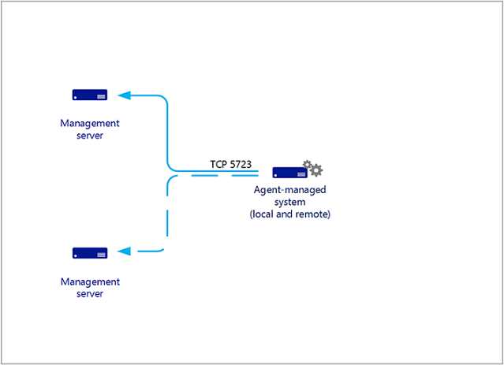

# Operations Manager Agents

>Applies To: System Center 2016 - Operations Manager

In System Center 2016 – Operations Manager, an agent is a service that is installed on a computer that looks for configuration data and proactively collects information for analysis and reporting, measures the health state of monitored objects like a SQL database or logical disk, and execute tasks on demand by an operator or in response to a condition. It allows Operations Manager to monitor Windows, Linux, and UNIX operating systems and the components of an IT service installed on them, like a web site or an Active Directory domain controller.  

## Windows agent

On a monitored Windows computer, the Operations Manager agent is listed as the Microsoft Monitoring Agent service. The Microsoft Monitoring Agent service collects event and performance data, executes tasks, and other workflows defined in a management pack. Even when the service is unable to communicate with the management server it reports to, the service continues to run and queues the collected data and events on the disk of the monitored computer. When the connection is restored, the Microsoft Monitoring Agent service sends collected data and events to the management server.

> [!NOTE] 
> The Microsoft Monitoring Agent service is sometimes referred to as the health service.

The Microsoft Monitoring Agent service also runs on management servers. On a management server, the service runs monitoring workflows and manages credentials. To run workflows, the service initiates MonitoringHost.exe processes using specified credentials. These processes monitor and collect event log data, performance counter data, Windows Management Instrumentation (WMI) data, and run actions such as scripts.

### Communication between agents and management servers

The Operations Manager agent sends alert and discovery data to its assigned primary management server, which writes the data to the operational database. The agent also sends events, performance, and state data to the primary management server for that agent, which writes the data to the operational and data warehouse databases simultaneously.

The agent sends data according to the schedule parameters for each rule and monitor. For optimized collection rules, data is only transmitted if a sample of a counter differs from the previous sample by a specified tolerance, such as 10%. This helps reduce network traffic and the volume of data stored in the operational database.

Additionally, all agents send a packet of data, called a *heartbeat*, to the management server on a regular schedule, by default every 60 seconds. The purpose of the heartbeat is to validate the availability of the agent and communication between the agent and the management server. For more information on heartbeats, see [How Heartbeats Work in Operations Manager](../Manage/how-heartbeats-work.md).

For each agent, Operations Manager runs a *health service watcher*, which monitors the state of the remote Health Service from the perspective of the management server.  The agent communicates with a management server over TCP port 5723.    

## Linux/UNIX agent

The architecture of the Unix and Linux agent differs from a Windows agent significantly. The Windows agent has a Health Service responsible for evaluating the health of the monitored computer. The Unix and Linux Agent does not run a health service, instead it passes information to the Health Service on a management server to be evaluated.  The management server runs all of the workflows to monitor operating system health defined in our implementation of the UNIX/Linux management packs:

   - Disk
   - Processor
   - Memory
   - Network adapters
   - Operating System  
   - Processes
   - Log files  

The UNIX and Linux agents for Operations Manager consist of a CIM Object Manager (i.e. CIM Server), and a set of CIM Providers. The CIM Object Manager is the “server” component that implements the WS-Management communication, authentication, authorization and dispatch of requests to the providers. The providers are the key to the CIM implementation in the agent, defining the CIM classes and properties, interfacing with the kernel APIs to retrieve raw data, formatting the data (e.g. calculating deltas and averages), and servicing the requests dispatched from the CIM Object Manager. From System Center Operations Manager 2007 R2 through System Center 2012 SP1, the CIM Object Manager used in the Operations Manager UNIX and Linux agents is the OpenPegasus server. The providers used to collect and report monitoring data are developed by Microsoft, and open-sourced at CodePlex.com.   

This changed in System Center 2012 R2 Operations Manager, where UNIX/Linux agents are now based on a fully consistent implementation of Open Management Infrastructure (OMI) as their CIM Object Manager. In the case of the Operations Manager UNIX/Linux agents, OMI is replacing OpenPegasus. Like OpenPegasus, OMI is an open-source, lightweight, and portable CIM Object Manager implementation – though it is certainly lighter in weight and more portable than OpenPegasus. This implementation continues to be applied in System Center 2016 - Operations Manager.   

The communication between the management server and the UNIX/Linux agent is split into two categories, agent maintenance and health monitoring.  The management server uses two protocols to communicate with the UNIX or Linux computer:

- Secure Shell (SSH) and Secure Shell File Transfer Protocol (SFTP)

    Used for agent maintenance tasks such as installing, upgrading, and removing agents.

- Web Services for Management (WS-Management)

    Used for all monitoring operations and include the discovery of agents that were already installed.

The communication between the Operations Manager management server and UNIX/Linux agent communicate using WS-Man over HTTPS and the WinRM interface.  All agent maintenance tasks are performed over SSH on port 22.  All health monitoring is performed over WS-MAN on port 1270. The management server requests performance and configuration data via WS-MAN before evaluating the data to provide health status.  All actions, such as agent maintenance, monitors, rules, tasks, and recoveries, are configured to use predefined profiles according to their requirement for an unprivileged or privileged account. 

> [!NOTE] 
> All credentials referred to in this topic pertain to accounts that have been established on the UNIX or Linux computer, not to the Operations Manager accounts that are configured during the installation of Operations Manager. Contact your system administrator for credentials and authentication information.  

## Agent security 

### Authentication on UNIX/Linux computer

In Operations Manager, the system administrator is no longer is required to provide the root password of the UNIX or Linux computer to the management server. Now by elevation, an unprivileged account can assume the identity of a privileged account on the UNIX or Linux computer. The elevation process is performed by the UNIX su (superuser) and sudo programs that use the credentials that the management server supplies. For privileged agent maintenance operations that use SSH (such as discovery, deployment, upgrades, uninstallation, and agent recovery), support for su, sudo elevation, and support for SSH key authentication (with or without passphrase) is provided. For privileged WS-Management operations (such as viewing secure log files), support for sudo elevation (without password) is added.

For detailed instructions for specifying credentials and configuring accounts, see [How to Set Credentials for Accessing UNIX and Linux Computers](../Manage/how-to-set-credentials-for-accessing-unix-and-linux-computers.md).

## Agent deployment

System Center 2016 – Operations Manager Agents may be installed by using one of the following three methods.  Most installations use a combination of these methods to install different sets of computers, as appropriate.

- The discovery and installation of one or more agents from the Operations console. This is the most common form of installation.  A management server must be able to connect the computer with RPC, and either the management server Action Account or other provided credentials must have administrative access to the target computer.
- Inclusion in the installation image. This is a manual installation to a base image that is used for the preparation of other computers.  In this case, Active Directory integration may be used to automatically assign the computer to a management server upon the initial startup.
- Manual installation. This method is used when the agent cannot be installed by one of the other methods—for example, when remote procedure call (RPC) is unavailable because of a firewall. The setup is manually run on the agent or deployed through an existing software distribution tool.

Agents that are installed by using the Discovery Wizard can be managed from the Operations console, such as updating agent versions, applying patches, and configuring the management server that the agent reports to.

When you install the agent using a manual method, updates to the agent must also be performed manually. You will be able to use Active Directory integration to assign agents to management groups. For more information, see [Integrating Active Directory and Operations Manager](https://technet.microsoft.com/en-us/library/hh212829.aspx).

### Agent deployment to Windows system

Discovery of a Windows system requires that the TCP 135 (RPC), RPC range, and TCP 445 (SMB) ports remain open and that the SMB service is enabled on the agent computer.

- After a target device has been discovered, an agent can be deployed to it. Agent installation requires:
- Opening RPC ports beginning with endpoint mapper TCP 135 and the Server Message Block (SMB) port TCP/UDP 445.
- Enabling the File and Printer Sharing for Microsoft Networks and the Client for Microsoft Networks services. (This ensures that the SMB port is active.)
- If enabled, Windows Firewall Group Policy settings for Allow remote administration exception and Allow file and printer sharing exception must be set to Allow unsolicited incoming messages from to the IP address and subnets for the primary and secondary management servers for the agent. 
- An account that has local administrator rights on the target computer.
- Windows Installer 3.1. To install, see article 893803 in the Microsoft Knowledge Base 
http://go.microsoft.com/fwlink/?LinkId=86322 <verify if we need to continue calling this out>
- Microsoft Core XML Services (MSXML) 6 on the Operations Manager product installation media in the \msxml sub directory. Push agent installation will install MSXML 6 on the target device if it is not already installed. <verify if we need to continue calling this out>

### Agent deployment to UNIX and Linux system

In System Center 2016 – Operations Manager, the management server uses two protocols to communicate with the UNIX or Linux computer:

- Secure Shell (SSH) for installing, upgrading, and removing agents.
- Web Services for Management (WS-Management) for all monitoring operations and include the discovery of agents that were already installed.

The protocol that is used depends on the action or information that is requested on the management server.  All actions, such as agent maintenance, monitors, rules, tasks, and recoveries, are configured to use predefined profiles according to their requirement for an unprivileged or privileged account.

> [!NOTE] 
> All credentials referred to in this section pertain to accounts that have been established on the UNIX or Linux computer, not to the Operations Manager accounts that are configured during the installation of Operations Manager.  Contact your system administrator for credentials and authentication information.

By elevation, an unprivileged account can assume the identity of a privileged account on the UNIX or Linux computer.  The elevation process is performed by the UNIX su (superuser) and sudo programs that use the credentials that the management server supplies.  For privileged agent maintenance operations that use SSH (such as discovery, deployment, upgrades, uninstallation, and agent recovery), support for su, sudo elevation, and SSH key authentication (with or without passphrase) is provided.  For privileged WS-Management operations (such as viewing secure log files), support for sudo elevation (without password) is supported.

## Active Directory agent assignment

System Center 2016 – Operations Manager allows you to take advantage of your investment in Active Directory Domain Services (AD DS) by enabling you to use it to assign agent-managed computers to management groups.  This feature is commonly used in conjunction with the agent deployed as part of a server deployment build process.  When the computer comes online for the first time, the Operations Manager agent queries Active Directory for its management server assignment and automatically starts monitoring the computer.

To assign computers to management groups by using AD DS:

- The functional level of AD DS domains must be Windows 2008 native or higher
- Agent-managed computers and all management servers must be in the same domain or in two-way trusted domains.

> [!NOTE] 
> An agent that determines it is installed on a domain controller will not query Active  Directory for configuration information.  This is for security reasons.  Active Directory Integration is disabled by default on domain controllers because the agent runs under the Local System account.  The Local System account on a domain controller has Domain Administrator rights; therefore, it will detect all Management Server Service Connection Points that are registered in Active Directory, regardless of the domain controller’s security group membership.  As a result, the agent will try to connect to all management servers in all management groups.  The results can be unpredictable, thus presenting a security risk.

Agent assignment is done by using a Service Connection Point (SCP), which is an Active Directory object for publishing information that client applications can use to bind to a service. The SCP will contain connection information to the management server, including the server’s FQDN and port number. Operations Manager agents can automatically discover management servers by querying for SCPs.

This feature works well for controlling agent assignment in a distributed management group deployment, to prevent agents from reporting to management servers that are dedicated to resource pools or management servers in a secondary data center in a warm-standby configuration to prevent agent failover during normal operation.  
