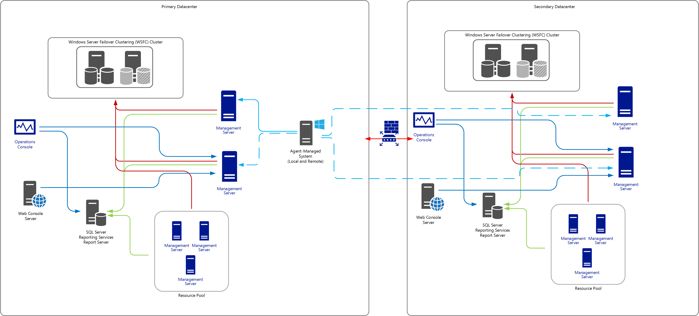
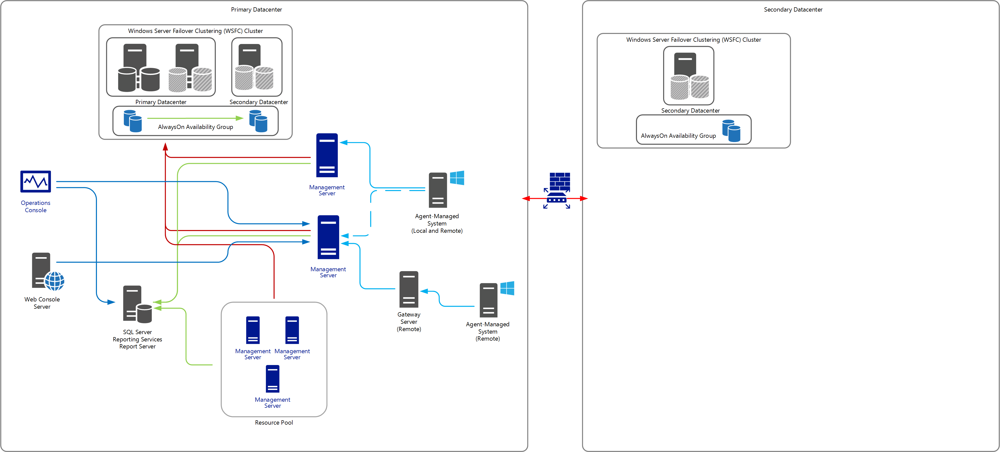
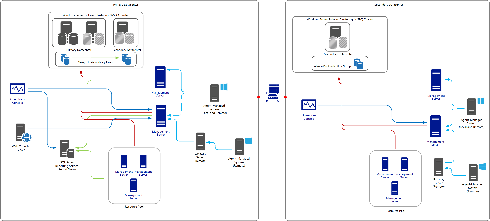

# High Availability and Disaster Recovery

>Applies To: System Center 2016 - Operations Manager

Various System Center 2016 – Operations Manager servers and features can potentially fail, impacting Operations Manager functionality.  The amount of data and functionality lost during a failure is different in each failure scenario. It depends on the role of the failing feature, the length of time it takes to recover the failing feature. 

## High availability

High-availability needs are addressed by building redundancy into the management group for the Operations Manager operational and data warehouse databases, the gateway and management servers, and specific workloads.  These workloads include network device monitoring, cross-platform monitoring, and management group specific workloads that were previously managed by the Root Management Server.

The multiple server, single management group configuration can make use of SQL Server 2014 or SQL Server 2016 Always On for providing high availability and service continuity of the Operations Manager databases.  Management server fault-tolerance is provided by having at least two management servers and making use of resource pools for monitoring UNIX servers, Linux servers, and network devices. Agent based Windows servers can be configured with a primary and secondary management server to redirect agent communications should a management server fail.

The RMS Emulator can be moved to another management server as well should the management server hosting the RMS Emulator become unavailable.

Web and Operations console connections can be made highly available.  This is accomplished by configuring high availability for the Data Access Services.  This can be done by installing Microsoft Network Load Balancing (NLB) or using a hardware-based load balancers, or DNS alias.  One or more management servers are added as members of the NLB pool and when opening the either console, you reference the virtual name registered in DNS, of the load-balanced management servers.  

Multiple gateway servers can be deployed across a trust boundary to provide redundant pathways for agents that lie across that trust boundary. Just as agents can fail over between a primary management server and one or more secondary management servers, they can also fail over between gateway servers. In addition, multiple gateway servers can be used to distribute the workload of managing agentless\-managed computers and managed network devices.  
  
In addition to providing redundancy through agent\-gateway failover, gateway servers can be configured to fail over between management servers in a management group if multiple management servers are available.  

## Disaster recovery

Disaster recovery relates to measures taken to ensure that operations can be resumed in the event of a catastrophic failure (for example, loss of the entire data center that hosts the primary infrastructure).  It is an important element that must be considered in any deployment and the decisions that are made in planning for disaster recovery affect how Operations Manager will be able to continue supporting proactive monitoring and reporting of the performance and availability of your critical IT services.  This section will focus on the recommended strategy of disaster recovery and resiliency and what steps should be taken to ensure a smooth recovery.

While HA and DR solutions will provide protection from system failure or system loss, they should not be relied on for protection from accidental, unintended, or malicious data loss or corruption. In these cases, backup copied or lagged replication copies might have to be leveraged for restore operations.  In many cases, a restore operation is the most appropriate form of DR. One example of this could be a low-priority reporting database or analysis data. In many cases, the cost to enable multisite DR at the system or application level far outweighs the value of the data. In cases in which the near-term value of the data is low and the need to access the data can be delayed without severe business impact in the case of a failure or site DR excessive, consider using simple backup and restore processes for DR if the cost savings warrant it.
 
Understanding the impact and tolerance for downtime will help drive the decisions that need to be understood in order to properly design the architecture for Operations Manager and the level of complexity and cost required to support disaster recovery.  Additionally, you have to consider the extent of monitoring data loss the IT organization can tolerate without causing business consequences.  This is best described in two terms: recovery time objective (RTO) and recovery point objective (RPO).  

The two most common disaster recovery design configurations for Operations Manager are:

- Creating a duplicate management group deployed to your secondary data center that duplicates  in scale and configuration, the primary management group. 
- Deploying additional servers in a secondary data center to support the Operational and Data Warehouse database, with management servers deployed in a cold-standby configuration as to not participate in the management group until recovery actions need to be performed.

Deploying a duplicate management group is an option when there is no tolerance for downtime; however, it is the most complex option.  Configuration between both needs to be consistent so that when you cut over, there is no difference in what is monitored, alerted or reported, presented, and finally escalated.  Integration with other monitoring platforms or ITSM platforms such as System Center 2016 - Service Manager, Remedy or ServiceNow will need to exist as well, and possibly configured in an active/passive state to avoid duplication of incidents, configuration items, etc.  Agents will be multihomed between both management groups, so there will be duplication of data.    

The following diagram is an example of this design scenario.    

If immediate recovery is not necessary for your Operations Manager deployment and you want to avoid the complexity of a duplicate management group, alternatively you can deploy additional management group components in your secondary data center in order to retain functionality of your management group.  At a minimum, consider implementing a SQL Server 2014 or 2016 Always On Availability Group to provide recovery of the Operational and Data Warehouse databases between two or more datacenters, where a two-node failover cluster instance (FCI) is deployed in the primary data center, and a standalone SQL Server in the secondary datacenter as part of a single Windows Server Failover Cluster (WSFC).  The secondary replica for the Always On Availability Group would be on the non-FCI standalone instance as shown in the following diagram.   

In this example, you would be required to deploy one or more Windows Server with the same hardware configuration and computer name, and reinstall the management server role using the **/Recover** parameter.  During this time, agents will queue the data collected (alerts, events, performance, etc.) until they can resume communication with a management server in the management group.  This approach avoids installing new instances of SQL Server and restoring databases from your last known good backup.  However, in this recovery scenario there is likely going to be a longer delay in returning to an operable state given you will need to deploy the other roles necessary to resume minimum monitoring functionality.  If this approach isn't acceptable, you can deploy management servers in your secondary data center for on-standby recovery.  They need to be removed as members of the three primary resources pools - All Management Servers Resource Pool, Notifications, and AD Assignment.  This also includes any custom resource pool which may include management servers hosted in the primary data center and need to continue to function as part of the recovery plan.  The System Center Data Access, System Center Configuration Management, and Microsoft Monitoring Agent services should be stopped and set to manual or disable and only started in a disaster recovery scenario.  
If a management server is supporting integration (via a connector hosted directly on the management server or from another System Center product such as VMM, Orchestrator or Service Manager) this will need to be planned for with manual or automatic recovery steps depending on the integration configuration and sequence of recovery steps.  Additionally, this ensures any other dependency on the management server is captured and planned for when the disaster recovery plan needs to be implemented.   

If one site goes offline, the agent will fail over to the management server in another site, assuming that the agent’s failover configuration allows this.  You should re-configure the Windows agents to cache only management servers in your primary data center that should manage them to prevent them from attempting to failover to a management server in the secondary data center, which would only delay recovery and reporting.  This can be accomplished if you manually deploy the agent in an automated manner with a script (e.g. VBScript or better yet, PowerShell) to pre-configure during installation, or post deployment if you push the agent from the console, again using a scripted method managed with your enterprise configuration management solution.    

Operations Manager can be deployed on Azure virtual machines as an alternative disaster recovery option to maintain continuity of the management group.  It will be necessary to also deploy SQL Server on a virtual machine in Azure and not in a hybrid configuration, as the latency between a management server and the SQL Server hosting the Operations Manager databases will negatively impact performance of the management group.  
Consider the monitoring scope, network topology and network connectivity to Microsoft Azure (i.e. site-to-site VPN or ExpressRoute), integration points (i.e. ITSM solutions, other System Center products, third-part add-ons, etc.), console access, regulatory or relevant laws or polices, etc. in order to properly architect this scenario within Azure IaaS or other public cloud providers.  

